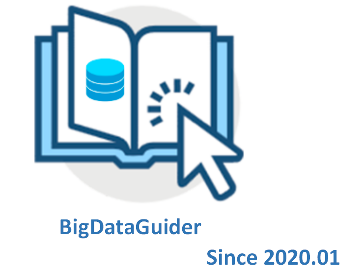
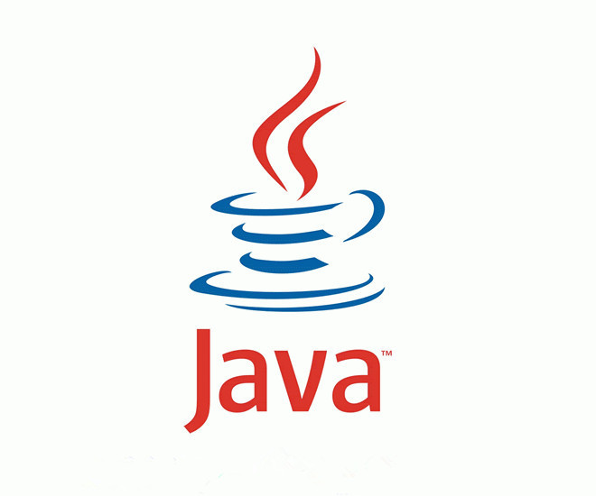

# BigDataGuider
大数据学习笔记: 
* 计算机基础知识：数据结构与算法、数据库进阶
* java核心技术：涉及java编程基础、java并发编程、jVM、设计模式  
* 大数据框架：spark、flink、hadoop、elasticsearch、zookeeper、kafka

  

 

<table>
    <tr>
      <th></th>
      <th></th>
      <th></th>
    </tr>
    <tr>
      <td align="center"><a href="#java进阶">java</a></td>
      <td align="center"><a href="#大数据框架">bigdata</a></td>
      <td align="center"><a href="#flink">Flink</a></td>
    </tr>
  </table>
 

## java进阶
### java并发编程
[并发编程：并发编程基础](java/1.java基础与提高/1.多线程/并发编程总结（一）：并发编程基础.md)  
[并发编程：线程池的使用与详解](java/1.java基础与提高/1.多线程/6.java线程池详解.md)  
[并发编程：锁的使用](java/1.java基础与提高/1.多线程/并发编程总结：锁机制.md)  
[乐观锁和悲观锁](java/1.java基础与提高/1.多线程/并发编程总结：乐观锁和悲观锁.md)  
[并发编程：CountDownLatch](java/1.java基础与提高/1.多线程/并发编程：CountDownLatch.md)  
[并发编程：java原子类](java/1.java基础与提高/1.多线程/并发编程：java原子类.md)  
[并发编程：同步容器](java/1.java基础与提高/1.多线程/并发编程：同步容器.md)  

### redis
[Redis安装.md](bigdata/Redis/Redis安装.md)  
[Redis基础](bigdata/Redis/Redis基础.md)    
[Redis面试](bigdata/Redis/Redis综合题.md)   

### Spring
[依赖注入](/java/2.Java框架/1.spring/2.笔记/1.依赖注入.md)  
[Spring IOC的理解](/java/2.Java框架/1.spring/2.笔记/Spring进阶：IOC的理解.md)  

## 大数据框架

## flink
* [flink安装与基本使用.md](bigdata/flink/1.flink1.9学习笔记/1.flink1.9安装与基本使用.md)  
* [WordCount入门案例实践.md](bigdata/flink/1.flink1.9学习笔记/2.WordCount入门案例实践.md)  
* [flink核心概念综述.md](bigdata/flink/1.flink1.9学习笔记/3.flink核心概念综述.md)  
* [Flink理论基础](bigdata/flink/1.flink1.9学习笔记/4.Flink理论基础.md)  
* [Flink运行架构](bigdata/flink/1.flink1.9学习笔记/5.Flink运行架构.md)  

