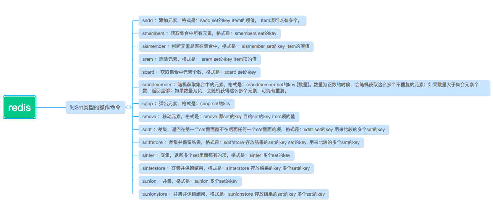
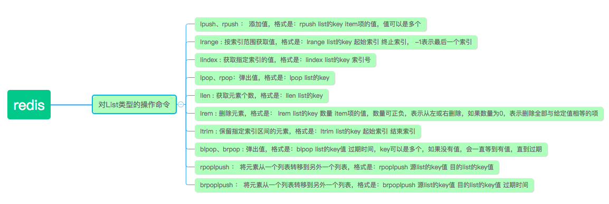
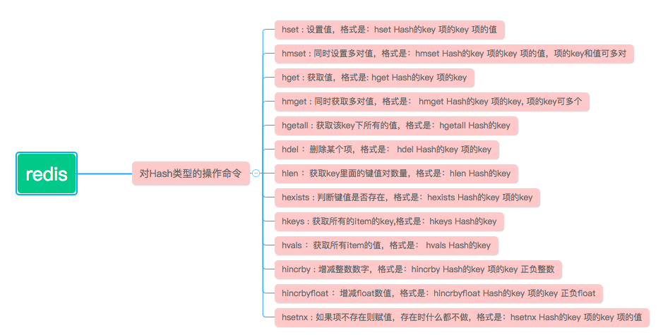

<!-- TOC -->

* [1. Resis常用命令](#1-resis常用命令)
  + [1.1. Redis支持的数据类型](#11-redis支持的数据类型)
  + [1.2. String](#12-string)
    - [1.2.1. 设置过期时间](#121-设置过期时间)
  + [1.3. Set](#13-set)
  + [1.4. List](#14-list)
  + [1.5. Hash](#15-hash)

<!-- /TOC -->

# 1. Resis常用命令

## 1.1. Redis支持的数据类型

String
Hash
List
Set
有序集合sorted sets

## 1.2. String

``` sh
127.0.0.1:6379> set username bruce
OK
127.0.0.1:6379> set address chengdu
OK
127.0.0.1:6379> get username
"bruce"
127.0.0.1:6379> get address
"chengdu"
# 查看所有key   
127.0.0.1:6379> keys *

```

### 1.2.1. 设置过期时间

``` sh
127.0.0.1:6379> set word hello,redis! ex 100
# 查看过期时间
127.0.0.1:6379> ttl word
(integer) 90
```

* EX 表示单位为 s
* PX 表示单位为毫秒

## 1.3. Set

<div align="center"></div>

1\. sadd:添加

``` sh
127.0.0.1:6379> sadd myset v1
(integer) 1
127.0.0.1:6379> sadd myset v1
(integer) 0
127.0.0.1:6379> sadd myset v2 v3 v4
```

2\. smembers：获取集合中所有元素

``` sh
127.0.0.1:6379> smembers myset
1) "v4"
2) "v1"
3) "3"
4) "v2"
5) "vq"
6) "1"
7) "v3"
8) "2"
9) "4"
```

3\. sismember：判断元素是否在集合中

``` sh
127.0.0.1:6379> sismember myset v1
(integer) 1
127.0.0.1:6379> sismember myset v11
(integer) 0
```

4\. srem：删除元素

``` sh
127.0.0.1:6379> srem myset 2
(integer) 1
```

5\. scard：获取集合中元素的个数

``` sh
127.0.0.1:6379> smembers myset
1) "v3"
2) "v4"
3) "v1"
4) "v2"
127.0.0.1:6379> scard myset
(integer) 4
```

6\. srandmember：随机获取集合中的元素

``` sh
127.0.0.1:6379> smembers myset
1) "v3"
2) "v4"
3) "v1"
4) "v2"
127.0.0.1:6379> srandmember myset 2
1) "v4"
2) "v1"
127.0.0.1:6379> srandmember myset 7
1) "v2"
2) "v4"
3) "v1"
4) "v3"
127.0.0.1:6379> srandmember myset -3
1) "v4"
2) "v4"
3) "v1"
```

7\. spop：弹出元素

``` sh
127.0.0.1:6379> spop myset
"v4"
127.0.0.1:6379> spop myset
"v1"
```

[参考](https://www.cnblogs.com/xinhuaxuan/p/9256738.html)

## 1.4. List

<div align="center"></div>

1\. lpush、rpush：添加值

``` sh
127.0.0.1:6379> lpush mylist v1 v2
(integer) 2

127.0.0.1:6379> lrange mylist 0 -1
1) "v2"
2) "v1"

127.0.0.1:6379> lpush mylist 0 -1
(integer) 4
127.0.0.1:6379> lrange mylist 0 -1
1) "-1"
2) "0"
3) "v2"
4) "v1"

127.0.0.1:6379> rpush mylist v3
(integer) 5
127.0.0.1:6379> lrange mylist 0 -1
1) "-1"
2) "0"
3) "v2"
4) "v1"
5) "v3"

```

3\. lindex：获取指定索引的值

``` sh
127.0.0.1:6379> lindex mylist 0
"-1"
127.0.0.1:6379> lindex mylist 2
"v2"
```

4\. llen：获取list中元素的个数

``` sh
127.0.0.1:6379> lrange mylist 0 -1
1) "-1"
2) "0"
3) "v2"
4) "v1"
5) "v3"
127.0.0.1:6379> llen mylist
(integer) 5
```

5\. lrem：删除元素

第一个参数是数目，从左到右删除的个数；第二个参数表示删除的内容

``` sh
127.0.0.1:6379> lrange mylist 0 -1
1) "-1"
2) "0"
3) "v2"
4) "v1"
5) "v3"

127.0.0.1:6379> lrem mylist 1 -1
(integer) 1

127.0.0.1:6379> lrange mylist 0 -1
1) "0"
2) "v2"
3) "v1"
4) "v3"

127.0.0.1:6379> lrem mylist 1 0
(integer) 1
```

 

## 1.5. Hash

<div align="center"></div>

hash数据结构可以这么理解

* 首先是一个key - value键值对
* 其次，value是一个map

1\. hset：设置值

``` sh
127.0.0.1:6379> hset myhash id 1
(integer) 1
127.0.0.1:6379> hset myhash name eastlong
(integer) 1
127.0.0.1:6379> hset myhash age 27
(integer) 1
```

2\. hmset：同时设置多对值

``` sh
127.0.0.1:6379> hmset myhash sex boy address SHA
OK
```

3\. hget：获取值

``` sh
127.0.0.1:6379> hget myhash sex
"boy"
127.0.0.1:6379> hget myhash address
"SHA"
```

4\. hmget：同时获取多对值

``` sh
127.0.0.1:6379> hmget myhash sex address
1) "boy"
2) "SHA"
```

5\. hgetall：获取该key下所有的值

``` sh
127.0.0.1:6379> hgetall myhash
 1) "id"
 2) "1"
 3) "name"
 4) "eastlong"
 5) "age"
 6) "27"
 7) "sex"
 8) "boy"
 9) "address"
10) "SHA"
```

6\. hdel：删除某个项

``` sh
127.0.0.1:6379> hdel myhash address
(integer) 1
```

7\. hlen：获取key里面的键值对数量

``` sh
127.0.0.1:6379> hlen myhash
(integer) 4
```

8\. hexists：判断键值是否存在

``` sh
127.0.0.1:6379> hexists myhash name
(integer) 1
127.0.0.1:6379> hexists myhash address
(integer) 0
```

9\. hkeys：获取所有的item的key

``` sh
127.0.0.1:6379> hgetall myhash
1) "id"
2) "1"
3) "name"
4) "eastlong"
5) "age"
6) "27"
7) "sex"
8) "boy"

127.0.0.1:6379> hkeys myhash
1) "id"
2) "name"
3) "age"
4) "sex"
```

10. hvals：获取所有的item的值

``` sh
127.0.0.1:6379> hvals myhash
1) "1"
2) "eastlong"
3) "27"
4) "boy"
```

[参考](https://www.cnblogs.com/xinhuaxuan/p/9256763.html)
