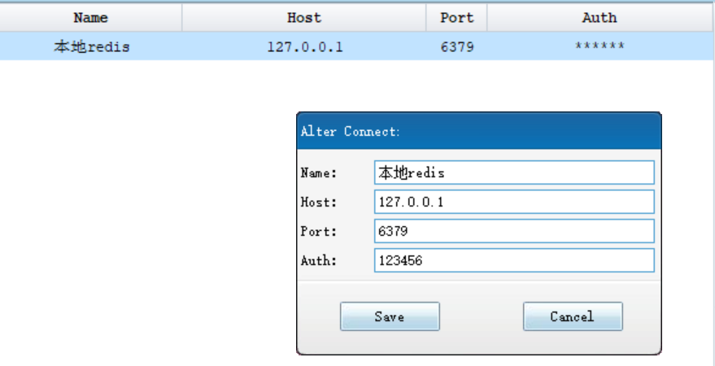
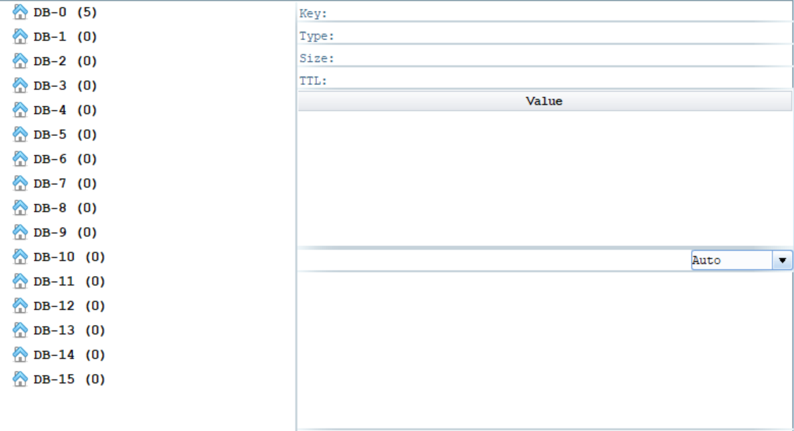

<!-- TOC -->

- [1. Redis入门教程](#1-redis入门教程)
  - [1.1. Windows系统Redis安装](#11-windows系统redis安装)
  - [1.2. 常用命令](#12-常用命令)
- [2. Redis命令](#2-redis命令)
  - [2.1. 字符串命令](#21-字符串命令)
    - [2.1.1. getrange key start end](#211-getrange-key-start-end)
    - [2.1.2. GETSET key value](#212-getset-key-value)
    - [2.1.3. 密码设置](#213-密码设置)
  - [2.2. Linux系统redis安装](#22-linux系统redis安装)
    - [2.2.1. 编译安装](#221-编译安装)
    - [2.2.2. reids配置文件目录设置](#222-reids配置文件目录设置)
  - [2.3. redis可视化客户端安装](#23-redis可视化客户端安装)
    - [2.3.1. redis studio](#231-redis-studio)

<!-- /TOC -->

# 1. Redis入门教程
## 1.1. Windows系统Redis安装
1.下载64位Redis软件压缩包  
[Redis下载](https://github.com/microsoftarchive/redis/releases)
解压即可使用

2. 启动redis
cmd切换到redis安装路径：D:\Users\xiaolong_wu\soft\Redis
（可以配置redis环境变量，则不用输入路径）

```shell
## step1：启动服务器（服务端）
redis-server.exe redis.windows.conf
## step2:打开客户端
redis-cli.exe -h 127.0.0.1  -p 6379

## 设置值
127.0.0.1:6379> set myKey abc
## 获取值
127.0.0.1:6379> get myKey
```

## 1.2. 常用命令
```shell
## 1. 删除键
127.0.0.1:6379> del longKey

## 2.序列化
127.0.0.1:6379> set greeting "Hello"
127.0.0.1:6379> dump greeting

## 3.
```

# 2. Redis命令
## 2.1. 字符串命令
### 2.1.1. getrange key start end
返回 key 中字符串值的子字符
```sh
127.0.0.1:6379> set myKey "This is my test key"

127.0.0.1:6379> getrange myKey 0 3
"This"

127.0.0.1:6379> getrange myKey 0 -1
"This is my test key"
```

### 2.1.2. GETSET key value  
将给定 key 的值设为 value ，并返回 key 的旧值(old value)。
```sh
127.0.0.1:6379> getset db mongodb
(nil)
127.0.0.1:6379> get db
"mongodb"
127.0.0.1:6379> getset db redis
"mongodb"
```
### 2.1.3. 密码设置

```sh
127.0.0.1:6379> config set requirepass "123456"
OK

127.0.0.1:6379> auth 123456
OK

```


https://www.cnblogs.com/kismetv/category/1186633.html

## 2.2. Linux系统redis安装
[参考：linux安装redis5](https://blog.csdn.net/weixin_41158446/article/details/91427235)
### 2.2.1. 编译安装
1. 基本安装
```sh
tar -zxvf redis-5.0.7.tar.gz

cd redis-5.0.7

cd src/

# 编译
make

# 安装
make install

# 启动服务端-在src目录下
redis-server

# 启动客户端-在src目录下
redis-cli  # 或者 ./redis-cli

127.0.0.1:6379> PING
PONG  
# 表示连接成功
```

2. 指定端口启动服务
```sh
redis-server --port 6380

redis-cli -p 6380
```

3. 指定配置文件
```
$ cat redis.conf | grep -v "#" |grep -v "^$" > redis-6379.conf
```

* 修改配置文件内容为：
```sh
port 6379
daemonize yes
logfile "6379.log"
dir ./data/  # data目录需要在redis根目录下创建
```

* 后台启动redis
```sh
$ redis-server redis-6379.conf
```

* 查看redis进程是否真正启动
```sh
$ ps -ef |grep redis-
```


* 杀死redis进程

kill -s 9 17825

### 2.2.2. reids配置文件目录设置
1. 配置与启动
```sh
$ mkdir conf
$ mv redis-6379.conf conf/

$ pwd
/home/hadoop/app/redis-5.0.4

# 配置文件启动redis
$ redis-server conf/redis-6379.conf

# 查看日志
$ cd data
```

2. 若启动多个redis服务，只需要多创建几个redis-conf文件，启动对应端口的服务即可。


## 2.3. redis可视化客户端安装
### 2.3.1. redis studio
[下载地址](https://github.com/cinience/RedisStudio/releases)

打开即可使用，无需安装

<div align="center"></div>

auth需要设置密码
```sh
127.0.0.1:6379> config set requirepass "123456"
OK
127.0.0.1:6379> auth 123456
OK
```
<div align="center"></div>

redis默认有**16个数据库**，如果在执行过程中没有指定哪一个，默认使用**DB-0**


