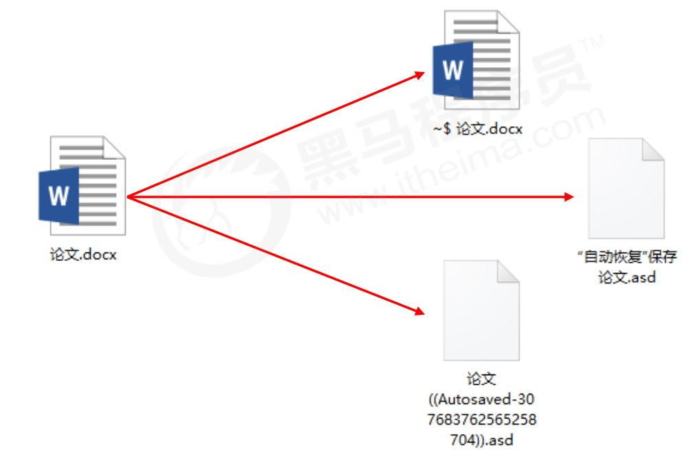
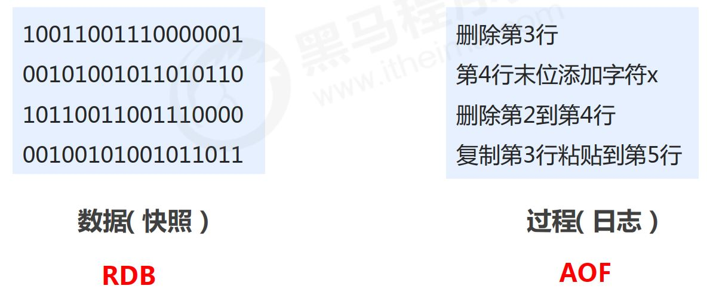
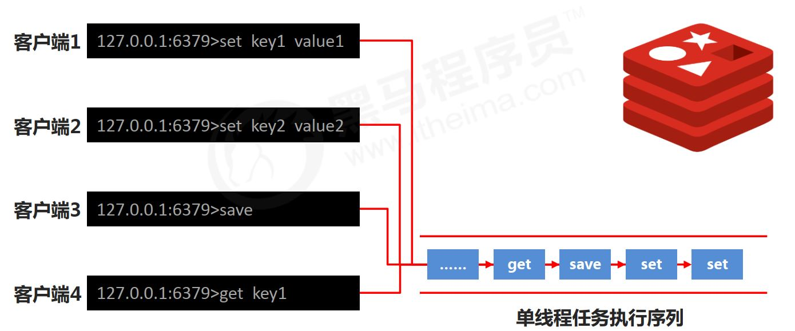
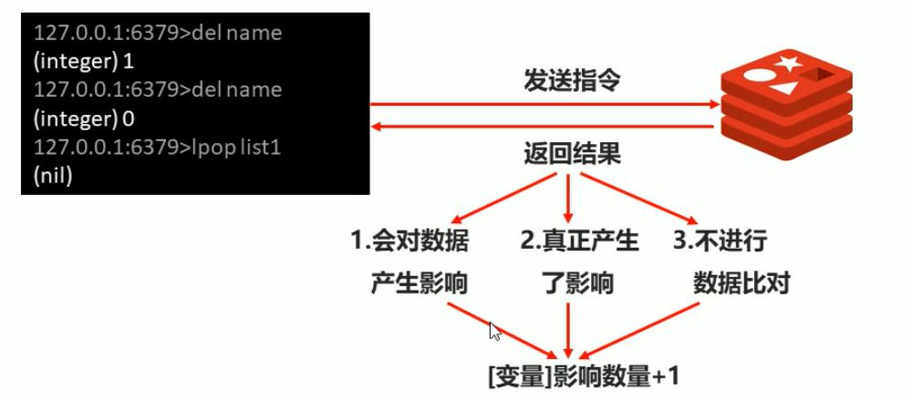
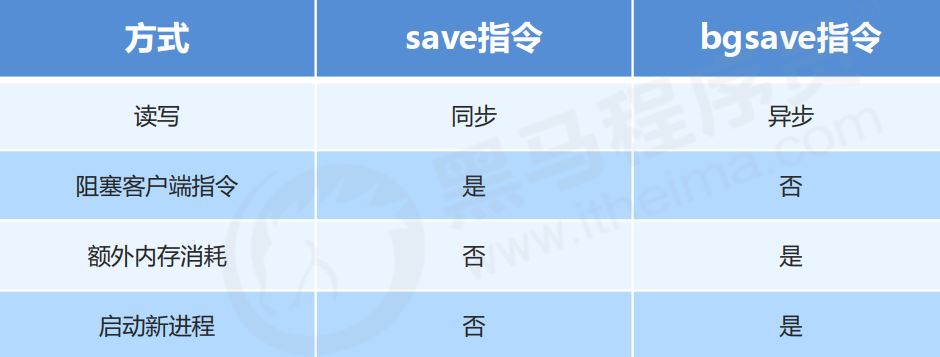

<!-- TOC -->

- [1. Redis持久化](#1-redis持久化)
  - [1.1. 持久化简介](#11-持久化简介)
    - [1.1.1. 什么是持久化](#111-什么是持久化)
    - [1.1.2. 为什么要进行持久化](#112-为什么要进行持久化)
    - [1.1.3. 持久化过程保存什么](#113-持久化过程保存什么)
  - [1.2. RDB持久化方案](#12-rdb持久化方案)
    - [1.2.1. RDB启动方式 —— save指令](#121-rdb启动方式--save指令)
    - [1.2.2. save指令相关配置](#122-save指令相关配置)
    - [1.2.3. save指令工作原理](#123-save指令工作原理)
  - [1.3. RDB启动方式 —— bgsave指令](#13-rdb启动方式--bgsave指令)
    - [1.3.1. bgsave指令工作原理](#131-bgsave指令工作原理)
    - [1.3.2. bgsave指令相关配置](#132-bgsave指令相关配置)
  - [RDB启动方式-save配置](#rdb启动方式-save配置)
    - [save配置](#save配置)
    - [save配置原理](#save配置原理)
  - [RDB三种启动方式对比](#rdb三种启动方式对比)
    - [rdb特殊启动形式](#rdb特殊启动形式)
    - [RDB 优缺点](#rdb-优缺点)

<!-- /TOC -->

# 1. Redis持久化
## 1.1. 持久化简介
* 意外断电
<center></center>

* 自动备份

<center></center>
写文件保存在内存中，然后备份到磁盘里。

### 1.1.1. 什么是持久化
**利用永久性存储介质将数据进行保存，在特定的时间将保存的数据进行恢复的工作机制**称为**持久化**。

### 1.1.2. 为什么要进行持久化
防止数据的意外丢失，确保数据安全性。

### 1.1.3. 持久化过程保存什么
* 将当前**数据状态**进行保存，**快照**形式，存储数据结果，存储格式简单，关注点在数据。
* 将数据的**操作过程**进行保存，**日志**形式，存储操作过程，存储格式复杂，关注点在数据的操作过程。
<center></center>

## 1.2. RDB持久化方案
**RDB启动方式**

* 谁，什么事件，干什么事情？
  - 谁：redis操作者（用户）
  - 什么时间：即时（随时进行）
  - 干什么事情：保存数据

### 1.2.1. RDB启动方式 —— save指令
* 命令
  - save
- 作用
  - 手动执行一次保存操作

save保存的记录在`data`目录下查看

### 1.2.2. save指令相关配置
```sh
$ vim redis-6379.conf


dbfilename dump-6379.rdb
rdbcompression yes
rdbchecksum yes
```

- dir
  - 说明：设置存储.rdb文件的路径
  - 经验：通常设置成存储空间较大的目录中，目录名称data

- dbfilename dump.rdb
  - 说明：设置本地数据库文件名，默认值为 dump.rdb
  - 经验：通常设置为dump-端口号.rdb

- rdbcompression yes
  - 说明：设置存储至本地数据库时是否压缩数据，默认为 yes，采用 LZF 压缩
  - 经验：通常默认为开启状态，如果设置为no，可以节省 CPU 运行时间，但会使存储的文件变大（巨大）
- rdbchecksum yes
  - 说明：设置是否进行RDB文件格式校验，该校验过程在写文件和读文件过程均进行
  - 经验：通常默认为开启状态，如果设置为no，可以节约读写性过程约10%时间消耗，但是存储一定的数据损坏风险

### 1.2.3. save指令工作原理
<center></center>

**注意**： save指令的执行会阻塞当前Redis服务器， 直到当前RDB过程完成为止， 有可能会造成长时间阻塞， **线上环境不建议使用**。


## 1.3. RDB启动方式 —— bgsave指令
**数据量过大，单线程执行方式造成效率过低如何处理？**

- 后台执行

  - 谁：redis操作者（用户）发起指令；redis服务器控制指令执行
  - 什么时间：即时（发起）；合理时间（执行）
  - 干什么事情：保存数据

- 命令
  - bgsave
- 作用
  - 手动启动后台保存操作，但不是立即执行

### 1.3.1. bgsave指令工作原理
<center></center>

**注意**：**bgsave命令是针对save阻塞问题做的优化**。 Redis内部所有涉及到RDB操作都采用bgsave的方式， save命令可以放弃使用。

### 1.3.2. bgsave指令相关配置
- stop-writes-on-bgsave-error yes
  - 说明：后台存储过程中如果出现错误现象，是否停止保存操作
  - 经验：通常默认为开启状态

```sh
$ vim redis-6379.conf

## append
stop-writes-on-bgsave-error yes
```

## RDB启动方式-save配置
反复执行保存指令，忘记了怎么办？不知道数据产生了多少变化，何时保存？

- 自动执行

  - 谁：redis服务器发起指令（基于条件）
  - 什么时间：满足条件
  - 干什么事情：保存数据

### save配置
- 配置
  - save second changes

- 作用
  - **满足限定时间范围内key的变化数量达到指定数量即进行持久化**。

- 参数
  - second：监控时间范围
  - changes：监控key的变化量

- 位置
  - 在conf文件中进行配置

- 范例
```sh
save 900 1  # 每15分钟内，key变化1次 --> 保存
save 300 10
```

### save配置原理
<center></center>

注意： 
* save配置要根据实际业务情况进行设置，频度过高或过低都会出现性能问题，结果可能是灾难性的
* save配置中对于second与changes设置通常具有互补对应关系，尽量不要设置成包含性关系
* **save配置启动后执行的是bgsave操作**

## RDB三种启动方式对比
<center></center>

### rdb特殊启动形式
- 全量复制
  - 在主从复制中会提到
- 服务器运行过程中重启
  - debug reload
- 关闭服务器时指定保存数据
  - shutdown save

### RDB 优缺点
- RDB优点
  - RDB是一个紧凑压缩的二进制文件，存储效率较高
  - RDB内部存储的是redis在某个时间点的数据快照，非常适合用于数据备份，全量复制等场景
  -RDB恢复数据的速度要比AOF快很多
  - 应用：服务器中每X小时执行bgsave备份，并将RDB文件拷贝到远程己气中，用于灾难恢复
- RDB缺点
  - RDB方式无论是执行指令还是利用配置，无法做到实时持久化，具体较大的可能性**丢失数据**.
  - bgsave指令每次运行要**执行fork操作创建子进程**，要牺牲掉一些性能。
  - Redis的众多版本中未进行RDB文件格式的版本统一，有可能出现个版本服务之间数据格式无法兼容现象。

- RDB存储的弊端
  - 存储数据量较大，效率较低——基于快照思想，每次读写都是全部数据，当数据量巨大时，效率非常低
  - 大数据量下的IO性能较低
  - 基于fork创建子进程，内存产生额外消耗
  - 宕机带来的数据丢失风险
- 解决思路
  - 不写全数据，仅记录部分数据
  - 改记录数据未记录操作过程
  - 对所有操作均进行记录，排除丢失数据的风险  
**这也就是AOF的引入**
- AOF概念
  - AOF持久化：以独立日志的方式记录每次写命令，重启时再重新执行AOF文件中命令达到恢复数据的目的。与RDB相比可以简单描述为改记录数据产生的过程
  - AOF的主要作用是解决了数据持久化的**实时性**，目前已经是**Redis持久化的主流方式**。


