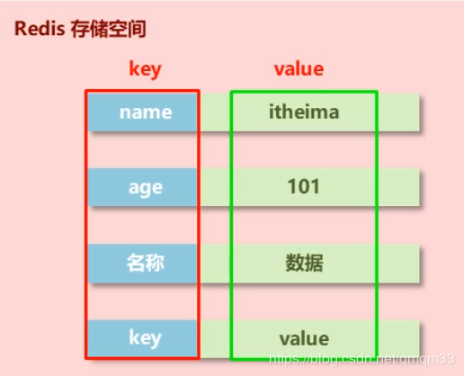
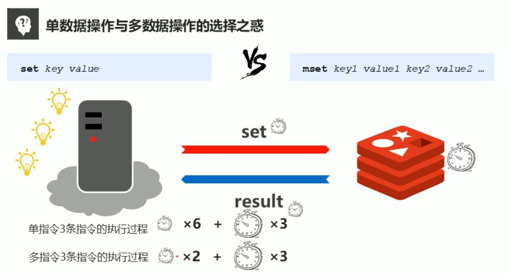
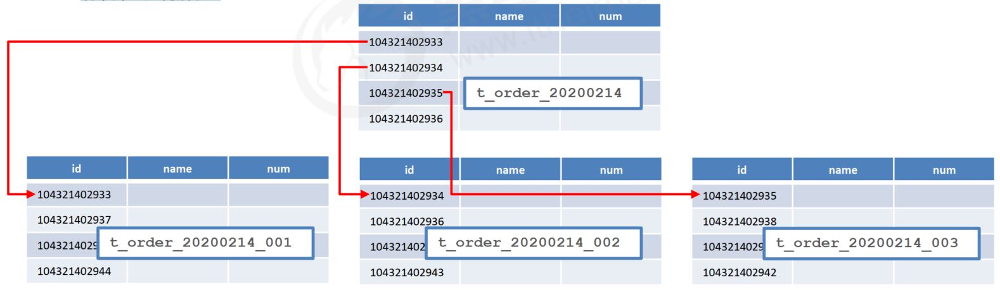
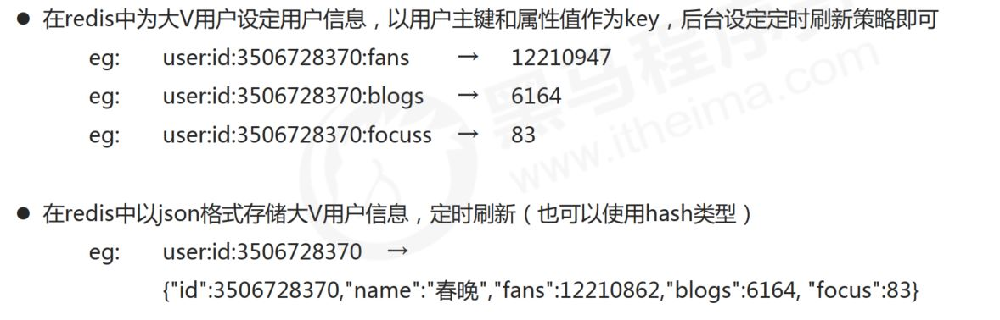
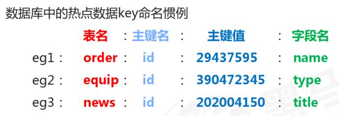
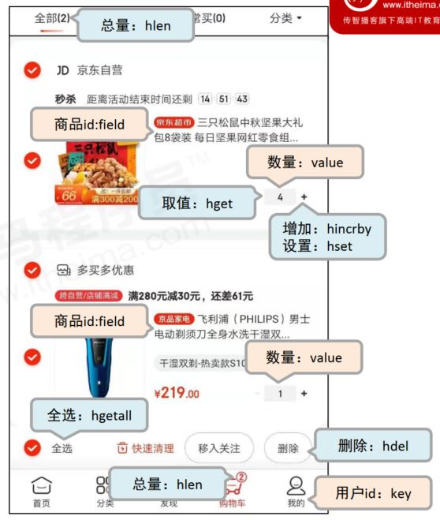

<!-- TOC -->

- [1. Redis数据类型](#1-redis数据类型)
  - [1.1. 业务数据的特殊性](#11-业务数据的特殊性)
    - [1.1.1. 应用场景](#111-应用场景)
    - [1.1.2. Redis基本数据类型](#112-redis基本数据类型)
  - [1.2. redis 数据存储格式](#12-redis-数据存储格式)
  - [1.3. String类型](#13-string类型)
    - [1.3.1. 基本操作](#131-基本操作)
  - [1.4. string 类型数据的扩展操作](#14-string-类型数据的扩展操作)
    - [1.4.1. 业务场景 - 数据库分表](#141-业务场景---数据库分表)
    - [1.4.2. 解决方案](#142-解决方案)
    - [1.4.3. string 作为数值操作](#143-string-作为数值操作)
    - [1.4.4. 业务场景-微信投票](#144-业务场景-微信投票)
    - [1.4.5. 解决方案-有效时间](#145-解决方案-有效时间)
  - [string 类型应用场景: 新浪微博大V主页显示粉丝数与微博数量](#string-类型应用场景-新浪微博大v主页显示粉丝数与微博数量)
  - [1.5. string 类型数据操作的注意事项](#15-string-类型数据操作的注意事项)
  - [key的设置约定](#key的设置约定)
- [Hash数据类型](#hash数据类型)
  - [hash类型介绍](#hash类型介绍)
    - [存储的困惑](#存储的困惑)
  - [hash类型数据基本操作](#hash类型数据基本操作)
  - [注意事项](#注意事项)
  - [Hash类型应用场景](#hash类型应用场景)
    - [场景1：电商网站购物车设计与实现](#场景1电商网站购物车设计与实现)

<!-- /TOC -->
# 1. Redis数据类型
|Redis数据类型|类比java|
|:----------: |:---:|
|string|String|
|hash|Hashmap|
|list|LinkList|
|set|HashSet|
|sorted_set|TreeSet|

## 1.1. 业务数据的特殊性

作为缓存使用

### 1.1.1. 应用场景

* 原始业务功能设计
  + 秒杀
  + 618活动
  + 双十一活动
  + 排队购票
* 运营平台监控到的突发高频访问数据
  + 突发市政要闻，被强势关注围观
* 高频、复杂的统计数据
  + 在线人数
  + 投票排行榜
* 附加功能
* 系统功能优化或升级
  + 单服务器升级集群
  + Session管理
  + Token管理

### 1.1.2. Redis基本数据类型

|Redis数据类型|类比java|
|:----------: |:---:|
|string|String|
|hash|Hashmap|
|list|LinkList|
|set|HashSet|
|sorted_set|TreeSet|

## 1.2. redis 数据存储格式

* **redis自身是一个Map, 其中所有的数据都是采用key:value的形式存储**

* 数据类型指的是存储的数据的类型，也就是value部分的类型，key部分永远都是字符串；

<center></center>

## 1.3. String类型

* 存储内容：通常使用字符串，如果字符串以整数的形式展示，可以作为数字操作使用

### 1.3.1. 基本操作

``` sh
# 添加/修改多个数据
mset key1 valueq key2 value2 …

127.0.0.1:6379> mset a 1 b 2 c 3
OK
127.0.0.1:6379> mget a b
1) "1"
2) "2"

# 获取数据字符个数（字符串长度）
strlen key

127.0.0.1:6379> strlen a
(integer) 1

# 追加信息到原始信息后部（如果原始信息存在就追加，否则新建）
127.0.0.1:6379> append a "hadoop"
(integer) 7
127.0.0.1:6379> get a
"1hadoop"
```

多指令消耗的时间短。

<center></center>

## 1.4. string 类型数据的扩展操作
### 1.4.1. 业务场景 - 数据库分表
大型企业级应用中，**分表**操作是基本操作，使用多张表存储同类型数据，但是对应的主键 id 必须保证统一性，不能重复。 **Oracle 数据库具有 sequence 设定**，可以解决该问题，但是 MySQL数据库并不具有类似的机制，那么如何解决？
<center></center>

### 1.4.2. 解决方案
* 设置数值数据增加指定范围的值
```sh
incr key
incrby key increment
incrbyfloat key increment
```

* 设置数值数据减少指定范围的值
```sh
decr key
decrby key increment
```

### 1.4.3. string 作为数值操作
* string在redis内部存储默认就是一个**字符串**，**当遇到增减类操作incr， decr时会转成数值型进行计算**。

* redis所有的操作都是**原子性**的，采用**单线程**处理所有业务，命令是一个一个执行的，因此无需考虑并发带来的数据影响。

* 注意： 按数值进行操作的数据，如果原始数据不能转成数值，或超越了redis 数值上限范围，将报错。9223372036854775807（ java中long型数据最大值， Long.MAX_VALUE）

Tips1:
  * **redis用于控制数据库表主键id，为数据库表主键提供生成策略，保障数据库表的主键唯一性**。
  * 此方案适用于所有数据库，且支持数据库集群

### 1.4.4. 业务场景-微信投票
* “最强女生”启动海选投票，只能通过微信投票，每个微信号每 4 小时只能投1票。  
- 电商商家开启热门商品推荐，热门商品不能一直处于热门期，每种商品热门期维持3天， 3天后自动取消热门。   
- 新闻网站会出现热点新闻，热点新闻最大的特征是时效性，如何自动控制热点新闻的时效性。
### 1.4.5. 解决方案-有效时间
设置数据具有指定的生命周期
```sh
setex key seconds value
psetex key milliseconds value
```

Tips 2：
* redis 控制数据的生命周期，通过数据是否失效控制业务行为，**适用于所有具有时效性限定控制的操作**。

## string 类型应用场景: 新浪微博大V主页显示粉丝数与微博数量
1. 业务场景
主页高频访问信息显示控制，例如新浪微博大V主页显示粉丝数与微博数量。

2. 解决方案
<center></center>

Tips 3:
* redis应用于各种结构型和非结构型高热度数据访问加速。


## 1.5. string 类型数据操作的注意事项
* 数据未获取到
  * （ nil）等同于null

- 数据最大存储量
  - 512MB

- 数值计算最大范围（ java中的long的最大值）
  - $2^{64}$

## key的设置约定
<center></center>

# Hash数据类型
## hash类型介绍
### 存储的困惑
对象类数据的存储如果具有较频繁的更新需求操作会显得笨重。
<center></center>

- 新的存储需求：对一系列存储的数据进行编组，方便管理，典型应用存储对象信息
- 需要的存储结构：**一个存储空间保存多个键值对数据**。
- hash类型：**底层使用哈希表结构实现数据存储**。
<center></center>

- hash存储结构优化
  - 如果field数量较少，存储结构优化为**类数组**结构
  - 如果field数量较多，存储结构使用**HashMap**结构

## hash类型数据基本操作
```sh
# 添加/修改数据: hset key field value

127.0.0.1:6379> hset user name zhangsan
(integer) 1
127.0.0.1:6379> hset user age 18
(integer) 1
127.0.0.1:6379> hset user weight 45
(integer) 1

# 获取数据: hget key field; hgetall key
127.0.0.1:6379> hget user age
"18"
127.0.0.1:6379> hgetall user
1) "name"
2) "zhangsan"
3) "age"
4) "18"
5) "weight"
6) "45"

# 删除数据 hdel key field1 [field2]

# 添加/修改多个数据
hmset key field1 value1 field2 value2 …

# 获取多个数据
hmget key field1 field2 …

# 获取哈希表中字段的数量
hlen key
# 获取哈希表中是否存在指定的字段
hexists key field

# 获取哈希表中所有的字段名或字段值
hkeys key
hvals key

# 设置指定字段的数值数据增加指定范围的值
hincrby key field increment
hincrbyfloat key field increment
```

## 注意事项
* **hash类型下的value只能存储字符串**，不允许存储其他数据类型，不存在嵌套现象。如果数据未获取到，对应的值为（ nil）

*  每个 hash 可以存储 $2^{32} - 1$ 个键值对
- hash类型十分贴近对象的数据存储形式，并且**可以灵活添加删除对象属性**。但**hash设计初衷不是为了存储大量对象而设计的**，切记不可滥用，更不可以将hash作为对象列表使用。

- hgetall 操作可以获取全部属性，如果内部field过多，遍历整体数据效率就很会低，有可能成为数据访问
瓶颈

## Hash类型应用场景
### 场景1：电商网站购物车设计与实现

<center></center>


