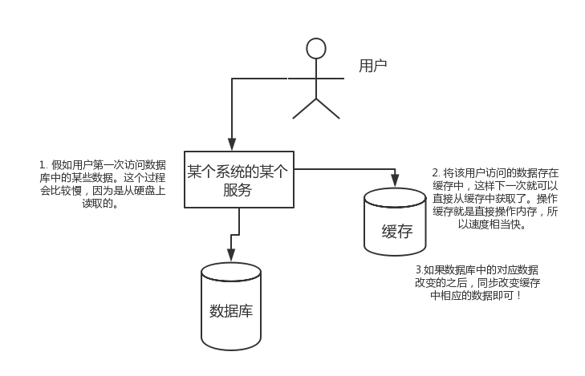

本文介绍Redis面试相关的知识
<!-- TOC -->

- [1. 导读](#1-导读)
- [2. Redis面试题（一）](#2-redis面试题一)
    - [2.1. Redis简介](#21-redis简介)
    - [2.2. 为什么要用 redis/为什么要用缓存](#22-为什么要用-redis为什么要用缓存)
    - [2.3. 为什么要用 redis 而不用 map/guava 做缓存?](#23-为什么要用-redis-而不用-mapguava-做缓存)
    - [2.4. redis 和 memcached 的区别](#24-redis-和-memcached-的区别)
    - [2.5. redis 设置过期时间](#25-redis-设置过期时间)
        - [2.5.1. 定期删除+惰性删除](#251-定期删除惰性删除)
    - [2.6. redis 内存淘汰机制](#26-redis-内存淘汰机制)
    - [2.7. redis 持久化机制](#27-redis-持久化机制)

<!-- /TOC -->
# 1. 导读
1. redis简介
    * **数据存储在内存**，速度快
    * 常用于**缓存**方向
    * 常用作**分布式锁**
2. 为什么要用 redis/为什么要用缓存
    * 高性能 - 速度快，**操作缓存就是直接操作内存**
    * 高并发 - **直接操作缓存能够承受的请求远远大于直接访问数据库**
3. 为什么要用 redis 而不用 map/guava 做缓存?
    * map/guava
        1. 本地缓存
        2. 轻量级，速度快
        3. 生命周期随着 jvm 的销毁而结束
        4. 缓存不具有一致性
    * redis
        * 分布式缓存
        * 多实例下缓存具有一致性
        * 需保持服务高可用，架构复杂
# 2. Redis面试题（一）
## 2.1. Redis简介
简单来说 redis 就是一个数据库，不过与传统数据库不同的是 **redis 的数据是存在内存中的，所以读写速度非常快**，因此 redis 被广泛应用于缓存方向。另外，redis 也经常用来做**分布式锁**。redis 提供了多种数据类型来支持不同的业务场景。

redis最重要的是其线程模型：单线程NIO异步的线程模型。

## 2.2. 为什么要用 redis/为什么要用缓存
主要从**高性能**和**高并发**这两点来看待这个问题。
* 高性能  

假如用户第一次访问数据库中的某些数据。这个过程会比较慢，因为是**从硬盘上读取**的。将该用户访问的数据存在缓存中，这样下一次再访问这些数据的时候就可以直接从缓存中获取了。**操作缓存就是直接操作内存**，所以速度相当快。如果数据库中的对应数据改变的之后，同步改变缓存中相应的数据即可！
<div align="center"></div>

* 高并发

**直接操作缓存能够承受的请求是远远大于直接访问数据库的**，所以我们可以考虑把数据库中的部分数据转移到缓存中去，这样用户的一部分请求会直接到缓存这里而不用经过数据库。
<div align="center"></div>

## 2.3. 为什么要用 redis 而不用 map/guava 做缓存?
缓存分为**本地缓存和分布式缓存**。

* 以 Java 为例，**使用自带的 map 或者 guava 实现的是本地缓存，最主要的特点是轻量以及快速，生命周期随着 jvm 的销毁而结束，并且在多实例的情况下，每个实例都需要各自保存一份缓存，缓存不具有一致性**。

* 使用 redis 或 memcached 之类的称为**分布式缓存**，**在多实例的情况下，各实例共用一份缓存数据，缓存具有一致性**。缺点是需要保持 redis 或 memcached服务的高可用，整个程序架构上较为复杂。

## 2.4. redis 和 memcached 的区别
现在公司一般都是用 redis 来实现缓存。
1. redis支持更丰富的数据类型（支持更复杂的应用场景）
Redis不仅仅支持简单的k/v类型的数据，同时还提供list，set，zset，hash等数据结构的存储。memcache支持简单的数据类型，String。

2. Redis支持**数据的持久化**，可以将内存中的数据保持在磁盘中，重启的时候可以再次加载进行使用,而Memecache把数据全部存在内存之中。

3. 集群模式：memcached没有原生的集群模式，需要依靠客户端来实现往集群中分片写入数据；但是 redis 目前是原生支持 cluster 模式的.

4. Memcached是多线程，非阻塞IO复用的网络模型；Redis使用单线程的多路 IO 复用模型。

## 2.5. redis 设置过期时间
* 应用：一般项目中的 token 、一些登录信息、短信验证码

删除rediskey?
### 2.5.1. 定期删除+惰性删除
1. **定期删除**
    redis默认是每隔 100ms 就随机抽取一些设置了过期时间的key，检查其是否过期，如果过期就删除。

    **为什么要随机抽取？**   
    每隔100ms就遍历所有的设置过期时间的 key 的话，就会给 CPU 带来很大的负载。
2. **惰性删除**  
假如你的过期 key，靠定期删除没有被删除掉，还停留在内存里，除非你的系统去查一下那个 key，才会被redis给删除掉。

如果大量过期key堆积在内存里，导致redis内存块耗尽了。怎么解决这个问题呢？

## 2.6. redis 内存淘汰机制
MySQL里有2000w数据，Redis中只存20w的数据，如何保证Redis中的数据都是热点数据?

redis 提供 6种数据淘汰策略：
**allkeys-lru：当内存不足以容纳新写入数据时，在键空间中，移除最近最少使用的key（这个是最常用的）**

* volatile-lru：从已设置过期时间的数据集（server.db[i].expires）中挑选最近最少使用的数据淘汰  
* volatile-ttl：从已设置过期时间的数据集（server.db[i].expires）中挑选将要过期的数据淘汰  
* volatile-random：从已设置过期时间的数据集（server.db[i].expires）中任意选择数据淘汰  
* allkeys-lru：当内存不足以容纳新写入数据时，在键空间中，移除最近最少使用的key（这个是最常用的）  
* allkeys-random：从数据集（server.db[i].dict）中任意选择数据淘汰  
* no-eviction：禁止驱逐数据，也就是说当内存不足以容纳新写入数据时，新写入操作会报错。这个应该没人使用吧！   

4.0版本后增加以下两种：

* volatile-lfu：从已设置过期时间的数据集(server.db[i].expires)中挑选最不经常使用的数据淘汰   
* allkeys-lfu：当内存不足以容纳新写入数据时，在键空间中，移除最不经常使用的key

## 2.7. redis 持久化机制
怎么保证 redis 挂掉之后再重启数据可以进行恢复？

1. 持久化概念
    将内存中的数据写入到硬盘里面，大部分原因是为了之后重用数据（比如重启机器、机器故障之后**恢复数据**），或者是为了防止系统故障而将数据备份到一个远程位置。

2. Redis支持持久化,Memcached不支持持久化。Redis支持两种不同的持久化操作

* **快照（snapshotting，RDB）**  
    Redis可以**通过创建快照来获得存储在内存里面的数据在某个时间点上的副本**。Redis创建快照之后，可以对快照进行备份，可以将快照复制到其他服务器从而创建具有相同数据的服务器副本（Redis主从结构，主要用来提高Redis性能），还可以将快照留在原地以便重启服务器的时候使用。**快照持久化是Redis默认采用的持久化方式**

    快照持久化是Redis默认采用的持久化方式，在redis.conf配置文件中默认有此下配置：
    ```sh
    save 900 1           #在900秒(15分钟)之后，如果至少有1个key发生变化，Redis就会自动触发BGSAVE命令创建快照。

    save 300 10          #在300秒(5分钟)之后，如果至少有10个key发生变化，Redis就会自动触发BGSAVE命令创建快照。

    save 60 10000        #在60秒(1分钟)之后，如果至少有10000个key发生变化，Redis就会自动触发BGSAVE命令创建快照。
    ```
* AOF（append-only file）持久化  
    与快照持久化相比，**AOF持久化的实时性更好，因此已成为主流的持久化方案**。

    默认情况下Redis没有开启AOF（append only file）方式的持久化，可以通过appendonly参数开启：
    ```
    appendonly yes
    ```
    **开启AOF持久化后,每执行一条会更改Redis中的数据的命令，Redis就会将该命令写入硬盘中的AOF文件**。AOF文件的保存位置和RDB文件的位置相同，都是通过dir参数设置的，默认的文件名是appendonly.aof。  

    在Redis的配置文件中存在三种不同的 AOF 持久化方式，它们分别是：
    ```sh
    appendfsync always    #每次有数据修改发生时都会写入AOF文件,这样会严重降低Redis的速度
    appendfsync everysec  #每秒钟同步一次，显示地将多个写命令同步到硬盘
    appendfsync no        #让操作系统决定何时进行同步
    ```

    为了兼顾数据和写入性能，用户可以**考虑 appendfsync everysec选项 ，让Redis每秒同步一次AOF文件，Redis性能几乎没受到任何影响**。而且这样即使出现系统崩溃，用户最多只会丢失一秒之内产生的数据。当硬盘忙于执行写入操作的时候，Redis还会优雅的放慢自己的速度以便适应硬盘的最大写入速度。

3. Redis 4.0 对于持久化机制的优化  
    **Redis 4.0 开始支持 RDB 和 AOF 的混合持久化**（默认关闭，可以通过配置项 aof-use-rdb-preamble 开启）。

    **如果把混合持久化打开，AOF 重写的时候就直接把 RDB 的内容写到 AOF 文件开头**。这样做的好处是可以结合 RDB 和 AOF 的优点, 快速加载同时避免丢失过多的数据。当然缺点也是有的， AOF 里面的 RDB 部分是压缩格式不再是 AOF 格式，可读性较差。


