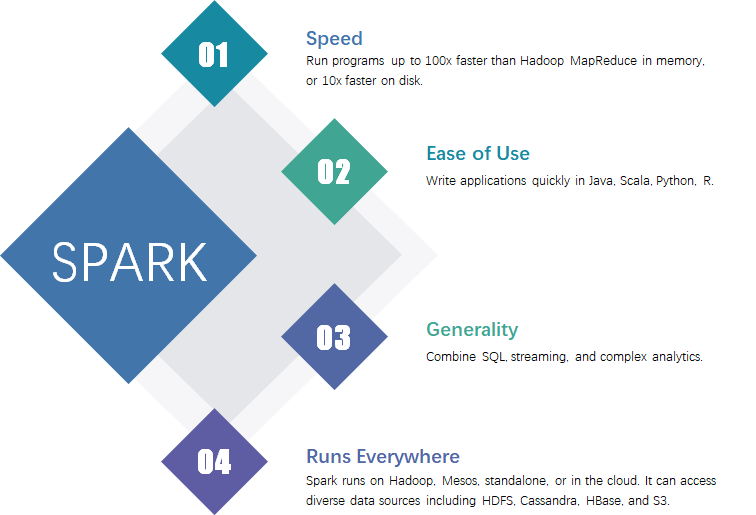
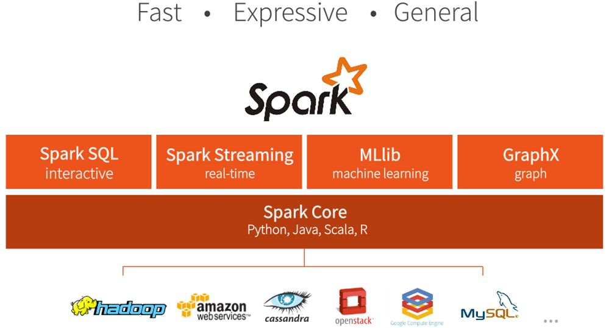
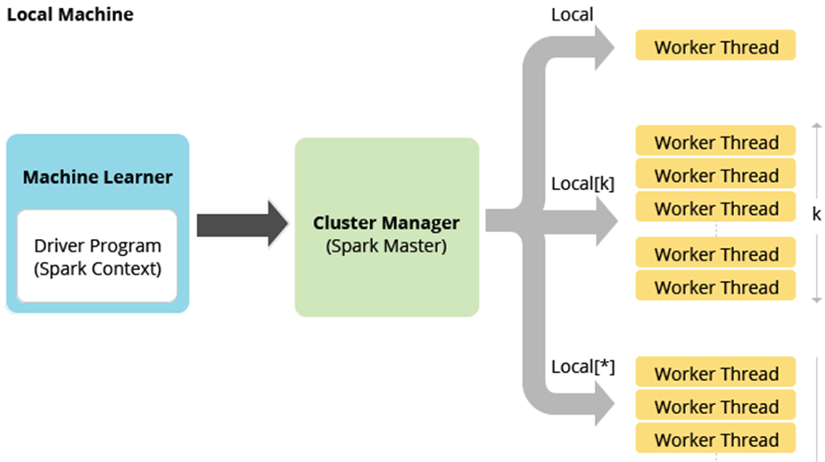

## Spark Day01：环境搭建、基本使用


## 一、Spark 课程安排


### 1、Spark 基础课程安排

​		Spark 基础课程目前来说，大概分为四天，内容很多：

- Spark Core：基础篇内容，2天时间
  - 第一天：环境搭建、基本使用
  - 第二天：RDD（弹性分布式数据集），类比Scala集合类中列表List

- Spark SQL：1天时间
  - 类比Hive框架，来源于Hive框架，前生就是Hive框架，从Hive框架演变而来，功能远远强大与Hive（Hive框架仅仅提供SQL功能，将SQL转换为MapReduce），DSL编程。
- SparkStreaming：1天时间
  - 类比Storm，针对流式数据进行实时分析处理框架，Spark 2.x开始出现SQL+Streaming=结构化流式处理框架StructuredStreaming，近两年比较流式处理框架Flink。


学习Spark课程基础：

- Apache Hadoop 框架：
  - HDFS：分布式文件系统，存储大规模数据
  - YARN：分布式集群资源管理和应用调度框架，可以运行很多应用，比如MapReduce、Spark、Storm、Flink，在企业中往往将Spark程序运行在YARN上。
  - MapReduce：编程模型，思想很好

- MySQL和Hive：
  - 在企业中往往多大数据相关的工作，SQL必须的，必备的
- Scala 语言：
  - 函数式编程，高阶函数和匿名函数
  - 集合类：Array、List、Set、Map，尤其其中高阶函数


### 2、今天课程内容提纲

​		今天是Spark第一天，主要还是以环境为主：

- Spark 框架概述（了解）
- Spark 框架模块（知道）
- Spark 应用架构（知道）
- Spark 源码编译（知道）
- Spark 运行模式：本地模式（掌握）
- Spark 集群（掌握）
  - Spark Standalone集群：类似Hadoop YARN框架
  - HADOOP YARN：Spark 应用运行在YARN上
- Spark 应用提交（掌握）
  - 提交命令：spark-submit
  - Deploy Mode：很关键的，很容易出错，尤其程序运行在YARN上
- IDEA 开发程序（掌握）
  - 词频统计WordCount：Scala、Java（匿名内部类和Lambda表达式）
  - 将应用打包运行在集群


## 二、Spark 框架概述


### 1、Spark 是什么

​		Spark 框架类似MapReduce框架，针对海量数据进行处理分析的。

​		官方文档：http://spark.apache.org/


涵盖以下几个方面：

- 针对大规模数据处理的框架
  - 类似MapReduce大规模数据处理框架
- 统一分析引擎（**unified analytics engine**）
  - 集批处理、交互式分析和流式处理、高级分析为一体的一栈式解决方案


文档：

- 官方文档，针对2.2.0版本：http://spark.apache.org/docs/2.2.0/
- 源码下载：https://github.com/apache/spark

- Apache 下载：https://archive.apache.org/dist/spark/

  

Spark 框架历史：

​		来源于加州大学伯克利分校AMP（A：算法，M：机器学习，P：人类） Lab实验室（人工智能AI），发表论文，出现Spark框架。

​		创建公司Databricks（金砖）：https://databricks.com/spark/about，官方博客：https://databricks.com/blog


目前来说，对大规模数据处理的方式（业务模型）：

- 离线批处理（分析）：Bacth Processing
  - 典型框架就是MapReduce、Hive
- 实时流式处理：Streaming Processing
  - 针对流式数据，实时分析处理，典型框架Storm（JStorm），SparkStreaming、Flink（Blink）

- 交互式处理分析：Interactive Processing
  - 相应时间500ms - 2s之间
  - 典型框架：SparkSQL、Presto（京东）、Impala、Kylin

- 高级数据分析：
  - 机器学习（Machine Learning）：将传统算法使用大数据框架实现，提供对应API供使用
  - 图形计算


### 2、Spark 优势




优势：**Runs Everywhere**

- 第一个方面：数据来源
  - HDFS：文本文件、JSON文件、ORC或Parquet
  - NoSQL：HBase（Spark 从HBase读取数据）、ES、MongoDB、Redis
  - RDBMs：MySQL、Oracle。。。。。。
- 第二方面：应用运行在哪里
  - 本地模式：Local Mode 
  - 集群模式：Cluster Manager
    - Spark Standalone集群
    - Hadoop YARN集群（使用最多）
    - Apache Mesos（分布式集群资源管理和应用调度框架） -- 携程有的部门在使用
  - K8s：容器中
    - 从Spark 2.3开始的支持运行在K8s中


## 三、Spark 框架模块




​		Spark  2.x中模块，主要包含以下几项：

- Spark Core：核心模块，基础模块
  - 对大规模数据进行离线批处理分析的模块，提供主要**数据结构：RDD** -> 将要处理的数据封装在分布式集合中，调用集合中的函数就可以处理数据，最终将数据输出到外部存储系统（RDBMS、Redis等）
- Spark SQL：针对结构化数据处理的模块
  - 类似Hive框架的功能，但是SparkSQL提供SQL和DSL（调用API）
  - 数据结构：**Dataset/DataFrame = RDD + Schema（**字段名称和字段类型）

- SparkStreaming：针对流式数据实时处理
  - 类似Storm框架，小批次小批次Batch处理数据，按照时间间隔将流式数据划分文很多小批次，每批次的数据当做RDD，对其进行处理分析，将每批次处理结果进行输出。
  - 数据结构：**DStream(分离、离散的流)=List[RDD]**


- Spark MLlib：机器学习库
  - 将传统的经典的机器学习算法（分类、聚类、推荐和回归）使用Spark实现
    - 基于RDD数据结构实现的算法，老的API
    - 基于DataFrame数据结构的算法，新的API，推荐使用此类API

- Spark GraphX：图形计算

  - 2014年的时候，阿里巴巴某些部门使用GraphX框架，
  - 目前Neo4J图数据库，被广泛的使用，很方便，属于NOSQL数据库中面向图的数据库。

- Structured Streaming：结构化流式处理

  - 一言以蔽之：SparkSQL + SparkStreaming，对流式数据使用DataFrame进行处理
  - 直接从Kafka 读取数据流式数据，进行分析处理，输出到HBase、Redis、RDBMS
  - 从Spark 2.0提出，到Spark 2.2.0成Release版本，可以用生成环境使用，Spark 2.3和Spark 2.4功能不断的增加，最新版本也提供了对流式数据可以进行一条一条的处理而不是微批处理。

- SparkR：针对R语言编程的Spark 模块

  

- PySpark：针对Python开发应用的Spark 模块

  


## 四、Spark 应用架构

​		

### 1、回顾MapReduce应用架构

​			当一个MapReduce应用运行在集群上的时候（运行YARN），两部分组成：

- 第一部分：应用管理者AppMaster
  - 管理应用资源的申请，申请Contanier容器（内存和CPU）
  - 调度Task执行，跟踪运行转态（成功还是失败，失败的话是否需要重新运行）
- 第二部分：Task任务
  - 包含两种Task，分别为MapTask和ReduceTask，每个Task都是运行在一个JVM Process进程中。


### 2、Spark 应用架构

​		官方文档：http://spark.apache.org/docs/2.2.0/cluster-overview.html

​		中文文档：http://spark.apachecn.org


Spark 应用运行在集群上，也是包含两个部分：

- Driver Program：驱动程序  - JVM Process进程
  - 就是程序MAIN方法，必须创建SparkContext上下文对象
  - 功能：读取数据、申请资源、调度Task运行

- Executors：运行Task的进程 -JVM Process进程
  - 相当于线程池，每个线程运行1个Task任务，每个Task运行需要1Core CPU（默认配置）
  - Driver Program向Worker节点（NodeManager）启动Executor进程，将Task发送给Executor执行。


与MapReduce应用比较：

- 第一点：一个MapReduce应用就是一个Job，但是SparkApplication中有多个Job
- 第二点：MapReduce中Task以进程Process方式运行，Spark中Task以线程Thread方式运行。


## 五、Spark 源码编译


### 1、Spark 下载

​		官方下载：http://spark.apache.org/downloads.html

然而实际使用的时候，并不能直接使用下载，仅仅测试可以下载使用。


### 2、编译源码

​		http://spark.apache.org/docs/2.2.0/building-spark.html

#### 1）、为什么要源码编译：

- Spark 框架往往处理的数据和应用运行，依赖于Hadoop、Hive等框架，需要对应实际版本中
- 不能使用CDH 5.x版本的Spark
  - Spark 版本太低，基于Spark 1.6.x版本
  - Spark SQL模块被阉割，SQL模块的功能与Cloudera公司的Imapla冲突


#### 2）、下载地址

​	https://github.com/apache/spark/archive/v2.2.0.tar.gz


### 3、目录结构


## 六、Spark 本地模式


### 1、Spark 应用运行模式


### 2、应用运行本地模式

​			MapReduce运行在本地模式：启动一个JVM进程，将所有Task运行在JVM进程中。

​			针对Spark Application来说，本地模式同样也是启动给一个JVM 进程，将所有的Task运行在进程中，但是不一样的是启动JVM进程的时候，需要指定CPU Cor核数，表示可以同时运行几个Task。

​			本地模式启动的JVM进程其实就是运行DriverProgram程序，也就是Spark Application的MAIN方法。




相关含义说明：


通常写法：

```shell
## 指定2个线程运行Task，通常写法
--master local[2]
```


### 3、本地模式配置


### 4、启动spark-shell本地模式

```shell
SPARK_HOME=/export/servers/spark-2.2.0-bin-2.6.0-cdh5.14.0
${SPARK_HOME}/bin/spark-shell --master local[2]
```

启动提示信息：

```
# a. 表示Spark Application运行提供WEB UI监控页面，端口号：4040
Spark context Web UI available at http://192.168.59.140:4040

# b. 表示的是创建SparkContext实例对象，名称为sc, 主要用于读取数据和调度Job执行
Spark context available as 'sc' (master = local[2], app id = local-1562012933749).

# c. 表示创建SparkSession实例对象，名称为spark，从Spark 2.0开始出现的，底层还是SparkContext
Spark session available as 'spark'.
```


```
scala> val readmeRDD = sc.textFile("/datas/README.md")
```


### 5、词频统计


#### 1）、读取输入数据

```scala
val inputRDD = sc.textFile("/datas/wordcount.input")
```

​		底层调用的就是MapReduce中InputFormat读取数据的方式（TextInputFormat)，此处RDD中的每条数据就是文件中读取的每条数据。


#### 2）、分割单词

```scala
val wordsRDD = inputRDD.flatMap(line => line.split("\\s+"))
```


#### 3）、转换为二元组

```scala
val tuplesRDD = wordsRDD.map(word => (word ,1))
```


#### 4）、统计词频

```scala
val wordcountsRDD = tuplesRDD.reduceByKey((a, b) => a + b)
```

​		按照Key对Value进行统计，聚合操作包含：本地聚合和全局聚合。


#### 5）、输出结果

```
wordcountsRDD.saveAsTextFile("/datas/sparkOutut")
```


### 6、列表中reduce函数


### 7、本地模式运行圆周率PI

​		使用蒙塔卡罗算法，估算统计圆周率PI。

```shell
SPARK_HOME=/export/servers/spark-2.2.0-bin-2.6.0-cdh5.14.0

## 本地模式local mode 运行圆周率程序
${SPARK_HOME}/bin/spark-submit \
--master local[2] \
--class org.apache.spark.examples.SparkPi \
${SPARK_HOME}/examples/jars/spark-examples_2.11-2.2.0.jar \
100
```


## 七、Spark Standalone 集群


### 1、回顾Hadoop YARN架构

​		分布式主从结构，由主节点和从节点。

- 主节点ResourceManager：管理整个集群资源，调度分配集群资源
- 从节点NodeManager：管理每个机器的资源，将资源信息发送给RM，并且在容器Contanier中运行任务。

MapReduce应用运行在YARN上的时候，启动一个服务，监控观察应用运行完成的状态：

- MRHistoryServer：监控运行完成MapReduce程序


### 2、Standalone 架构

​		与Hadoop YARN架构类似，此分布式资源管理框架仅仅运行Spark Application。


- 主节点：Master
  - 管理整个集群的资源和调度资源运行的Spark Application
- 从节点：Workers
  - 管理每个节点的资源，运行Executors（JVM 进程，相当于线程池，每个线程使用1Core CPU，运行1个task）

- 历史服务器：HistoryServer
  - 监控运行Spark Application完成以后以后的各个应用状态。
  - Spark Application运行的时候，日志信息称为EventLog（事件日志）
  - 当应用运行在集群上的时候，将其运行的日志信息记录下来保存下来（通常保存到HDFS），启动HistoryServer服务，到保存目录下读取日志数据，进行解析，通过WEB UI界面展示。


### 3、Standalone HA

​		http://spark.apache.org/docs/2.2.0/spark-standalone.html#high-availability

使用Zookeeper配置HA：让Zookeeper选举Active Master，并且实时监控Master和StandBy Master状态。


配置属性：http://spark.apache.org/docs/2.3.0/configuration.html#deploy


### 4、MapReduce HistoryServer

​		专门监控运行在YARN上完成的MapReduce服务，配置如下：

- 将MR运行日志数据保存到HDFS（日志聚合）

  - 将运行完成MR程序的日志数据上传到HDFS目录：`yarn-site.xml`

  ```xml
      <!-- 启用日志，保存日志数据到HDFS -->
  	<property>
          <name>yarn.log-aggregation-enable</name>
          <value>true</value>
      </property>
      <!-- 表示保存日志数据天数，单位是秒 -->
      <property>
          <name>yarn.log-aggregation.retain-seconds</name>
          <value>604800</value>
      </property>
  ```

- 配置服务在哪台机器及端口号: `map-site.xml`

  ```xml
          <property>
                  <name>mapreduce.jobhistory.address</name>
                  <value>bigdata-cdh03.itcast.cn:10020</value>
          </property>
          <property>
                  <name>mapreduce.jobhistory.webapp.address</name>
                  <value>bigdata-cdh03.itcast.cn:19888</value>
          </property>
  ```

- 启动服务

```shell
sbin/mr-jobhistory-daemon.sh start historyserver
```

运行MapReduce程序

```shell
bin/yarn jar share/hadoop/mapreduce/hadoop-mapreduce-examples-2.6.0-cdh5.14.0.jar wordcount /datas/wordcount.input /datas/mrOutput
```


## 八、Spark on YARN

​		官方文档：http://spark.apache.org/docs/2.2.0/running-on-yarn.html

- 配置参数：`yarn.log.server.url`

```xml
	<property>
		<name>yarn.log.server.url</name>
		<value>http://bigdata-cdh03.itcast.cn:19888/jobhistory/logs</value>
	</property>
```

​		虽然spark和MR的模型不同,都有自己的historyserver， 但是有一个是相通的,就是都是在YARN上运行, 每个container有统一的日志存放地址；
​		YARN把container日志查询和查看的方式，做到MR的historyserver中了，相当于是MR的historyserver提供了一个功能: 根据containerid或者applicationid,查询日志。所以,YARN提供了yarn.log.server.url参数，指定查询日志的url。

- 配置Spark Application运行YARN上的服务监控地址：`$SPARK_HOME/conf/spark-defaults.conf`

```properties
spark.yarn.historyServer.address bigdata-cdh01.itcast.cn:18080
```


- 发现日志信息，此过程很慢

```xml

19/07/02 07:59:19 WARN yarn.Client: Neither spark.yarn.jars nor spark.yarn.archive is set, falling back to uploading libraries under SPARK_HOME.
19/07/02 07:59:21 INFO yarn.Client: Uploading resource file:/tmp/spark-44403171-fcb4-4b88-ad0e-05cb43180eb4/__spark_libs__4416616369365011235.zip -> hdfs://bigdata-cdh01.itcast.cn:8020/user/root/.sparkStaging/application_1562024263233_0005/__spark_libs__4416616369365011235.zip
```

解决：将依赖Spark 框架JAR包上传到HDFS目录，运行应用的时候指定即可。

```shell
bin/hdfs dfs -mkdir -p /spark/app/jars/

bin/hdfs dfs -put /export/servers/spark-2.2.0-bin-2.6.0-cdh5.14.0/jars/* /spark/app/jars/
```


提交运行应用：

```shell
## 运行圆周率程序，指定依赖Spark JAR包
SPARK_HOME=/export/servers/spark-2.2.0-bin-2.6.0-cdh5.14.0
${SPARK_HOME}/bin/spark-submit \
--master yarn \
--conf spark.yarn.jars=hdfs://bigdata-cdh01.itcast.cn:8020/spark/app/jars/*.jar \
--class org.apache.spark.examples.SparkPi \
${SPARK_HOME}/examples/jars/spark-examples_2.11-2.2.0.jar \
10
```


- 提交Spark 应用到RM，会为此应用创建AppMaster，运行在NM的Contanier中；
- Spark Application的Driver找应用AppMaster，需要多少资源运行多个Eexcutor；
- 应用AppMaster向RM申请资源，获取资源信息，给Spark Application的Driver；
- Driver Program告知NM在Contanier中启动Executor（JVM 进程，线程池）；
- Driver Program调度Job的Task到Executor中运行。


## 九、Spark 应用提交

​		

### 1、应用提交spark-sbumit

​		Spark 应用提交的相关命令，在$SPARK_HOME/bin目录下：


通过阅读脚本的代码可以：

```xml
spark-shell  -> spark-submit  -> spark-class
```


```shell
SPARK_HOME=/export/servers/spark-2.2.0-bin-2.6.0-cdh5.14.0
${SPARK_HOME}/bin/spark-submit \
## 应用的可选项
--master yarn \
--conf spark.yarn.jars=hdfs://bigdata-cdh01.itcast.cn:8020/spark/app/jars/*.jar \
--class org.apache.spark.examples.SparkPi \
## 应用的Jar（使用Java或者Scala语言开发）
${SPARK_HOME}/examples/jars/spark-examples_2.11-2.2.0.jar \
## 应用参数
10
```

提交应用帮助文档：

```shell
bin/spark-submit --help
```

有如下文档说明：

```shell
# 应用提交命令
Usage: spark-submit [options] <app jar | python file> [app arguments]
# 可以通过命令行将应用kill
Usage: spark-submit --kill [submission ID] --master [spark://...]
# 可以通过命令行查看应用状态数据
Usage: spark-submit --status [submission ID] --master [spark://...]
# 运行Spark 自带的应用程序，基本不用
Usage: spark-submit run-example [options] example-class [example args]

Options:
  --master MASTER_URL         spark://host:port, mesos://host:port, yarn, or local.
  --deploy-mode DEPLOY_MODE   Whether to launch the driver program locally ("client") or
                              on one of the worker machines inside the cluster ("cluster")
                              (Default: client).
  --class CLASS_NAME          Your application's main class (for Java / Scala apps).
  --name NAME                 A name of your application.
  --jars JARS                 Comma-separated list of local jars to include on the driver
                              and executor classpaths.
  --packages                  Comma-separated list of maven coordinates of jars to include
                              on the driver and executor classpaths. Will search the local
                              maven repo, then maven central and any additional remote
                              repositories given by --repositories. The format for the
                              coordinates should be groupId:artifactId:version.
  --exclude-packages          Comma-separated list of groupId:artifactId, to exclude while
                              resolving the dependencies provided in --packages to avoid
                              dependency conflicts.
  --repositories              Comma-separated list of additional remote repositories to
                              search for the maven coordinates given with --packages.
  --py-files PY_FILES         Comma-separated list of .zip, .egg, or .py files to place
                              on the PYTHONPATH for Python apps.
  --files FILES               Comma-separated list of files to be placed in the working
                              directory of each executor. File paths of these files
                              in executors can be accessed via SparkFiles.get(fileName).

  --conf PROP=VALUE           Arbitrary Spark configuration property.
  --properties-file FILE      Path to a file from which to load extra properties. If not
                              specified, this will look for conf/spark-defaults.conf.

  --driver-memory MEM         Memory for driver (e.g. 1000M, 2G) (Default: 1024M).
  --driver-java-options       Extra Java options to pass to the driver.
  --driver-library-path       Extra library path entries to pass to the driver.
  --driver-class-path         Extra class path entries to pass to the driver. Note that
                              jars added with --jars are automatically included in the
                              classpath.

  --executor-memory MEM       Memory per executor (e.g. 1000M, 2G) (Default: 1G).

  --proxy-user NAME           User to impersonate when submitting the application.
                              This argument does not work with --principal / --keytab.

  --help, -h                  Show this help message and exit.
  --verbose, -v               Print additional debug output.
  --version,                  Print the version of current Spark.

 Spark standalone with cluster deploy mode only:
  --driver-cores NUM          Cores for driver (Default: 1).

 Spark standalone or Mesos with cluster deploy mode only:
  --supervise                 If given, restarts the driver on failure.
  --kill SUBMISSION_ID        If given, kills the driver specified.
  --status SUBMISSION_ID      If given, requests the status of the driver specified.

 Spark standalone and Mesos only:
  --total-executor-cores NUM  Total cores for all executors.

 Spark standalone and YARN only:
  --executor-cores NUM        Number of cores per executor. (Default: 1 in YARN mode,
                              or all available cores on the worker in standalone mode)

 YARN-only:
  --driver-cores NUM          Number of cores used by the driver, only in cluster mode
                              (Default: 1).
  --queue QUEUE_NAME          The YARN queue to submit to (Default: "default").
  --num-executors NUM         Number of executors to launch (Default: 2).
                              If dynamic allocation is enabled, the initial number of
                              executors will be at least NUM.
  --archives ARCHIVES         Comma separated list of archives to be extracted into the
                              working directory of each executor.
  --principal PRINCIPAL       Principal to be used to login to KDC, while running on
                              secure HDFS.
  --keytab KEYTAB             The full path to the file that contains the keytab for the
                              principal specified above. This keytab will be copied to
                              the node running the Application Master via the Secure
                              Distributed Cache, for renewing the login tickets and the
                              delegation tokens periodically.
```


### 2、部署模式deploy mode


#### 1）、基本概念

提交应用的时候，有一个参数：

```
--deploy-mode DEPLOY_MODE   Whether to launch the driver program locally ("client") or
                              on one of the worker machines inside the cluster ("cluster")
                              (Default: client).
```

表示每个Spark Application运行时Driver Program运行的地方，有两个值：

- 客户端：client
  - 将Driver运行在应用提交的机器上，启动进程名称为SparkSubmit
- 集群中：cluster
  - 将Driver 运行在集群的从节点上，如果是SparkStandalone集群，就运行在Worker节点上；如果是YARN集群，就运行在NodeManager的Contanier容器中。

在企业实际生产环境中，将Spark Application以cluster部署模式（Deploy Mode）运行在集群上。


#### 2）、演示说明

​		运行圆周率PI在SparkStandalone集群上，分别以client和cluster模式：

```shell
SPARK_HOME=/export/servers/spark-2.2.0-bin-2.6.0-cdh5.14.0
## 运行PI程序，到Spark Standalone集群，设置资源配置
${SPARK_HOME}/bin/spark-submit \
--master spark://bigdata-cdh02.itcast.cn:7077 \
--deploy-mode client \
--name "Spark PI Application" \
--class org.apache.spark.examples.SparkPi \
--driver-memory 512m \
--executor-memory 512m \
--executor-cores 1 \
--total-executor-cores 3 \
${SPARK_HOME}/examples/jars/spark-examples_2.11-2.2.0.jar \
10
```


```shell
SPARK_HOME=/export/servers/spark-2.2.0-bin-2.6.0-cdh5.14.0
## 运行PI程序，到Spark Standalone集群，设置资源配置
${SPARK_HOME}/bin/spark-submit \
--master spark://bigdata-cdh02.itcast.cn:6066 \
--deploy-mode cluster \
--name "Spark PI Application" \
--class org.apache.spark.examples.SparkPi \
--driver-memory 512m \
--executor-memory 512m \
--executor-cores 1 \
--total-executor-cores 3 \
${SPARK_HOME}/examples/jars/spark-examples_2.11-2.2.0.jar \
10
```


```shell
SPARK_HOME=/export/servers/spark-2.2.0-bin-2.6.0-cdh5.14.0
## 运行PI程序，到Spark Standalone集群，设置资源配置
${SPARK_HOME}/bin/spark-submit \
--master spark://bigdata-cdh02.itcast.cn:6066 \
--deploy-mode cluster \
--name "Spark PI Application" \
--class org.apache.spark.examples.SparkPi \
--driver-memory 512m \
--driver-cores 1 \
--supervise \
--executor-memory 512m \
--executor-cores 1 \
--total-executor-cores 3 \
${SPARK_HOME}/examples/jars/spark-examples_2.11-2.2.0.jar \
10
```

​	运行圆周率PI在Hadoop YARN集群上，client模式：


​		当Spark Application运行在YARN上时，采用client的DeployMode的时候，AppMaster充当Executor加载器：向RM申请资源（Contanier），告知NM在Contanier启动Executor进程，不做任何关于Application中Job的调度执行。

​		

​		将Spark Application运行在YARN上时，将Driver Program以cluster的DeployMode运行，此时AppMaster和Driver合一体。

```shell
SPARK_HOME=/export/servers/spark-2.2.0-bin-2.6.0-cdh5.14.0
${SPARK_HOME}/bin/spark-submit \
--master yarn \
--deploy-mode cluster \
--class org.apache.spark.examples.SparkPi \
--driver-memory 512m \
--driver-cores 1 \
--executor-memory 512m \
--executor-cores 1 \
--num-executors 3 \
--queue dev \
${SPARK_HOME}/examples/jars/spark-examples_2.11-2.2.0.jar \
100
```


## 十、应用开发


### 1、创建Maven工程

pom.xml文件内容如下：

```xml
<!-- 指定仓库位置，依次为aliyun、cloudera和jboss仓库 -->
<repositories>
    <repository>
        <id>aliyun</id>
        <url>http://maven.aliyun.com/nexus/content/groups/public/</url>
    </repository>
    <repository>
        <id>cloudera</id>
        <url>https://repository.cloudera.com/artifactory/cloudera-repos/</url>
    </repository>
    <repository>
        <id>jboss</id>
        <url>http://repository.jboss.com/nexus/content/groups/public</url>
    </repository>
</repositories>

<properties>
    <scala.version>2.11.8</scala.version>
    <scala.binary.version>2.11</scala.binary.version>
    <spark.version>2.2.0</spark.version>
    <hadoop.version>2.6.0-cdh5.14.0</hadoop.version>
</properties>

<dependencies>
    <!-- 依赖Scala语言 -->
    <dependency>
        <groupId>org.scala-lang</groupId>
        <artifactId>scala-library</artifactId>
        <version>${scala.version}</version>
    </dependency>
    <!-- Spark Core 依赖 -->
    <dependency>
        <groupId>org.apache.spark</groupId>
        <artifactId>spark-core_${scala.binary.version}</artifactId>
        <version>${spark.version}</version>
    </dependency>
    <!-- Hadoop Client 依赖 -->
    <dependency>
        <groupId>org.apache.hadoop</groupId>
        <artifactId>hadoop-client</artifactId>
        <version>${hadoop.version}</version>
    </dependency>
</dependencies>

<build>
    <outputDirectory>target/classes</outputDirectory>
    <testOutputDirectory>target/test-classes</testOutputDirectory>
    <resources>
        <resource>
            <directory>${project.basedir}/src/main/resources</directory>
        </resource>
    </resources>
    <!-- Maven 编译的插件 -->
    <plugins>
        <plugin>
            <groupId>org.apache.maven.plugins</groupId>
            <artifactId>maven-compiler-plugin</artifactId>
            <version>3.0</version>
            <configuration>
                <source>1.8</source>
                <target>1.8</target>
                <encoding>UTF-8</encoding>
            </configuration>
        </plugin>
        <plugin>
            <groupId>net.alchim31.maven</groupId>
            <artifactId>scala-maven-plugin</artifactId>
            <version>3.2.0</version>
            <executions>
                <execution>
                    <goals>
                        <goal>compile</goal>
                        <goal>testCompile</goal>
                    </goals>
                    <configuration>
                        <args>
                            <arg>-dependencyfile</arg>
                            <arg>${project.build.directory}/.scala_dependencies</arg>
                        </args>
                    </configuration>
                </execution>
            </executions>
        </plugin>
    </plugins>
</build>
```


### 2、序列化异常


​		上述问题，在于PrintStream不能序列化传输，可以设置Spark Application不使用Java 序列化。


设置应用使用Kryo序列化

```java
		// TODO： 1、构建JavaSparkContext实例对象，同样传递SparkConf封装应用配置信息
		SparkConf sparkConf = new SparkConf()
				.setMaster("local[2]").setAppName("SparkWordCountJava")
				// 设置序列化为Kryo
				.set("spark.serializer", "org.apache.spark.serializer.KryoSerializer")
				//
				.registerKryoClasses(new Class[]{java.io.PrintStream.class});
```

