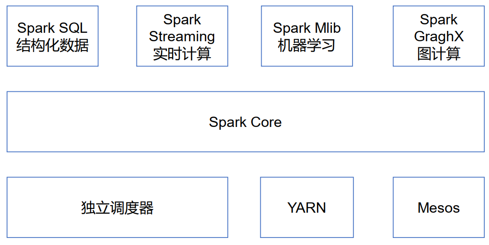
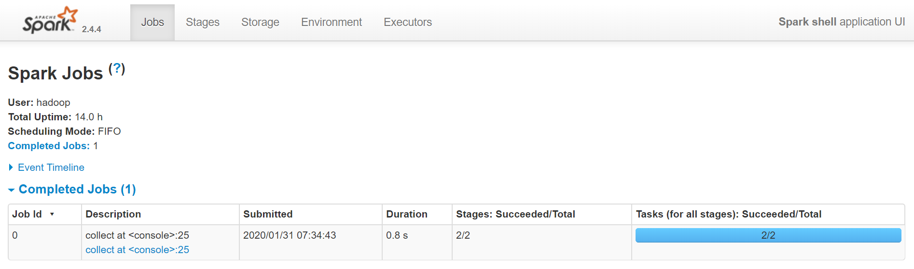
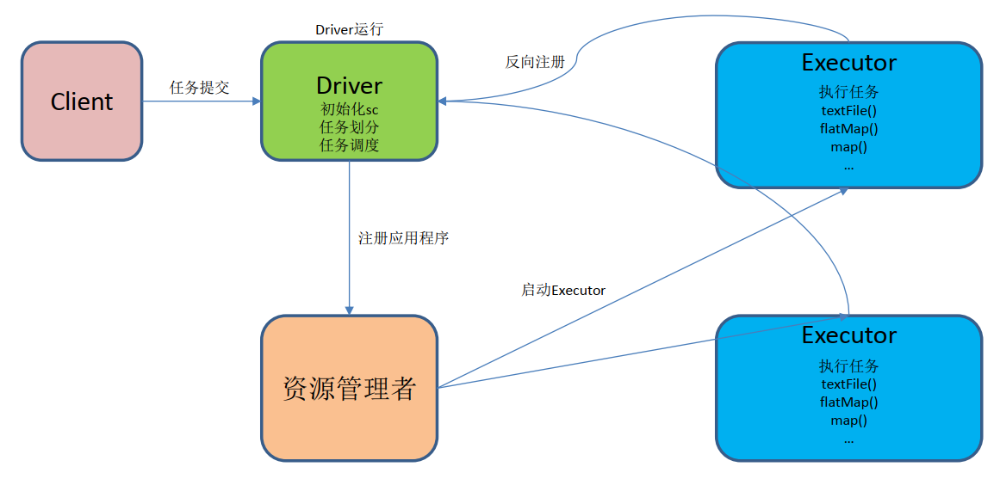
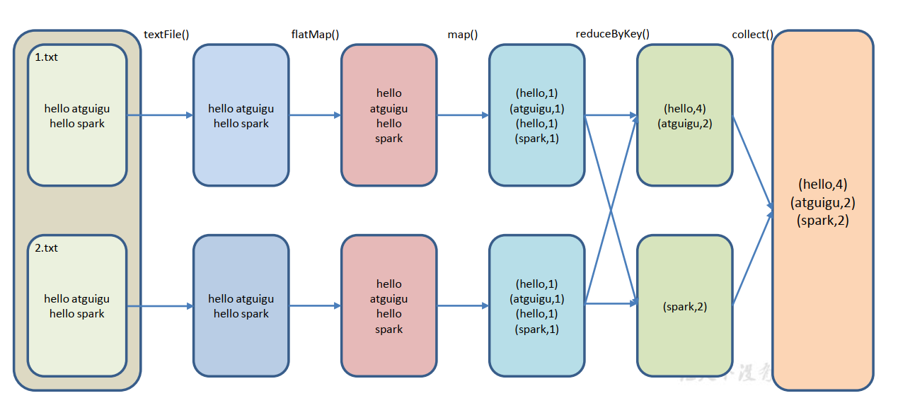
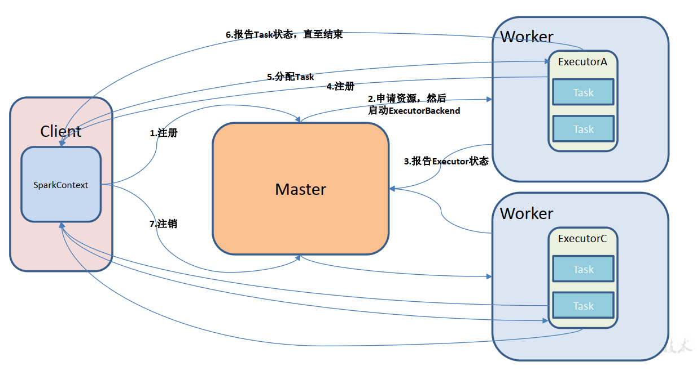
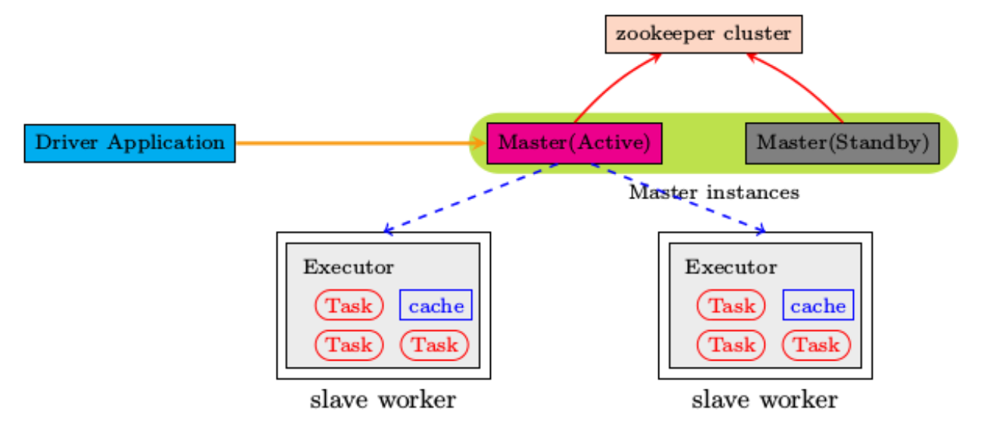
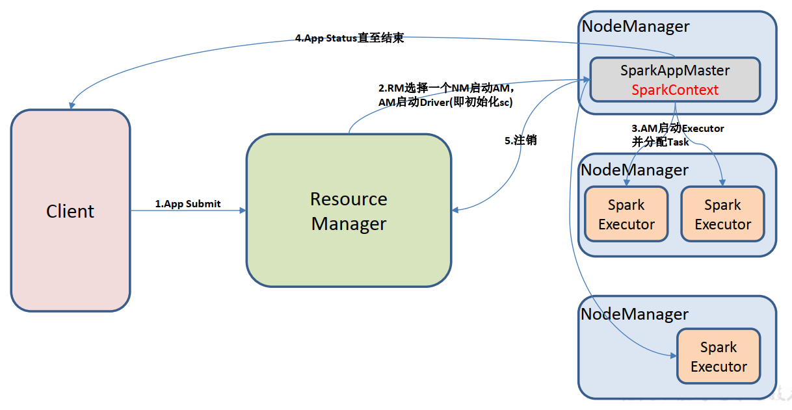
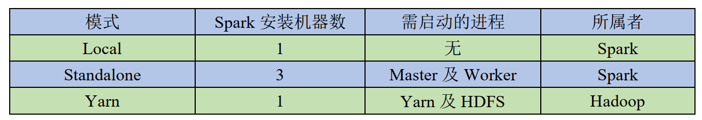

**Spark 基础解析**
<!-- TOC -->

- [1. Spark 概述](#1-spark-概述)
    - [1.1. 什么是 Spark](#11-什么是-spark)
        - [1.1.1. 定义](#111-定义)
        - [1.1.2. 历史](#112-历史)
    - [1.2. Spark 内置模块](#12-spark-内置模块)
    - [1.3. Spark 特点](#13-spark-特点)
- [2. Spark 运行模式](#2-spark-运行模式)
    - [2.1. Local模式](#21-local模式)
        - [2.1.1. 概述](#211-概述)
        - [2.1.2. 安装并使用](#212-安装并使用)
        - [2.1.3. 基本使用](#213-基本使用)
        - [2.1.4. WordCount案例](#214-wordcount案例)
        - [2.1.5. spark任务提交流程](#215-spark任务提交流程)
        - [2.1.6. 数据流程](#216-数据流程)
    - [2.2. Standalone 模式](#22-standalone-模式)
        - [2.2.1. 概述](#221-概述)
        - [2.2.2. 安装与使用](#222-安装与使用)
        - [2.2.3. JobHistoryServer 配置](#223-jobhistoryserver-配置)
        - [2.2.4. HA配置](#224-ha配置)
    - [2.3. Yarn模式](#23-yarn模式)
        - [2.3.1. 概述](#231-概述)
        - [2.3.2. 安装使用](#232-安装使用)
        - [2.3.3. 日志查看](#233-日志查看)
    - [2.4. Mesos 模式](#24-mesos-模式)
    - [2.5. 几种模式对比](#25-几种模式对比)
- [3. WordCount案例实战](#3-wordcount案例实战)
- [4. 踩坑记](#4-踩坑记)
    - [4.1. Spark运行shell报错：Service 'sparkDriver' could not bind on a random free port.](#41-spark运行shell报错service-sparkdriver-could-not-bind-on-a-random-free-port)

<!-- /TOC -->
# 1. Spark 概述
## 1.1. 什么是 Spark
### 1.1.1. 定义
Spark是一种**基于内存**的快速、通用、可扩展的**大数据分析引擎**。

### 1.1.2. 历史
* 2009年诞生于加州大学伯克利分校AMPLab， 项目采用Scala编写。
* 2010年开源;
* 2013年6月成为Apache孵化项目
* 2014年2月成为Apache顶级项目。

## 1.2. Spark 内置模块
<div align="center"></div>

* Spark Core： 实现了 Spark 的基本功能，包含任务调度、内存管理、错误恢复、与存储系统交互等模块。 Spark Core 中还包含了对弹性分布式数据集(Resilient Distributed DataSet，简称 RDD)的 API 定义。

* Spark SQL： 是 Spark 用来操作结构化数据的程序包。通过 Spark SQL，我们可以使用SQL 或者 Apache Hive 版本的 SQL 方言(HQL)来查询数据。 Spark SQL 支持多种数据源，比如 Hive 表、 Parquet 以及 JSON 等。

* Spark Streaming： 是 Spark 提供的对实时数据进行流式计算的组件。提供了用来操作数据流的 API，并且与 Spark Core 中的 RDD API 高度对应。

* Spark MLlib： 提供常见的机器学习(ML)功能的程序库。包括分类、回归、聚类、协同过滤等，还提供了模型评估、数据 导入等额外的支持功能。
集群管理器： Spark 设计为可以高效地在一个计算节点到数千个计算节点之间伸缩计算。为了实现这样的要求，同时获得最大灵活性， Spark 支持在各种集群管理器(Cluster Manager)上运行，包括 Hadoop YARN、 Apache Mesos，以及 Spark 自带的一个简易调度器，叫作独立调度器。

## 1.3. Spark 特点
1）快： 与Hadoop的MapReduce相比， Spark基于内存的运算要快100倍以上，基于硬盘的运算也要快10倍以上。 Spark实现了高效的DAG执行引擎，可以通过基于内存来高效处理数据流。计算的中间结果是存在于内存中的。

2）易用： Spark支持Java、 Python和Scala的API，还支持超过80种高级算法，使用户可以快速构建不同的应用。而且Spark支持交互式的Python和Scala的Shell，可以非常方便地在这些Shell中使用Spark集群来验证解决问
题的方法。

3）通用： Spark提供了统一的解决方案。 Spark可以用于批处理、交互式查询（ Spark SQL）、实时流处理（ Spark Streaming）、机器学习（ Spark MLlib）和图计算（ GraphX）。这些不同类型的处理都可以在同一个应用中无缝使用。减少了开发和维护的人力成本和部署平台的物力成本。

4）兼容性： Spark可以非常方便地与其他的开源产品进行融合。比如， Spark可以使用Hadoop的YARN和 Apache Mesos作为它的资源管理和调度器，并且可以处理所有Hadoop支持的数据，包括HDFS、 HBase等。这对
于已经部署Hadoop集群的用户特别重要，因为不需要做任何数据迁移就可以使用Spark的强大处理能力。

# 2. Spark 运行模式
1.Spark通常有本地模式、Standalone模式、Yarn安装模式等。

## 2.1. Local模式
### 2.1.1. 概述
Local模式就是运行在一台计算机上的模式，通常就是用于在本机上练手和测试。它可以通过以下集中方式设置Master。

* local: 所有计算都**运行在一个线程当中**，没有任何并行计算，通常我们在本机执行一些测试代码，或者练手，就用这种模式;

* local[K]: **指定使用几个线程来运行计算**，比如local[4]就是运行4个Worker线程。通常我们的Cpu有几个Core，就指定几个线程，最大化利用Cpu的计算能力;

* local[*]: 这种模式直接帮你按照Cpu最多Cores来设置线程数了。

### 2.1.2. 安装并使用

```sh
$ pwd
/home/hadoop/app

$ tar -zxvf spark-2.4.4-bin-hadoop2.7.tgz


$ mv spark-2.4.4-bin-hadoop2.7 spark-2.4.4


```

* 启动spark-shell 
```sh
bin/spark-shell
```
启动成功至少说明spark能正常使用

### 2.1.3. 基本使用
1. 官方求Pie的案例
```sh
bin/spark-submit \
--class org.apache.spark.examples.SparkPi \
--executor-memory 1G \
--total-executor-cores 2 \
./examples/jars/spark-examples_2.11-2.4.4.jar \
100
```
2. 提交代码命令及参数说明
```sh
bin/spark-submit \
--class <main-class>
--master <master-url> \
--deploy-mode <deploy-mode> \
--conf <key>=<value> \
... 
<application-jar> \
[application-arguments]
```

【参数说明】
* --class: 你的应用的启动类
* --master: 指定 Master 的地址，默认为 Local;  
* --deploy-mode: 部署模式：client、yarn等 (default: client)
* -- application-arguments: 传给 main()方法的参数
* --executor-memory 1G 指定每个 executor 可用内存为 1G
* --total-executor-cores 2 指定每个 executor 使用的 cup 核数为 2 个

### 2.1.4. WordCount案例
1. 准备文件
在spark2.4.4根目录下创建文件files/wc/test.txt
```txt
hello hadoop
hello spark
hello hive
hello flink
hello zookeeper
hello kafka
```

2. 启动spark-shell
```sh
bin/spark-shell
```

3. 开启另一个linux窗口,查看进程
```sh
[hadoop@hadoop101 app]$ jps
2600 SparkSubmit
2682 Jps
```

4. 查看Spark jobs webUI
登录浏览器：http://192.168.211.128:4040

5. 运行 WordCount 程序
* 启动spark-shell
* 输入scala脚本
```scala
 sc.textFile("files/wc/test.txt").flatMap(_.split(" ")).map((_,1)).reduceByKey(_+_).collect
```

6. 查看spark job运行
登录浏览器：http://192.168.211.128:4040

<div align="center"></div>

### 2.1.5. spark任务提交流程
local模式提交流程分析
<div align="center"></div>

**重要角色**

* Driver（驱动器）  
Spark 的驱动器是**执行开发程序中的 main 方法的进程**。它负责开发人员编写的用来创建 SparkContext、创建 RDD，以及进行 RDD 的转化操作和行动操作代码的执行。如果你是用 spark shell，那么当你启动 Spark shell 的时候，系统后台自启了一个 Spark 驱动器程序，就是在 Spark shell 中预加载的一个叫作 sc 的 SparkContext 对象。如果驱动器程序终止，那么 Spark 应用也就结束了。主要负责：
    1. 把用户程序转为任务  
    2. 跟踪 Executor 的运行状况  
    3. 为执行器节点调度任务  
    4. UI 展示应用运行状况  

* Executor（执行器）  
Spark Executor 是一个工作进程，负责在 Spark 作业中运行任务，任务间相互独立。Spark 应用启动时， Executor 节点被同时启动，并且始终伴随着整个 Spark 应用的生命周期而存在。如果有 Executor 节点发生了故障或崩溃， Spark 应用也可以继续执行，会将出错节点上的任务调度到其他 Executor 节点上继续运行。主要负责：  
    1. 负责运行组成 Spark 应用的任务，并将结果返回给驱动器进程；
    2. 通过自身的块管理器（ Block Manager）为用户程序中要求缓存的 RDD 提供内存式存储。 **RDD 是直接缓存在 Executor 进程内的**，因此任务可以在运行时充分利用缓存数据加速运算。

### 2.1.6. 数据流程
* textFile("input")：读取本地文件 input 文件夹数据；
* flatMap(_.split(" "))：压平操作，按照空格分割符将一行数据映射成一个个单词；
* map((_,1))： 对每一个元素操作， 将单词映射为元组；
* reduceByKey(_+_)：按照 key 将值进行聚合，相加；
* collect：将数据收集到 Driver 端展示。

```scala
 sc.textFile("files/wc/test.txt").flatMap(_.split(" ")).map((_,1)).reduceByKey(_+_).collect
```

<div align="center"></div>

## 2.2. Standalone 模式
### 2.2.1. 概述
构建一个由 Master+Slave 构成的 Spark 集群， Spark 运行在集群中

**Standalone运行模式介绍**
<div align="center"></div>

### 2.2.2. 安装与使用
1. 进入 spark 安装目录下的 conf 文件夹
```sh
[atguigu@hadoop102 module]$ cd spark/conf/
```

2. 修改配置文件名称
```sh
[atguigu@hadoop102 conf]$ mv slaves.template slaves
[atguigu@hadoop102 conf]$ mv spark-env.sh.template spark-env.sh
```

3. 修改 slave 文件，添加 work 节点：
```sh
[atguigu@hadoop102 conf]$ vim slaves
hadoop102
hadoop103
hadoop104
```

4. 修改 spark-env.sh 文件，添加如下配置：
```sh
[atguigu@hadoop102 conf]$ vim spark-env.sh
SPARK_MASTER_HOST=hadoop101
SPARK_MASTER_PORT=7077
```

5. 分发 spark 包
```sh
[atguigu@hadoop102 module]$ xsync spark/
```

6. 启动
```sh
[atguigu@hadoop102 spark]$ sbin/start-all.sh
[atguigu@hadoop102 spark]$ util.sh
================atguigu@hadoop102================
3330 Jps
3238 Worker
3163 Master
================atguigu@hadoop103================
2966 Jps
2908 Worker

================atguigu@hadoop104================
2978 Worker
3036 Jps
```

网页查看： hadoop102:8080  
注意： 如果遇到 `JAVA_HOME not set` 异常， 可以在 sbin 目录下的 spark-config.sh 文件  
中加入如下配置：
```sh
export JAVA_HOME=XXXX
```

7. 官方求 PI 案例
```sh
[atguigu@hadoop102 spark]$ bin/spark-submit \
--class org.apache.spark.examples.SparkPi \
--master spark://hadoop102:7077 \
--executor-memory 1G \
--total-executor-cores 2 \
./examples/jars/spark-examples_2.11-2.1.1.jar \
100
```

8. 启动 spark shell
```sh
/opt/module/spark/bin/spark-shell \
--master spark://hadoop101:7077 \
--executor-memory 1g \
--total-executor-cores 2
```

参数： --master spark://hadoop102:7077 指定要连接的集群的 master
执行 WordCount 程序  
```scala
scala>sc.textFile("input").flatMap(_.split("
")).map((_,1)).reduceByKey(_+_).collect  

res0: Array[(String, Int)] = Array((hadoop,6), (oozie,3), (spark,3),
(hive,3), (atguigu,3), (hbase,6))
```

### 2.2.3. JobHistoryServer 配置
1. 修改 spark-default.conf.template 名称
```sh
[atguigu@hadoop102 conf]$ mv spark-defaults.conf.template sparkdefaults.conf
```

2. 修改 spark-default.conf 文件，开启 Log：
```sh
[atguigu@hadoop102 conf]$ vi spark-defaults.conf
spark.eventLog.enabled true
spark.eventLog.dir hdfs://hadoop102:9000/directory
```
注意： HDFS 上的目录需要提前存在
3. 修改 spark-env.sh 文件，添加如下配置：
```sh
[atguigu@hadoop102 conf]$ vi spark-env.sh
export SPARK_HISTORY_OPTS="-Dspark.history.ui.port=18080
-Dspark.history.retainedApplications=30
-Dspark.history.fs.logDirectory=hdfs://hadoop101:9000/directory"
```

参数描述：

* spark.eventLog.dir： Application 在运行过程中所有的信息均记录在该属性指定的路径下

* spark.history.ui.port=18080 WEBUI 访问的端口号为 18080

* spark.history.fs.logDirectory=hdfs://hadoop102:9000/directory 配置了该属性后，在 starthistory-server.sh 时就无需再显式的指定路径， Spark History Server 页面只展示该指定路径下的信息.

* spark.history.retainedApplications=30 指定保存 Application 历史记录的个数，如果超过这个值，旧的应用程序信息将被删除，这个是内存中的应用数，而不是页面上显示的应用数。

4. 分发配置文件
```sh
[atguigu@hadoop102 conf]$ xsync spark-defaults.conf
[atguigu@hadoop102 conf]$ xsync spark-env.sh
```

5. 启动历史服务
```sh
[atguigu@hadoop102 spark]$ sbin/start-history-server.sh
```

6. 再次执行任务
```sh
[atguigu@hadoop102 spark]$ bin/spark-submit \
--class org.apache.spark.examples.SparkPi \
--master spark://hadoop101:7077 \
--executor-memory 1G \
--total-executor-cores 2 \
./examples/jars/spark-examples_2.11-2.1.1.jar \
100
```

7. 查看历史服务
hadoop102:18080

### 2.2.4. HA配置

<div align="center"></div>

1. zookeeper 正常安装并启动
2. 修改 spark-env.sh 文件添加如下配置：
```sh
注释掉如下内容：
#SPARK_MASTER_HOST=hadoop102
#SPARK_MASTER_PORT=7077
添加上如下内容：
export SPARK_DAEMON_JAVA_OPTS="
-Dspark.deploy.recoveryMode=ZOOKEEPER
-Dspark.deploy.zookeeper.url=hadoop101,hadoop102,hadoop103
-Dspark.deploy.zookeeper.dir=/spark"

```

3. 分发配置文件
```sh
[atguigu@hadoop102 conf]$ xsync spark-env.sh
```

4. 在 hadoop102 上启动全部节点
```sh
[atguigu@hadoop102 spark]$ sbin/start-all.sh
```

5. 在 hadoop103 上单独启动 master 节点
```sh
[atguigu@hadoop103 spark]$ sbin/start-master.sh
```

6. spark HA 集群访问
```sh
/opt/module/spark/bin/spark-shell \
--master spark://hadoop101:7077,hadoop102:7077 \
--executor-memory 2g \
--total-executor-cores 2
```

## 2.3. Yarn模式

### 2.3.1. 概述
**Spark 客户端直接连接 Yarn， 不需要额外构建 Spark 集群。**
有 `yarn-client` 和 `yarn-cluster` 两种模式， 主要区别在于： **Driver 程序的运行节点。**
* yarn-client： Driver 程序运行在客户端， 适用于交互、调试，希望立即看到 app 的输出;
* yarn-cluster： Driver 程序运行在由 RM（ ResourceManager）启动的 AP（ APPMaster）,适用于生产环境。

<div align="center"></div>

### 2.3.2. 安装使用
1. 修改 hadoop 配置文件 yarn-site.xml,添加如下内容：
```sh
[atguigu@hadoop102 hadoop]$ vi yarn-site.xml
```

```xml
<!--是否启动一个线程检查每个任务正使用的物理内存量，如果任务超出分配值，
则直接将其杀掉，默认是 true -->
<property>
    <name>yarn.nodemanager.pmem-check-enabled</name>
    <value>false</value>
</property>
<!--是否启动一个线程检查每个任务正使用的虚拟内存量，如果任务超出分配值，则直接将其杀掉，默认是 true -->
<property>
    <name>yarn.nodemanager.vmem-check-enabled</name>
    <value>false</value>
</property>
```

2. 修改 spark-env.sh，添加如下配置：
```sh
[atguigu@hadoop102 conf]$ vi spark-env.sh
YARN_CONF_DIR=/opt/module/hadoop-2.7.2/etc/hadoop
```

3. 分发配置文件
```sh
[atguigu@hadoop102 conf]$ xsync /opt/module/hadoop-
2.7.2/etc/hadoop/yarn-site.xml
[atguigu@hadoop102 conf]$ xsync spark-env.sh
```

4. 执行一个程序
```sh
[atguigu@hadoop102 spark]$ bin/spark-submit \
--class org.apache.spark.examples.SparkPi \
--master yarn \
--deploy-mode client \
./examples/jars/spark-examples_2.11-2.1.1.jar \
100
```

注意：在提交任务之前需启动 HDFS 以及 YARN 集群。

### 2.3.3. 日志查看
1. 修改配置文件 spark-defaults.conf
添加如下内容：
```sh
spark.yarn.historyServer.address=hadoop101:18080
spark.history.ui.port=4000
```

2. 重启 spark 历史服务
```sh
[atguigu@hadoop102 spark]$ sbin/stop-history-server.sh
stopping org.apache.spark.deploy.history.HistoryServer
[atguigu@hadoop102 spark]$ sbin/start-history-server.sh
starting org.apache.spark.deploy.history.HistoryServer, logging to
/opt/module/spark/logs/spark-atguiguorg.apache.spark.deploy.history.HistoryServer-1-hadoop102.out
```
3. 提交任务到 Yarn 执行
```sh
bin/spark-submit \
--class org.apache.spark.examples.SparkPi \
--master yarn \
--deploy-mode client \
./examples/jars/spark-examples_2.11-2.1.1.jar \
100
```

4. Web 页面查看日志  
http://hadoop03:8088/cluster


## 2.4. Mesos 模式
Spark 客户端直接连接 Mesos； 不需要额外构建 Spark 集群。 国内应用比较少，**更多的是运用 yarn 调度**。

## 2.5. 几种模式对比
<div align="center"></div>

# 3. WordCount案例实战
Spark Shell 仅在测试和验证我们的程序时使用的较多，在生产环境中，通常会在 IDE中编制程序，然后打成 jar 包，然后提交到集群，最常用的是创建一个 Maven 项目，利用Maven 来管理 jar 包的依赖。
```xml
<dependencies>
    <dependency>
        <groupId>org.apache.spark</groupId>
        <artifactId>spark-core_2.11</artifactId>
        <version>2.1.1</version>
    </dependency>
</dependencies>
<build>
    <finalName>WordCount</finalName>
    <plugins>
        <plugin>
            <groupId>net.alchim31.maven</groupId>
            <artifactId>scala-maven-plugin</artifactId>
            <version>3.2.2</version>
            <executions>
                <execution>
                    <goals>
                        <goal>compile</goal>
                        <goal>testCompile</goal>
                    </goals>
                </execution>
            </executions>
        </plugin>

        <plugin>
            <groupId>org.apache.maven.plugins</groupId>
            <artifactId>maven-assembly-plugin</artifactId>
            <version>3.0.0</version>
            <configuration>
            <archive>
                <manifest>
                    <mainClass>WordCount</mainClass>
                </manifest>
            </archive>
            <descriptorRefs>
                <descriptorRef>jar-withdependencies</descriptorRef>
            </descriptorRefs>
            </configuration>
            <executions>
                <execution>
                    <id>make-assembly</id>
                    <phase>package</phase>
                    <goals>
                        <goal>single</goal>
                    </goals>
                </execution>
            </executions>
        </plugin>
    </plugins>
</build>
```

2. 编写代码
```scala
package com.atguigu
import org.apache.spark.{SparkConf, SparkContext}
object WordCount{
    def main(args: Array[String]): Unit = {
        //1.创建 SparkConf 并设置 App 名称
        val conf = new SparkConf().setAppName("WC")
        //2.创建 SparkContext，该对象是提交 Spark App 的入口
        val sc = new SparkContext(conf)
        //3.使用 sc 创建 RDD 并执行相应的 transformation 和 action
        sc.textFile(args(0)).flatMap(_.split(" ")).map((_,
        1)).reduceByKey(_+_, 1).sortBy(_._2, false).saveAsTextFile(args(1))
        //4.关闭连接
        sc.stop()
    }
}
```

4. 打包到集群测试
```sh
bin/spark-submit \
--class WordCount \
--master spark://hadoop102:7077 \
WordCount.jar \
/word.txt \
/out
```

# 4. 踩坑记
## 4.1. Spark运行shell报错：Service 'sparkDriver' could not bind on a random free port.

【解析】
需要修改hostname
```sh
sudo vim /etc/hosts

# 域名映射
127.0.0.1  hadoop101

```
