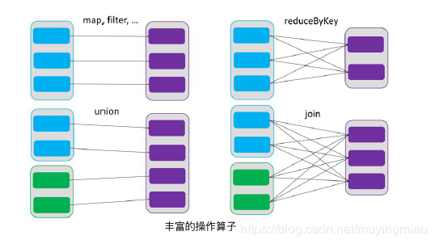
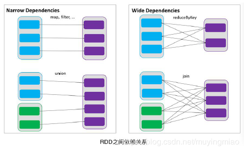
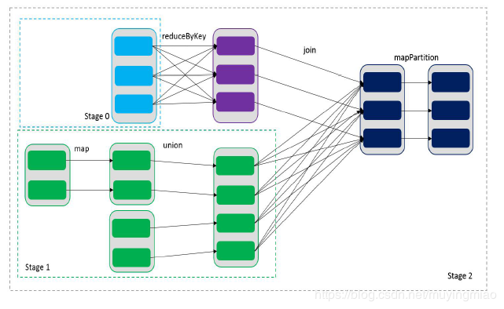
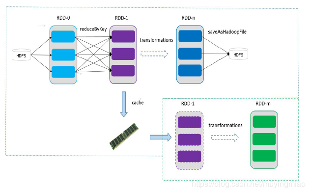

<!-- TOC -->

- [1. RDD 概述](#1-rdd-概述)
    - [1.1. 前言](#11-前言)
    - [1.2. 什么是 RDD](#12-什么是-rdd)
    - [1.3. RDD的特点](#13-rdd的特点)
        - [1.3.1. 弹性](#131-弹性)
        - [1.3.2. 分区](#132-分区)
        - [1.3.3. 只读](#133-只读)
        - [1.3.4. 依赖](#134-依赖)
        - [1.3.5. 缓存](#135-缓存)
        - [1.3.6. CheckPoint](#136-checkpoint)
- [2. RDD编程](#2-rdd编程)
    - [2.1. 编程模型](#21-编程模型)
    - [2.2. RDD 的创建](#22-rdd-的创建)
        - [2.2.1. 从集合中创建](#221-从集合中创建)
        - [2.2.2. 由外部存储系统的数据集创建](#222-由外部存储系统的数据集创建)
    - [2.3. RDD 的转换（面试开发重点）](#23-rdd-的转换面试开发重点)
        - [2.3.1. Value 类型](#231-value-类型)
            - [2.3.1.1. map(func)案例](#2311-mapfunc案例)
            - [2.3.1.2. mapPartitions(func) 案例](#2312-mappartitionsfunc-案例)
            - [2.3.1.3. flatMap(func) 案例](#2313-flatmapfunc-案例)
            - [2.3.1.4. map()和 mapPartition()的区别](#2314-map和-mappartition的区别)
            - [2.3.1.5. glom 案例](#2315-glom-案例)
            - [2.3.1.6. groupBy(func)案例](#2316-groupbyfunc案例)
            - [2.3.1.7. filter(func) 案例](#2317-filterfunc-案例)
            - [2.3.1.8. sample(withReplacement, fraction, seed) 案例](#2318-samplewithreplacement-fraction-seed-案例)
            - [2.3.1.9. distinct([numTasks])) 案例](#2319-distinctnumtasks-案例)
            - [2.3.1.10. coalesce(numPartitions) 案例](#23110-coalescenumpartitions-案例)
            - [2.3.1.11. repartition(numPartitions) 案例](#23111-repartitionnumpartitions-案例)
            - [2.3.1.12. coalesce 和 repartition 的区别](#23112-coalesce-和-repartition-的区别)
            - [2.3.1.13. sortBy(func,[ascending], [numTasks]) 案例](#23113-sortbyfuncascending-numtasks-案例)
            - [2.3.1.14. pipe(command, [envVars]) 案例](#23114-pipecommand-envvars-案例)
        - [2.3.2. 双 Value 类型交互](#232-双-value-类型交互)
            - [2.3.2.1. union(otherDataset) 案例](#2321-unionotherdataset-案例)
            - [2.3.2.2. subtract (otherDataset) 案例](#2322-subtract-otherdataset-案例)
            - [2.3.2.3. intersection(otherDataset) 案例](#2323-intersectionotherdataset-案例)
            - [zip(otherDataset)案例](#zipotherdataset案例)
        - [Key-Value 类型](#key-value-类型)
            - [partitionBy 案例](#partitionby-案例)
            - [reduceByKey(func, [numTasks]) 案例](#reducebykeyfunc-numtasks-案例)
            - [groupByKey 案例](#groupbykey-案例)
            - [reduceByKey 和 groupByKey 的区别](#reducebykey-和-groupbykey-的区别)
            - [sortByKey([ascending], [numTasks]) 案例](#sortbykeyascending-numtasks-案例)
            - [join(otherDataset, [numTasks]) 案例](#joinotherdataset-numtasks-案例)
    - [Action](#action)
        - [reduce(func)案例](#reducefunc案例)
        - [collect()案例](#collect案例)
        - [count()案例](#count案例)
        - [first()案例](#first案例)
        - [take(n)案例](#taken案例)
        - [takeOrdered(n)案例](#takeorderedn案例)
        - [saveAsTextFile(path)](#saveastextfilepath)
        - [saveAsSequenceFile(path)](#saveassequencefilepath)
        - [saveAsObjectFile(path)](#saveasobjectfilepath)
        - [countByKey()案例](#countbykey案例)
        - [foreach(func)案例](#foreachfunc案例)

<!-- /TOC -->

# 1. RDD 概述
## 1.1. 前言
Spark的一些基本概念或者术语，必须了解清楚
| Term（术语）    | Meaning（含义）                                              |
| --------------- | ------------------------------------------------------------ |
| Application     | Spark 应用程序，由集群上的一个 Driver 节点和多个 Executor 节点组成。 |
| Driver program  | 主运用程序，该进程运行应用的 main() 方法并且创建  SparkContext |
| Cluster manager | 集群资源管理器（例如，Standlone Manager，Mesos，YARN）       |
| Worker node     | 执行计算任务的工作节点                                       |
| Executor        | 位于工作节点上的应用进程，负责执行计算任务并且将输出数据保存到内存或者磁盘中 |
| Task            | 被发送到 Executor 中的工作单元                                 |

<div align="center"></div>

执行过程：
* 用户程序创建 SparkContext 后，它会连接到集群资源管理器，集群资源管理器会为用户程序分配计算资源，并启动 Executor；
* Dirver 将计算程序划分为不同的执行阶段和多个 Task，之后将 Task 发送给 Executor；
* Executor 负责执行 Task，并将执行状态汇报给 Driver，同时也会将当前节点资源的使用情况汇报给集群资源管理器

## 1.2. 什么是 RDD
* RDD（Resilient Distributed Dataset）叫做**弹性分布式数据集**，是 Spark 中最基本的数据抽象。代码中是一个抽象类， **它代表一个弹性的、 不可变、可分区、里面的元素可并行计算的集合**。

* 在Spark 中，对数据的所有操作不外乎创建RDD、转化已有RDD 以及调用RDD 操作进行求值。**每个RDD都被分为多个分区，这些分区运行在集群中的不同节点上**。RDD 可以包含Python、Java、Scala 中任意类型的对象， 甚至可以包含用户自定义的对象。**RDD 具有数据流模型的特点：自动容错、位置感知性调度和可伸缩性**。RDD 允许用户在执行多个查询时显式地将工作集缓存在内存中，后续的查询能够重用工作集，这极大地提升了查询速度。  
* RDD 支持两种操作:**transformation操作和action操作**。RDD 的转化操作是返回一个新的RDD 的操作，比如map()和filter()，而action操作则是向驱动器程序返回结果或把结果写入外部系统的操作。比如count() 和first()。Spark 采用**惰性计算模式**，RDD 只有第一次在一个行动操作中用到时，才会真正计算。Spark 可以优化整个计算过程。默认情况下，Spark 的RDD 会在你每次对它们进行行动操作时重新计算。如果想在多个行动操作中重用同一个RDD ， 可以使用`RDD.persist()`让Spark 把这个RDD 缓存下来。

```
## RDD的属性
* Internally, each RDD is characterized by five main properties:
 *
 *  - A list of partitions
 *  - A function for computing each split
 *  - A list of dependencies on other RDDs
 *  - Optionally, a Partitioner for key-value RDDs (e.g. to say that the RDD is hash-partitioned)
 *  - Optionally, a list of preferred locations to compute each split on (e.g. block locations for
 *    an HDFS file)
```

1. **一组分片（Partition），即数据集的基本组成单位**。  
对于RDD 来说，每个分片都会被一个计算任务处理，并决定并行计算的粒度。用户可以在创建RDD 时指定RDD 的分片个数，如果没有指定，那么就会采用默认值。默认值就是**程序所分配到的CPU Core的数目**。
```scala
protected def getPartitions: Array[Partition]
```
2. 一个计算每个分区的函数。  
Spark 中RDD 的计算是以分片为单位的，每个RDD都会实现compute 函数以达到这个目的。ompute 函数会对迭代器进行复合，不需要保存每次计算的结果。
```scala
def compute(split: Partition, context: TaskContext): Iterator[T]
```
3. RDD 之间的依赖关系。
RDD 的每次转换都会生成一个新的RDD，所以RDD 之间就会形成类似于流水线一样的**前后依赖关系**。**在部分分区数据丢失时，Spark 可以通过这个依赖关系重新计算丢失的分区数据，而不是对RDD 的所有分区进行重新计算。**
```scala
protected def getDependencies: Seq[Dependency[_]] = deps ​​​​​​​
```
4. 一个Partitioner， 即RDD 的分片函数（分区器）。
当前Spark 中实现了两种类型的分片函数，一个是基于哈希的HashPartitioner，另外一个是基于范围的RangePartitioner。只有对于于key-value 的RDD ， 才会有Partitioner， 非key-value 的RDD 的Parititioner 的值是None。Partitioner 函数不但决定了RDD 本身的分片数量， 也决定了parent RDD Shuffle 输出时的分片数量。
```scala
@transient 
val partitioner: Option[Partitioner] = None
```
5. 一个列表，存储存取每个Partition 的优先位置（ preferred location）。
对于一个HDFS 文件来说，这个列表保存的就是每个Partition 所在的块的位置。按照“移动数据不如移动计算”的理念，Spark 在进行任务调度的时候，会尽可能地将计算任务分配到其所要处理数据块的存储位置。
```scala
protected def getPreferredLocations(split: Partition): Seq[String] = Nil
```

RDD 是一个应用层面的逻辑概念。一个RDD有多个分片。RDD 就是一个元数据记录集，记录了RDD 内存所有的关系数据。

## 1.3. RDD的特点
### 1.3.1. 弹性
1. **存储的弹性：内存与磁盘的自动切换；**  
自动进行内存和磁盘数据存储的切换；**Spark 优先把数据放到内存中**，如果内存放不下，就会放到磁盘里面，程序进行自动的存储切换
2. **容错的弹性：数据丢失可以自动恢复；**  
**基于血统的高效容错机制**。在RDD 进行转换和动作的时候，会形成RDD 的`Lineage 依赖链`，当某一个RDD 失效的时候，可以通过重新计算上游的RDD 来重新生成丢失的RDD 数据。

3. **计算的弹性：计算出错重试机制；**  
Task 如果失败会自动进行特定次数的重试RDD 的计算任务如果运行失败，会自动进行任务的重新计算，默认次数是`4次`。

4. 分片的弹性： 可根据需要重新分片。

### 1.3.2. 分区
RDD逻辑上是分区的，每个分区的数据是抽象存在的，计算的时候会通过一个 `compute`函数得到每个分区的数据。如果 RDD 是通过已有的文件系统构建，则 compute 函数是读取指定文件系统中的数据，如果 RDD 是通过其他 RDD 转换而来，则 compute 函数是执行转换逻辑将其他 RDD 的数据进行转换。

### 1.3.3. 只读
如下图所示， RDD 是只读的，要想改变 RDD 中的数据，只能在现有的 RDD 基础上创建新的 RDD。
<div align="center"></div>

由一个 RDD 转换到另一个 RDD，可以通过丰富的操作算子实现，不再像 MapReduce那样只能写 map 和 reduce 了。

RDD 的操作算子包括两类，一类叫做 `transformations`，它是用来将 RDD 进行转化，`构建 RDD 的血缘关系`；另一类叫做 `actions`，它是用来触发 RDD 的计算，得到 RDD 的相关计算结果或者将 RDD 保存的文件系统中。

### 1.3.4. 依赖
RDDs 通过操作算子进行转换，转换得到的新 RDD 包含了从其他 RDDs 衍生所必需的信息， RDDs 之间维护着这种`血缘关系`，也称之为`依赖`。如下图所示，依赖包括两种，一种是**窄依赖**， RDDs 之间分区是一一对应的，另一种是宽依赖，下游 RDD 的每个分区与上游RDD(也称之为父 RDD)的每个分区都有关，是多对多的关系。
<div align="center"></div>

通过RDDs 之间的这种依赖关系，一个任务流可以描述为**DAG(有向无环图)**，如下图所示，在实际执行过程中宽依赖对应于Shuffle(图中的reduceByKey 和join)，窄依赖中的所有转换操作可以通过类似于管道的方式一气呵成执行(图中map 和union 可以一起执行)。

<div align="center"></div>

### 1.3.5. 缓存
**如果在应用程序中多次使用同一个 RDD，可以将该 RDD 缓存起来，该 RDD 只有在第一次计算的时候会根据血缘关系得到分区的数据，在后续其他地方用到该 RDD 的时候，会直接从缓存处取而不用再根据血缘关系计算，这样就加速后期的重用。如下图所示， RDD-1 经过一系列的转换后得到 RDD-n 并保存到 hdfs， RDD-1 在这一过程中会有个中间结果，如果将其缓存到内存，那么在随后的 RDD-1 转换到 RDD-m 这一过程中，就不会计算其之前的 RDD-0 了。

<div align="center"></div>

### 1.3.6. CheckPoint
虽然 RDD 的血缘关系天然地可以实现容错，当 RDD 的某个分区数据失败或丢失，可以通过血缘关系重建。但是对于长时间迭代型应用来说，随着迭代的进行， RDDs 之间的血缘关系会越来越长，一旦在后续迭代过程中出错，则需要通过非常长的血缘关系去重建，势必影响性能。为此， **RDD 支持 checkpoint 将数据保存到持久化的存储中**，这样就可以切断之前的血缘关系，因为 checkpoint后的RDD 不需要知道它的父RDDs 了，它可以从 checkpoint处拿到数据。

# 2. RDD编程
## 2.1. 编程模型
在 Spark 中， RDD 被表示为对象，通过对象上的方法调用来对 RDD 进行转换。经过一系列的 transformations 定义 RDD 之后，就可以调用 actions 触发 RDD 的计算， action 可以是向应用程序返回结果(count, collect 等)，或者是向存储系统保存数据(saveAsTextFile等)。在 Spark 中，**只有遇到 action，才会执行 RDD 的计算**(即`延迟计算`)，这样在运行时可以通过管道的方式传输多个转换。

## 2.2. RDD 的创建
在 Spark 中创建 RDD 的创建方式可以分为三种：**从集合中创建 RDD； 从外部存储创建 RDD； 从其他 RDD 创建。**

### 2.2.1. 从集合中创建
1. 使用 parallelize()从集合创建
```scala
scala> val rdd = sc.parallelize(Array(1,2,3,4,5,6,7,8))
rdd: org.apache.spark.rdd.RDD[Int] = ParallelCollectionRDD[0] at parallelize at <console>:24
```
2. 使用 makeRDD()从集合创建
```scala
scala> val rdd1 = sc.makeRDD(Array(1,2,3,4,5,6,7,8))
rdd1: org.apache.spark.rdd.RDD[Int] = ParallelCollectionRDD[0] at makeRDD at <console>:24
```
### 2.2.2. 由外部存储系统的数据集创建
包括本地的文件系统，还有所有 Hadoop 支持的数据集，比如 HDFS、 Cassandra、 HBase等。
```scala
scala> val rdd2= sc.textFile("hdfs://hadoop102:9000/RELEASE")
rdd2: org.apache.spark.rdd.RDD[String] = hdfs:// hadoop102:9000/RELEASE
MapPartitionsRDD[4] at textFile at <console>:24
```

## 2.3. RDD 的转换（面试开发重点）
RDD 整体上分为 **Value 类型**和 **Key-Value 类型**
### 2.3.1. Value 类型
#### 2.3.1.1. map(func)案例
1. 作用： 返回一个新的 RDD，该 RDD 由每一个输入元素经过 func 函数转换后组成.  
2. 需求： 创建一个 1-10 数组的 RDD，将所有元素*2 形成新的 RDD  
1). 创建
```scala
scala> var source = sc.parallelize(1 to 10)
source: org.apache.spark.rdd.RDD[Int] = ParallelCollectionRDD[1] at parallelize at <console>:24
```
2). 打印
```scala
scala> source.collect()
res0: Array[Int] = Array(1, 2, 3, 4, 5, 6, 7, 8, 9, 10)
```
3). 将所有元素*2
```scala
scala> val mapped = source.map(_ * 2)
mapped: org.apache.spark.rdd.RDD[Int] = MapPartitionsRDD[2] at map at <console>:25
```
4). 打印最终结果
```scala
scala> mapped.collect()
res1: Array[Int] = Array(2, 4, 6, 8, 10, 12, 14, 16, 18, 20)
```

#### 2.3.1.2. mapPartitions(func) 案例
1. 作用： 类似于 map，但独立地在 RDD 的每一个分片上运行，因此在类型为 T 的 RDD上运行时， func 的函数类型必须是 Iterator[T] => Iterator[U]。 假设有 N 个元素， 有 M 个分区，那么 map 的函数的将被调用 N 次,而 mapPartitions 被调用 M 次,一个函数一次处理所有
分区。

2. 需求： 创建一个 RDD，使每个元素*2 组成新的 RDD
* 创建一个 RDD
```scala
scala> val rdd = sc.parallelize(Array(1,2,3,4))
rdd: org.apache.spark.rdd.RDD[Int] = ParallelCollectionRDD[3] at parallelize at <console>:24
```

* 使每个元素*2 组成新的 RDD
```scala
scala> rdd.mapPartitions(x => x.map(_*2))
res2: org.apache.spark.rdd.RDD[Int] = MapPartitionsRDD[4] at mapPartitions at <console>:26
```

* 打印新的 RDD
```scala
scala> res2.collect()
res3: Array[Int] = Array(2, 4, 6, 8)
```

#### 2.3.1.3. flatMap(func) 案例
1. 作用：类似于 map，但是每一个输入元素可以被映射为 0 或多个输出元素（所以 func 应该返回一个序列，而不是单一元素）

 * wordcount案例中flatMap主要实现压平操作
    * flatMap(_.split(" "))：压平操作，按照空格分割符将一行数据映射成一个个单词；
2. 需求：创建一个元素为 1-5 的 RDD，运用 flatMap 创建一个新的 RDD，新的 RDD 为原RDD 的每个元素的扩展（1->1,2->1,2……5->1,2,3,4,5）
```scala
scala> val sourceFlatMap = sc.parallelize(1 to 5)
sourceFlatMap: org.apache.spark.rdd.RDD[Int] = ParallelCollectionRDD[5] at parallelize at <console>:24

scala> sourceFlatMap.collect()
res4: Array[Int] = Array(1, 2, 3, 4, 5)

scala> val flatMap = sourceFlatMap.flatMap(1 to _)
flatMap: org.apache.spark.rdd.RDD[Int] = MapPartitionsRDD[6] at flatMap at <con                                          sole>:25

scala> flatMap.collect()
res5: Array[Int] = Array(1, 1, 2, 1, 2, 3, 1, 2, 3, 4, 1, 2, 3, 4, 5)
```

#### 2.3.1.4. map()和 mapPartition()的区别
1. **map()： 每次处理一条数据。**
2. **mapPartition()： 每次处理一个分区的数据**，这个分区的数据处理完后，原 RDD 中分区的数据才能释放，可能导致 OOM。
3. 开发指导：当内存空间较大的时候建议使用 mapPartition()，以提高处理效率。

#### 2.3.1.5. glom 案例
1. 作用： 将每一个分区形成一个数组，形成新的 RDD 类型时 RDD[Array[T]]
2. 需求：创建一个 4 个分区的 RDD，并将每个分区的数据放到一个数组
```scala
scala> val rdd = sc.parallelize(1 to 16,4)
rdd: org.apache.spark.rdd.RDD[Int] = ParallelCollectionRDD[7] at parallelize at <console>:24

scala> rdd.collect()
res6: Array[Int] = Array(1, 2, 3, 4, 5, 6, 7, 8, 9, 10, 11, 12, 13, 14, 15, 16)

scala> rdd.glom().collect()
res7: Array[Array[Int]] = Array(Array(1, 2, 3, 4), Array(5, 6, 7, 8), Array(9, 10, 11, 12), Array(13, 14, 15, 16))
```

#### 2.3.1.6. groupBy(func)案例

1. 作用：  
**分组**，按照传入函数的返回值进行分组。 将相同的 key 对应的值放入一个迭代器。
2. 需求：  
创建一个 RDD，按照元素模以 2 的值进行分组。
```scala
scala> val rdd = sc.parallelize(1 to 6)
rdd: org.apache.spark.rdd.RDD[Int] = ParallelCollectionRDD[9] at parallelize at <console>:24

scala> val group = rdd.groupBy(_ % 2)
group: org.apache.spark.rdd.RDD[(Int, Iterable[Int])] = ShuffledRDD[11] at groupBy at <console>:25

scala> group.collect()
res8: Array[(Int, Iterable[Int])] = Array((0,CompactBuffer(2, 4, 6)), (1,CompactBuffer(1, 3, 5)))
```

#### 2.3.1.7. filter(func) 案例
1. 作用：  
**过滤。** 返回一个新的 RDD，该 RDD 由经过 func 函数计算后返回值为 true 的输
入元素组成。
2. 需求：  
创建一个 RDD（由字符串组成）， 过滤出一个新 RDD（包含”xiao”子串）
```scala
scala> val sourceFilter = sc.parallelize(Array("xiaolong","xiaowen","xiaojun","linjun"))
sourceFilter: org.apache.spark.rdd.RDD[String] = ParallelCollectionRDD[12] at parallelize at <console>:24

scala> sourceFilter.collect()
res9: Array[String] = Array(xiaolong, xiaowen, xiaojun, linjun)

scala> val filter = sourceFilter.filter(_.contains("xiao"))
filter: org.apache.spark.rdd.RDD[String] = MapPartitionsRDD[13] at filter at <console>:25

scala> filter.collect()
res10: Array[String] = Array(xiaolong, xiaowen, xiaojun)
```

#### 2.3.1.8. sample(withReplacement, fraction, seed) 案例
1. 作用： 以指定的随机种子随机抽样出数量为 fraction 的数据， `withReplacement` 表示是抽出的数据是否放回， true 为有放回的抽样， false 为无放回的抽样， seed 用于指定随机数生成器种子。
2. 需求：创建一个 RDD（1-10），从中选择放回和不放回抽样
```scala
scala> val rdd = sc.parallelize(1 to 10)
rdd: org.apache.spark.rdd.RDD[Int] = ParallelCollectionRDD[14] at parallelize at <console>:24

scala> var sample1 = rdd.sample(true,0.4,2)
sample1: org.apache.spark.rdd.RDD[Int] = PartitionwiseSampledRDD[15] at sample at <console>:25

scala> sample1.collect()
res11: Array[Int] = Array(1, 2, 2, 6, 6, 10)

scala> var sample2 = rdd.sample
sample   sampleStdev   sampleVariance

scala> var sample2 = rdd.sample(false,0.2,3)
sample2: org.apache.spark.rdd.RDD[Int] = PartitionwiseSampledRDD[16] at sample at <console>:25

scala> sample2.collect()
res12: Array[Int] = Array(1)
```

#### 2.3.1.9. distinct([numTasks])) 案例
1. 作用： 
**去重**，对源 RDD 进行去重后返回一个新的 RDD。 默认情况下，只有 `8 个并行任务`来操作，但是可以传入一个可选的 `numTasks` 参数改变它。
2. 需求：创建一个 RDD， 使用 distinct()对其去重。
```scala
scala> val rdd = sc.parallelize(List(1,2,1,3,6,9,6))
rdd: org.apache.spark.rdd.RDD[Int] = ParallelCollectionRDD[27] at parallelize at <console>:24

scala> val distinctRdd = rdd.distinct()
distinctRdd: org.apache.spark.rdd.RDD[Int] = MapPartitionsRDD[30] at distinct at <console>:25

scala> distinctRdd.collect()
res23: Array[Int] = Array(1, 6, 3, 9, 2)
```

#### 2.3.1.10. coalesce(numPartitions) 案例
coalesce [ˌkəʊəˈles]  
1. 作用：  
**缩减分区数**，用于大数据集过滤后，提高小数据集的执行效率。
2. 需求：创建一个 4 个分区的 RDD，对其缩减分区
```scala
scala> val rdd = sc.parallelize(1 to 16,4)
rdd: org.apache.spark.rdd.RDD[Int] = ParallelCollectionRDD[31] at parallelize at <console>:24

scala> rdd.partitions.size
res24: Int = 4

scala> val coalesceRdd = rdd.coalesce(2)
coalesceRdd: org.apache.spark.rdd.RDD[Int] = CoalescedRDD[33] at coalesce at <console>:25

scala> coalesceRdd.partitions.size
res28: Int = 2
```

#### 2.3.1.11. repartition(numPartitions) 案例
1. 作用： 根据分区数，**重新通过网络随机洗牌所有数据**。
2. 需求：创建一个 4 个分区的 RDD，对其重新分区
```scala
scala> val rdd = sc.parallelize(1 to 16,4)
rdd: org.apache.spark.rdd.RDD[Int] = ParallelCollectionRDD[34] at parallelize at <console>:24

scala> rdd.partitions.size
res29: Int = 4

scala> val rerdd = rdd.repartition(2)
rerdd: org.apache.spark.rdd.RDD[Int] = MapPartitionsRDD[38] at repartition at <console>:25

scala> rerdd.partitions.size
res30: Int = 2
```

#### 2.3.1.12. coalesce 和 repartition 的区别
1. coalesce 重新分区，可以选择是否进行 shuffle 过程。由参数 shuffle: Boolean = false/true决定。
2. repartition 实际上是调用的 coalesce，进行 shuffle。 源码如下：
```scala
def repartition(numPartitions: Int)(implicit ord: Ordering[T] = null): RDD[T] = withScope {
coalesce(numPartitions, shuffle = true)
}
```

#### 2.3.1.13. sortBy(func,[ascending], [numTasks]) 案例
1. 作用；使用 func 先对数据进行处理，按照处理后的数据比较结果排序，默认为正序。
2. 需求：创建一个 RDD，按照不同的规则进行排序
```scala
scala> val rdd = sc.parallelize(List(1,4,3,2))
rdd: org.apache.spark.rdd.RDD[Int] = ParallelCollectionRDD[39] at parallelize at <console>:24

scala> rdd.sortBy(x => x).collect()
res31: Array[Int] = Array(1, 2, 3, 4)

// 按照与 3 余数的大小排序
scala> rdd.sortBy(x => x%3).collect()
res32: Array[Int] = Array(3, 1, 4, 2)
```

#### 2.3.1.14. pipe(command, [envVars]) 案例
1. 作用：**管道，针对每个分区，都执行一个 shell 脚本，返回输出的 RDD。**
注意：脚本需要放在 Worker 节点可以访问到的位置
2. 需求：编写一个脚本，使用管道将脚本作用于 RDD 上。
```sh
#### Shell 脚本
#!/bin/sh
echo "AA"
while read LINE; do
echo ">>>"${LINE}
done
```

```scala
scala> val rdd = sc.parallelize(List("hadoop","spark","flink","storm","zookeeper","hive"),2)
rdd: org.apache.spark.rdd.RDD[String] = ParallelCollectionRDD[46] at parallelize at <console>:24

scala> rdd.pipe("/home/hadoop/app/spark-2.4.4/files/pipe.sh").collect()
res35: Array[String] = Array(AA, >>>hadoop, >>>spark, >>>flink, AA, >>>storm, >>>zookeeper, >>>hive)
```

### 2.3.2. 双 Value 类型交互
#### 2.3.2.1. union(otherDataset) 案例
1. 作用： 对源 RDD 和参数 RDD union后返回一个新的RDD
2. 需求：创建两个 RDD，并union
```scala
scala> val rdd1 = sc.parallelize(1 to 5)
rdd1: org.apache.spark.rdd.RDD[Int] = ParallelCollectionRDD[50] at parallelize at <console>:24

scala> val rdd2 = sc.parallelize(4 to 8)
rdd2: org.apache.spark.rdd.RDD[Int] = ParallelCollectionRDD[51] at parallelize at <console>:24

scala> rdd1.union(rdd2).collect()
res36: Array[Int] = Array(1, 2, 3, 4, 5, 4, 5, 6, 7, 8)
```
【备注】  
和数学意义上的并集有区别，单纯是union，结合
#### 2.3.2.2. subtract (otherDataset) 案例
1. 作用： 计算差的一种函数，去除两个 RDD 中相同的元素，不同的 RDD 将保留下来
2. 需求：创建两个 RDD，求第一个 RDD 与第二个 RDD 的差集
```scala
scala> val rdd1 = sc.parallelize(3 to 8)
rdd1: org.apache.spark.rdd.RDD[Int] = ParallelCollectionRDD[53] at parallelize at <console>:24

scala> val rdd2 = sc.parallelize(1 to 5)
rdd2: org.apache.spark.rdd.RDD[Int] = ParallelCollectionRDD[54] at parallelize at <console>:24

scala> rdd1.subtract(rdd2).collect()
res37: Array[Int] = Array(6, 7, 8)
```

#### 2.3.2.3. intersection(otherDataset) 案例
1. 作用： **求交集**，对源 RDD 和参数 RDD 求交集后返回一个新的 RDD
2. 需求：创建两个 RDD，求两个 RDD 的交集
```scala
scala> val rdd1 = sc.parallelize(1 to 7)
rdd1: org.apache.spark.rdd.RDD[Int] = ParallelCollectionRDD[59] at parallelize at <console>:24

scala> val rdd2 = sc.parallelize(5 to 10)
rdd2: org.apache.spark.rdd.RDD[Int] = ParallelCollectionRDD[60] at parallelize at <console>:24

scala> rdd1.intersection(rdd2).collect()
res39: Array[Int] = Array(6, 7, 5)
```

#### zip(otherDataset)案例
1. 作用：  
**组装key-value型RDD**，将两个 RDD 组合成 Key/Value 形式的 RDD,这里**默认两个 RDD 的 partition 数量以及元素数量都相同**，否则会抛出异常。
2. 需求：创建两个 RDD，并将两个 RDD 组合到一起形成一个(k,v)RDD
```scala
scala> val rdd1 = sc.parallelize(Array(1,2,3),3)
rdd1: org.apache.spark.rdd.RDD[Int] = ParallelCollectionRDD[73] at parallelize at <console>:24

scala> val rdd2 = sc.parallelize(Array("a","b","c"),3)
rdd2: org.apache.spark.rdd.RDD[String] = ParallelCollectionRDD[74] at parallelize at <console>:24

scala> rdd1.zip(rdd2).collect()
res41: Array[(Int, String)] = Array((1,a), (2,b), (3,c))
```

### Key-Value 类型
#### partitionBy 案例
1. 作用：对 pairRDD 进行分区操作，如果原有的 partionRDD 和现有的 partionRDD 是一致的话就不进行分区， 否则会生成 ShuffleRDD，即会产生 shuffle 过程。

2. 需求：创建一个 4 个分区的 RDD，对其重新分区
```scala
scala> rdd.partitions.size
res43: Int = 2

scala> val rdd1 = sc.parallelize(Array((1,"aa"),(2,"bb"),(3,"cc"),(4,"dd")),4)
rdd1: org.apache.spark.rdd.RDD[(Int, String)] = ParallelCollectionRDD[77] at parallelize at <console>:24

scala> rdd1.partitions.size
res44: Int = 4

scala> val rdd2 = rdd1.partitionBy(new org.apache.spark.HashPartitioner(2))
rdd2: org.apache.spark.rdd.RDD[(Int, String)] = ShuffledRDD[78] at partitionBy at <console>:25

scala> rdd2.partitions.size
res45: Int = 2
```

#### reduceByKey(func, [numTasks]) 案例
1. 在一个(K,V)的 RDD 上调用，返回一个(K,V)的 RDD，使用指定的 reduce 函数，将相同key 的值聚合到一起， reduce 任务的个数可以通过第二个可选的参数来设置。
2. 需求：创建一个 pairRDD，计算相同 key 对应值的相加结果
```scala
scala> val rdd = sc.parallelize(List(("female",1),("male",5),("female",5),("male",2)))
rdd: org.apache.spark.rdd.RDD[(String, Int)] = ParallelCollectionRDD[80] at parallelize at <console>:24

scala> val reduce = rdd.reduceByKey((x,y) => x+y)
reduce: org.apache.spark.rdd.RDD[(String, Int)] = ShuffledRDD[81] at reduceByKey at <console>:25

scala> reduce.collect()
res46: Array[(String, Int)] = Array((male,7), (female,6))
```

#### groupByKey 案例
1. 作用： groupByKey 也是对每个 key 进行操作，但只生成一个 seq。
2. 需求：创建一个 pairRDD，将相同 key 对应值聚合到一个 seq 中，并计算相同 key 对应值的相加结果
```scala
scala> val words = Array("one", "two", "two", "three", "three", "three")
words: Array[String] = Array(one, two, two, three, three, three)

scala> val wordPairsRDD = sc.parallelize(words).map(word => (word, 1))
wordPairsRDD: org.apache.spark.rdd.RDD[(String, Int)] = MapPartitionsRDD[83] at map at <console>:26

scala> val group = wordPairsRDD.groupByKey()
group: org.apache.spark.rdd.RDD[(String, Iterable[Int])] = ShuffledRDD[84] at groupByKey at <console>:25

scala> group.collect()
res47: Array[(String, Iterable[Int])] = Array((two,CompactBuffer(1, 1)), (one,CompactBuffer(1)), (three,CompactBuffer(1, 1, 1)))

scala> group.map(t => (t._1, t._2.sum))
res48: org.apache.spark.rdd.RDD[(String, Int)] = MapPartitionsRDD[85] at map at <console>:26

scala> res48.collect()
res49: Array[(String, Int)] = Array((two,2), (one,1), (three,3))
```

#### reduceByKey 和 groupByKey 的区别
1. reduceByKey： 按照 key 进行聚合，在 shuffle 之前有 combine（预聚合）操作，返回结果是 RDD[k,v]。
2. groupByKey：按照 key 进行分组，直接进行 shuffle。
3. 开发指导： reduceByKey 比 groupByKey，建议使用。但是需要注意是否会影响业务逻辑。

#### sortByKey([ascending], [numTasks]) 案例
1. 作用： **排序**
在一个(K,V)的 RDD 上调用， K 必须实现 Ordered 接口，返回一个按照 key 进行排序的(K,V)的 RDD
2. 需求：创建一个 pairRDD，按照 key 的正序和倒序进行排序 
```scala
scala> val rdd = sc.parallelize(Array((3,"aa"),(6,"cc"),(2,"bb"),(1,"dd")))
rdd: org.apache.spark.rdd.RDD[(Int, String)] = ParallelCollectionRDD[86] at parallelize at <console>:24

// 按照 key 的正序
scala> rdd.sortByKey(true).collect()
res50: Array[(Int, String)] = Array((1,dd), (2,bb), (3,aa), (6,cc))

// 按照 key 的倒序
scala> rdd.sortByKey(false).collect()
res51: Array[(Int, String)] = Array((6,cc), (3,aa), (2,bb), (1,dd))
```

#### join(otherDataset, [numTasks]) 案例
1. 作用：在类型为(K,V)和(K,W)的 RDD 上调用，返回一个相同 key 对应的所有元素对在
一起的(K,(V,W))的 RDD
2. 需求：创建两个 pairRDD，并将 key 相同的数据聚合到一个元组。
```scala
scala> val rdd = sc.parallelize(Array((1,"a"),(2,"b"),(3,"c")))
rdd: org.apache.spark.rdd.RDD[(Int, String)] = ParallelCollectionRDD[89] at parallelize at <console>:24

scala> val rdd1 = sc.parallelize(Array((1,4),(2,5),(3,6)))
rdd1: org.apache.spark.rdd.RDD[(Int, Int)] = ParallelCollectionRDD[90] at parallelize at <console>:24

scala> rdd.join(rdd1).collect()
res52: Array[(Int, (String, Int))] = Array((1,(a,4)), (3,(c,6)), (2,(b,5)))
```

## Action
### reduce(func)案例
1. 作用： 通过 func 函数聚集 RDD 中的所有元素，先聚合分区内数据，再聚合分区间数据。
2. 需求：创建一个 RDD，将所有元素聚合得到结果
```scala
scala> val rdd1 = sc.makeRDD(1 to 10,2)
rdd1: org.apache.spark.rdd.RDD[Int] = ParallelCollectionRDD[94] at makeRDD at <console>:24

scala>  rdd1.reduce(_+_)
res53: Int = 55

scala> val rdd2 = sc.makeRDD(Array(("a",1),("a",3),("c",3),("d",5)))
rdd2: org.apache.spark.rdd.RDD[(String, Int)] = ParallelCollectionRDD[95] at makeRDD at <console>:24

scala> rdd2.reduce((x,y)=>(x._1 + y._1,x._2 + y._2))
res54: (String, Int) = (aacd,12)
```

### collect()案例
1. 作用： 在驱动程序中，以数组的形式返回数据集的所有元素。
2. 需求：创建一个 RDD，并将 RDD 内容收集到 Driver 端打印

### count()案例
1. 作用： 返回 RDD 中**元素的个数**
2. 需求： 创建一个 RDD，统计该 RDD 的条数

```scala
scala> val rdd = sc.parallelize(1 to 10)
rdd: org.apache.spark.rdd.RDD[Int] = ParallelCollectionRDD[96] at parallelize at <console>:24

scala> rdd.count()
res55: Long = 10
```

###  first()案例
1. 作用： **返回 RDD 中的第一个元素**
2. 需求：创建一个 RDD， 返回该 RDD 中的第一个元素
```scala
scala> val rdd = sc.parallelize(1 to 10)
rdd: org.apache.spark.rdd.RDD[Int] = ParallelCollectionRDD[97] at parallelize at <console>:24

scala>  rdd.first
res56: Int = 1
```

### take(n)案例
1. 作用： 返回一个由 RDD 的前 n 个元素组成的数组
2. 需求：创建一个 RDD，统计该 RDD 的条数
```scala
scala> val rdd = sc.parallelize(Array(2,5,4,6,8,3))
rdd: org.apache.spark.rdd.RDD[Int] = ParallelCollectionRDD[0] at parallelize at <console>:24

scala> rdd.take(3)
res0: Array[Int] = Array(2, 5, 4)
```

### takeOrdered(n)案例
1. 作用： 返回该 RDD 排序后的前 n 个元素组成的数组
2. 需求：创建一个 RDD，统计该 RDD 的条数
```scala
scala> val rdd = sc.parallelize(Array(2,5,4,6,8,3))
rdd: org.apache.spark.rdd.RDD[Int] = ParallelCollectionRDD[1] at parallelize at <console>:24

scala> rdd.takeOrdered(3)
res1: Array[Int] = Array(2, 3, 4)
```

### saveAsTextFile(path)
作用： 将数据集的元素以 textfile 的形式保存到 HDFS 文件系统或者其他支持的文件系统，
对于每个元素， Spark 将会调用 toString 方法，将它装换为文件中的文本
### saveAsSequenceFile(path)
作用： 将数据集中的元素以 Hadoop sequencefile 的格式保存到指定的目录下，可以使
HDFS 或者其他 Hadoop 支持的文件系统。
### saveAsObjectFile(path)
作用： 用于将 RDD 中的元素序列化成对象，存储到文件中。

### countByKey()案例
1. 作用： 针对(K,V)类型的 RDD，返回一个(K,Int)的 map，表示每一个 key 对应的元素个数。

2. 需求：创建一个 PairRDD，统计每种 key 的个数

```scala
scala> val rdd = sc.parallelize(List((1,3),(1,2),(1,4),(2,3),(3,6),(3,8)),3)
rdd: org.apache.spark.rdd.RDD[(Int, Int)] = ParallelCollectionRDD[3] at parallelize at <console>:24

scala> rdd.countByKey()
res2: scala.collection.Map[Int,Long] = Map(3 -> 2, 1 -> 3, 2 -> 1)
```

### foreach(func)案例
1. 作用： 在数据集的每一个元素上，运行函数 func 进行更新。
2. 需求：创建一个 RDD，对每个元素进行打印
```scala
scala> var rdd = sc.makeRDD(1 to 5,2)
rdd: org.apache.spark.rdd.RDD[Int] = ParallelCollectionRDD[6] at makeRDD at <console>:24

scala> rdd.foreach(println(_))
1
2
3
4
5
```


