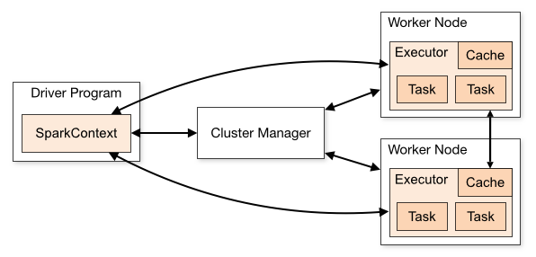

**
弹性式数据集RDDs
**

# 前言
Spark的一些基本概念或者术语，必须了解清楚
| Term（术语）    | Meaning（含义）                                              |
| --------------- | ------------------------------------------------------------ |
| Application     | Spark 应用程序，由集群上的一个 Driver 节点和多个 Executor 节点组成。 |
| Driver program  | 主运用程序，该进程运行应用的 main() 方法并且创建  SparkContext |
| Cluster manager | 集群资源管理器（例如，Standlone Manager，Mesos，YARN）       |
| Worker node     | 执行计算任务的工作节点                                       |
| Executor        | 位于工作节点上的应用进程，负责执行计算任务并且将输出数据保存到内存或者磁盘中 |
| Task            | 被发送到 Executor 中的工作单元                                 |

执行过程：

* 用户程序创建 SparkContext 后，它会连接到集群资源管理器，集群资源管理器会为用户程序分配计算资源，并启动 Executor；
* Dirver 将计算程序划分为不同的执行阶段和多个 Task，之后将 Task 发送给 Executor；
* Executor 负责执行 Task，并将执行状态汇报给 Driver，同时也会将当前节点资源的使用情况汇报给集群资源管理器