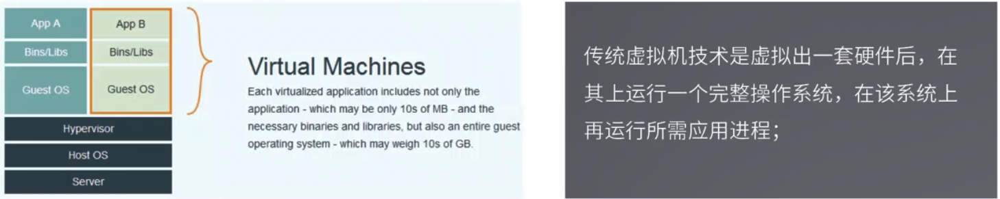
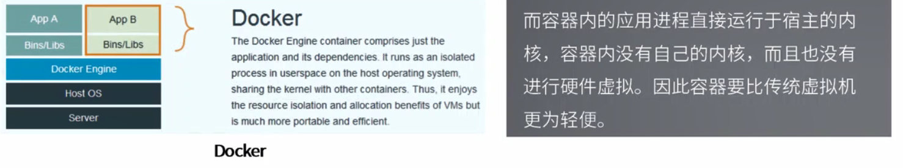
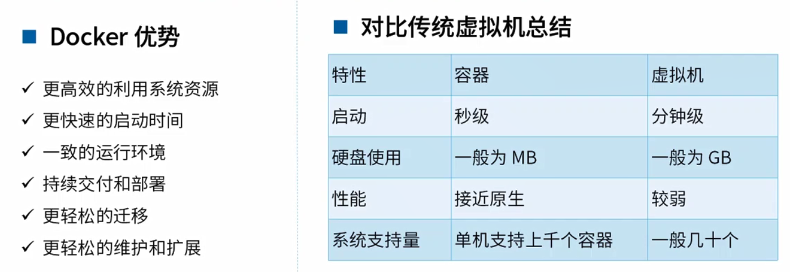
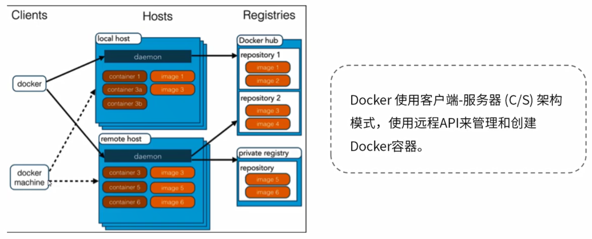
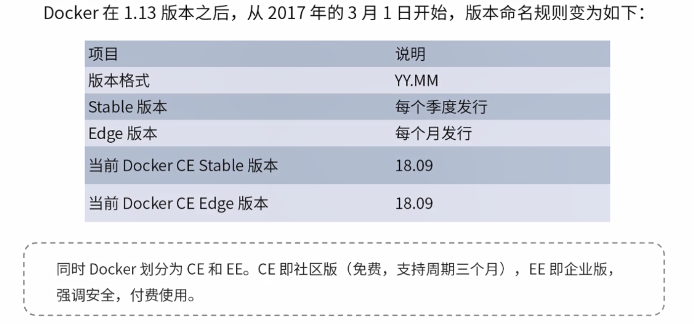

<!-- TOC -->

- [1. Docker简单介绍](#1-docker简单介绍)
    - [1.1. 什么是docker？](#11-什么是docker)
    - [1.2. Docker和传统虚拟机](#12-docker和传统虚拟机)
    - [1.3. 为什么使用docker](#13-为什么使用docker)
    - [1.4. docker架构](#14-docker架构)
- [2. Docker安装](#2-docker安装)
    - [2.1. docker版本命名](#21-docker版本命名)
    - [2.2. docker安装](#22-docker安装)
    - [2.3. docker卸载](#23-docker卸载)
    - [2.4. docker镜像加速器](#24-docker镜像加速器)

<!-- /TOC -->

# 1. Docker简单介绍
## 1.1. 什么是docker？
google go语言开发，基于Linux内核的cgroup,namespace，以及AUFS类的Union FS等技术，对进程进行封装隔离，属于操作系统层面的虚拟化技术。由于隔离的进程独立于宿主和其他的隔离的进程，因此称其为**容器**。

## 1.2. Docker和传统虚拟机




## 1.3. 为什么使用docker


## 1.4. docker架构


# 2. Docker安装
## 2.1. docker版本命名


重点：
* CE 
    * 社区版
    * 免费
* EE
    * 企业版
    * 收费

## 2.2. docker安装
1. 系统要求
Docker CE支持Centos7，内核不低于3.10
```sh
[hadoop@hadoop101 ~]$ uname -r
3.10.0-957.27.2.el7.x86_64
```

2. 卸载旧版本docker
```sh
[hadoop@hadoop101 ~]$ sudo yum remove docker
```

3. 安装docker-ce
```sh
[hadoop@hadoop101 ~]$ sudo yum install docker-ce
# 发现没有package

# 需要安装一些依赖

[hadoop@hadoop101 ~]$ sudo yum install -y yum-utils device-mapper-persistent-data lvm2

[hadoop@hadoop101 ~]$ sudo yum-config-manager --add-repo https://download.docker.com/linux/centos/docker-ce.repo

[hadoop@hadoop101 ~]$ sudo yum-config-manager --add-repo https://download.docker.com/linux/centos/docker-ce.repo
```

4. 脚本安装docker
```sh
curl -fsSL https://get.docker.com -o get-docker.sh

sudo sh get-docker.sh --mirror Aliyun
```

5. 启动docker
```sh
# 设置开机启动
sudo systemctl enable docker

sudo systemctl start docker

# 查看docker是否安装成功
[hadoop@hadoop101 ~]$ sudo docker info

# 查看docker版本信息
[hadoop@hadoop101 ~]$ docker --version

```

6. 建立docker用户组
当前环境下，执行docker命令必须使用`sudo`,非常麻烦。我们可以创建docker，把当前用户加入docker用户组。
```sh
[hadoop@hadoop101 ~]$ sudo groupadd docker

# hadoop是当前用户
[hadoop@hadoop101 ~]$ sudo usermod -aG docker hadoop

[hadoop@hadoop101 ~]$ logout
```

7. 测试docker是否安装成功
```sh
# 启动一个基于hello-world镜像的容器
[hadoop@hadoop101 ~]$ docker run hello-world
```

## 2.3. docker卸载
1. 删除docker安装包
```sh
sudo remove docker-ce
```

2. 删除docker镜像
```sh
sudo rm -rf /var/lib/docker
```

## 2.4. docker镜像加速器
docker官方和国内云服务供应商提供了国内加速器服务：
* docker官方：registry mirror
* 阿里云加速器
* DaoCloud加速器
* 163加速器

1. 在/etc/docker路径下添加文件daemon.json
```json
{
    "registry-mirrors":[
        "http://hub-mirror.c.163.com"
    ]
}
```

2. 重启docker服务并生效
```sh
[hadoop@hadoop101 docker]$ sudo systemctl daemon-reload
[hadoop@hadoop101 docker]$ sudo systemctl restart docker
# 查看Registry Mirrors是否修改
[hadoop@hadoop101 docker]$ docker info
```

3. 测试效果
```sh
# 列出所有的容器
[hadoop@hadoop101 docker]$ docker ps -a
1c42f7a46920 hello-world "/hello" 

# 删除容器
[hadoop@hadoop101 docker]$ docker rm -f 1c42f7a46920

# 删除镜像
[hadoop@hadoop101 docker]$ docker rmi hello-world

[hadoop@hadoop101 docker]$ docker run hello-world
```


