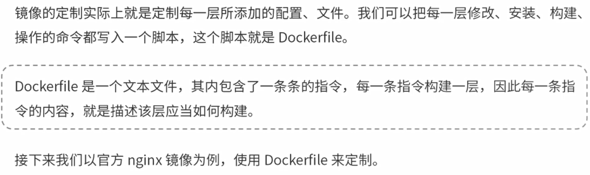
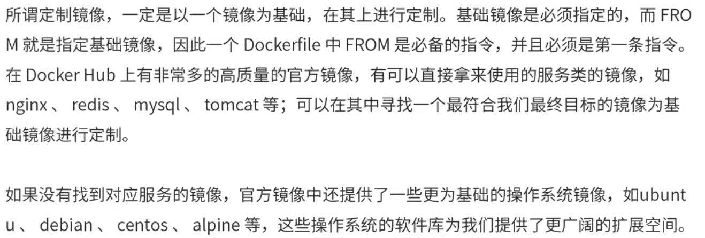
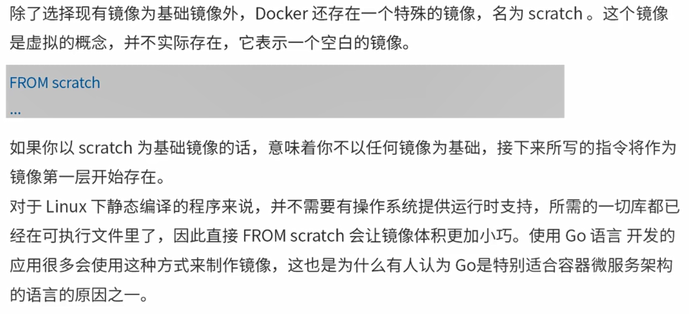
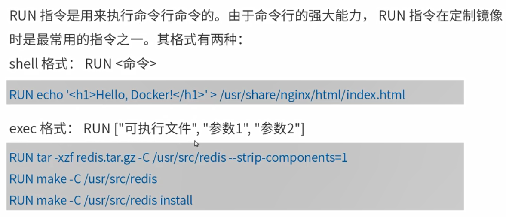
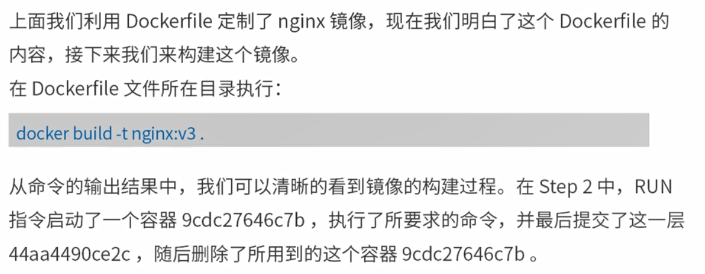

<!-- TOC -->

- [1. docker构建私有镜像](#1-docker构建私有镜像)
    - [1.1. 使用Dockerfile定制镜像](#11-使用dockerfile定制镜像)
    - [1.2. 构建镜像](#12-构建镜像)

<!-- /TOC -->
# 1. docker构建私有镜像
## 1.1. 使用Dockerfile定制镜像


1. 在空目录创建文件，命名为Dockerfile
```sh
[hadoop@hadoop101 file]$ cd docker/
[hadoop@hadoop101 docker]$ mkdir mydockerfile
[hadoop@hadoop101 docker]$ touch Dockerfile
[hadoop@hadoop101 docker]$ vim Dockerfile
```

```Dockerfile
FROM nginx

RUN echo '<h1>Hello,Docker!</h1>' > /usr/share/nginx/html/index.html
```
说明：

* FROM
  


* RUN
  

## 1.2. 构建镜像
* 构建
 

```sh
# 构建
[hadoop@hadoop101 docker]$ docker build -t mynginx:1.0 .

# 查看镜像
[hadoop@hadoop101 docker]$ docker images

# 运行容器-1
[hadoop@hadoop101 docker]$ docker run --name mynginx -p 80:80 mynginx:1.0 

# 运行容器-2
[hadoop@hadoop101 docker]$ docker run --name mynginx2 -p 80:80 mynginx:1.0 /bin/bash

# 运行容器-3 命令行
[hadoop@hadoop101 docker]$ docker run --name mynginx3 -it -p 80:80 mynginx:1.0 /bin/bash
```

2. docker运行java程序
