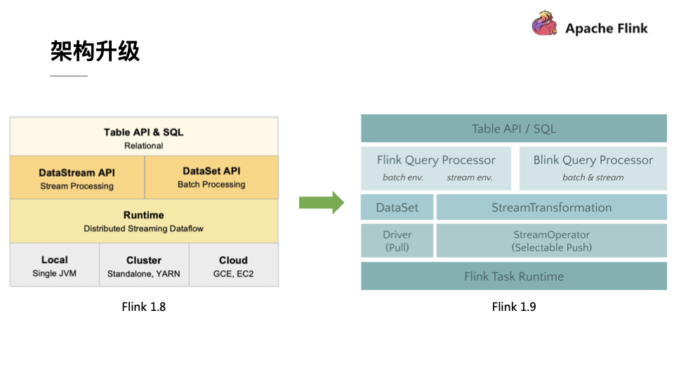
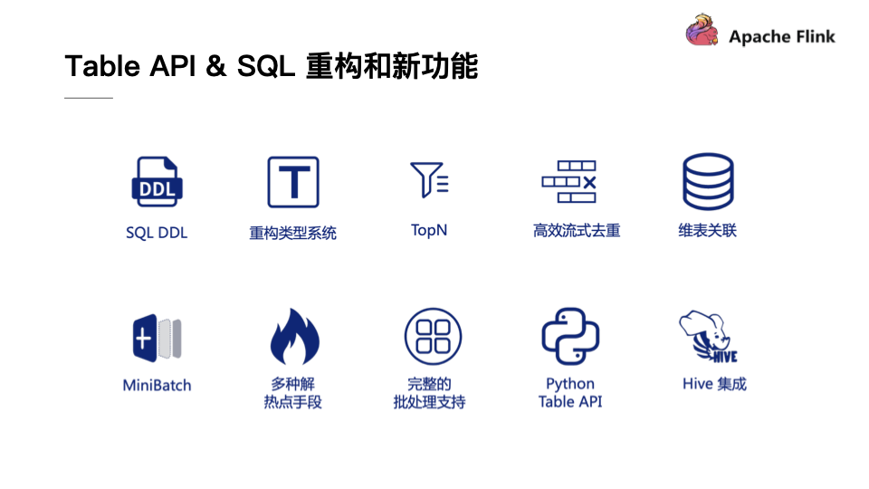
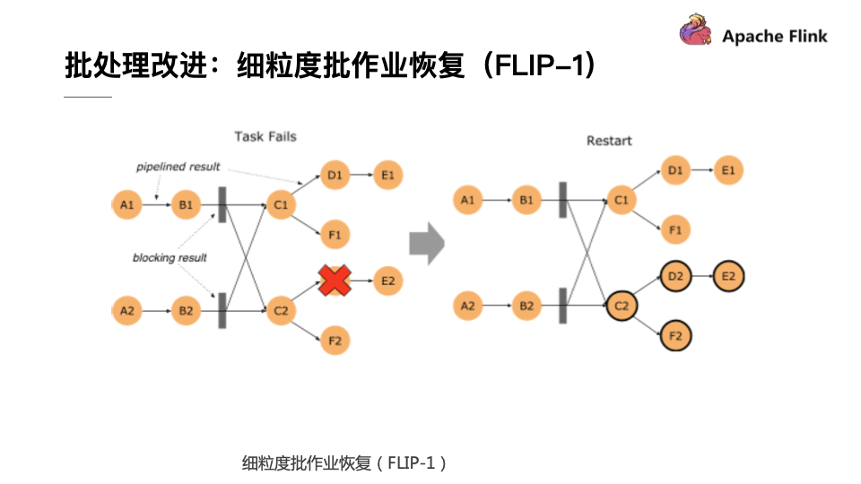
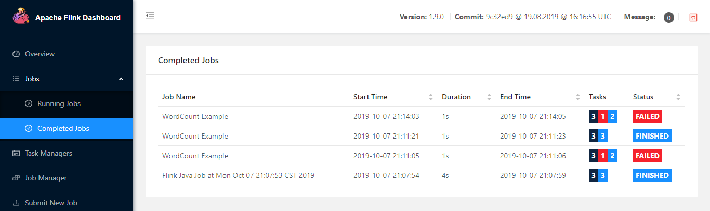

Flink1.9简介与安装
本文将从flink1.9的单机安装、flink1.9简介两方面进行介绍。

<!-- TOC -->

- [1. flink1.9简介](#1-flink19简介)
    - [1.1. 架构升级](#11-架构升级)
    - [1.2. 架构升级](#12-架构升级)
    - [1.3. Table API & SQL 重构和新功能](#13-table-api--sql-重构和新功能)
    - [1.4. 批处理改进：细粒度批作业恢复（FLIP-1）](#14-批处理改进细粒度批作业恢复flip-1)
    - [1.5. 重构的Web UI](#15-重构的web-ui)
- [2. 安装flink1.9（一）](#2-安装flink19一)

<!-- /TOC -->
# 1. flink1.9简介
在2019年年初，Blink开源贡献给Apache Flink的时候，一个要点就是Blink会以Flink的一个分支来支持开源，Blink会将其主要的优化点都Merge到Flink里面，一起将Flink做的更好。如今，都已经过去了半年的时间，随着Flink1.9.0版本的发布，阿里巴巴的Blink团队可以骄傲地宣布自己已经兑现了之前的承诺。因此，当我们结合这两篇报道来看的时候，能够发现当初Blink的一些新功能如今已经能够在Flink1.9.0版本里面看到了，也能看出Flink社区的效率和执行力都是非常高的。
## 1.1. 架构升级
整体而言，如果一个软件系统产生了较大改动，那基本上就是架构升级带来的，对于Flink而言也不例外。想必熟悉Flink的同学对于下图中左侧的架构图一定不会陌生，在Flink的分布式流式执行引擎之上有一整套相对独立的DataStream API和DataSet API，它们分别负责流计算作业和批处理作业。在此基础之上Flink还提供了一个流批统一的Table API和SQL，用户可以使用相同的Table API或者SQL来描述流计算作业和批处理作业，只需要在运行时告诉Flink引擎以流模式运行还是以批模式运行即可，Table层将会把作业优化成为DataStream作业或者DataSet作业。但是Flink 1.8版本的架构在底层存在一些弊端，那就是DataStream和DataSet在底层共享的代码并不多。其次，两者的API也完全不同，因此就会导致上层重复开发的工作量比较大，长期来看就会使得Flink的开发和维护成本越来越大。
## 1.2. 架构升级
<div align="center"><a></a></div>
基于上述问题，Blink在架构上进行了一些新型的探索，经过和社区密切的讨论之后确定了Flink未来的架构路线。也就是在Flink未来的版本中，DataSet的API会被完全移除掉，SteamTransformation会作为底层的API来描述批作业和流作业，Table API和SQL会将流作业都翻译到SteamTransformation上，所以在Flink 1.9中为了不影响使用之前版本用户的体验，还需要一种能够让新旧架构并存的方案。基于这个目的，Flink的社区开发人员也做了一系列努力，提出了上图中右侧的Flink 1.9架构设计，将API和实现部分做了模块的拆分，并且提出了一个Planner接口，能够支持不同的Planner具体实现。Planner的具体工作就是优化和翻译成物理执行图等，也就是Flink Query Processor所做的工作。Flink将原本的实现全部移动到了Flink Query Processor中，将从Blink Merge过来的功能都放到了Blink Query Processor。这样就能够实现一举两得，不仅能够使得Table模块拆分之后变得更加清晰，更重要的是也不会影响老版本用户的体验，同时能够使得用户享受到Blink的新功能和优化。

## 1.3. Table API & SQL 重构和新功能
在Table API & SQL 重构和新功能部分，Flink在1.9.0版本中也Merge了大量从Blink中增加的SQL功能。这些新功能都是在阿里巴巴内部经过千锤百炼而沉淀出来的，相信能够使得Flink更上一层台阶。这里挑选了一些比较重要的成果为大家介绍，比如对于SQL DDL的支持，重构了类型系统，高效流式的TopN，高效流式去重，社区关注已久的维表关联，对于MinBatch以及多种解热点手段的支持，完整的批处理支持，Python Table API以及Hive的集成。接下来也会简单介绍下这些新功能。
<div align="center"><a></a></div>
SQL DDL：在以前如果要注册一个Source或者Table Sink，必须要通过Java、Scala等代码或者配置文件进行注册，而在Flink 1.9版本中则支持了SQL DDL的语法直接去注册或者删除表。

重构类型系统：在Flink 1.9版本中实现了一套全新的数据类型系统，这套全新的类型系统与SQL标准进行了完全对齐，能够支持更加丰富的类型。这套全新的类型系统也为未来Flink SQL能够支持更加完备和完善的功能打下了坚实的基础。

TopN：在Flink 1.9版本提供强大的流处理能力以及社区期待已久的TopN来实时计算排行榜，能够实时计算排名靠前的店铺或者进行实时流数据的过滤。

高效流式去重：在现实的生产系统中，很多ETL作业或者任务没有做到端到端的一致性，这就导致明细层可能存在重复数据，这些数据交给汇总层做汇总时就会造成指标偏大，进而多计算了一些值，因此在进入汇总层之前往往都会做一个去重，这里引入了一个流计算中比较高效的去重功能，能够以比较低的代价来过滤重复的数据。

维表关联：能够实时地关联MySQL、HBase、Hive表中数据。

MinBatch&多种解热点手段：在性能优化方面，Flink 1.9版本也提供了一些性能优化的手段，比如提升吞吐的MinBatch的优化以及多种解热点手段。

完整的批处理支持：Flink 1.9版本具有完整的批处理支持，在下一个版本中也会继续投入力量来支持TBDS达到开箱即用的高性能。

Python Table API：在Flink 1.9版本中也引入了Python Table API，这也是Flink在多语言方向的有一个重大进步。能够使得Python用户能够轻松地玩转Flink SQL这样的功能。

Hive集成：Hive是Hadoop生态圈中不可忽视的重要力量，为了更好地去推广Flink批处理的功能，与Hive进行集成也是必不可少的。很高兴，在Flink 1.9版本的贡献者中也有两位Hive的PMC来推动集成工作。而首先需要解决的就是Flink如何读取Hive数据的问题，目前Flink已经完整打通了对于Hive MetaStore的访问，Flink可以直接去访问Hive MetaStore中的数据，同时反过来Flink也可以将其表数据中的元信息直接存储到Hive MetaStore里面供Hive访问，同时我们也增加了Hive的Connector支持CSV等格式，用户只需要配置Hive的MetaStore就能够在Flink直接读取。在此基础之上，Flink 1.9版本还增加了Hive自定义函数的兼容，Hive的自定义函数都能够在Flink SQL里面直接运行。

## 1.4. 批处理改进：细粒度批作业恢复（FLIP-1）
Flink 1.9版本在批处理部分也做了较多的改进，首要的就是细粒度批作业的恢复。这个优化点在很早之前就被提出来了，而在1.9版本里终于将未完成的功能实现了收尾。在Flink 1.9版本中，如果批处理的作业有错误发生，Flink会首先计算这个错误影响的范围，这称为Fault Region，因为在批处理作业中有一些节点需要通过Pipeline的数据进行传输，而其他的节点可以通过Blocking的方式先把数据存储下来，下游再去读取存储下来的数据，如果算子的输出已经进行了完整的保存，那就没有必要将这个算子重新拉起来运行了，这样就使得错误恢复被控制在一个相对较小的范围里面。如果再极端一点，在每个数据Shuffle的地方都进行数据落盘，这就和MapReduce的Map行为比较类似了，不过Flink支持更加高级的用法，用户可以自行控制每个Shuffle的地方通过网络进行直连还是通过文件落盘的方式进行传输，这也是Flink的一个核心不同点。
<div align="center"><a></a></div>

有了文件Shuffle之后，大家也会想是否能够将这个功能插件化，使其能够将文件Shuffle到其他地方，目前社区也在针对于这个方向做相应的努力，比如可以用Yarn做Shuffle的实现或者做一个分布式服务对于文件进行Shuffle。在阿里内部已经实现了这种架构，实现了单作业处理百TB级别的作业。当Flink具备这种插件化机制以后，就能够轻松地对接更加高效和灵活的Shuffle，让Shuffle这个批处理里面老大难的问题得到较好的解决。

流处理改进：State Processor API(FLIP-43)
流处理一直都是Flink的核心，所以在Flink 1.9版本里面也在流处理方面提出了很多改进，增加了一个非常实用的功能叫做Sate Processor API，其能够帮助用户直接访问Flink中存储的State，API能够帮助用户非常方便地读取、修改甚至重建整个State。这个功能的强大之处在于几个方面，第一个就是灵活地读取外部的数据，比如从一个数据库中读取自主地构建Savepoint，解决作业冷启动问题，这样就不用从N天前开始重跑整个数据。

此外，借助State Processor API，用户可以直接分析State中的数据，因为这部分数据在之前一直属于黑盒，这里面存储的数据是对是错，是否存在异常都用都无从得知，当有了State Processor API之后，用户就可以像分析普通数据一样来分析State数据，进而检测异常和分析故障。第三点就是对于脏数据的订正，比如有一条脏数据污染了State，就可以用State Processor API对于状态进行修复和订正。最后一点就是状态迁移，但用户修改了作业逻辑，还想要复用原来作业中大部分的State，或者想要升级这个State的结构就可以用这个API来完成相应的工作。在流处理面很多常见的工作和问题都可以通过Flink 1.9版本里面提供的State Processor API解决，因此也可以看出这个API的应用前景是非常广泛的。

## 1.5. 重构的Web UI
除了上述功能的改进之外，Flink 1.9.0还提供了如下图所示的焕然一新的Web UI。这个最新的前端UI由专业Web前端工程师操刀，采用了最新的AngularJS进行重构。可以看出最新的Web UI非常的清新和现代化，也算是Apache开源软件里面自带UI的一股清流。


# 2. 安装flink1.9（一）
1.下载flink  
[1.官网](https://flink.apache.org/)  
[2.清华镜像源](https://mirrors.tuna.tsinghua.edu.cn/)  
2.解压
```sh
$ tar -zxvf flink-1.9.0-bin-scala_2.11.tgz 

$ mv flink-1.9.0 flink
```

3.环境变量配置
```sh
sudo vim /etc/profile

export FLINK_HOME=/home/hadoop/app/flink
export PATH=$PATH:$FLINK_HOME/bin

# 配置生效
source /etc/profile
```

4.启动flink
```sh
# 启动flink的命令
$ flink/bin/start-cluster.sh 
# 查看进程
[hadoop@192 app]$ jps
10003 StandaloneSessionClusterEntrypoint
10521 Jps
10447 TaskManagerRunner
```
5.webUI查看  
打开浏览器，输入：http://192.168.239.101:8081   
6.启动一个flink example
```sh
bin/flink run examples/batch/WordCount.jar \ 
--input files/input/word.txt \ # WordCount的文件
--output files/output/wordcount # 存放计算结果的路径
```
7.查看已完成的flink job
<div align="center"><a></a></div>


