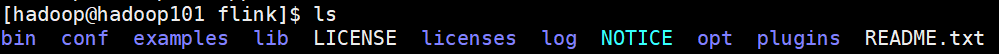

<!-- TOC -->

- [1. WordCount案例实践](#1-wordcount案例实践)
    - [1.1. 创建maven项目](#11-创建maven项目)
    - [1.2. WordCount代码实现](#12-wordcount代码实现)
        - [1.2.1. WordCount批处理实现](#121-wordcount批处理实现)
        - [1.2.2. WordCount流处理实现](#122-wordcount流处理实现)
- [2. flink部署与任务提交](#2-flink部署与任务提交)
    - [2.1. flink部署](#21-flink部署)
    - [2.2. flink任务提交](#22-flink任务提交)

<!-- /TOC -->

# 1. WordCount案例实践
本文的wordcount程序基于scala编程，因此需要配置scala编程环境。
包括：
* Scala安装与配置
* IDEA安装scala插件

[1.Scala安装与配置](https://www.runoob.com/scala/scala-install.html)  
[2.IDEA安装scala](https://www.cnblogs.com/kevinlogs/p/9175602.html)

## 1.1. 创建maven项目
对于入门新手而言，创建工程和配置需要花一点时间。这里需要注意一下几点。
1. 本文WordCount是Scala语言编写的，因此创建Scala文件。
2. 由于通常我们创建的是maven工程，需要加入scala框架支持。
* 点击工程 --> 右击鼠标 --> Add Framework Support --> 选择安装好的Scala版本。
3. 创建maven项目后，通常src/目录下只有main和resource两个文件夹，跑scala需要新建文件夹，命名为scala。
同时，点击文件夹右键，选择：Mark Directory as Source Root

## 1.2. WordCount代码实现
### 1.2.1. WordCount批处理实现
1. 在resource目录下创建hello.txt文件
```txt
hello flink
hello spark
hello hive
hello hadoop
hello xiaolong_wu
```
2. 编写WordCount程序

```scala
import org.apache.flink.api.scala._
import org.apache.flink.api.scala.ExecutionEnvironment

object WordCount {
  def main(args: Array[String]): Unit = {
    // 创建一个执行环境
    val env = ExecutionEnvironment.getExecutionEnvironment

    val input = "E:\\mycode\\myjava\\flinkstart\\src\\main\\resources\\hello.txt";
    val inputDataSet = env.readTextFile(input);

    val wordCountDataSet = inputDataSet.flatMap(_.split(" "))
        .map((_,1))
          .groupBy(0)
            .sum(1)
  wordCountDataSet.print()
  }
}
```

3. 运行程序
【结果】
```
(hadoop,1)
(hive,1)
(xiaolong_wu,1)
(flink,1)
(hello,5)
(spark,1)
```

### 1.2.2. WordCount流处理实现
1.编写scala程序
```scala
import org.apache.flink.streaming.api.scala._
import org.apache.flink.streaming.api.scala.StreamExecutionEnvironment

object StreamWordCount {
  def main(args: Array[String]): Unit = {
    // 创建流出来的执行环境
    val env = StreamExecutionEnvironment.getExecutionEnvironment
    // 接收一个socket文本流
    val dataStream = env.socketTextStream("192.168.202.130", 7777,'\n')
    // 对每条数据进行流处理
    val WordCountDataStream = dataStream.flatMap(_.split(" "))
      .filter(_.nonEmpty)
      .map((_, 1))
      .keyBy(0) // 相当于groupby
      .sum(1)
    WordCountDataStream.print()

    //启动executor
    env.execute("stream wordCount job")
  }
}
```

2. 在Linux服务器上监听7777端口
在Linux服务器输入如下命令
```sh
nc -lk 7777
```

* -l表示listen 端口
* k 表示保持当前的连接状态

3. 在Linux下输入word,执行scala程序，就可以实现wordCount的目的了。
* Linux端输入
```
1234
hadoop
spark hive
hello maven
hello world
hello maven
hello scala
hello hive
```
windows IDEA结果窗口输出结果：
```
2> (hello,1)
2> (maven,1)
1> (hello,2)
1> (world,1)
2> (hello,3)
1> (maven,2)
1> (scala,1)
1> (hello,4)
2> (hive,1)
2> (hello,5)
```

# 2. flink部署与任务提交
## 2.1. flink部署
由于是案例测试，本文只选用一台机器，作为一个伪集群。
1. 下载flink安装包  
[1.flink官网下载](https://flink.apache.org/downloads.html#apache-flink-191)  
[2.清华镜像站下载](https://mirrors.tuna.tsinghua.edu.cn/apache/flink/flink-1.9.1/)
这里推荐清华镜像站下载，速度快！
2. 解压flink安装包
```sh
tar -zxvf flink-1.9.1-bin-scala_2.11.tgz

mv flink-1.9.1 flink
```
3. flink目录说明
cd flink

<div align="center"></div>

* bin/ 
  flink命令都在这个目录下
* conf/
  flink配置文件
* log/
  存放日志
4. 启动flink
```sh
bin/start-cluster.sh

# 查看进程
[hadoop@hadoop101 flink]$ jps
3394 Jps
2822 StandaloneSessionClusterEntrypoint
3256 TaskManagerRunner
```

登录flink webUI  
http://192.168.202.130:8081/

## 2.2. flink任务提交
将wordcount程序打包，并提交至flink


