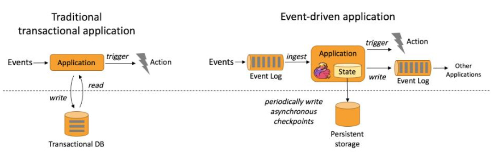
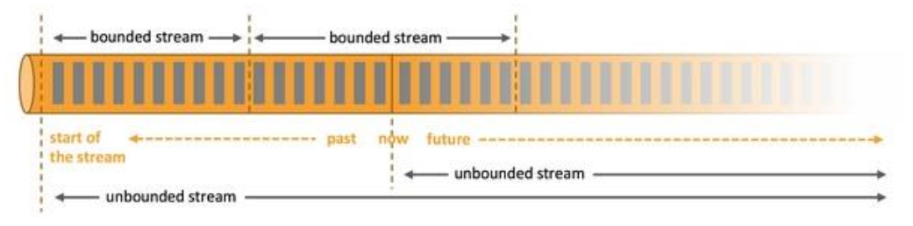
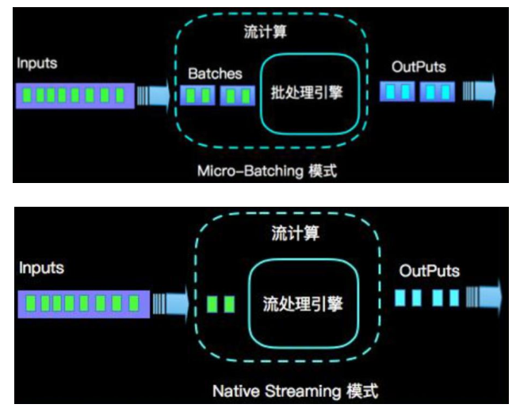

<!-- TOC -->

- [导读](#导读)
- [1. Flink的特点](#1-flink的特点)
- [2. Flink VS Spark Streaming](#2-flink-vs-spark-streaming)

<!-- /TOC -->
# 导读
1. Flink特点（先记5点）
    * 事件驱动
    * 基于流的实际观，离线数据是有界流，实时数据是无界流
    * 支持事件时间和处理时间
    * Exactly-once
    * 低延迟
2. Flink VS Spark Streaming
    * 流（Stream）vs 微批（micro-batching） 
    * 数据模型
        * flink:基本数据模型是数据流，以及事件（Event）序列
        * spark streaming:小批数据RDD的集合
    * 运行架构
        * spark streaming:微批。DAG-->不同的stage，一个完成后才可以计算下一个
        * flink：标准流；一个事件在一个节点处理完后可以直接发往下一个节点进行处理
# 1. Flink的特点
* 事件驱动

* 基于流的世界观  
在flink中，一切都是由流组成的。离线数据是有界的流，实时数据是一个无界的流。

* 支持事件时间和处理时间

* 精确一次的（Exactly-once）状态一致性保证

* 低延迟

# 2. Flink VS Spark Streaming 

* 流（Stream）vs 微批（micro-batching）

* 数据模型
    * Spark 采用RDD模型，Spark Streaming 的DStream实际上也是一组组小批数据RDD的集合。

    * flink基本数据模型是数据流，以及事件（Event）序列。

* 运行时架构
    * Spark是批计算，将DAG划分为不同的stage，一个完成后才可以计算下一个。
    * flink是标准的流执行模式，一个事件在一个节点处理完后可以直接发往下一个节点进行处理

