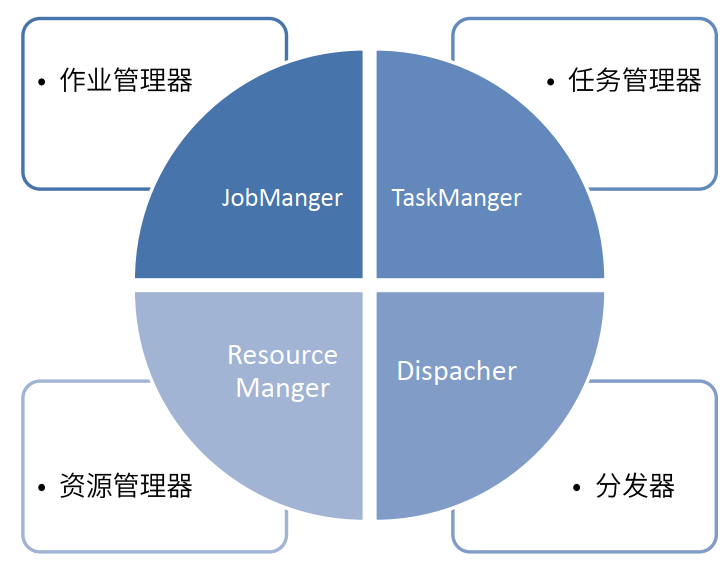

<!-- TOC -->

- [1. 导读](#1-导读)
- [2. Flink运行时的组件](#2-flink运行时的组件)
    - [2.1. 作业管理器-JobManager](#21-作业管理器-jobmanager)
    - [2.2. 任务管理器上 - TaskManager](#22-任务管理器上---taskmanager)
    - [2.3. 资源管理器](#23-资源管理器)

<!-- /TOC -->
# 1. 导读
1.flink三大组件
    * jobmanager
    * taskManager
    * 资源管理器

# 2. Flink运行时的组件

## 2.1. 作业管理器-JobManager

* 控制一个应用程序的主进程，也就是说，每个应用程序都会被一个不同JobManager所控制执行

* JobManager会向资源管理器（ResourceManager）请求任务执行必要的资源，也就是任务管理器上（TaskManager）上的插槽（solt）。
而在执行过程中，JobManager会负责所有需要中央协调的操作，比如：检查点（checkpoints）的协调。

## 2.2. 任务管理器上 - TaskManager

* Flink工作流程中，通常Flink中会有**多个TaskManager运行**，每一个TaskManager包含了一定数量的插槽(slots)。插槽的数量限制了TaskManager能够执行的任务数。
* 启动之后TaskManager向资源管理器注册它的solts;收到资源管理器的指令后，TaskManager就会将一个或者多个插槽提供给JobManager
调用。JobManager就可以向solts分配tasks来执行了。

* 在执行过程中一个TaskManager可以跟其他同一个应用程序运行的TaskManager交换数据。

## 2.3. 资源管理器
* 主要负责管理任务管理器的solts,TaskManager插槽solt是Flink定义的处理资源单元。

* Flink为不同环境和资源管理工具提供不同的资源管理器。

* 当jobManager申请插槽资源时，ResourceManager会将有空闲插槽的TaskManager分配给JobManager。如果ResourceManager没有足够的插槽来满足JobManager的请求，它还可以向资源平台发起会话，以提供启动TaskManager进程的容器。

* 

