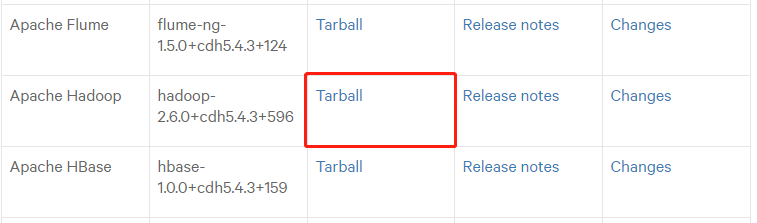
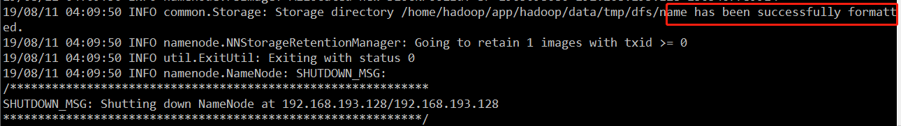

Flink1.9的安装与简单应用
<!-- TOC -->

- [1. 安装flink（一）](#1-安装flink一)
- [2. flink Standalone模式部署](#2-flink-standalone模式部署)
    - [2.1. 修改配置文件](#21-修改配置文件)
    - [2.2. 运行实例](#22-运行实例)
- [3. YARN模式安装](#3-yarn模式安装)
    - [3.1. Hadoop安装](#31-hadoop安装)
        - [3.1.1. Hadoop下载与解压](#311-hadoop下载与解压)
        - [3.1.2. Hadoop配置文件的配置](#312-hadoop配置文件的配置)
        - [3.1.3. 启动hadoop](#313-启动hadoop)
        - [3.1.4. 免密码登录](#314-免密码登录)
    - [3.2. flink on yarn 提交任务](#32-flink-on-yarn-提交任务)

<!-- /TOC -->
Flink安装与配置
# 1. 安装flink（一）
1.下载flink  
[1.官网](https://flink.apache.org/)  
[2.清华镜像源](https://mirrors.tuna.tsinghua.edu.cn/)  
2.解压
```sh
$ tar -zxvf flink-1.8.1-bin-scala_2.11.tgz 

$ mv flink-1.8.1 flink
```
3.启动flink
```sh
# 启动flink的命令
$ flink/bin/start-cluster.sh 
# 查看进程
[hadoop@192 app]$ jps
10003 StandaloneSessionClusterEntrypoint
10521 Jps
10447 TaskManagerRunner
```
4.webUI查看  
打开浏览器，输入：http://192.168.154.130:8081  
5.启动一个flink example
```sh
flink/bin/flink run flink/examples/batch/WordCount.jar --input /home/hadoop/file/test.txt --output /home/hadoop/file/output.txt
```
# 2. flink Standalone模式部署
## 2.1. 修改配置文件
1.修改flink-conf.yaml 
```
$ vim conf/flink-conf.yaml 

# 指定jobmanageer的主机
jobmanager.rpc.address: hadoop-master

```
2.修改slaves
```sh
# 只需要修改为主机名；单机部署，因此只有一台机器
hadoop-master
```
3.域名解析
修改c:\windows\system32\drivers\etc\hosts文件
添加
```
192.168.193.128  hadoop-master
```
4.启动集群
```sh
$ flink/bin/start-cluster.sh 
```
5.webUI查看  
http://hadoop-master:8081/#/overview

6.关闭集群
```sh
bin/stop-cluster.sh
```

## 2.2. 运行实例
```sh
$ bin/flink run examples/streaming/WordCount.jar
```


# 3. YARN模式安装
## 3.1. Hadoop安装
### 3.1.1. Hadoop下载与解压
1.下载hadoop  
Apache原生的hadoop在生产上几乎不会用，开发人员一般都是部署Hadoop的发行版Cloudera Hadoop即CDH.  
[CDH5.4.3下载地址](https://www.cloudera.com/documentation/enterprise/release-notes/topics/cdh_vd_cdh_package_tarball_54.html#concept_a2p_5m3_ps)  
选择hadoop-2.6.0-cdh5.4.3/
<div align="center"><a></a></div>
2.解压  

```sh
$ tar -zxvf hadoop-2.6.0-cdh5.4.3.tar.gz 
$ mv hadoop-2.6.0-cdh5.4.3 hadoop
```
3.配置JAVA_HOME路径  
hadoop的底层是java开发的，hadoop的运行依赖于java  
* 修改hadoop-env.sh
```sh
export JAVA_HOME=/home/hadoop/app/jdk
export HADOOP_CONF_DIR=/home/hadoop/app/hadoop/etc/hadoop/ 
```

### 3.1.2. Hadoop配置文件的配置
要启动hadoop并运行，必须要做一些配置文件的配置。主要用来配置：hdfs文件副本数、指定mr运行在yarn上、指定YARN的老大（ResourceManager）的地址、reducer获取数据的方式等。  
配置文件在目录/home/hadoop/app/hadoop/etc/hadoop下。    
1.配置core-site.xml
* 首先创建临时文件目录 
mkdir /home/hadoop/app/hadoop/data
* 修改core-site.xml
```xml
<property>
	        <name>fs.defaultFS</name>
	        <value>hdfs://hadoop-master:8020</value>
</property>
<property>
	        <name>hadoop.tmp.dir</name>
	        <value>/home/hadoop/app/hadoop/data/tmp</value>
</property>
```
2.配置 hdfs-site.xml
```xml
<property>
            <!--hdfs文件副本数 -->
			<name>fs.replication</name>
			<value>1</value>
	</property>
	<property>
			<name>dfs.namenode.secondary.http-address</name>
			<value>hadoop-master:50090</value>
</property>
```
3.配置mapred-site.xml
* 首先要修改文件名  
```sh
$ mv mapred-site.xml.template mapred-site.xml
```
* 其次配置mapred-site.xml
```xml
<!-- 指定mr运行在yarn上 -->
<configuration>
<property>
        <name>mapreduce.framework.name</name>
        <value>yarn</value>
</property>
</configuration>
```
4.配置yarn-site.xml
```xml
<!-- 指定YARN的老大（ResourceManager）的地址 -->
	<property>
			<name>yarn.resourcemanager.hostname</name>
			<value>hadoop-master</value>
	</property>
	<!-- reducer获取数据的方式 -->
	<property>
			<name>yarn.nodemanager.aux-services</name>
			<value>mapreduce_shuffle</value>
	</property>
```

5.修改slaves
```
hadoop-master
```

### 3.1.3. 启动hadoop  

1.格式化hadoop

```sh
bin/hdfs namenode -format
```

<div align="center"><a></a></div>
2.启动hadoop  

```sh
sbin/start-all.sh
[hadoop@hadoop-master hadoop]$ jps
2721 TaskManagerRunner
3524 SecondaryNameNode
3924 NodeManager
3972 Jps
3258 NameNode
3658 ResourceManager
2285 StandaloneSessionClusterEntrypoint
3374 DataNode
```
3.关闭hadoop服务
```sh
$ sbin/stop-yarn.sh
$ sbin/stop-dfs.sh
```  

### 3.1.4. 免密码登录
 启动hadoop过程中需要输入密码，非常繁琐，因此需要在Linux下配置免密码登录。
```sh
$ ssh-keygen
$ cd .ssh
$ ls
id_rsa  id_rsa.pub
$ cat id_rsa.pub >> authorized_keys
# 赋权限：
chmod 600 authorized_keys
$ ssh localhost	
```
【备注】为了避免出错，先不要执行此命令。因为执行后，会在.ssh/目录下产生一个known_hosts文件。拷贝到其他主机后悔报错出问题。

可以直接登录到localhost
hadoop@hadoop1:~/.ssh$ ls
authorized_keys  id_rsa  id_rsa.pub  
【备注】拷贝到其他主机
scp -r .ssh hadoop@hadoop1:/home/hadoop

## 3.2. flink on yarn 提交任务
启动hadoop，先启动hdfs,再启动yarn  

```sh
$ sbin/start-dfs.sh
$ sbin/start-yarn.sh
```
【备注】hadoop的监控页面
http://hadoop-master:8088/  -- Yarn监控页面
http://hadoop-master:50070/ -- Hdfs监控页面

再hadoop-master节点提交Yarn-Session,使用安装目录下bin目录中的yarn-session.sh脚本提交。
```
./bin/flink run -m yarn-cluster ./examples/batch/WordCount.jar
```


