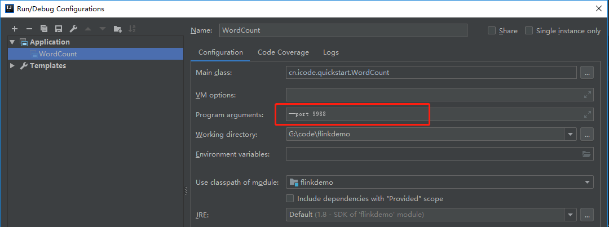
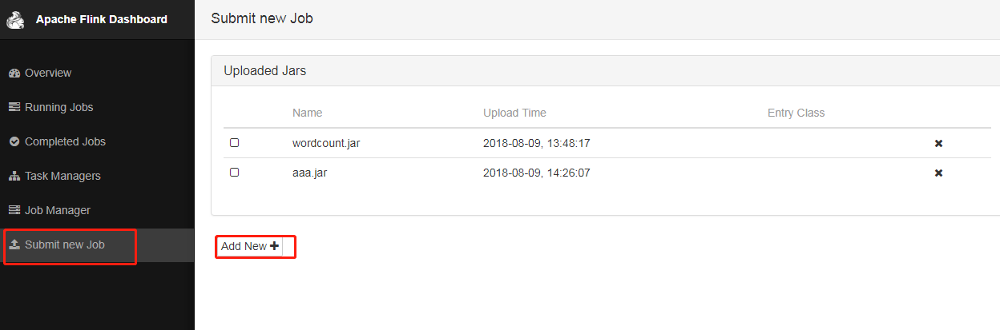
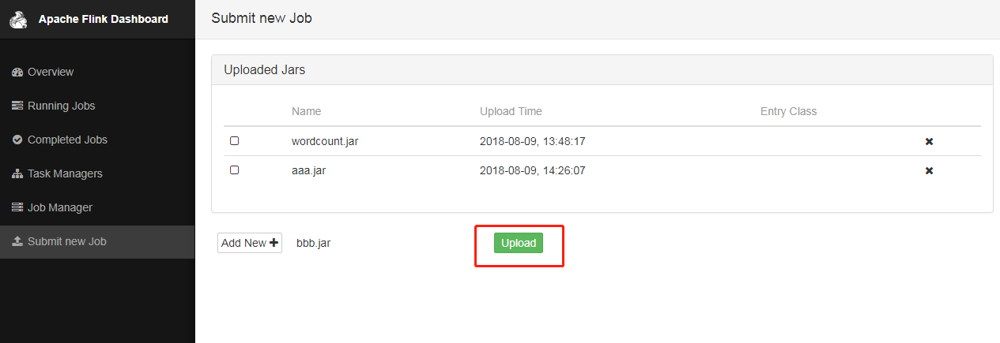
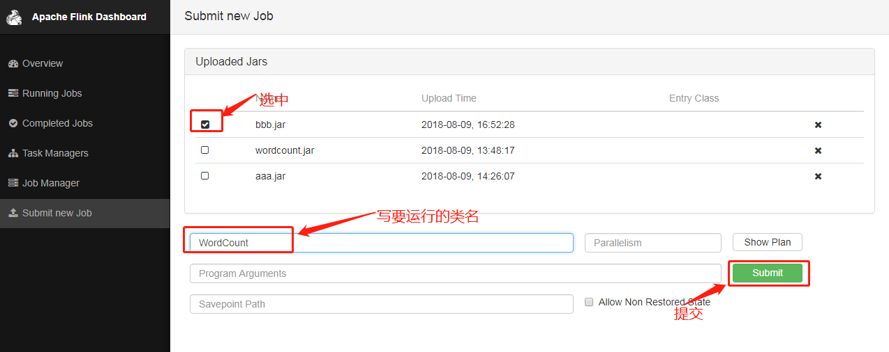
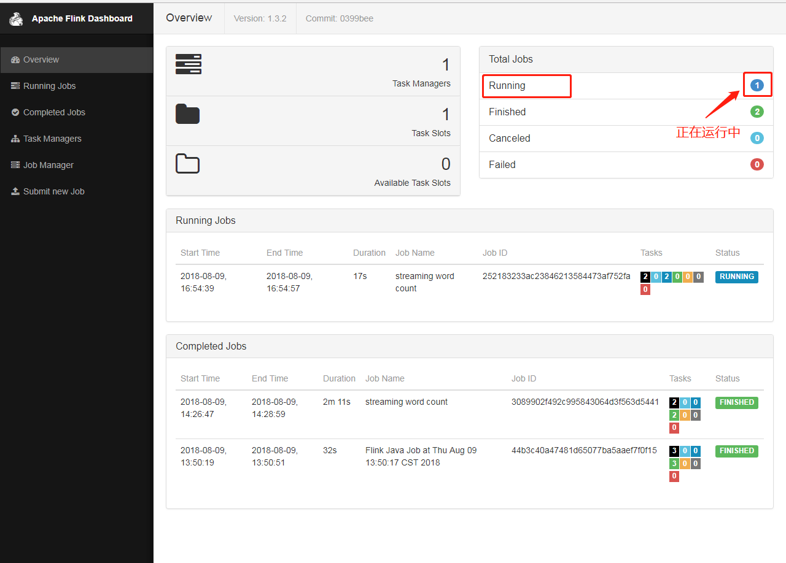
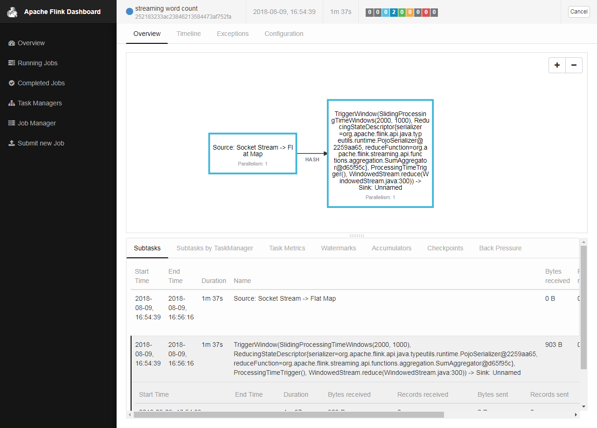
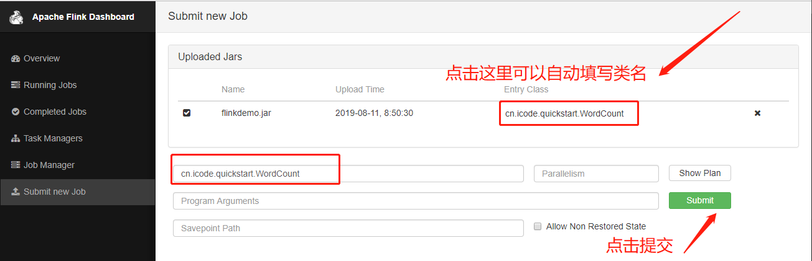

<!-- TOC -->

- [1. WordCount程序](#1-wordcount程序)
    - [1.1. 需求说明](#11-需求说明)
    - [1.2. 程序开发](#12-程序开发)
        - [1.2.1. pom依赖](#121-pom依赖)
        - [1.2.2. WordCount.java](#122-wordcountjava)
    - [1.3. 程序运行](#13-程序运行)
        - [1.3.1. 本地运行](#131-本地运行)
        - [1.3.2. Linux上运行](#132-linux上运行)
- [2. 踩坑记](#2-踩坑记)
    - [2.1. 端口设置](#21-端口设置)
    - [2.2. 防火墙为关闭，导致连接请求被拒绝。](#22-防火墙为关闭导致连接请求被拒绝)
    - [2.3. 补全类名](#23-补全类名)

<!-- /TOC -->

在学习hadoop、spark、storm过程中，第一个案例往往是WordCount,因此，在学Flink时，也拿WordCount的案例练练手。

# 1. WordCount程序
## 1.1. 需求说明
【需求】利用flink开发一个WordCount程序，实现字数统计的功能，并打包到Linux上，利用Flink WebUI界面运行。
## 1.2. 程序开发
### 1.2.1. pom依赖
```xml
<dependencies>
        <dependency>
            <groupId>org.apache.flink</groupId>
            <artifactId>flink-java</artifactId>
            <version>1.2.0</version>
        </dependency>
        <dependency>
            <groupId>org.apache.flink</groupId>
            <artifactId>flink-streaming-java_2.10</artifactId>
            <version>1.2.0</version>
        </dependency>
        <dependency>
            <groupId>org.apache.flink</groupId>
            <artifactId>flink-clients_2.10</artifactId>
            <version>1.2.0</version>
        </dependency>
    </dependencies>
```
### 1.2.2. WordCount.java
```java
package cn.icode.quickstart;

import org.apache.flink.api.common.functions.FlatMapFunction;
import org.apache.flink.api.java.utils.ParameterTool;
import org.apache.flink.streaming.api.datastream.DataStream;
import org.apache.flink.streaming.api.datastream.DataStreamSource;
import org.apache.flink.streaming.api.environment.StreamExecutionEnvironment;
import org.apache.flink.streaming.api.windowing.time.Time;
import org.apache.flink.util.Collector;

public class WordCount {
    public static void main(String[] args) {
        //定义socket端口号
        int port = 9988;
        try {
            ParameterTool parameterTool = ParameterTool.fromArgs(args);
            port = parameterTool.getInt("port");
        } catch (Exception e) {
            System.out.println("没有指定port使用默认值9988");
        }
        //获取运行环境
        StreamExecutionEnvironment env = StreamExecutionEnvironment.getExecutionEnvironment();
        //连接socket获取输入的数据
        DataStreamSource<String> text = env.socketTextStream("192.168.193.128", port, "\n");
        //计算数据
        DataStream<WordWithCount> windowCount = text.flatMap(new FlatMapFunction<String, WordWithCount>() {
            public void flatMap(String value, Collector<WordWithCount> out) throws Exception {
                String[] splits = value.split("\\s");
                for (String word:splits) {
                    out.collect(new WordWithCount(word,1L));
                }
            }
        })//打平操作，把每行的单词转为<word,count>类型的数据
                .keyBy("word")//针对相同的word数据进行分组
                .timeWindow(Time.seconds(2),Time.seconds(1))//指定计算数据的窗口大小和滑动窗口大小
                .sum("count");
        //把数据打印到控制台
        windowCount.print()
                .setParallelism(1);//使用一个并行度
        //注意：因为flink是懒加载的，所以必须调用execute方法，上面的代码才会执行
        try {
            env.execute("streaming word count");
        } catch (Exception e) {
            e.printStackTrace();
            System.out.println("execute get bug!");
        }
    }
    /**
     * 主要为了存储单词以及单词出现的次数
     */
    public static class WordWithCount{
        public String word;
        public long count;
        public WordWithCount(){}
        public WordWithCount(String word, long count) {
            this.word = word;
            this.count = count;
        }
        @Override
        public String toString() {
            return "WordWithCount{" +
                    "word='" + word + '\'' +
                    ", count=" + count +
                    '}';
        }
    }
}
```

## 1.3. 程序运行
### 1.3.1. 本地运行
【前提】
启动flink；
新建窗口，监控端口9988；在程序执行后输入几个单词。
```
nc -l 9988
```
1.不加参数，直接运行
执行main函数即可；  
2.配置参数  
在IDEA中，Run --> Edit Configuration
-->Program Arguements
配置：--port 9988
<div align="center"><a></a></div>

运行main函数。  

### 1.3.2. Linux上运行
1.将程序打包，并上传到Linux上。
2.打开flink webUI。  
http://hadoop-master:8081/  
3.提交任务  
<div align="center"><a></a></div>
<div align="center"><a></a></div>
<div align="center"><a></a></div>
<div align="center"><a></a></div>
<div align="center"><a></a></div>

# 2. 踩坑记
## 2.1. 端口设置
在运行flink时，若不配置端口号，flink默认是9000端口。
但是执行下来会报错：Connection refused!
查询资料发现：Hadoop的有个端口号用的也是9000，因此可能端口号冲突。因此修改了端口号为：9988.
## 2.2. 防火墙为关闭，导致连接请求被拒绝。
[Centos7永久关闭防火墙](https://blog.51cto.com/12350545/2286917)
## 2.3. 补全类名
3.WebUI提交任务时，main class类名没写全。应该写全类名，如：
<div align="center"><a></a></div>


