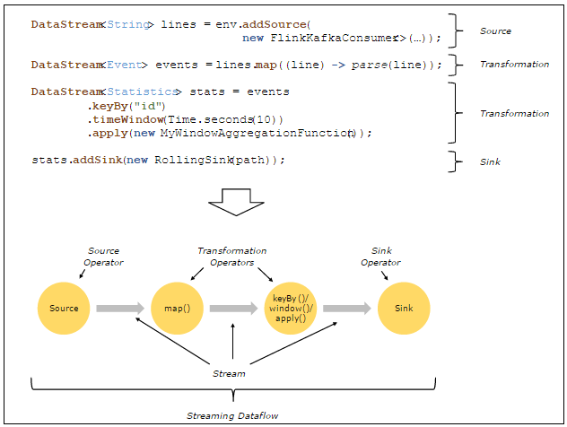
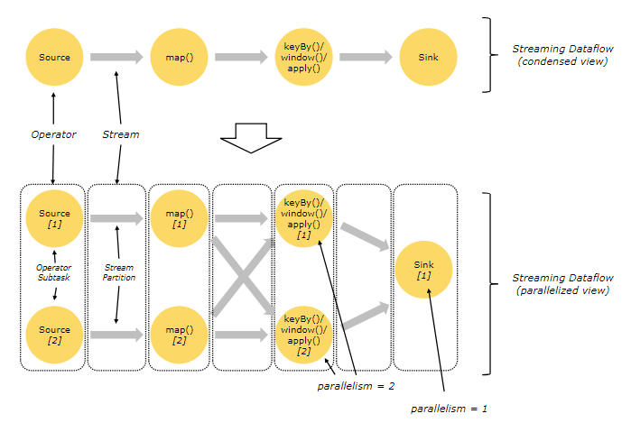
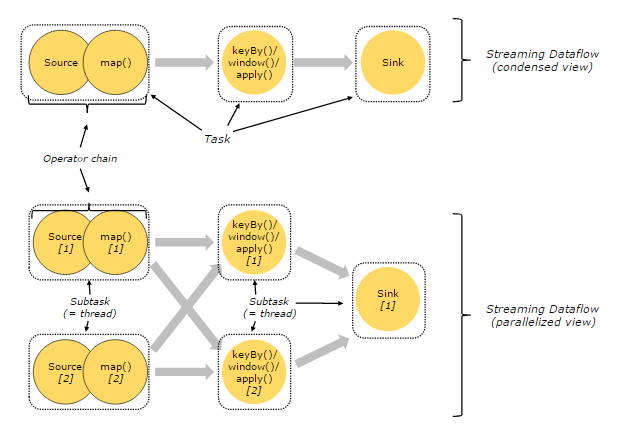

<!-- TOC --><!-- TOC -->

- [1. Apache Flink详细入门](#1-apache-flink详细入门)
    - [1.1. 基本概念](#11-基本概念)
        - [1.1.1. Stream & Transformation & Operator](#111-stream--transformation--operator)
        - [1.1.2. Parallel Dataflow](#112-parallel-dataflow)
        - [1.1.3. Task & Operator Chain](#113-task--operator-chain)
        - [1.1.4. Time & Window](#114-time--window)

# 1. Apache Flink基本介绍
## 1.1. 基本概念
&emsp;&emsp;Apache Flink是一个面向分布式数据流处理和批量数据处理的开源计算平台，它能够**基于同一个Flink运行时（Flink Runtime），提供支持流处理和批处理两种类型应用的功能**。
* 流处理  
    低延迟、Exactly-once保证
* 批处理  
    高吞吐、高效处理

&emsp;&emsp;Flink是完全支持流处理，也就是说作为流处理看待时输入数据流是无界的；批处理被作为一种特殊的流处理，只是它的输入数据流被定义为有界的。基于同一个Flink运行时（Flink Runtime）。
* API支持
    * 对Streaming数据类应用，提供DataStream API -- 流处理  
    * 对批处理类应用，提供DataSet API（支持Java/Scala）
### 1.1.1. Stream & Transformation & Operator

* **Stream**
&emsp;&emsp;stream是一个中间结果数据
* **Transformation**
&emsp;&emsp;transformation是一个操作，对一个或者多个输入stream进行计算处理，输出多个结果stream;

  

### 1.1.2. Parallel Dataflow
&emsp;&emsp;在Flink中，程序天生是**并行和分布式**的：一个Stream可以被分成多个Stream分区（Stream Partitions），一个Operator可以被分成多个Operator Subtask，每一个Operator Subtask是在不同的线程中独立执行的。一个Operator的并行度，等于Operator Subtask的个数，一个Stream的并行度总是等于生成它的Operator的并行度。

上图展现了在两个Operator之间的Stream的两种模式：
* One-to-one模式  
比如从Source[1]到map()[1]，它保持了Source的分区特性（Partitioning）和分区内元素处理的有序性  

* Redistribution模式  
这种模式改变了输入数据流的分区，比如从map()[1]、map()[2]到keyBy()/window()/apply()[1]、keyBy()/window()/apply()[2]，上游的Subtask向下游的多个不同的Subtask发送数据，改变了数据流的分区，这与实际应用所选择的Operator有关系。
另外，Source Operator对应2个Subtask，所以并行度为2，而Sink Operator的Subtask只有1个，故而并行度为1。

### 1.1.3. Task & Operator Chain  
在Flink分布式执行环境中，会将多个Operator Subtask串起来组成一个Operator Chain，实际上就是一个执行链，每个执行链会在TaskManager上一个独立的线程中执行，如下图所示：

上图中上半部分表示的是一个Operator Chain，多个Operator通过`Stream`连接，而每个Operator在运行时对应一个Task；图中下半部分是上半部分的一个并行版本，也就是对每一个Task都并行化为多个Subtask。

### 1.1.4. Time & Window  
Flink支持基于时间窗口操作，也支持基于数据的窗口操作:

