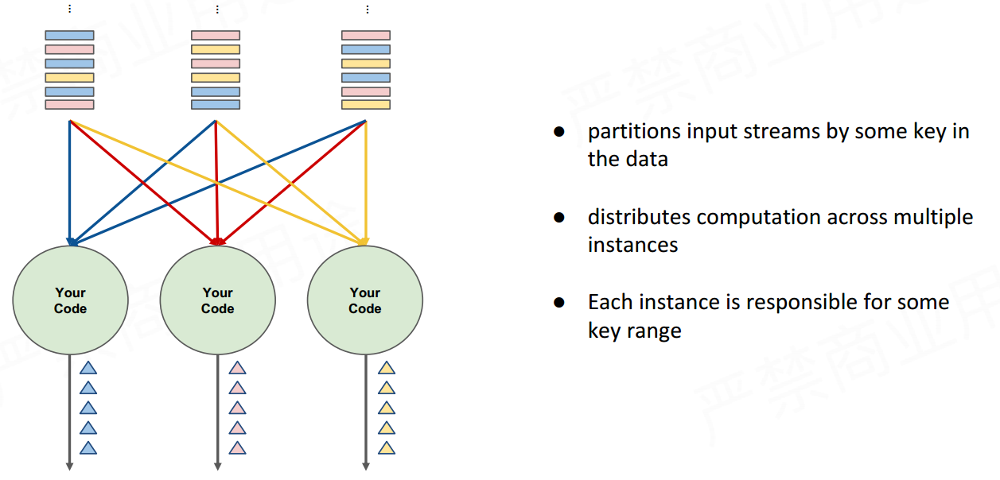

<!-- TOC -->

- [1. Apache Flink 概念介绍：有状态流式处理引擎的基石](#1-apache-flink-概念介绍有状态流式处理引擎的基石)
    - [1.1. 何谓“有状态流处理”](#11-何谓有状态流处理)
        - [1.1.1. 传统批次处理方法](#111-传统批次处理方法)
        - [1.1.2. 理想方法](#112-理想方法)
        - [1.1.3. 流式处理 -- ee](#113-流式处理----ee)
        - [1.1.4. 分散式流式处理](#114-分散式流式处理)
        - [1.1.5. 有状态分散式流式处理](#115-有状态分散式流式处理)
    - [1.2. 有状态流式处理的挑战](#12-有状态流式处理的挑战)
        - [1.2.1. 状态容错（State fault tolerance）](#121-状态容错state-fault-tolerance)
        - [1.2.2. 状态维护](#122-状态维护)
        - [1.2.3. Event-time处理](#123-event-time处理)
        - [1.2.4. 状态保存与迁移](#124-状态保存与迁移)
    - [1.3. 抽象级别](#13-抽象级别)

<!-- /TOC -->

# 1. Apache Flink 概念介绍：有状态流式处理引擎的基石
## 1.1. 何谓“有状态流处理”

### 1.1.1. 传统批次处理方法  
传统的批次处理方法：
* 持续收取数据  
* 以时间作为划分数个批次档案的依据  
* 周期性执行批次运算

  

### 1.1.2. 理想方法

  

### 1.1.3. 流式处理 -- ee

* **在无穷无尽的输入上长时间运行的计算**

  

### 1.1.4. 分散式流式处理  

* 通过数据中的某个键对输入流进行分区
* 跨多个实例分配计算
* 每个实例负责一些关键范围  

  

### 1.1.5. 有状态分散式流式处理

  

* 嵌入式本地状态后端
* 状态键与输入流共同分区
snapshot的定义：
关于指定数据集合的一个完全可用拷贝，该拷贝包括相应数据在某个时间点（拷贝开始的时间点）的映像。快照可以是其所表示的数据的一个副本，也可以是数据的一个复制品。

## 1.2. 有状态流式处理的挑战

### 1.2.1. 状态容错（State fault tolerance）
当某个节点挂了，如何保证状态的容错？
* 如何保证状态拥有**精确一次exactly-oance guarantee**的容错保证
    每一次输入（数据、事件）反应到更改状态恰好是一次；

### 1.2.2. 状态维护

### 1.2.3. Event-time处理

### 1.2.4. 状态保存与迁移

## 1.3. 抽象级别
Flink提供了不同级别的抽象，以开发**流处理或批处理**作业。

* MapReduce：input --> map(Reduce) --> Output
* Spark: input --> Transformations --> action -- output
* Storm：input --> Spout --> Bolt --> output  
* Flink:        source --> transformation --> sink

