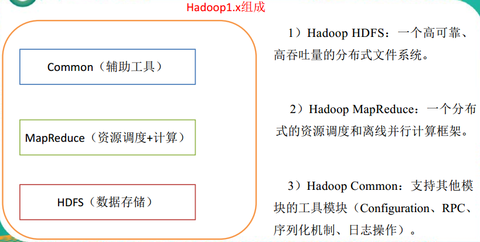
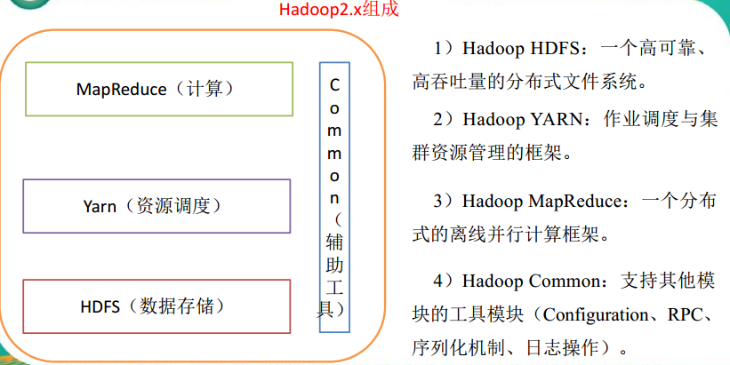
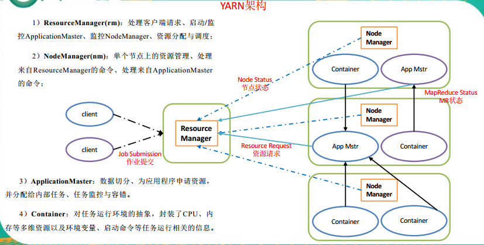
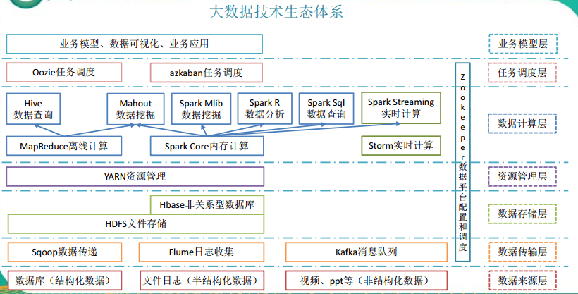

Hadoop入门（一）：Hadoop简介
本章节主要介绍Hadoop的基本概念。  
[参考文档](../2.资料/2_尚硅谷大数据之从Hadoop框架讨论大数据生态.pdf)
<!-- TOC -->

- [1. Hadoop简介](#1-hadoop简介)
    - [1.1. Hadoop是什么？](#11-hadoop是什么)
    - [1.2. Hadoop发展历史](#12-hadoop发展历史)
    - [1.3. Hadoop 三大发行版本](#13-hadoop-三大发行版本)
    - [1.4. Hadoop的优势](#14-hadoop的优势)
    - [1.5. Hadoop 组成](#15-hadoop-组成)
        - [1.5.1. hadoop1.x](#151-hadoop1x)
        - [1.5.2. hadoop2.x](#152-hadoop2x)
    - [1.6. Yarn架构概述](#16-yarn架构概述)
    - [1.7. MapReduce 架构概述](#17-mapreduce-架构概述)
    - [1.8. 大数据技术生态](#18-大数据技术生态)

<!-- /TOC -->

# 1. Hadoop简介

## 1.1. Hadoop是什么？
1） Hadoop 是一个由 Apache 基金会所开发的**分布式系统基础架构**。  
2）主要解决，海量数据的**存储**和海量数据的**分析计算**问题。  
3）广义上来说， HADOOP 通常是指一个更广泛的概念——**HADOOP 生态圈。**
## 1.2. Hadoop发展历史
可以说 Google 是 hadoop 的思想之源(Google 在大数据方面的三篇论文)
* GFS --->HDFS
* Map-Reduce --->MR
* BigTable --->Hbase

## 1.3. Hadoop 三大发行版本
Hadoop 三大发行版本：**Apache、 Cloudera、 Hortonworks**。  

* pache 版本最原始（最基础）的版本，对于入门学习最好。
* Cloudera 在大型互联网企业中用的较多。
* Hortonworks 文档较好。
## 1.4. Hadoop的优势
**1）高可靠性：**

 Hadoop 底层维护多个数据副本，所以即使Hadoop 某个计算元素或存储出现故障，也不会导致数据的丢失。  

**2）高扩展性：**
在集群间分配任务数据，可方便的扩展数以千计的节点。  

**3）高效性：**
在 MapReduce 的思想下， Hadoop 是并行工作的，以加快任务处理速度。

**4）高容错性：**
能够自动将失败的任务重新分配。

## 1.5. Hadoop 组成
### 1.5.1. hadoop1.x

### 1.5.2. hadoop2.x
在 Hadoop2.x 时代， 增加了 Yarn。 Yarn 只负责资源的调度， MapReduce 只负责运算。

## 1.6. Yarn架构概述

## 1.7. MapReduce 架构概述
MapReduce 将计算过程分为两个阶段： Map 和 Reduce  
1） Map 阶段**并行处理**输入数据；
2） Reduce 阶段对 Map 结果进行汇总。

## 1.8. 大数据技术生态

