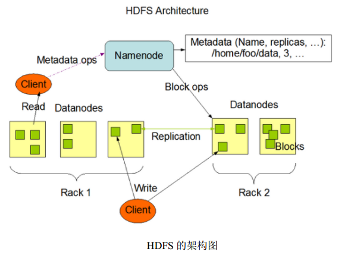
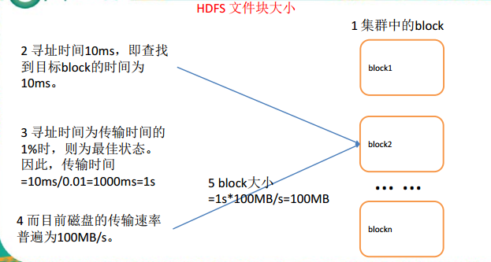

<!-- TOC -->

- [1. Hadoop概述](#1-hadoop概述)
    - [1.1. HDFS产生背景](#11-hdfs产生背景)
    - [1.2. HDFS 概念](#12-hdfs-概念)
    - [1.3. HDFS优缺点](#13-hdfs优缺点)
        - [1.3.1. 优点](#131-优点)
        - [1.3.2. 缺点](#132-缺点)
    - [1.4. HDFS架构](#14-hdfs架构)
        - [1.4.1. Client](#141-client)
        - [1.4.2. NameNode：](#142-namenode)
        - [1.4.3. DataNode](#143-datanode)
        - [1.4.4. Secondary NameNode](#144-secondary-namenode)
    - [1.5. HDFS 文件块大小](#15-hdfs-文件块大小)
- [HDFS常用shell操作](#hdfs常用shell操作)
    - [常用命令](#常用命令)

<!-- /TOC -->
# 1. Hadoop概述
## 1.1. HDFS产生背景 
&emsp;&emsp;随着数据量越来越大，在一个操作系统管辖的范围内存不下了，那么就分配到更多的操作系统管理的磁盘中，但是不方便管理和维护，迫切需要一种系统来管理多台机器上的文件，这就是**分布式文件管理系统**。 **HDFS只是分布式文件管理系统中的一种**.

## 1.2. HDFS 概念
&emsp;&emsp;**HDFS，它是一个文件系统**，用于存储文件，通过`目录树`来定位文件； 其次，它是**分布式**的， 由很多服务器联合起来实现其功能，集群中的服务器有各自的角色。  
&emsp;&emsp;HDFS 的设计适合**一次写入，多次读出**的场景，且**不支持文件的修改**。**适合用来做数据分析，并不适合用来做网盘应用。**

## 1.3. HDFS优缺点
### 1.3.1. 优点
1. 高容错性  
    * （1）数据自动保存多个副本。它通过增加副本的形式，提高容错性；  
    * （2）某一个副本丢失以后，它可以自动恢复。  
2. 适合大数据处理
    * （1）数据规模：能够处理数据规模达到 GB、 TB、甚至 PB 级别的数据；
    * （2）文件规模：能够处理百万规模以上的文件数量，数量相当之大。
3. 流式数据访问， 它能保证数据的一致性。 
4. 可构建在廉价机器上， 通过多副本机制，提高可靠性。

### 1.3.2. 缺点
1. 不适合低延时数据访问，比如毫秒级的存储数据，是做不到的。  
2. 无法高效的对大量小文件进行存储。
    * （1）存储大量小文件的话，它会占用 NameNode 大量的内存来存储文件、目录和块信息。这样是不可取的，因为 NameNode 的内存总是有限的；  
    * （2）小文件存储的寻址时间会超过读取时间，它违反了 HDFS 的设计目标。
3. 并发写入、文件随机修改。
    * （1）一个文件只能有一个写，不允许多个线程同时写；
    * （2）仅支持数据 append（追加），不支持文件的随机修改。  

【总结】
* 优点：
    * 高容错性
    * 适合大数据处理
    * 高可扩展性
* 缺点：
    * 对大量小文件的处理效率低
    * 不适合低延迟的场景
    * 只支持数据的追加，不支持随机修改

## 1.4. HDFS架构
<div align="center"><a></a></div>

### 1.4.1. Client
&emsp;&emsp;就是客户端。
* （1）文件切分。文件上传 HDFS 的时候， Client 将文件切分成一个一个的 Block，然后进行存储；  
* （2）与 NameNode 交互，获取文件的位置信息；
* （3）与 DataNode 交互，读取或者写入数据；
* （4） Client 提供一些命令来管理 HDFS，比如启动或者关闭 HDFS；
* （5） Client 可以通过一些命令来访问 HDFS；
### 1.4.2. NameNode：
&emsp;&emsp;就是 Master，它是一个主管、管理者。
* （1）管理 HDFS 的名称空间；
* （2）管理数据块（Block） 映射信息；
* （3）配置副本策略；
* （4）处理客户端读写请求。
### 1.4.3. DataNode
&emsp;&emsp;就是 Slave。 NameNode 下达命令， DataNode 执行实际的操作。
* （1）存储实际的数据块；
* （2）执行数据块的读/写操作。
### 1.4.4. Secondary NameNode
&emsp;&emsp;并非 NameNode 的热备。当 NameNode 挂掉的时候，它并不能马
上替换 NameNode 并提供服务。  
* （1）辅助 NameNode，分担其工作量；
* （2）定期合并 Fsimage 和 Edits，并推送给 NameNode；
* （3）在紧急情况下，可辅助恢复 NameNode。

## 1.5. HDFS 文件块大小
&emsp;&emsp;HDFS 中的文件在物理上是**分块存储（block）**，块的大小可以通过配置参数( dfs.blocksize)来规定，**默认大小在 hadoop2.x 版本中是 128M，老版本中是 64M**。  
&emsp;&emsp;HDFS 的块比磁盘的块大，其目的是为了最小化寻址开销。如果块设置得足够大，从磁盘传输数据的时间会明显大于定位这个块开始位置所需的时间。因而， 传输一个由多个块组成的文件的时间取决于磁盘传输速率。  
&emsp;&emsp;如果寻址时间约为 10ms，而传输速率为 100MB/s，为了使寻址时间仅占传输时间的 1%，我们要将块大小设置约为 100MB。 默认的块大小 128MB。
块的大小： 
```
10ms*100*100M/s = 100M
```

<div align="center"><a></a></div>  

# HDFS常用shell操作
## 常用命令
（0）启动 Hadoop 集群（方便后续的测试）
```
$ sbin/start-dfs.sh
$ sbin/start-yarn.sh
```
（1） -help： 输出这个命令参数
```
$ hadoop fs -help rm
```
（2） -ls: 显示目录信息
```
$ hadoop fs -ls /
```
（3） -mkdir：在 hdfs 上创建目录
```
$ hadoop fs -mkdir -p /sanguo/shuguo
```
（4） -moveFromLocal 从本地剪切粘贴到 hdfs
```$ touch kongming.txt
$ hadoop fs -moveFromLocal ./kongming.txt
/sanguo/shuguo
```
（5） --appendToFile ：追加一个文件到已经存在的文件末尾
```
$ touch liubei.txt
$ vi liubei.txt

输入
san gu mao lu
$ hadoop fs -appendToFile liubei.txt
/sanguo/shuguo/kongming.txt
```
（6） -cat ：显示文件内容
```
$ hadoop fs -cat /sanguo/shuguo/kongming.txt
```
（7） -tail：显示一个文件的末尾
```
$ hadoop fs -tail /sanguo/shuguo/kongming.txt
```
（8） -chgrp 、 -chmod、 -chown： linux 文件系统中的用法一样，修改文件所属权限
```
$ hadoop fs -chmod 666 /sanguo/shuguo/kongming.txt  
$ hadoop fs -chown atguigu:atguigu /sanguo/shuguo/kongming.txt
```

（9） -copyFromLocal：从本地文件系统中拷贝文件到 hdfs 路径去
```
$ hadoop fs -copyFromLocal README.txt /
```
（10） -copyToLocal：从 hdfs 拷贝到本地
```
$ hadoop fs -copyToLocal /sanguo/shuguo/kongming.txt ./
```
（11） -cp ：从 hdfs 的一个路径拷贝到 hdfs 的另一个路径
```
$ hadoop fs -cp /sanguo/shuguo/kongming.txt /zhuge.txt
```
（12） -mv：在 hdfs 目录中移动文件
```
$ hadoop fs -mv /zhuge.txt /sanguo/shuguo/
```
（13） -get：等同于 copyToLocal，就是从 hdfs 下载文件到本地
```
$ hadoop fs -get /sanguo/shuguo/kongming.txt ./
```
（14） -getmerge ：合并下载多个文件，比如 hdfs 的目录 /aaa/下有多个文件:log.1,
log.2,log.3,...
```
$ hadoop fs -getmerge /user/atguigu/test/* ./zaiyiqi.txt
```

（15） -put：等同于 copyFromLocal
``` 
$ hadoop fs -put ./zaiyiqi.txt /user/atguigu/test/
```
（16） -rm：删除文件或文件夹
```
$ hadoop fs -rm /user/atguigu/test/jinlian2.txt
```
（17） -rmdir：删除空目录
```
$ hadoop fs -mkdir /test
$ hadoop fs -rmdir /test
```
（18） -du 统计文件夹的大小信息
```
$ hadoop fs -du -s -h /user/atguigu/test 2.7 K /user/atguigu/test
$ hadoop fs -du -h /user/atguigu/test

1.3 K /user/atguigu/test/README.txt
15 /user/atguigu/test/jinlian.txt
1.4 K /user/atguigu/test/zaiyiqi.txt
```

（19） -setrep：设置 hdfs 中文件的副本数量
```
$ hadoop fs -setrep 10 /sanguo/shuguo/kongming.txt
```
这里设置的副本数只是记录在 NameNode 的元数据中，是否真的会有这么多副本，还得看 DataNode 的数量。因为目前只有 3 台设备，最多也就 3 个副本，只有节点数的增加到10 台时， 副本数才能达到 10。
