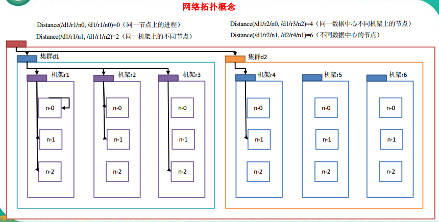

<!-- TOC -->

- [1. HDFS的数据流](#1-hdfs的数据流)
    - [1.1. HDFS写数据流](#11-hdfs写数据流)
        - [1.1.1. 剖析文件写入](#111-剖析文件写入)
        - [1.1.2. 网络拓扑概念](#112-网络拓扑概念)
        - [1.1.3. 机架感知（副本节点选择）](#113-机架感知副本节点选择)
    - [1.2. HDFS 读数据流程](#12-hdfs-读数据流程)

<!-- /TOC -->

# 1. HDFS的数据流
## 1.1. HDFS写数据流
### 1.1.1. 剖析文件写入

1. 客户端通过 Distributed FileSystem 模块向 NameNode 请求上传文件， NameNode 检查目标文件是否已存在，父目录是否存在。   

2. NameNode 返回是否可以上传。  

3. 客户端请求第一个 block 上传到哪几个 datanode 服务器上。  

4. NameNode 返回 3 个 datanode 节点， 分别为 dn1、 dn2、 dn3。  

5. 客户端通过 FSDataOutputStream 模块请求 dn1 上传数据， dn1 收到请求会继续调用 dn2，然后 dn2 调用 dn3，将这个通信管道建立完成。  

6. dn1、 dn2、 dn3 逐级应答客户端。    

7. 客户端开始往 dn1 上传第一个 block （先从磁盘读取数据放到一个本地内存缓存），以 **packet**为单位， dn1 收到一个 packet 就会传给 dn2， dn2 传给 dn3； dn1 每传一个 packet 会放入一个应答队列等待应答。  

8. 当一个 block 传输完成之后，客户端再次请求 NameNode 上传第二个 block 的服务器。（重复执行 3-7 步）。

### 1.1.2. 网络拓扑概念
在海量数据处理中，其主要限制因素是**节点之间数据的传输速率——带宽**很稀缺。这里的想法是**将两个节点间的带宽作为距离的衡量标准。

* 网络带宽是指在单位时间（一般指的是1秒钟）内能传输的数据量。

* 节点距离：两个节点到达最近的共同祖先的距离总和。

### 1.1.3. 机架感知（副本节点选择）
Hadoop2.7.2 副本节点选择：
* 第一个副本在 Client 所处的节点上。 如果客户端在集群外，随机选一个。
* 第二个副本和第一个副本位于相同机架， 随机节点。
* 第三个副本位于不同机架，随机节点。

## 1.2. HDFS 读数据流程
1. 客户端通过 Distributed FileSystem 向 NameNode 请求下载文件， NameNode 通过查询元数据，找到文件块所在的 DataNode 地址。

2. 挑选一台 DataNode（就近原则，然后随机）服务器，请求读取数据。

3. DataNode 开始传输数据给客户端（从磁盘里面读取数据输入流，以 packet 为单位来做校验）。

4. 客户端以 packet 为单位接收，先在本地缓存，然后写入目标文件。
