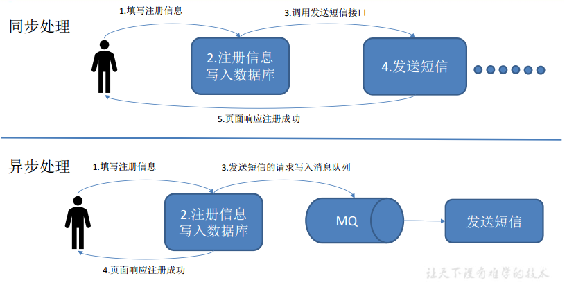
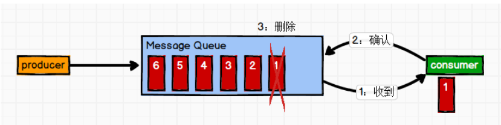
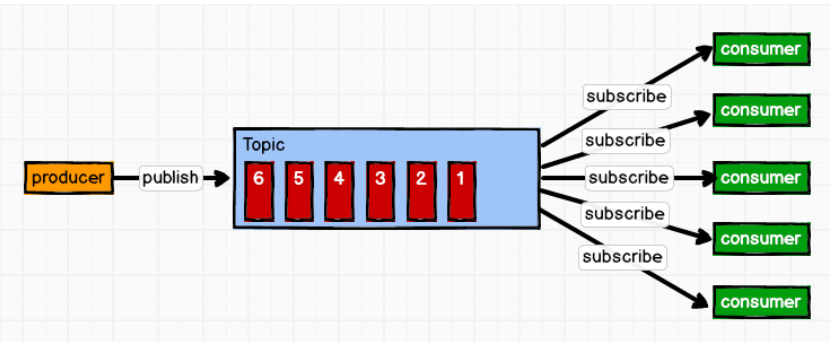
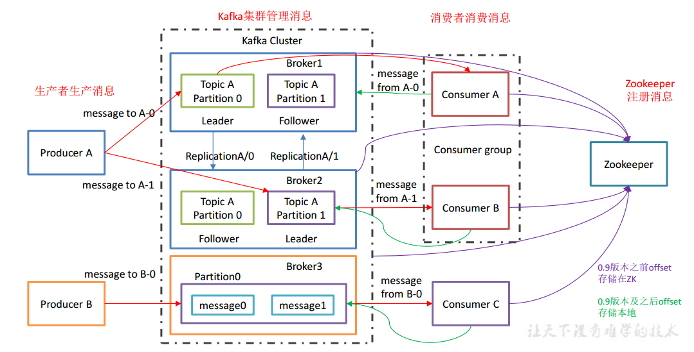

Kafka入门系列（一）：Kafka概述

<!-- TOC -->

- [1. Kafka概述](#1-kafka概述)
    - [1.1. 定义](#11-定义)
    - [1.2. 消息队列](#12-消息队列)
        - [1.2.1. 传统消息队列的应用场景](#121-传统消息队列的应用场景)
        - [1.2.2. 使用消息队列的好处](#122-使用消息队列的好处)
    - [1.3. 消息队列的两种模式](#13-消息队列的两种模式)
        - [1.3.1. 点对点模式](#131-点对点模式)
        - [1.3.2. 发布/订阅模式](#132-发布订阅模式)
    - [1.4. Kafka架构](#14-kafka架构)

<!-- /TOC -->
# 1. Kafka概述
## 1.1. 定义
Kafka 是一个分布式的基于**发布/订阅模式**的**消息队列（Message Queue）** ， 主要应用于大数据实时处理领域。
## 1.2. 消息队列
### 1.2.1. 传统消息队列的应用场景

### 1.2.2. 使用消息队列的好处
1） 解耦  
允许你独立的扩展或修改两边的处理过程，只要确保它们遵守同样的接口约束。 
2）灵活性 & 峰值处理能力 -- 削峰
在访问量剧增的情况下，应用仍然需要继续发挥作用，但是这样的突发流量并不常见。  
如果为以能处理这类峰值访问为标准来投入资源随时待命无疑是巨大的浪费。使用消息队列能够使关键组件顶住突发的访问压力，而不会因为突发的超负荷的请求而完全崩溃。  
3） 异步通信  
很多时候，用户不想也不需要立即处理消息。消息队列提供了异步处理机制，**允许用户把一个消息放入队列，但并不立即处理它。想向队列中放入多少消息就放多少，然后在需要的时候再去处理它们**。
4）缓冲 
有助于控制和优化数据流经过系统的速度，解决生产消息和消费消息的处理速度不一致的情况。  
5） 可恢复性  
系统的一部分组件失效时，不会影响到整个系统。消息队列降低了进程间的耦合度，所以即使一个处理消息的进程挂掉，加入队列中的消息仍然可以在系统恢复后被处理。

## 1.3. 消息队列的两种模式
### 1.3.1. 点对点模式
（一对一，消费者主动拉取数据，消息收到后消息清除）  
消息生产者生产消息发送到 Queue中，然后消息消费者从 Queue中取出并且消费消息。消息被消费以后， queue 中不再有存储，所以消息消费者不可能消费到已经被消费的消息。Queue 支持存在多个消费者，但是对一个消息而言，只会有一个消费者可以消费。

### 1.3.2. 发布/订阅模式
（一对多，消费者消费数据之后不会清除消息）
消息生产者（发布）将消息发布到 topic 中，同时有多个消息消费者（订阅）消费该消息。和点对点方式不同，发布到 topic 的消息会被所有订阅者消费。

有点像订阅微信公众号
两种：1）微信公众号类型：生产者主动推送数据
     2）kafka类型:消费者主动拉取数据；
        缺点：有点浪费资源，需要一直去Topic询问是否有消息。

## 1.4. Kafka架构

* Producer     
消息生产者，就是向 kafka broker 发消息的客户端；  
* Consumer   
消息消费者，向 kafka broker 取消息的客户端；
* Consumer Group （CG）：   
消费者组，由多个 consumer 组成。 **消费者组内每个消费者负责消费不同分区的数据，一个分区只能由一个组内消费者消费；消费者组之间互不影响**。 所有的消费者都属于某个消费者组，即**消费者组是逻辑上的一个订阅者。**
* Broker  
一台 kafka 服务器就是一个 broker。一个集群由多个 broker 组成。一个 broker可以容纳多个 topic。
* Topic  
可以理解为一个队列， 生产者和消费者面向的都是一个 topic；
* Partition  
 为了实现扩展性，一个非常大的 topic 可以分布到多个 broker（即服务器）上，一个 topic 可以分为多个 partition，每个 partition 是一个有序的队列；
 * Replica  
 副本，为保证集群中的某个节点发生故障时， 该节点上的 partition 数据不丢失，且 kafka 仍然能够继续工作，kafka 提供了副本机制，一个 topic 的每个分区都有若干个副本，一个 leader 和若干个 follower。
 * leader  
每个分区多个副本的“主”，生产者发送数据的对象，以及消费者消费数据的对象都是 leader。
* leader  
每个分区多个副本中的“从”，实时从 leader 中同步数据，保持和 leader 数据的同步。 leader 发生故障时，某个 follower 会成为新的 leader。

一个分区只能被同一个消费者组里面的一个消费者消费。（可以被其他消费者组里面的某一个消费者消费）

0.9版本之前：
    offset存储在ZK中
消费者消费到第几条数据（数据的位置），会保存在zookeeper里。

0.9版本之后：
    offset存储在kafka本地（存在磁盘，保存7天）。

