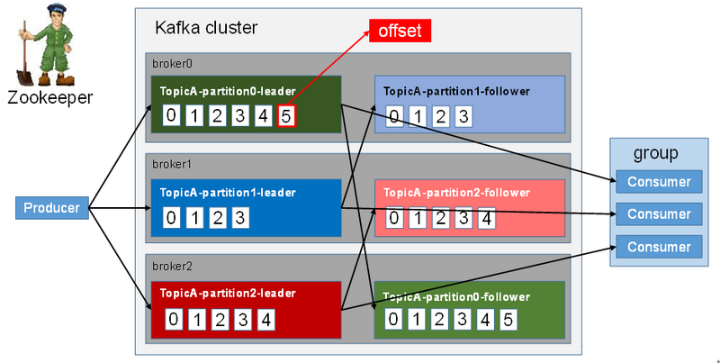
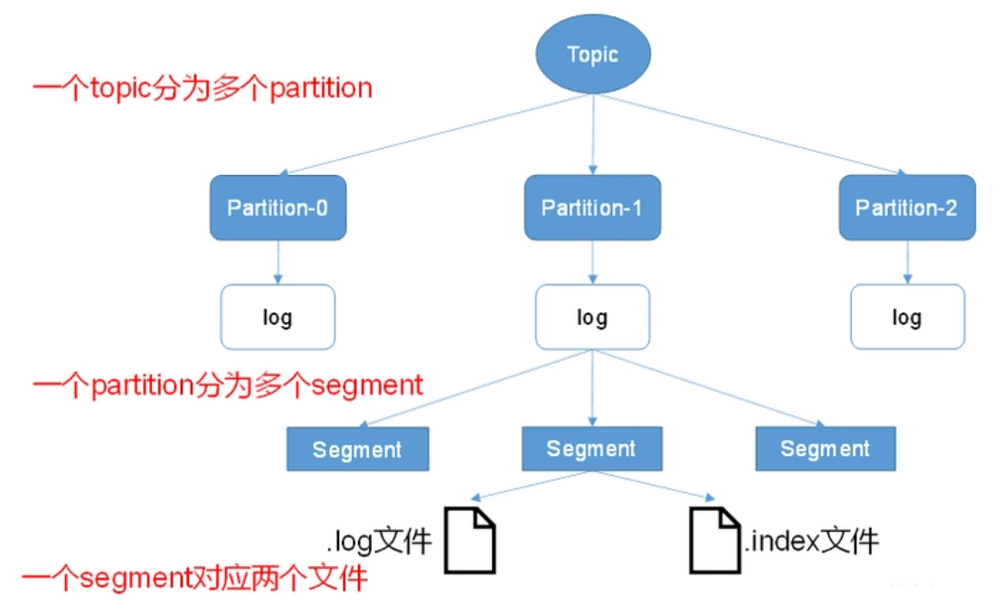
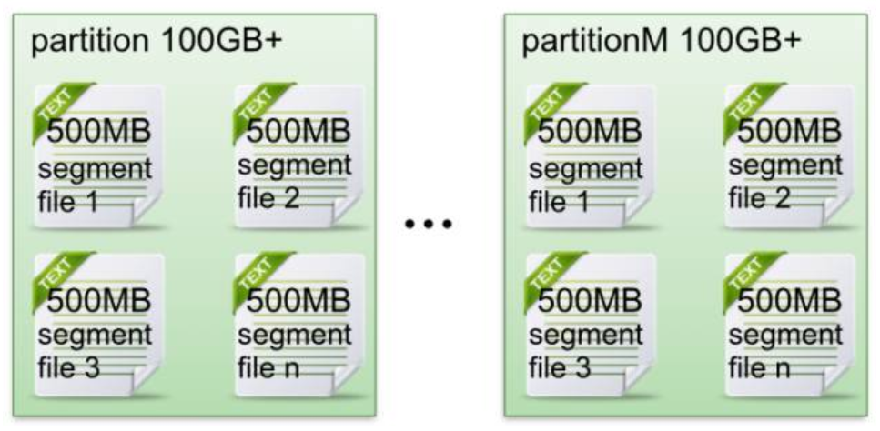
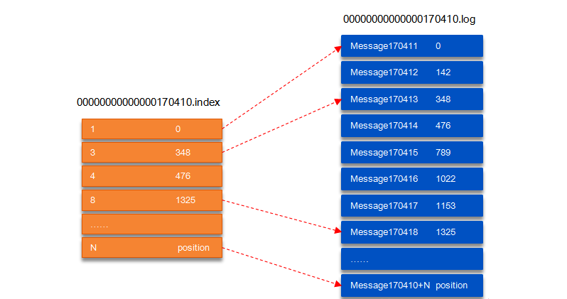
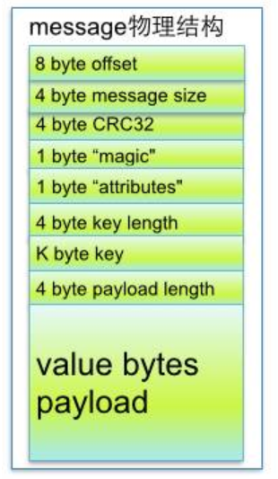

<!-- TOC -->

- [1. Kafka工作流程及文件存储机制](#1-kafka工作流程及文件存储机制)
    - [1.1. 关键术语](#11-关键术语)
    - [1.2. kafka工作流程](#12-kafka工作流程)
    - [1.3. Kafka文件存储机制](#13-kafka文件存储机制)
        - [1.3.1. topic中partition存储分布](#131-topic中partition存储分布)
        - [1.3.2. partiton中文件存储方式](#132-partiton中文件存储方式)
        - [1.3.3. partiton中segment文件存储结构](#133-partiton中segment文件存储结构)
        - [1.3.4. 从partition中通过offset查找message](#134-从partition中通过offset查找message)
    - [1.4. 总结](#14-总结)
    - [参考资料](#参考资料)

<!-- /TOC -->
# 1. Kafka工作流程及文件存储机制
## 1.1. 关键术语
* Broker：消息中间件处理结点，一个Kafka节点就是一个broker，多个broker能够组成一个Kafka集群。

* Topic：一类消息，比如page view日志、click日志等都能够以topic的形式存在。Kafka集群能够同一时候负责多个topic的分发。

* Partition：**topic物理上的分组**。一个topic能够分为多个partition，**每一个partition是一个有序的队列。**

* Segment：partition物理上由多个segment组成。以下有具体说明。

* offset：每一个partition都由一系列有序的、不可变的消息组成，这些消息被连续的追加到partition中。**partition中的每一个消息都有一个连续的序列号叫做offset,用于partition中唯一标识的这条消息。**

## 1.2. kafka工作流程
<div align="center"></div>

* Kafka 中消息是以 topic 进行分类的， 生产者生产消息，消费者消费消息，都是面向 topic的。

* topic 是逻辑上的概念，而 partition 是物理上的概念，每个 partition 对应于一个 log 文件，该 log 文件中存储的就是 producer 生产的数据。 Producer 生产的数据会被不断追加到该log 文件末端，且每条数据都有自己的 offset。 消费者组中的每个消费者， 都会实时记录自己
消费到了哪个 offset，以便出错恢复时，从上次的位置继续消费。

## 1.3. Kafka文件存储机制
<div align="center"></div>


### 1.3.1. topic中partition存储分布
如果实验环境中Kafka集群仅仅有一个broker。xxx/message-folder为**数据文件存储根文件夹**。在Kafka broker中**server.properties**文件配置(**参数log.dirs=xxx/message-folder**)。比如创建2个topic名称分别为report_push、launch_info, partitions数量都为partitions=4

存储路径和文件夹规则为：

xxx/message-folder

          |--report_push-0
          |--report_push-1
          |--report_push-2
          |--report_push-3
          |--launch_info-0
          |--launch_info-1
          |--launch_info-2
          |--launch_info-3

**在Kafka文件存储中，同一个topic下有多个不同partition，每一个partition为一个文件夹，partiton命名规则为`topic名称+有序序号`，第一个partiton序号从0開始，序号最大值为partitions数量减1。**

### 1.3.2. partiton中文件存储方式
<div align="center"></div>

* 每一个partion(文件夹)相当于一个巨型文件被平均分配到多个大小相等segment(段)数据文件里。

* 但每一个段segment file消息数量不一定相等，这样的特性方便old segment file高速被删除。（默认情况下每一个文件大小为1G）

* 每一个partiton仅仅须要支持顺序读写即可了。segment文件生命周期由服务端配置參数决定(默认7天)。

这样做的优点就是**能高速删除无用文件。有效提高磁盘利用率**。

### 1.3.3. partiton中segment文件存储结构
* segment file组成：由2大部分组成。分别为index file和data file，此2个文件一一相应，成对出现，后缀`.index`和`.log`分别表示为segment索引文件、数据文件.

* segment文件命名规则：partion全局的第一个segment从0開始，**index 和 log 文件以当前 segment 的第一条消息的 offset 命名。**。

<div align="center"></div>

索引文件存储大量元数据，数据文件存储大量消息，索引文件里元数据指向相应数据文件里message的物理偏移地址。

```
00000000000000000000.index
00000000000000000000.log
00000000000000170410.index
00000000000000170410.log
00000000000000239430.index
00000000000000239430.log
```

### 1.3.4. 从partition中通过offset查找message
以上图为例
* 第一步查找segment file   
    读取offset=170418的消息，首先查找segment文件，其中00000000000000000000.index 为最开始的文件，第二个文件为 00000000000000170410.index（起始偏移为 170410+1=170411），而第三个文件为 00000000000000239430.index（起始偏移为 239430+1=239431），所以这个 offset=170418 就落到了第二个文件之中。其它后续文件可以依次类推，以其偏移量命名并排列这些文件，然后根据二分查找法就可以快速定位到具体文件位置。

* 第二步通过segment file查找message     
    其次根据 00000000000000170410.index 文件中的 [8,1325] 定位到 00000000000000170410.log 文件中的 1325 的位置进行读取。要是读取 offset=170418 的消息，从 00000000000000170410.log 文件中的 1325的位置进行读取。那么，如何确定何时读完本条消息呢？

这个问题由消息的物理结构解决，消息都具有固定的物理结构，包括：offset（8 Bytes）、消息体的大小（4 Bytes）、crc32（4 Bytes）、magic（1 Byte）、attributes（1 Byte）、key length（4 Bytes）、key（K Bytes）、payload（N Bytes）等字段，可以确定一条消息的大小，即读取到哪里截止。

<div align="center"></div>

```
8 byte offset 在parition(分区)内的每条消息都有一个有序的id号，这个id号被称为偏移(offset),它能够唯一确定每条消息在parition(分区)内的位置。即offset表示partiion的第多少message 
4 byte message size message大小 
4 byte CRC32 用crc32校验message 
1 byte “magic” 表示本次公布Kafka服务程序协议版本号号 
1 byte “attributes” 表示为独立版本号、或标识压缩类型、或编码类型。


4 byte key length 表示key的长度,当key为-1时，K byte key字段不填 
K byte key 可选 
value bytes payload 表示实际消息数据。
```

## 1.4. 总结
Kafka高效文件存储设计特点:
**定期清理、索引定位、稀疏存储**

* Kafka把topic中一个parition大文件分成多个小文件段。通过多个小文件段，就easy定期清除或删除已经消费完文件。降低磁盘占用。

* 通过索引信息能够高速定位message和确定response的最大大小。

* 通过index元数据所有映射到memory，能够避免segment file的IO磁盘操作。

* 通过索引文件稀疏存储，能够大幅降低index文件元数据占用空间大小


## 参考资料
1. [深入了解Kafka【二】工作流程及文件存储机制](https://segmentfault.com/a/1190000021175611?utm_source=tag-newest)  
2. [kafka存储机制](https://www.cnblogs.com/cynchanpin/p/7339537.html)