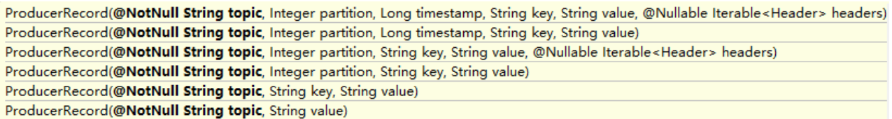
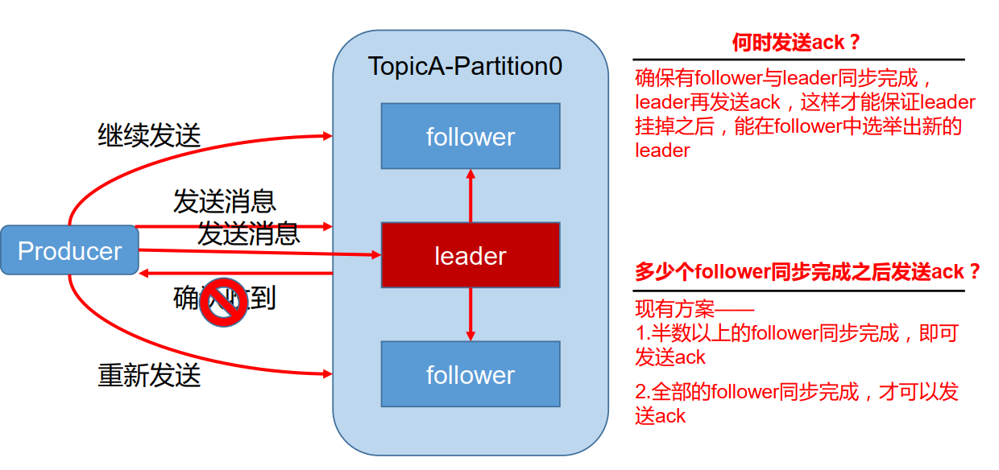
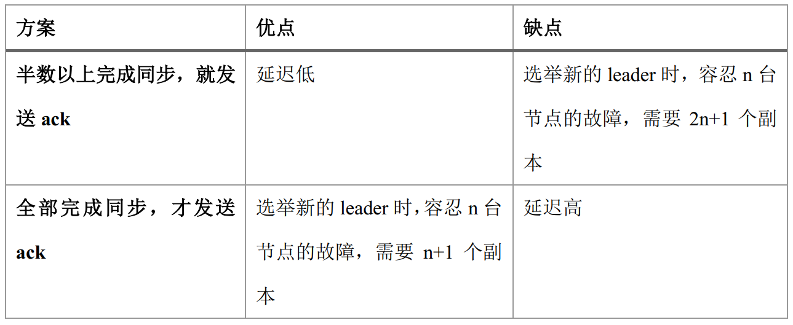
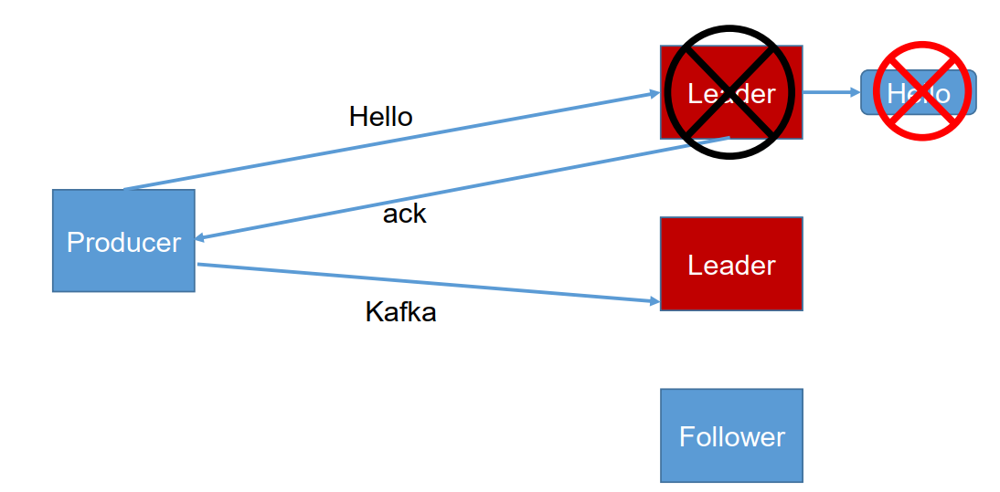
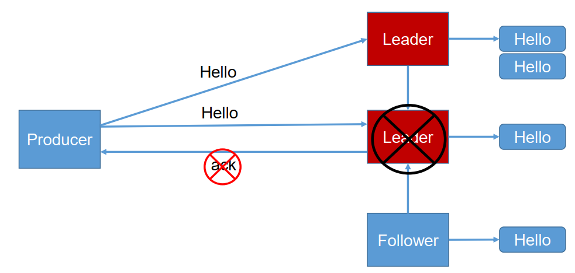
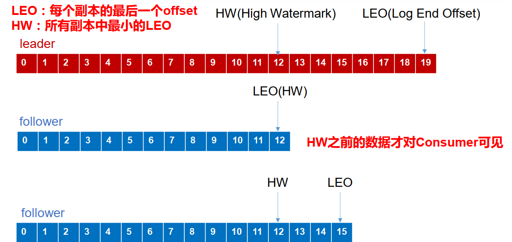

<!-- TOC -->

- [1. kafka生产者](#1-kafka生产者)
    - [1.1. 分区策略](#11-分区策略)
        - [1.1.1. 分区的原因](#111-分区的原因)
        - [1.1.2. 分区的原则](#112-分区的原则)
    - [1.2. 数据可靠性保证](#12-数据可靠性保证)
        - [1.2.1. 副本数据同步策略](#121-副本数据同步策略)
        - [1.2.2. ISR](#122-isr)
        - [1.2.3. ack 应答机制](#123-ack-应答机制)
        - [1.2.4. 故障处理细节](#124-故障处理细节)
    - [1.3. Exactly Once 语义](#13-exactly-once-语义)

<!-- /TOC -->
# 1. kafka生产者
## 1.1. 分区策略
### 1.1.1. 分区的原因
1. **方便在集群中扩展**，每个 Partition 可以通过调整以适应它所在的机器，而一个 topic又可以有多个 Partition 组成，因此整个集群就可以适应任意大小的数据了。
2. **可以提高并发**，因为可以以 Partition 为单位读写了。

### 1.1.2. 分区的原则
我们需要将 producer 发送的数据封装成一个 ProducerRecord 对象。

1. 指明 partition 的情况下，直接将指明的值直接作为 partiton 值；
2. 没有指明 partition 值但有 key 的情况下，将 key 的 hash 值与 topic 的 partition数进行取余得到 partition 值；
3. 既没有 partition 值又没有 key 值的情况下，第一次调用时随机生成一个整数（后面每次调用在这个整数上自增），将这个值与 topic 可用的 partition 总数取余得到 partition值，也就是常说的 **round-robin** 算法。

## 1.2. 数据可靠性保证
为保证 producer 发送的数据，能可靠的发送到指定的 topic， topic 的每个 partition 收到producer 发送的数据后， 都需要向 producer 发送 **ack**（acknowledgement 确认收到） ，如果producer 收到 ack， 就会进行下一轮的发送，否则重新发送数据。

### 1.2.1. 副本数据同步策略

理解：半数以上完成同步，就发送ack，举个例子：假设现在一共有1个leader，4个follower，那么>=2个follower完成同步时，发生ack，假设有2台机器挂了，最坏的情况是这两台都是同步过的机器，那么至少要有2*2+1=5个副本，才能保证新选leader时的leader是完成同步的（除故障2台外至少还有一台是同步过的），而全部完成同步方案中，当有2台节点故障，只要第三台完成同步，就能作为新选举的leader。

Kafka 选择了第二种方案，原因如下：  
1. 同样为了容忍 n 台节点的故障，第一种方案需要 2n+1 个副本，而第二种方案只需要 n+1个副本，而 Kafka 的每个分区都有大量的数据， 第一种方案会造成大量数据的冗余。  
2. 虽然第二种方案的网络延迟会比较高，但网络延迟对 Kafka 的影响较小。

### 1.2.2. ISR
采用第二种方案之后，设想以下情景： leader 收到数据，所有 follower 都开始同步数据，但有一个 follower，因为某种故障，迟迟不能与 leader 进行同步，那 leader 就要一直等下去，直到它完成同步，才能发送 ack。这个问题怎么解决呢？

Leader 维护了一个动态的 in-sync replica set (ISR)，意为和 leader 保持同步的 follower 集合。当 ISR 中的 follower 完成数据的同步之后， leader 就会给 follower 发送 ack。**如果follower长时间未向leader同步数据，则该follower将被踢出ISR该时间阈值由replica.lag.time.max.ms参数设定。 Leader 发生故障之后，就会从 ISR 中选举新的 leader。**

### 1.2.3. ack 应答机制
对于某些不太重要的数据，对数据的可靠性要求不是很高，能够容忍数据的少量丢失，所以没必要等 ISR 中的 follower 全部接收成功。  
所以 Kafka 为用户提供了**三种可靠性级别**，用户根据对可靠性和延迟的要求进行权衡，选择以下的配置。  
acks 参数配置：   
    acks：
* 0： producer 不等待 broker 的 ack，这一操作提供了一个最低的延迟， broker一接收到还没有写入磁盘就已经返回，当 broker 故障时有可能丢失数据；
* 1： producer 等待 broker 的 ack， partition 的 leader 落盘成功后返回 ack，如果在 follower同步成功之前 leader 故障，那么将会丢失数据；

* -1（all） ： producer 等待 broker 的 ack， partition 的 leader 和 follower 全部落盘成功后才
返回 ack。但是如果在 follower 同步完成后， broker 发送 ack 之前， leader 发生故障，那么会造成数据重复。

### 1.2.4. 故障处理细节
消费一致性、存储一致性

* Log文件中的HW和LEO

* LEO：指的是每个副本最大的 offset；
* HW：指的是消费者能见到的最大的 offset， ISR 队列中最小的 LEO。
理解：LEO、HW是根据当前副本同步的情况取值的。

1. follower 故障
follower 发生故障后会被临时踢出 ISR，待该 follower 恢复后，follower 会读取本地磁盘记录的上次的 HW，并将 log 文件高于 HW 的部分截取掉，从 HW 开始向 leader 进行同步。等该 **follower 的 LEO 大于等于该 Partition 的 HW**，即 follower 追上 leader 之后，就可以重新加入 ISR 了。

2. leader 故障
leader 发生故障之后，会从 ISR 中选出一个新的 leader，之后，为保证多个副本之间的数据一致性， 其余的 follower 会先将各自的 log 文件高于 HW 的部分截掉，然后从新的 leader同步数据。

【备注】
注意： 这只能保证副本之间的数据一致性（存储一致性），并不能保证数据不丢失或者不重复（消费一致性）。

## 1.3. Exactly Once 语义

&emsp;&emsp;**将服务器的 ACK 级别设置为-1**，可以保证 Producer 到 Server 之间不会丢失数据，即 At Least Once 语义。相对的，将服务器 ACK 级别设置为 0，可以保证生产者每条消息只会被发送一次，即 At Most Once 语义。

&emsp;&emsp;At Least Once 可以保证数据不丢失，但是不能保证数据不重复；相对的， At Least Once可以保证数据不重复，但是不能保证数据不丢失。 但是，对于一些非常重要的信息，比如说交易数据，下游数据消费者要求数据既不重复也不丢失，即 Exactly Once 语义。在 0.11 版本以前的 Kafka，对此是无能为力的，只能保证数据不丢失，再在下游消费者对数据做全局去重。对于多个下游应用的情况，每个都需要单独做全局去重，这就对性能造成了很大影响。

&emsp;&emsp;0.11 版本的 Kafka，引入了一项重大特性：**幂等性**。**所谓的幂等性就是指 Producer 不论向 Server 发送多少次重复数据， Server 端都只会持久化一条**。**幂等性结合 At Least Once 语义，就构成了 Kafka 的 Exactly Once 语义**。即：  

**At Least Once + 幂等性 = Exactly Once**

&emsp;&emsp;要启用幂等性，只需要**将 Producer 的参数中 enable.idompotence 设置为 true 即可**。 **Kafka的幂等性实现其实就是将原来下游需要做的去重放在了数据上游**。开启幂等性的 Producer 在初始化的时候会被分配一个 PID，发往同一 Partition 的消息会附带 Sequence Number。而Broker 端会对<PID, Partition, SeqNumber>做缓存，当具有相同主键的消息提交时， Broker 只会持久化一条。

&emsp;&emsp;**但是 PID 重启就会变化，同时不同的 Partition 也具有不同主键，所以幂等性无法保证跨分区跨会话的 Exactly Once**。
