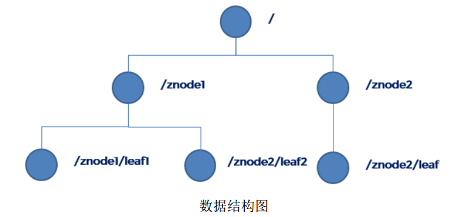
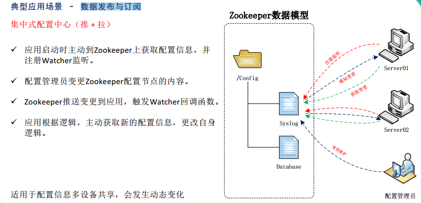
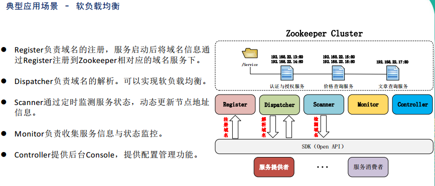
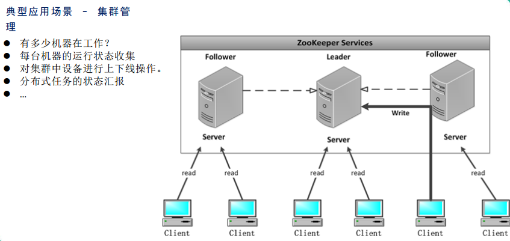

Zookeeper入门教程（一）：zookeeper概述
<!-- TOC -->

- [1. Zookeeper概述](#1-zookeeper概述)
    - [1.1. 什么是zookeeper](#11-什么是zookeeper)
    - [1.2. 特点](#12-特点)
    - [1.3. 数据结构](#13-数据结构)
    - [1.4. 应用场景](#14-应用场景)
        - [1.4.1. 数据发布与订阅](#141-数据发布与订阅)
        - [1.4.2. 负载均衡](#142-负载均衡)
        - [1.4.3. 集群管理](#143-集群管理)
- [2. Zookeeper安装](#2-zookeeper安装)
    - [本地部署安装](#本地部署安装)
        - [基本配置](#基本配置)
        - [操作zookeeper](#操作zookeeper)
    - [2.2 配置参数解读](#22-配置参数解读)

<!-- /TOC -->
# 1. Zookeeper概述
## 1.1. 什么是zookeeper
&emsp;&emsp;Zookeeper 是一个开源的分布式的，为分布式应用提供协调服务的 Apache 项目。  
&emsp;&emsp;Zookeeper 从设计模式角度来理解：是一个**基于观察者模式设计的分布式服务管理框架，它负责存储和管理大家都关心的数据，然后接受观察者的注册，一旦这些数据的状态发生变化， Zookeeper 就将负责通知已经在Zookeeper 上注册的那些观察者做出相应的反应，从而实现集群中类似 Master/Slave 管理模式。**  
&emsp;&emsp;**Zookeeper=文件系统+通知机制**

## 1.2. 特点
* 1） Zookeeper：一个领导者（leader） ，多个跟随者（follower） 组成的集群。  

* 2） Leader 负责进行投票的发起和决议，更新系统状态。  

* 3） Follower 用于接收客户请求并向客户端返回结果，在选举 Leader 过程中参与投票。

* 4）集群中只要有半数以上节点存活， Zookeeper 集群就能正常服务。

* 5）全局数据一致：每个 server 保存一份相同的数据副本， client 无论连接到哪个 server，数据都是一致的。  

* 6）更新请求顺序进行，来自同一个 client 的更新请求按其发送顺序依次执行。

* 7）数据更新原子性， 一次数据更新要么成功，要么失败。

* 8）实时性，在一定时间范围内， client 能读到最新数据。


## 1.3. 数据结构
&emsp;&emsp;ZooKeeper 数据模型的结构与 Unix 文件系统很类似，整体上可以看作是一棵树，每个节点称做一个 ZNode。
&emsp;&emsp;很显然 zookeeper 集群自身维护了一套数据结构。这个存储结构是一个**树形结构**，其上的每一个节点，我们称之为"znode"，每一个 znode 默认能够存储 1MB 的数据，每个 ZNode都可以通过其路径唯一标识。
<div align="center"><a></a></div>

## 1.4. 应用场景
提供的服务包括： **分布式消息同步和协调机制、服务器节点动态上下线、统一配置管理、负载均衡、 集群管理等**。

### 1.4.1. 数据发布与订阅
<div align="center"><a></a></div>

### 1.4.2. 负载均衡
<div align="center"><a></a></div>

### 1.4.3. 集群管理
<div align="center"><a></a></div>

# 2. Zookeeper安装
## 本地部署安装
### 基本配置
前提：
* 安装jdk
1. 解压文件
```sh
$ tar -zxvf zookeeper-3.4.14.tar.gz -C /home/hadoop/app

mv zookeeper-3.4.14 zookeeper
```
2. 配置修改
* conf 这个路径下的 zoo_sample.cfg 修改为 zoo.cfg；  
进入 zoo.cfg 文件： vim zoo.cfg  
修改 dataDir 路径为  
dataDir=/home/hadoop/app/zookeeper/zkData

* 在zookeeper目录下创建目录zkData
    mkdir zkData

### 操作zookeeper
```sh
# 1. 启动zookeeper
$ bin/zkServer.sh start

# 2。查看进程是否启动
$ jps
4020 Jps
4001 QuorumPeerMain

# 3. 查看状态
$ bin/zkServer.sh status

# 4. 启动客户端
$ bin/zkCli.sh

# 5. 退出客户端
[zk: localhost:2181(CONNECTED) 0] quit

# 6. 停止 zookeeper
$ bin/zkServer.sh stop
```

## 2.2 配置参数解读
解读zoo.cfg 文件中参数含义
1） tickTime： 通信心跳数， Zookeeper服务器心跳时间，单位毫秒
Zookeeper使用的基本时间，服务器之间或客户端与服务器之间维持心跳的时间间隔，也就是每个tickTime时间就会发送一个心跳， 时间单位为毫秒。
它用于心跳机制，并且设置最小的session超时时间为两倍心跳时间。 (session的最小超时时间是2*tickTime)

2） initLimit： LF初始通信时限
集群中的follower跟随者服务器(F)与leader领导者服务器(L)之间初始连接时能容忍的最多心跳数（tickTime的数量），用它来限定集群中的Zookeeper服务器连接到Leader的时限。
投票选举新leader的初始化时间
Follower在启动过程中，会从Leader同步所有最新数据，然后确定自己能够对外服务的起始状态。
Leader允许F在initLimit时间内完成这个工作。

3） syncLimit： LF 同步通信时限
集群中Leader与Follower之间的最大响应时间单位，假如响应超过syncLimit * tickTime，
Leader认为Follwer死掉，从服务器列表中删除Follwer。
在运行过程中， Leader负责与ZK集群中所有机器进行通信，例如通过一些心跳检测机制，来检测机器的存活状态。
如果L发出心跳包在syncLimit之后，还没有从F那收到响应，那么就认为这个F已经不在线了。

4） dataDir：数据文件目录+数据持久化路径
保存内存数据库快照信息的位置， 如果没有其他说明， 更新的事务日志也保存到数据库。

5） clientPort：客户端连接端口
监听客户端连接的端口


