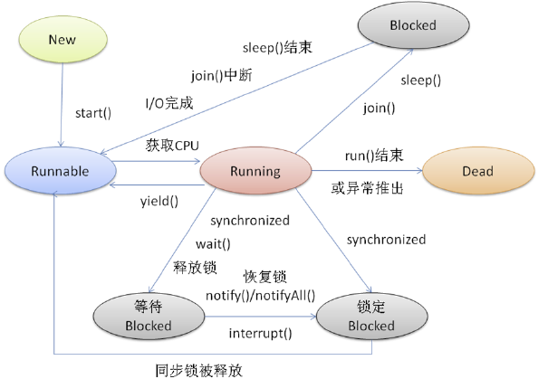

<!-- TOC -->

- [1. java多线程程（一）--线程的状态详解](#1-java多线程程一--线程的状态详解)
    - [1.1. 多线程概述](#11-多线程概述)
        - [1.1.1. 进程](#111-进程)
        - [1.1.2. 线程](#112-线程)
        - [1.1.3. 多线程](#113-多线程)
        - [1.1.4. 多线程的意义](#114-多线程的意义)
        - [1.1.5. 计算机CPU运行原理](#115-计算机cpu运行原理)
- [2. 线程生命周期及五种基本状态](#2-线程生命周期及五种基本状态)
    - [**Java线程具有五种基本状态**](#java线程具有五种基本状态)

<!-- /TOC -->
# 1. java多线程程（一）--线程的状态详解
## 1.1. 多线程概述
### 1.1.1. 进程
* 是一个**正在执行的程序**。是程序在计算机上的一次运行活动。
* **系统以进程为基本单位进行系统资源的调度和分配**。程序要运行，系统就在内存中为该程序分配一块独立的内存空间，载入程序代码和资源进行执行。
* 程序运行期间该内存空间**不能被其他进程直接访问**。

### 1.1.2. 线程
* **进程中的一个独立的控制单元**。线程在控制着进程的执行。只要进程中有一个线程在执行，进程就不会结束。

* **线程是进程内一次具体的执行任务**。程序的执行具体是通过线程来完成的，所以一个进程中至少有一个线程。
* **线程是CPU调度的基本单位**。
* **一个进程可以包含多个线程，这些线程共享数据空间和资源，但又分别拥有各自的<font color=red >执行堆栈和程序计数器</font>。**

  其实HelloWrold 程序中main方法的执行，就是Java虚拟机开启的一个名为“main”的线程来执行程序代码。

### 1.1.3. 多线程
&emsp;&emsp;在java虚拟机启动的时候会有一个java.exe的执行程序，也就是一个进程。该进程中至少有一个线程负责java程序的执行。而且这个线程运行的代码存在于main方法中。该线程称之为**主线程**。JVM启动除了执行一个主线程，还有**负责垃圾回收机制的线程**。像种在一个进程中有多个线程执行的方式，就叫做多线程。

### 1.1.4. 多线程的意义
&emsp;&emsp;多线程的出现能让程序产生同时运行效果。可以提高程序执行效率。  
&emsp;&emsp;比如：一个java程序运行，主线程执行过程生成很多对象，对象调用完成后成了垃圾，导致堆内存出现内存不足的现象。垃圾处理线程就可以帮助处理垃圾，使效率变高！
### 1.1.5. 计算机CPU运行原理
&emsp;&emsp;**在一个时刻，单核的cpu只能运行一个程序。** 而我们看到的同时运行效果，只是cpu在多个进程间做着快速切换动作。
&emsp;&emsp;**多线程的一个特性：随机性.**

# 2. 线程生命周期及五种基本状态
<div align="center"><a></a></div>


## **Java线程具有五种基本状态**
**新建状态（New）**：当线程对象对创建后，即进入了新建状态，如：
```java
Thread t = new MyThread();
```
就绪状态（Runnable）：当调用线程对象的start()方法（t.start();），线程即进入就绪状态。处于就绪状态的线程，只是说明此线程已经做好了准备，随时等待CPU调度执行，并不是说执行了t.start()此线程立即就会执行；

运行状态（Running）：当CPU开始调度处于就绪状态的线程时，此时线程才得以真正执行，即进入到运行状态。注：就绪状态是进入到运行状态的唯一入口，也就是说，线程要想进入运行状态执行，首先必须处于就绪状态中；

阻塞状态（Blocked）：处于运行状态中的线程由于某种原因，暂时放弃对CPU的使用权，停止执行，此时进入阻塞状态，直到其进入到就绪状态，才 有机会再次被CPU调用以进入到运行状态。根据阻塞产生的原因不同，阻塞状态又可以分为三种：

    等待阻塞 -- 运行状态中的线程执行wait()方法，使本线程进入到等待阻塞状态；
    同步阻塞 -- 线程在获取synchronized同步锁失败(因为锁被其它线程所占用)，它会进入同步阻塞状态；
    其他阻塞 -- 通过调用线程的sleep()或join()或发出了I/O请求时，线程会进入到阻塞状态。当sleep()状态超时、join()等待线程终止或者超时、或者I/O处理完毕时，线程重新转入就绪状态。

死亡状态（Dead）：线程执行完了或者因异常退出了run()方法，该线程结束生命周期。


----------------


<font color=red >color=gray</font>
