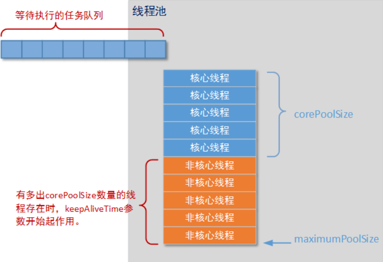

<!-- TOC -->

- [1. 前言](#1-前言)
    - [1.1. 为什么使用线程池？](#11-为什么使用线程池)
    - [1.2. 常见的四种线程池](#12-常见的四种线程池)
- [2. Java中的ThreadPoolExecutor类](#2-java中的threadpoolexecutor类)
    - [2.1. ThreadPoolExecutor类的四个构造方法](#21-threadpoolexecutor类的四个构造方法)
    - [2.2. 核心参数讲解](#22-核心参数讲解)
    - [2.3. ThreadPoolExecutor重要方法](#23-threadpoolexecutor重要方法)
        - [2.3.1. execute()方法](#231-execute方法)
        - [2.3.2. submit()方法](#232-submit方法)
        - [2.3.3. shutdown()和shutdownNow()](#233-shutdown和shutdownnow)
    - [2.4. 线程池的说明](#24-线程池的说明)
- [3. 深入剖析线程池实现原理](#3-深入剖析线程池实现原理)
    - [3.1. 线程池状态](#31-线程池状态)
    - [3.2. 任务的执行](#32-任务的执行)
    - [3.3. 线程池中的线程初始化](#33-线程池中的线程初始化)
    - [3.4. 任务缓存队列及排队策略](#34-任务缓存队列及排队策略)
    - [3.5. 任务拒绝策略](#35-任务拒绝策略)
    - [3.6. 线程池的关闭](#36-线程池的关闭)
- [4. 线程池使用案例](#4-线程池使用案例)
    - [4.1. ThreadPoolExecutor静态方法实现](#41-threadpoolexecutor静态方法实现)
    - [4.2. 几种常见的线程池](#42-几种常见的线程池)
        - [4.2.1. FixedThreadPool - 线程池大小固定，任务队列无界](#421-fixedthreadpool---线程池大小固定任务队列无界)
        - [4.2.2. SingleThreadExecutor - 线程池大小固定为1，任务队列无界](#422-singlethreadexecutor---线程池大小固定为1任务队列无界)
        - [4.2.3. CachedThreadPool - 线程池无限大（MAX INT），等待队列长度为1](#423-cachedthreadpool---线程池无限大max-int等待队列长度为1)
    - [4.3. 三种ExecutorService特性总结](#43-三种executorservice特性总结)
    - [4.4. 如何合理配置线程池的大小](#44-如何合理配置线程池的大小)
- [5. 参考资料](#5-参考资料)

<!-- /TOC -->
# 1. 前言
&emsp;&emsp;池化技术相比大家已经屡见不鲜了，线程池、数据库连接池、Http 连接池等等都是对这个思想的应用。池化技术的思想主要是为了减少每次获取资源的消耗，提高对资源的利用率。

## 1.1. 为什么使用线程池？
&emsp;&emsp;线程池提供了一种限制和管理资源（包括执行一个任务）。每个线程池还维护一些基本统计信息，例如已完成任务的数量。
阿里巴巴Java开发手册里规定：线程资源必须通过线程池提供，不能在应用中自行显式地创建线程。
* 使用线程池的好处：
1. 降低资源消耗。  
通过重复利用已创建的线程**降低线程创建和销毁造成的消耗。** 
2. 提高响应速度。  
当任务到达时，任务可以不需要的等到线程创建就能立即执行。
3. 提高线程的可管理性。线程是稀缺资源，如果无限制的创建，不仅会消耗系统资源，还会降低系统的稳定性，**使用线程池可以进行统一的分配，调优和监控。**
4. 解耦作用
线程的创建与执行完全分开，方便维护。

## 1.2. 常见的四种线程池
Java通过Executors提供四种线程池，分别为：  
* **newCachedThreadPool**  
创建一个可缓存线程池，如果**线程池长度超过需要值，可灵活回收空闲线程，若无可回收，则新建线程。**（线程池大小完全依赖于操作系统（或者说JVM）能够创建的最大线程大小。）  
* **newFixedThreadPool**   
创建一个定长线程池，可控制线程最大并发数，超出的线程会在队列中等待。
* **newScheduledThreadPool**   
创建一个定长线程池，支持定时及周期性任务执行。  
* **newSingleThreadExecutor**   
创建一个单线程化的线程池，它只会用唯一的工作线程来执行任务，保证所有任务按照指定顺序(FIFO, LIFO, 优先级)执行。


# 2. Java中的ThreadPoolExecutor类
## 2.1. ThreadPoolExecutor类的四个构造方法
java.uitl.concurrent.ThreadPoolExecutor类是线程池中最核心的一个类，因此如果要透彻地了解Java中的线程池，必须先了解这个类。下面我们来看一下ThreadPoolExecutor类的具体实现源码。在ThreadPoolExecutor类中提供了四个构造方法：
```java
public class ThreadPoolExecutor extends AbstractExecutorService {
    .....
    public ThreadPoolExecutor(int corePoolSize,int maximumPoolSize,long keepAliveTime,TimeUnit unit,
            BlockingQueue<Runnable> workQueue);
 
    public ThreadPoolExecutor(int corePoolSize,int maximumPoolSize,long keepAliveTime,TimeUnit unit,
            BlockingQueue<Runnable> workQueue,ThreadFactory threadFactory);
 
    public ThreadPoolExecutor(int corePoolSize,int maximumPoolSize,long keepAliveTime,TimeUnit unit,
            BlockingQueue<Runnable> workQueue,RejectedExecutionHandler handler);
 
    public ThreadPoolExecutor(int corePoolSize,int maximumPoolSize,long keepAliveTime,TimeUnit unit,
        BlockingQueue<Runnable> workQueue,ThreadFactory threadFactory,RejectedExecutionHandler handler);
    ...
}
```

从上面的代码可以得知，ThreadPoolExecutor继承了AbstractExecutorService类，并提供了四个构造器，事实上，通过观察每个构造器的源码具体实现，发现前面三个构造器都是调用的第四个构造器进行的初始化工作。

## 2.2. 核心参数讲解
下面解释下一下构造器中各个参数的含义：

* corePoolSize：**核心池的大小**，这个参数跟后面讲述的线程池的实现原理有非常大的关系。在创建了线程池后，**默认情况下，线程池中并没有任何线程，而是等待有任务到来才创建线程去执行任务，除非调用了prestartAllCoreThreads()或者prestartCoreThread()方法**，从这2个方法的名字就可以看出，是**预创建线程**的意思，即在没有任务到来之前就创建corePoolSize个线程或者一个线程。**默认情况下，在创建了线程池后，线程池中的线程数为0**，当有任务来之后，就会创建一个线程去执行任务，**当线程池中的线程数目达到corePoolSize后，就会把到达的任务放到缓存队列当中**；

* maximumPoolSize：**线程池最大线程数**，这个参数也是一个非常重要的参数，它表示在线程池中最多能创建多少个线程；

* keepAliveTime：**表示线程没有任务执行时最多保持多久时间会终止**。**默认情况下，只有当线程池中的线程数大于corePoolSize时，keepAliveTime才会起作用**，如果一个线程空闲的时间达到keepAliveTime，则会终止，直到线程池中的线程数不超过corePoolSize。但是如果调用了allowCoreThreadTimeOut(boolean)方法，在线程池中的线程数不大于corePoolSize时，keepAliveTime参数也会起作用，直到线程池中的线程数为0；

* unit：参数keepAliveTime的时间单位，有7种取值，在TimeUnit类中有7种静态属性：
```java
TimeUnit.DAYS;               //天
TimeUnit.HOURS;             //小时
TimeUnit.MINUTES;           //分钟
TimeUnit.SECONDS;           //秒
TimeUnit.MILLISECONDS;      //毫秒
TimeUnit.MICROSECONDS;      //微妙
TimeUnit.NANOSECONDS;       //纳秒
```

* **workQueue：一个阻塞队列，用来存储等待执行的任务，这个参数的选择也很重要，会对线程池的运行过程产生重大影响**，一般来说，这里的阻塞队列有以下几种选择：
```
ArrayBlockingQueue;
PriorityBlockingQueue;
LinkedBlockingQueue;
SynchronousQueue;
```

ArrayBlockingQueue和PriorityBlockingQueue使用较少，一般使用**LinkedBlockingQueue和Synchronous**。线程池的排队策略与BlockingQueue有关。

* threadFactory：线程工厂，主要用来创建线程；

* handler：表示当拒绝处理任务时的策略，有以下四种取值：
```
ThreadPoolExecutor.AbortPolicy:丢弃任务并抛出RejectedExecutionException异常。 
ThreadPoolExecutor.DiscardPolicy：也是丢弃任务，但是不抛出异常。 
ThreadPoolExecutor.DiscardOldestPolicy：丢弃队列最前面的任务，然后重新尝试执行任务（重复此过程）
ThreadPoolExecutor.CallerRunsPolicy：由调用线程处理该任务
```

<div align="center"></div>

## 2.3. ThreadPoolExecutor重要方法
ThreadPoolExecutor继承了类AbstractExecutorService，ThreadPoolExecutor类中有几个非常重要的方法：
```java
execute()
submit()
shutdown()
shutdownNow()
```
### 2.3.1. execute()方法
execute()方法实际上是Executor中声明的方法，在ThreadPoolExecutor进行了具体的实现，这个方法是ThreadPoolExecutor的核心方法，通过这个方法可以向线程池提交一个任务，交由线程池去执行。
### 2.3.2. submit()方法
　  submit()方法是在ExecutorService中声明的方法，在AbstractExecutorService就已经有了具体的实现，在ThreadPoolExecutor中并没有对其进行重写，这个方法也是用来向线程池提交任务的，但是**submit()和execute()方法不同，它能够返回任务执行的结果**，去看submit()方法的实现，会发现它实际上还是调用的execute()方法，只不过它利用了Future来获取任务执行结果（Future相关内容将在下一篇讲述）。
### 2.3.3. shutdown()和shutdownNow()
　  shutdown()和shutdownNow()是用来关闭线程池的。
* shutdown只是将线程池的状态设置为**SHUTWDOWN状态**，正在执行的任务会继续执行下去，没有被执行的则中断。而shutdownNow则是将线程池的状态设置为**STOP**，正在执行的任务则被停止，没被执行任务的则返回。


还有很多其他的方法，比如：getQueue() 、getPoolSize() 、getActiveCount()、getCompletedTaskCount()等获取与线程池相关属性的方法

## 2.4. 线程池的说明
如果有一个corePoolSize为5，maximumPoolSize为10的线程池，可用下图形象展示：

<div align="center"></div>

这里要说明一下：所谓核心线程非核心线程只是一个数量的说明，并不是说核心线程非核心线程有本质上的不同，它们都是普通的线程而已，并且线程特性都一样，不是说核心线程有特殊标记，线程池能“认”出来这是核心线程，对其有特殊操作。

# 3. 深入剖析线程池实现原理
在上一节我们从宏观上介绍了ThreadPoolExecutor，下面我们来深入解析一下线程池的具体实现原理，将从下面几个方面讲解：  
1. 线程池状态  
2. 任务的执行  
3. 线程池中的线程初始化  
4. 任务缓存队列及排队策略  
5. 任务拒绝策略
6. 线程池的关闭
7. 线程池容量的动态调整
## 3.1. 线程池状态  
在ThreadPoolExecutor中定义了一个volatile变量，另外定义了几个static final变量表示线程池的各个状态：
```java
volatile int runState;
static final int RUNNING    = 0;
static final int SHUTDOWN   = 1;
static final int STOP       = 2;
static final int TERMINATED = 3;
```
runState表示当前线程池的状态，它是一个volatile变量用来保证线程之间的可见性。下面的几个static final变量表示runState可能的几个取值。

当创建线程池后，初始时，线程池处于RUNNING状态；

**如果调用了shutdown()方法，则线程池处于SHUTDOWN状态，此时线程池不能够接受新的任务，它会等待所有任务执行完毕；**

**如果调用了shutdownNow()方法，则线程池处于STOP状态，此时线程池不能接受新的任务，并且会去尝试终止正在执行的任务；**

当线程池处于SHUTDOWN或STOP状态，并且所有工作线程已经销毁，任务缓存队列已经清空或执行结束后，线程池被设置为TERMINATED状态。

## 3.2. 任务的执行
<div align="center"></div>

## 3.3. 线程池中的线程初始化
默认情况下，创建线程池之后，线程池中是没有线程的，需要提交任务之后才会创建线程。在实际中如果需要线程池创建之后立即创建线程，可以通过以下两个方法办到：

* prestartCoreThread()：初始化一个核心线程；

* prestartAllCoreThreads()：初始化所有核心线程

## 3.4. 任务缓存队列及排队策略
在前面我们多次提到了**任务缓存队列，即workQueue，它用来存放等待执行的任务**。**workQueue的类型为BlockingQueue<Runnable>**，通常可以取下面三种类型：

1. **ArrayBlockingQueue：基于数组的先进先出队列**，此队列创建时必须指定大小；
2. **LinkedBlockingQueue：基于链表的先进先出队列**，如果创建时没有指定此队列大小，则默认为Integer.MAX_VALUE；
3. **synchronousQueue：这个队列比较特殊，它不会保存提交的任务，而是将直接新建一个线程来执行新来的任务**。synchronousQueue用得最多。

## 3.5. 任务拒绝策略
当线程池的任务缓存队列已满并且线程池中的线程数目达到maximumPoolSize，如果还有任务到来就会采取任务拒绝策略，通常有以下四种策略：

* ThreadPoolExecutor.AbortPolicy:丢弃任务并抛出RejectedExecutionException异常。
* ThreadPoolExecutor.DiscardPolicy：也是丢弃任务，但是不抛出异常。
* ThreadPoolExecutor.DiscardOldestPolicy：丢弃队列最前面的任务，然后重新尝试执行任务（重复此过程）
* ThreadPoolExecutor.CallerRunsPolicy：由调用线程处理该任务

## 3.6. 线程池的关闭

ThreadPoolExecutor提供了两个方法，用于线程池的关闭，分别是shutdown()和shutdownNow()，其中：

**shutdown()：不会立即终止线程池，而是要等所有任务缓存队列中的任务都执行完后才终止，但再也不会接受新的任务。**

**shutdownNow()：立即终止线程池，并尝试打断正在执行的任务，并且清空任务缓存队列，返回尚未执行的任务。**

# 4. 线程池使用案例
```java
package com.betop.base.threadlearn.threadpool;

import sun.net.www.protocol.http.HttpURLConnection;

import java.util.concurrent.*;

public class ThreadPoolDemo {
    public static void main(String[] args) {
        ThreadPoolExecutor executor = new ThreadPoolExecutor(
                5,// 核心线程池大小,即线程池中的线程数目大于这个参数时，提交的任务会被放进任务缓存队列
                10, // 线程池最大能容忍的线程数
                200, // 线程存活时间
                TimeUnit.MILLISECONDS, //参数keepAliveTime的时间单位
                new ArrayBlockingQueue<Runnable>(5) //任务缓存队列，用来存放等待执行的任务
        );

        for (int i = 0; i < 15; i++) {
            MyTask myTask = new MyTask(i);
            executor.execute(myTask);
            System.out.println("线程池中线程数目：" + executor.getPoolSize() + "，队列中等待执行的任务数目：" +
                    executor.getQueue().size() + "，已执行玩别的任务数目：" + executor.getCompletedTaskCount());
        }

        executor.shutdown();
    }
}
```
2. MyTask.java
```java
package com.betop.base.threadlearn.threadpool;

/**
 * @Author: eastlong
 * @Date 2019/12/1
 * @function:
 **/
public class MyTask implements Runnable{
    private int taskNum;

    public MyTask(int num) {
        this.taskNum = num;
    }

    @Override
    public void run() {
        System.out.println("正在执行task "+taskNum);
        try {
            Thread.currentThread().sleep(4000);
        } catch (InterruptedException e) {
            e.printStackTrace();
        }
        System.out.println("task "+taskNum+"执行完毕");
    }
}

```
3. 执行结果
<details>
<summary>程序运行结果 </summary>

```
正在执行task 0
线程池中线程数目：1，队列中等待执行的任务数目：0，已执行玩别的任务数目：0
线程池中线程数目：2，队列中等待执行的任务数目：0，已执行玩别的任务数目：0
线程池中线程数目：3，队列中等待执行的任务数目：0，已执行玩别的任务数目：0
正在执行task 1
线程池中线程数目：4，队列中等待执行的任务数目：0，已执行玩别的任务数目：0
正在执行task 2
正在执行task 3
线程池中线程数目：5，队列中等待执行的任务数目：0，已执行玩别的任务数目：0
正在执行task 4
线程池中线程数目：5，队列中等待执行的任务数目：1，已执行玩别的任务数目：0
线程池中线程数目：5，队列中等待执行的任务数目：2，已执行玩别的任务数目：0
线程池中线程数目：5，队列中等待执行的任务数目：3，已执行玩别的任务数目：0
线程池中线程数目：5，队列中等待执行的任务数目：4，已执行玩别的任务数目：0
线程池中线程数目：5，队列中等待执行的任务数目：5，已执行玩别的任务数目：0
线程池中线程数目：6，队列中等待执行的任务数目：5，已执行玩别的任务数目：0
正在执行task 10
线程池中线程数目：7，队列中等待执行的任务数目：5，已执行玩别的任务数目：0
正在执行task 11
线程池中线程数目：8，队列中等待执行的任务数目：5，已执行玩别的任务数目：0
正在执行task 12
线程池中线程数目：9，队列中等待执行的任务数目：5，已执行玩别的任务数目：0
正在执行task 13
线程池中线程数目：10，队列中等待执行的任务数目：5，已执行玩别的任务数目：0
正在执行task 14
task 0执行完毕
task 1执行完毕
正在执行task 5
task 3执行完毕
正在执行task 7
task 2执行完毕
正在执行task 8
task 4执行完毕
正在执行task 9
task 10执行完毕
正在执行task 6
task 12执行完毕
task 11执行完毕
task 13执行完毕
task 14执行完毕
task 5执行完毕
task 8执行完毕
task 9执行完毕
task 7执行完毕
task 6执行完毕
```
</details>

4. 结果分析
从执行结果可以看出，当线程池中线程的数目大于5时，便将任务放入任务缓存队列里面，当任务缓存队列满了之后，便创建新的线程。如果上面程序中，将for循环中改成执行20个任务，就会抛出任务拒绝异常了。

## 4.1. ThreadPoolExecutor静态方法实现
不过**在java doc中，并不提倡我们直接使用ThreadPoolExecutor，而是使用Executors类中提供的几个静态方法来创建线程池**：
```java
Executors.newCachedThreadPool();        //创建一个缓冲池，缓冲池容量大小为Integer.MAX_VALUE
Executors.newSingleThreadExecutor();   //创建容量为1的缓冲池
Executors.newFixedThreadPool(int);    //创建固定容量大小的缓冲池
```

* newFixedThreadPool创建的线程池corePoolSize和maximumPoolSize值是相等的，它使用的LinkedBlockingQueue；

* newSingleThreadExecutor将corePoolSize和maximumPoolSize都设置为1，也使用的LinkedBlockingQueue；

* newCachedThreadPool将corePoolSize设置为0，将maximumPoolSize设置为Integer.MAX_VALUE，使用的SynchronousQueue，也就是说来了任务就创建线程运行，当线程空闲超过60秒，就销毁线程。

实际中，如果Executors提供的三个静态方法能满足要求，就尽量使用它提供的三个方法，因为自己去手动配置ThreadPoolExecutor的参数有点麻烦，要根据实际任务的类型和数量来进行配置。

　另外，**如果ThreadPoolExecutor达不到要求，可以自己继承ThreadPoolExecutor类进行重写**。

## 4.2. 几种常见的线程池
Executors 是提供了一组工厂方法用于创建常用的 ExecutorService ，分别是 FixedThreadPool，CachedThreadPool 以及 SingleThreadExecutor。这三种ThreadPoolExecutor都是调用 ThreadPoolExecutor 构造函数进行创建，区别在于参数不同。
### 4.2.1. FixedThreadPool - 线程池大小固定，任务队列无界
```java
public static ExecutorService newFixedThreadPool(int nThreads) {
    return new ThreadPoolExecutor(nThreads, nThreads,
                                  0L, TimeUnit.MILLISECONDS,
                                  new LinkedBlockingQueue<Runnable>());
}
```
可以看到 corePoolSize 和 maximumPoolSize 设置成了相同的值，此时不存在线程数量大于核心线程数量的情况，所以KeepAlive时间设置不会生效。任务队列使用的是不限制大小的 LinkedBlockingQueue ，由于是无界队列所以容纳的任务数量没有上限，因此，FixedThreadPool的行为如下：
1. 从线程池中获取可用线程执行任务，如果没有可用线程则使用ThreadFactory创建新的线程，直到线程数达到nThreads。
2. 线程池线程数达到nThreads以后，新的任务将被放入队列。  
**FixedThreadPool的优点是能够保证所有的任务都被执行，永远不会拒绝新的任务；同时缺点是队列数量没有限制，在任务执行时间无限延长的这种极端情况下会造成内存问题。**

【程序案例】
```java
package com.betop.base.threadlearn.threadpool;

public class MyThread extends Thread{
    private Integer num; // 正在执行的任务数
    public MyThread(Integer num){
        this.num = num;
    }
    @Override
    public void run() {
        System.out.println(Thread.currentThread().getName()+" 正在执行第 "+ num + "个任务");
        try {
            Thread.sleep(500);// 模拟执行任务需要耗时
        } catch (InterruptedException e) {
            // e.printStackTrace(); // 消耗资源，一般不用
        }
        System.out.println(Thread.currentThread().getName()+" 执行完毕第 " + num + "个任务");
    }
}

// ######################################################
package com.betop.base.threadlearn.threadpool;

import java.util.concurrent.ExecutorService;
import java.util.concurrent.Executors;
import java.util.concurrent.ThreadPoolExecutor;

public class FixedThreadExecutorTest {
    public static void main(String[] args) {
        // 创建固定大小的线程池
        ExecutorService executor = Executors.newFixedThreadPool(2);
        ThreadPoolExecutor threadPoolExecutor = (ThreadPoolExecutor) executor;

        for (int i = 1; i <= 5; i++) {
            Thread t = new MyThread(i);
            threadPoolExecutor.execute(t);
            System.out.println("线程池中现在的线程数目是：" +
                    threadPoolExecutor.getPoolSize() + ",  队列中正在等待执行的任务数量为：" +
                    threadPoolExecutor.getQueue().size());
        }
        threadPoolExecutor.shutdown();
    }
}
```

【程序运行结果】
<details>
<summary>程序运行结果 </summary>
```
线程池中现在的线程数目是：1,  队列中正在等待执行的任务数量为：0
pool-1-thread-1 正在执行第 1个任务
线程池中现在的线程数目是：2,  队列中正在等待执行的任务数量为：0
线程池中现在的线程数目是：2,  队列中正在等待执行的任务数量为：1
线程池中现在的线程数目是：2,  队列中正在等待执行的任务数量为：2
pool-1-thread-2 正在执行第 2个任务
线程池中现在的线程数目是：2,  队列中正在等待执行的任务数量为：3
pool-1-thread-1 执行完毕第 1个任务
pool-1-thread-2 执行完毕第 2个任务
pool-1-thread-2 正在执行第 3个任务
pool-1-thread-1 正在执行第 4个任务
pool-1-thread-1 执行完毕第 4个任务
pool-1-thread-2 执行完毕第 3个任务
pool-1-thread-1 正在执行第 5个任务
pool-1-thread-1 执行完毕第 5个任务
```
</details>

### 4.2.2. SingleThreadExecutor - 线程池大小固定为1，任务队列无界
```java
public static ExecutorService newSingleThreadExecutor() {
    return new FinalizableDelegatedExecutorService
        (new ThreadPoolExecutor(1, 1,
                                0L, TimeUnit.MILLISECONDS,
                                new LinkedBlockingQueue<Runnable>()));
}
```

  这个工厂方法中使用无界LinkedBlockingQueue，并且将线程数设置成1，除此以外还使用FinalizableDelegatedExecutorService类进行了包装。这个包装类的主要目的是为了屏蔽ThreadPoolExecutor中动态修改线程数量的功能，仅保留ExecutorService中提供的方法。**虽然是单线程处理，一旦线程因为处理异常等原因终止的时候，ThreadPoolExecutor会自动创建一个新的线程继续进行工作。**

<div align="center"></div>

**SingleThreadExecutor 适用于在逻辑上需要单线程处理任务的场景，同时无界的LinkedBlockingQueue保证新任务都能够放入队列，不会被拒绝；缺点和FixedThreadPool相同，当处理任务无限等待的时候会造成内存问题。**
【程序案例】
```java
public class SingleThreadExecutorTest {
    public static void main(String[] args) {
        ExecutorService executor = Executors.newSingleThreadExecutor();

        for(int i=1;i<=5;i++){
            Thread t = new MyThread(i);
            executor.execute(t);
        }
        //关闭线程池
        executor.shutdown();
    }
}
```

<details>
<summary>运行结果    </summary>

```
pool-1-thread-1 正在执行第 1个任务
pool-1-thread-1 执行完毕第 1个任务
pool-1-thread-1 正在执行第 2个任务
pool-1-thread-1 执行完毕第 2个任务
pool-1-thread-1 正在执行第 3个任务
pool-1-thread-1 执行完毕第 3个任务
pool-1-thread-1 正在执行第 4个任务
pool-1-thread-1 执行完毕第 4个任务
pool-1-thread-1 正在执行第 5个任务
pool-1-thread-1 执行完毕第 5个任务
```
</details>

### 4.2.3. CachedThreadPool - 线程池无限大（MAX INT），等待队列长度为1
```java
public static ExecutorService newCachedThreadPool() {
    return new ThreadPoolExecutor(0, Integer.MAX_VALUE,
                                  60L, TimeUnit.SECONDS,
                                  new SynchronousQueue<Runnable>());
}
```
**SynchronousQueue是一个只有1个元素的队列，入队的任务需要一直等待直到队列中的元素被移出。核心线程数是0，意味着所有任务会先入队列；最大线程数是Integer.MAX_VALUE，可以认为线程数量是没有限制的。**KeepAlive时间被设置成60秒，意味着在没有任务的时候线程等待60秒以后退出。**CachedThreadPool对任务的处理策略是提交的任务会立即分配一个线程进行执行，线程池中线程数量会随着任务数的变化自动扩张和缩减，在任务执行时间无限延长的极端情况下会创建过多的线程。**  
【程序案例】
```java
public class CachedThreadExecutorTest {
    public static void main(String[] args) {
        //创建一个可缓存的线程池
        ExecutorService executor = Executors.newCachedThreadPool();
        ThreadPoolExecutor threadPoolExecutor = (ThreadPoolExecutor) executor;

        for(int i = 1; i <= 5; i++) {
            Thread t = new MyThread(i);
            //将线程放到池中执行
            threadPoolExecutor.execute(t);
            System.out.println("线程池中现在的线程数目是："+threadPoolExecutor.getPoolSize()+",  队列中正在等待执行的任务数量为："+
                    threadPoolExecutor.getQueue().size());
        }

        //关闭线程池
        threadPoolExecutor.shutdown();
    }
}
```

<details>
<summary>程序执行结果 </summary>

```java
线程池中现在的线程数目是：1,  队列中正在等待执行的任务数量为：0
pool-1-thread-1 正在执行第 1个任务
线程池中现在的线程数目是：2,  队列中正在等待执行的任务数量为：0
pool-1-thread-2 正在执行第 2个任务
线程池中现在的线程数目是：3,  队列中正在等待执行的任务数量为：0
线程池中现在的线程数目是：4,  队列中正在等待执行的任务数量为：0
pool-1-thread-3 正在执行第 3个任务
线程池中现在的线程数目是：5,  队列中正在等待执行的任务数量为：0
pool-1-thread-4 正在执行第 4个任务
pool-1-thread-5 正在执行第 5个任务
pool-1-thread-1 执行完毕第 1个任务
pool-1-thread-4 执行完毕第 4个任务
pool-1-thread-5 执行完毕第 5个任务
pool-1-thread-3 执行完毕第 3个任务
pool-1-thread-2 执行完毕第 2个任务
```
</details>

## 4.3. 三种ExecutorService特性总结
<div align="center"></div>

## 4.4. 如何合理配置线程池的大小
一般需要根据任务的类型来配置线程池大小：如果是CPU密集型任务，就需要尽量压榨CPU，参考值可以设为 NCPU+1。如果是IO密集型任务，参考值可以设置为2*NCPU。当然，这只是一个参考值，具体的设置还需要根据实际情况进行调整，比如可以先将线程池大小设置为参考值，再观察任务运行情况和系统负载、资源利用率来进行适当调整。


# 5. 参考资料
[1. Java并发编程：线程池的使用](https://www.cnblogs.com/xiaoxi/p/7692250.html)  
[2. 新手也能看懂的线程池学习总结](https://mp.weixin.qq.com/s/HCwCJw5CCDsue6H5XHfO0g)


