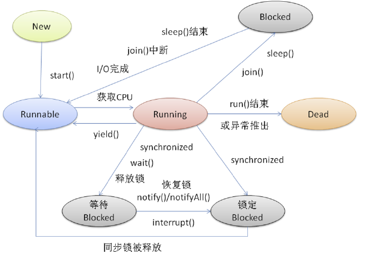

# 线程的创建
## 基本概念  
1.什么是线程：线程是一条执行路径，每个线程互不影响  
2.多线程：一个进程中，有多条不同的执行路径，并行执行，目的为了提升程序效率  
3.一个进程中，一定会有主线程  
4.线程分类：用户线程、守护线程  
5. 主线程、子线程、GC线程  
## 继承Thread类
```java
class ThreadDemo01 extends Thread {

    @Override
    public void run() {
        for (int i = 0; i < 10; i++) {
            System.out.println("子线程...i:" + i);
        }
    }
}

public class Thread001 {
    public static void main(String[] args) {
        System.out.println("main...主线程开始...");
        //1.启动线程
        ThreadDemo01 threadDemo01 = new ThreadDemo01();
        //2.启动
        threadDemo01.start();
        for (int i = 0; i < 10; i++) {
            System.out.println("main...i:" + i);
        }
        System.out.println("main...主线程结束...");

    }
}
```


【程序结果】


<details>
<summary>程序运行结果 </summary>

```
main...主线程开始...
main...i:0
main...i:1
main...i:2
main...i:3
main...i:4
main...i:5
main...i:6
main...i:7
main...i:8
main...i:9
main...主线程结束...
子线程...i:0
子线程...i:1
子线程...i:2
子线程...i:3
子线程...i:4
子线程...i:5
子线程...i:6
子线程...i:7
子线程...i:8
子线程...i:9
```
</details>

【同步和异步的概念】

* 同步
    * 单线程特征：代码从上到下执行，顺序执行
    * 同步概念：代码从上到下执行

* 异步 -- 采用多线程
    * 新的一条执行路径，不会影响其他线程
    * **多线程包含异步的概念。**

不推荐使用

## 实现Runnable类
```java
class ThreadDemo02 implements Runnable{

    @Override
    public void run() {
        for(int i = 0;i < 10; i++){
            System.out.println("子 i...:" + i);
        }
    }
}

public class Demo02 {
    public static void main(String[] args) {
        System.out.println("main .. 主线程开始");
        ThreadDemo02 threadDemo02 = new ThreadDemo02();
        Thread t1 = new Thread(threadDemo02);
        t1.start();
        for(int i = 0; i<10; i++){
            System.out.println("main.. i:" + i);
        }
        System.out.println("main .. 主线程结束");
    }
}
```

<details>
<summary>程序结果 </summary>

```
main .. 主线程开始
main.. i:0
main.. i:1
main.. i:2
main.. i:3
main.. i:4
main.. i:5
main.. i:6
main.. i:7
main.. i:8
main.. i:9
main .. 主线程结束
子 i...:0
子 i...:1
子 i...:2
子 i...:3
子 i...:4
子 i...:5
子 i...:6
子 i...:7
子 i...:8
子 i...:9
```
</details>


## 匿名内部类创建线程

```java
public class Demo03 {
    public static void main(String[] args) {
        System.out.println("main .. 主线程开始");
        Thread t1 = new Thread(new Runnable() {
            @Override
            public void run() {
                for (int i = 0; i < 10; i++){
                    System.out.println("子...i:" + i);
                }
            }
        });
        t1.start();
        for(int i = 0; i<10; i++){
            System.out.println("main.. i:" + i);
        }
        System.out.println("main .. 主线程结束");
    }
}
```

<details>
<summary>程序结果 </summary>

```
main .. 主线程开始
main.. i:0
main.. i:1
main.. i:2
main.. i:3
main.. i:4
main.. i:5
main.. i:6
main.. i:7
main.. i:8
main.. i:9
main .. 主线程结束
子 i...:0
子 i...:1
子 i...:2
子 i...:3
子 i...:4
子 i...:5
子 i...:6
子 i...:7
子 i...:8
子 i...:9
```
</details>

# 多线程的五种状态
<div align="center"><a></a></div>

线程包括5种状态：
1.new（新建状态）：线程对象被创建后，就会进入新建状态。如：Thread thread = new Thread().
（通俗说：一个thread少女长大成人）

2.Runnable(就绪状态)：就绪状态也叫可执行状态。当线程被创建后，调用start方法后（thread.start()），该线程就进入了就绪状态，等待CPU调度使用。
（通俗说：thread少女被start公公选为秀女，从此就是thread秀女等待被CPU皇帝宠幸）

3.Running（运行状态）:当线程获取到CPU的使用权时，即进入了运行状态。注：运行状态只能从就绪状态转化而来
（通俗说：thread秀女被CPU皇帝宠幸了，变成了thread妃子）

4.Blocked（阻塞转态）：阻塞状态是线程由于某些原因放弃了CPU使用权，暂时停止运行的一种状态。直到线程进入就绪状态，才有机会转到运行状态。阻塞的情况可以分为三种：
（通俗说：thread妃子因为某些原因不想或不能被CPU皇帝所宠幸）
（1）wait(等待阻塞)：线程调用wait()方法，让线程等待某工作的完成
（通俗说：thread妃子要先做其他的事情，让CPU皇帝去宠幸其他妃子）

（2）synchronized（同步阻塞）：线程在获取同步锁（synchronized）失败，即锁被其他线程占用，它就会进入同步阻塞状态。（通俗说：CPU皇帝在宠幸其他妃子）

（3）其他阻塞:当线程调用sleep()，join()或者发出I/O请求的时候，线程就会进入阻塞转态。当sleep，join方法等线程终止、或者超时、或者I/O处理完毕时，线程就会重新进入就绪状态。
（通俗说：thread妃子在睡觉、threa妃子不想被宠幸、thread妃子要忙一件要花费很久的事情，让CPU皇帝先宠幸其他妃子）

5.Dead（死亡状态）：线程执行完或者异常退出了run方法，该线程结束生命周期。

## join的作用
在某些情况下，主线程创建并启动了子线程，如果子线程中需要进行大量的耗时运算，主线程往往将早于子线程结束之前结束，如果主线程想等待子线程执行完毕后，获得子线程中的处理完的某个数据，就要用到join方法了，方法join（）的作用是**等待线程对象被销毁。**


