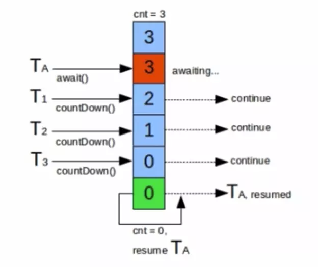

并发编程：CountDownLatch

在 java 1.5 中，提供了一些非常有用的辅助类来帮助我们进行并发编程，比如 CountDownLatch，CyclicBarrier和 Semaphore。
# CountDownLatch 用法


CountDownLatch 类位于 java.util.concurrent 包下，CountDownLatch 英文意为**倒计时器**，Latch 为门闩的意思。如果翻译成倒计数门闩，表示：把门锁起来，不让里面的线程跑出来。因此这个类用来**控制线程等待，可以让某个线程等待直到倒计时结束，再开始执行。**  

计数器的值为 3，线程 A 调用了 await() 之后，线程 A 就进入了等待状态，对其他线程每次执行 countDown() 方法时，计数器就会执行减 1 操作，当计数减为 0 时，线程 A 继续执行。
<div align="center"></div>

CountDownLatch 类只提供了一个构造器：
```java
public CountDownLatch(int count) {  };  //参数count为计数值
```
然后下面这 3 个方法是 CountDownLatch 类中最重要的方法：
```java
// 调用await()方法的线程会被挂起，它会等待直到count值为0才继续执行
public void await() throws InterruptedException { };   
// 和await()类似，只不过等待一定的时间后count值还没变为0的话就会继续执行
public boolean await(long timeout, TimeUnit unit) throws InterruptedException { };  
// 将count值减1
public void countDown() { };  
```

【案例分析】
```java
package com.eastlong.threadlearn.assist;

import java.util.concurrent.CountDownLatch;

/**
 * @function: CountDownLatch类的用法
 * @author: xiaolong_wu
 * Created at 2020/01/03
 **/
public class CountDownLatchTest {
    public static void main(String[] args) {
        CountDownLatch latch = new CountDownLatch(2);

        new Thread(){
            public void run(){
                System.out.println(Thread.currentThread().getName()+ " 正在执行");
                try {
                    Thread.sleep(200);
                    System.out.println(Thread.currentThread().getName()+ " 执行完毕");
                    latch.countDown();
                } catch (InterruptedException e) {
                    // e.printStackTrace();
                }
            };
        }.start();

        new Thread(){
            public void run() {
                try {
                    System.out.println(Thread.currentThread().getName()+" 正在执行");
                    Thread.sleep(2000);
                    System.out.println(Thread.currentThread().getName()+" 执行完毕");
                    latch.countDown();
                } catch (InterruptedException e) {
                    e.printStackTrace();
                }
            };
        }.start();

        try {
            Thread.sleep(10);
            System.out.println("等待2个子线程执行完毕...");
            latch.await();
            System.out.println("2个子线程已经执行完毕");
            System.out.println("继续执行主线程");
        } catch (InterruptedException e) {
            // e.printStackTrace();
        }
    }
}
```
【程序结果】
```
Thread-0 正在执行
Thread-1 正在执行
等待2个子线程执行完毕...
Thread-0 执行完毕
Thread-1 执行完毕
2个子线程已经执行完毕
继续执行主线程
```

# 参考资料
[Java并发编程：CountDownLatch、CyclicBarrier和Semaphore](https://www.cnblogs.com/dolphin0520/p/3920397.html)
https://www.jianshu.com/p/e80043ac4115


