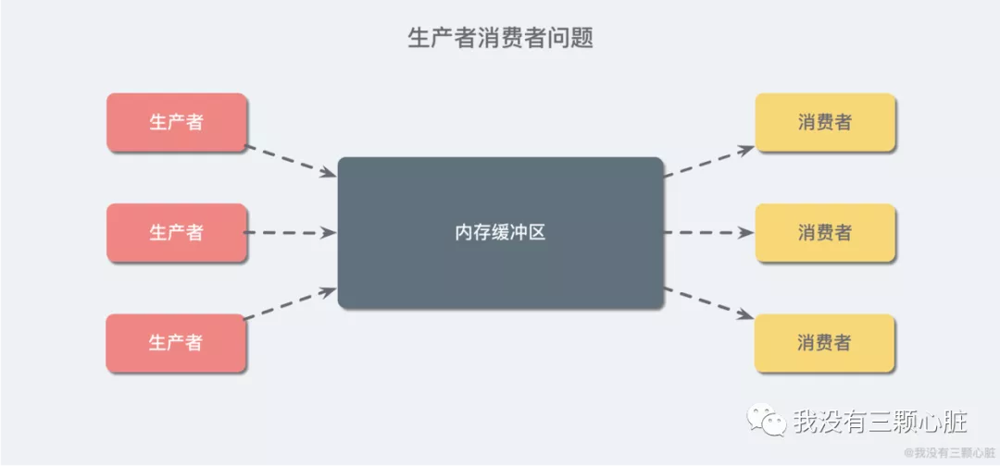
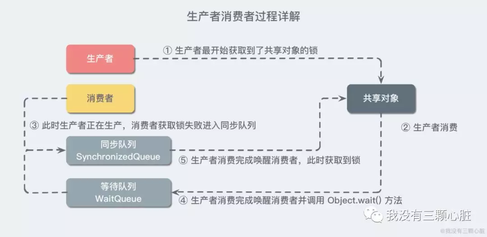

**并发编程学习:线程通信详解**
<!-- TOC -->

- [1. 经典的生产者消费者案例](#1-经典的生产者消费者案例)
    - [1.1. 生产者消费者案例概述](#11-生产者消费者案例概述)
    - [1.2. 准备基础代码：无通信的生产者消费者](#12-准备基础代码无通信的生产者消费者)
    - [1.3. 分析出现问题的原因](#13-分析出现问题的原因)
    - [1.4. 解决出现的问题](#14-解决出现的问题)
        - [1.4.1. 加锁解决性别紊乱](#141-加锁解决性别紊乱)
        - [1.4.2. 等待唤醒机制解决重复消费](#142-等待唤醒机制解决重复消费)
    - [1.5. 小结](#15-小结)

<!-- /TOC -->
# 1. 经典的生产者消费者案例
<div align="center"></div>

## 1.1. 生产者消费者案例概述
**生产者消费者问题**（英语：Producer-consumer problem）就是典型的**多线程同步案例**，它也被称为**有限缓冲问题**（英语：Bounded-buffer problem）。该问题描述了共享固定大小缓冲区的两个线程——即所谓的“生产者”和“消费者”——在实际运行时会发生的问题。生产者的主要作用是生成一定量的数据放到缓冲区中，然后重复此过程。与此同时，消费者也在缓冲区消耗这些数据。**该问题的关键就是要保证生产者不会在缓冲区满时加入数据，消费者也不会在缓冲区中空时消耗数据**。

* 注意：**生产者-消费者模式中的内存缓存区的主要功能是数据在多线程间的共享，此外，通过该缓冲区，可以缓解生产者和消费者的性能差**；

## 1.2. 准备基础代码：无通信的生产者消费者
我们来自己编写一个例子：一个生产者，一个消费者，并且让他们让他们使用同一个共享资源，并且我们期望的是生产者生产一条放到共享资源中，消费者就会对应地消费一条。

1. 我们先来模拟一个简单的共享资源对象：
```java
public class ShareResource {

    private String name;
    private String gender;

    /**
     * 模拟生产者向共享资源对象中存储数据
     *
     * @param name
     * @param gender
     */
    public void push(String name, String gender) {
        this.name = name;
        this.gender = gender;
    }

    /**
     * 模拟消费者从共享资源中取出数据
     */
    public void popup() {
        System.out.println(this.name + "-" + this.gender);
    }
}
```

2. 然后来编写我们的生产者，使用循环来交替地向共享资源中添加不同的数据：
```java
public class Producer implements Runnable {

    private ShareResource shareResource;

    public Producer(ShareResource shareResource) {
        this.shareResource = shareResource;
    }

    @Override
    public void run() {
        for (int i = 0; i < 50; i++) {
            if (i % 2 == 0) {
                shareResource.push("凤姐", "女");
            } else {
                shareResource.push("张三", "男");
            }
        }
    }
}
```
3. 接着让我们的消费者不停地消费生产者产生的数据：
```java
public class Consumer implements Runnable {

    private ShareResource shareResource;

    public Consumer(ShareResource shareResource) {
        this.shareResource = shareResource;
    }

    @Override
    public void run() {
        for (int i = 0; i < 50; i++) {
            shareResource.popup();
        }
    }
}
```

4. 然后我们写一段测试代码，来看看效果：
```java
public static void main(String[] args) {
    // 创建生产者和消费者的共享资源对象
    ShareResource shareResource = new ShareResource();
    // 启动生产者线程
    new Thread(new Producer(shareResource)).start();
    // 启动消费者线程
    new Thread(new Consumer(shareResource)).start();
}
```

5. 我们运行发现出现了诡异的现象，所有的生产者都似乎消费到了同一条数据：
```
张三-男
张三-男
....以下全是张三-男....
```
为什么会出现这样的情况呢？照理说，我的生产者在交替地向共享资源中生产数据，消费者也应该交替消费才对呀..我们大胆猜测一下，会不会是因为消费者是直接循环了 30 次打印共享资源中的数据，而此时生产者还没有来得及更新共享资源中的数据，消费者就已经连续打印了 30 次了，所以我们让消费者消费的时候以及生产者生产的时候都小睡个 10 ms 来缓解消费太快 or 生产太快带来的影响，也让现象更明显一些：

```java
/**
 * 模拟生产者向共享资源对象中存储数据
 *
 * @param name
 * @param gender
 */
public void push(String name, String gender) {
    try {
        Thread.sleep(10);
    } catch (InterruptedException ignored) {
    }
    this.name = name;
    this.gender = gender;
}

/**
 * 模拟消费者从共享资源中取出数据
 */
public void popup() {
    try {
        Thread.sleep(10);
    } catch (InterruptedException ignored) {
    }
    System.out.println(this.name + "-" + this.gender);
}
```
再次运行代码，发现了出现了以下的几种情况：

* **重复消费**：消费者连续地出现两次相同的消费情况（张三-男/ 张三-男）；
* **性别紊乱**：消费者消费到了脏数据（张三-女/ 凤姐-男）；

## 1.3. 分析出现问题的原因
* **重复消费**：我们先来看看重复消费的问题，当生产者生产出一条数据的时候，消费者正确地消费了一条，但是当消费者再来共享资源中消费的时候，生产者还没有准备好新的一条数据，所以消费者就又消费到老数据了，这其中的根本原因是**生产者和消费者的速率不一致**。

* **性别紊乱**：再来分析第二种情况。不同于上面的情况，消费者在消费第二条数据时，生产者也正在生产新的数据，但是尴尬的是，生产者只生产了一半儿（也就是该执行完 this.name = name），也就是还没有来得及给 gender 赋值就被消费者给取走消费了.. 造成这样情况的根本原因是**没有保证生产者生产数据的原子性**。

## 1.4. 解决出现的问题
### 1.4.1. 加锁解决性别紊乱
我们先来解决性别紊乱，也就是**原子性**的问题吧，对于这样的原子性操作，解决方法也很简单：加锁。稍微改造一下就好了：
```java
/**
 * 模拟生产者向共享资源对象中存储数据
 *
 * @param name
 * @param gender
 */
synchronized public void push(String name, String gender) {
    this.name = name;
    try {
        Thread.sleep(10);
    } catch (InterruptedException ignored) {
    }
    this.gender = gender;
}

/**
 * 模拟消费者从共享资源中取出数据
 */
synchronized public void popup() {
    try {
        Thread.sleep(10);
    } catch (InterruptedException ignored) {
    }
    System.out.println(this.name + "-" + this.gender);
}
```
【解析】
* 我们在方法前面都加上了 **synchronized** 关键字，来保证每一次读取和修改都只能是一个线程，这是因为当 synchronized 修饰在普通同步方法上时，它会**自动锁住当前实例对象**，也就是说这样改造之后读/ 写操作同时只能进行其一；
* 我把 push 方法sleep的代码改在了赋值 name 和 gender 的中间，以强化验证原子性操作是否成功，因为如果不是原子性的话，就很可能出现赋值 name 还没赋值给 gender 就被取走的情况，小睡一会儿是为了加强这种情况的出现概率（可以试着把 synchronized 去掉看看效果）；

运行代码后发现，并没有出现性别紊乱的现象了，但是重复消费仍然存在。

### 1.4.2. 等待唤醒机制解决重复消费
我们期望的是 `张三-男` 和 `凤姐-女` 交替出现，而不是有重复消费的情况，所以我们的生产者和消费者之间需要一点沟通，最容易想到的解决方法是，我们新增加一个标志位，然后在消费者中使用 while 循环判断，不满足条件则不消费，条件满足则退出 while 循环，从而完成消费者的工作。

```java
while (value != desire) {
    Thread.sleep(10);
}
doSomething();
```

这样做的目的就是为了防止**过快的无效尝试**，这种方法看似能够实现所需的功能，但是却存在如下的问题：

1）**难以确保及时性**。在睡眠时，基本不消耗处理器的资源，但是如果睡得过久，就不能及时发现条件已经变化，也就是及时性难以保证；   
2）**难以降低开销**。如果降低睡眠的时间，比如休眠 1 毫秒，这样消费者能够更加迅速地发现条件变化，但是却可能消耗更多的处理资源，造成了无端的浪费。

以上两个问题吗，看似矛盾难以调和，但是 Java 通过内置的等待/ 通知机制能够很好地解决这个矛盾并实现所需的功能。

**等待/ 通知机制**，是指一个线程 A 调用了对象 O 的 wait() 方法进入等待状态，而另一个线程 B 调用了对象 O 的 notifyAll() 方法，线程 A 收到通知后从对象 O 的 wait() 方法返回，进而执行后续操作。上述两个线程都是通过对象 O 来完成交互的，而**对象上的 wait 和 notify/ notifyAll 的关系就如同开关信号一样，用来完成等待方和通知方之间的交互工作。**

好，简单介绍完等待/ 通知机制，我们开始改造吧：

```java
public class ShareResource {

    private String name;
    private String gender;
    // 新增加一个标志位，表示共享资源是否为空，默认为 true
    private boolean isEmpty = true;

    /**
     * 模拟生产者向共享资源对象中存储数据
     *
     * @param name
     * @param gender
     */
    synchronized public void push(String name, String gender) {
        try {
            while (!isEmpty) {
                // 当前共享资源不为空的时，则等待消费者来消费
                // 使用同步锁对象来调用，表示当前线程释放同步锁，进入等待池，只能被其他线程所唤醒
                this.wait();
            }
            // 开始生产
            this.name = name;
            Thread.sleep(10);
            this.gender = gender;
            // 生产结束
            isEmpty = false;
            // 生产结束唤醒一个消费者来消费
            this.notify();
        } catch (Exception ignored) {
        }
    }

    /**
     * 模拟消费者从共享资源中取出数据
     */
    synchronized public void popup() {
        try {
            while (isEmpty) {
                // 为空则等着生产者进行生产
                // 使用同步锁对象来调用，表示当前线程释放同步锁，进入等待池，只能被其他线程所唤醒
                this.wait();
            }
            // 消费开始
            Thread.sleep(10);
            System.out.println(this.name + "-" + this.gender);
            // 消费结束
            isEmpty = true;
            // 消费结束唤醒一个生产者去生产
            this.notify();
        } catch (InterruptedException ignored) {
        }
    }
}
```

* 我们期望生产者生产一条，然后就去通知消费者消费一条，那么在生产和消费之前，都需要考虑当前是否需要生产 or 消费，所以我们新增了一个标志位来判断，如果不满足则等待；
* 被通知后仍然要检查条件，条件满足，则执行我们相应的生产 or 消费的逻辑，然后改变条件（这里是 `isEmpty`），并且通知所有等待在对象上的线程；
* 注意：上面的代码中通知使用的 notify() 方法，这是因为例子中写死了只有一个消费者和生产者，在实际情况中建议还是使用 **notifyAll()** 方法，这样多个消费和生产者逻辑也能够保证（可以自己试一下）；

## 1.5. 小结
通过初始版本一步步地分析问题和解决问题，我们就差不多写出了我们经典生产者消费者的经典代码，但通常消费和生产的逻辑是写在各自的消费者和生产者代码里的，这里我为了方便阅读，把他们都抽离到了共享资源上，我们可以简单地再来回顾一下这个消费生产和等待通知的整个过程：
<div align="center"></div>
