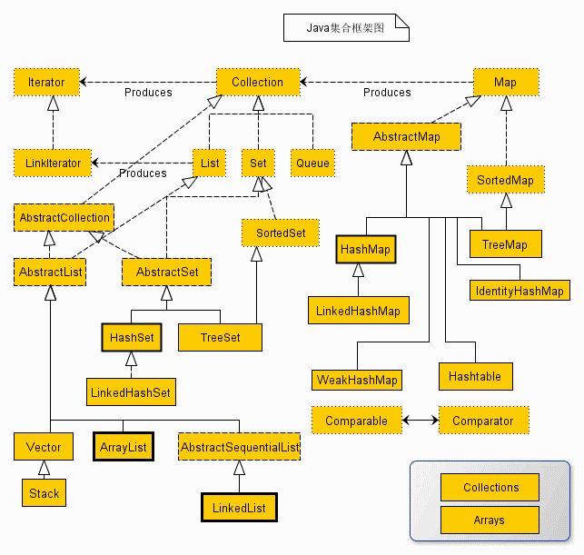
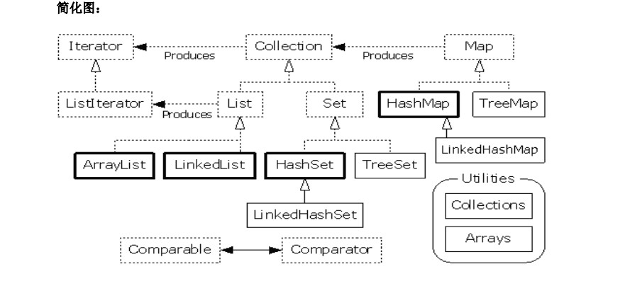
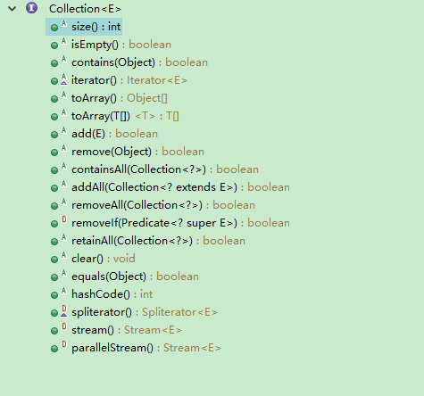
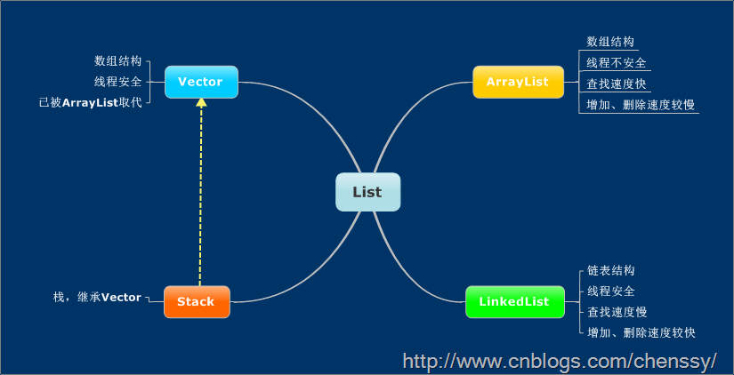
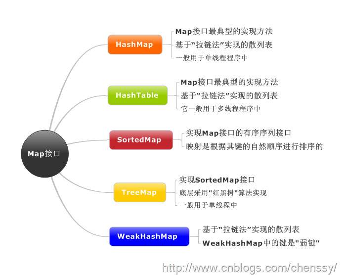

<center>集合框架</center>

[【参考文档】](https://www.cnblogs.com/xiaoxi/p/6089984.html)  
<!-- TOC -->

- [1. 集合概述](#1-集合概述)
- [2. 总体分析](#2-总体分析)
- [3. Collection接口](#3-collection接口)
- [4. List](#4-list)
- [5. Set接口](#5-set接口)
- [6. Map接口](#6-map接口)
    - [6.1. HashMap](#61-hashmap)
    - [6.2. LinkedHashMap](#62-linkedhashmap)
    - [6.3. TreeMap](#63-treemap)

<!-- /TOC -->

java集合详解
# 1. 集合概述
集合框架图
<div align="center"><a></a></div>

集合简化图
<div align="center"><a></a></div>

1. 所有集合类都位于**java.util**包下。Java的集合类主要由两个接口派生而出：**Collection和Map，Collection和Map是Java集合框架的根接口**。
2. Collection 接口是一组允许重复的对象。
    * Set 接口继承 Collection，集合元素不重复。
    * List 接口继承 Collection，允许重复，维护元素插入顺序。  
3. Map接口是键－值对象，与Collection接口没有什么关系。  
4. Set、List和Map可以看做集合的三大类：
    * List集合是**有序集合**，集合中的元素**可以重复**，访问集合中的元素可以根据元素的**索引**来访问。  
    * Set集合是**无序集合**，集合中的元素**不可以重复**，访问集合中的元素只能**根据元素本身**来访问（也是集合里元素不允许重复的原因）。  
    * Map集合中保存Key-value对形式的元素，访问时只能根据每项元素的key来访问其value。
# 2. 总体分析
<div align="center"><a></a></div>
大致说明：
看上面的框架图，先抓住它的主干，即Collection和Map。

1、Collection是一个接口，是高度抽象出来的集合，它包含了集合的基本操作和属性。Collection包含了List和Set两大分支。  
（1）List是一个**有序的队列**，每一个元素都有它的索引。第一个元素的索引值是0。List的实现类有**LinkedList, ArrayList, Vector, Stack**。  
（2）Set是一个不允许有重复元素的集合。Set的实现类有HastSet和TreeSet。HashSet依赖于HashMap，它实际上是通过HashMap实现的；TreeSet依赖于TreeMap，它实际上是通过TreeMap实现的。  
2、Map是一个映射接口，即key-value键值对。Map中的每一个元素包含“一个key”和“key对应的value”。AbstractMap是个抽象类，它实现了Map接口中的大部分API。而HashMap，TreeMap，WeakHashMap都是继承于AbstractMap。Hashtable虽然继承于Dictionary，但它实现了Map接口。  
3、接下来，再看Iterator。它是遍历集合的工具，即我们通常通过Iterator迭代器来遍历集合。我们说Collection依赖于Iterator，是因为Collection的实现类都要实现iterator()函数，返回一个Iterator对象。ListIterator是专门为遍历List而存在的。  
4、再看Enumeration，它是JDK 1.0引入的抽象类。作用和Iterator一样，也是遍历集合；但是Enumeration的功能要比Iterator少。在上面的框图中，Enumeration只能在Hashtable, Vector, Stack中使用。  
5、最后，看**Arrays和Collections。它们是操作数组、集合的两个工具类**。
# 3. Collection接口
Collection接口是处理**对象集合**的根接口，其中定义了很多对元素进行操作的方法。**Collection接口有两个主要的子接口List和Set，注意Map不是Collection的子接口，这个要牢记**。
<div align="center"><a></a></div>

# 4. List  
**List集合代表一个有序集合，集合中每个元素都有其对应的顺序索引。List集合允许使用重复元素，可以通过索引来访问指定位置的集合元素。**  
List所代表的是**有序的Collection**.  
**（1）ArrayList  --动态数组；允许元素为null；初始容量；扩容机制；擅长随机访问；非同步** 
ArrayList是一个动态数组，它允许任何符合规则的元素插入甚至包括null。每一个ArrayList都有一个初始容量（10），该容量代表了数组的大小。随着容器中的元素不断增加，容器的大小也会随着增加。在每次向容器中增加元素的同时都会进行容量检查，当快溢出时，就会进行扩容操作。所以如果我们明确所插入元素的多少，最好指定一个初始容量值，避免过多的进行扩容操作而浪费时间、效率。  
 ArrayList擅长于随机访问。同时ArrayList是非同步的  
**（2）LinkedList  --双向链表；擅长插入删除；非同步**  
* LinkedList是一个双向链表。所以它除了有ArrayList的基本操作方法外还额外提供了get，remove，insert方法在LinkedList的首部或尾部。
* LinkedList不能随机访问，它所有的操作都是要按照**双重链表**的需要执行。在列表中索引的操作将从开头或结尾遍历列表（从靠近指定索引的一端）。这样做的好处就是可以通过较低的代价在List中进行插入和删除操作。
* LinkedList也是非同步的。如果多个线程同时访问一个List，则必须自己实现访问同步。一种解决方法是在创建List时构造一个同步的List： 
    ```java
    List list = Collections.synchronizedList(new LinkedList(...));
    ```
**（3）Vector  --Vector是线程安全的动态数组**  
与ArrayList相似，但是Vector是同步的。所以说Vector是线程安全的动态数组。它的操作与ArrayList几乎一样。
**（4）Stack --Stack继承自Vector，实现一个后进先出的堆栈。**  
 Stack继承自Vector，实现一个后进先出的堆栈。Stack提供5个额外的方法使得Vector得以被当作堆栈使用。基本的push和pop 方法，还有peek方法得到栈顶的元素，empty方法测试堆栈是否为空，search方法检测一个元素在堆栈中的位置。Stack刚创建后是空栈。

 <div align="center"><a></a></div>

# 5. Set接口
* Set是一种不包括重复元素的Collection。无法随机访问。仅允许一个null元素存在。
* Set接口有三个具体实现类，分别是散列集HashSet、链式散列集LinkedHashSet和树形集TreeSet。 
* Set最多有一个null元素。需要注意的是:虽然Set中元素没有顺序，但是元素在set中的位置是由该元素的**HashCode**决定的，其具体位置其实是固定的。  
（1）HashSet
    * HashSet 是一个没有重复元素的集合,由HashMap实现的，不保证元素的顺序，仅允许一个null 元素;
    * HashSet是非同步的; 
    * HashSet按Hash算法来存储集合的元素，因此具有很好的**存取和查找性能**。

HashSet的实现方式:**通过一个HashMap存储元素，元素是存放在HashMap的Key中，而Value统一使用一个Object对象。**
（2）LinkedHashSet
**LinkedHashSet继承自HashSet，其底层是基于LinkedHashMap来实现的，有序，非同步。**  
（3）TreeSet  
**TreeSet是一个有序集合，其底层是基于TreeMap实现的，非线程安全。**  TreeSet可以确保集合元素处于排序状态。TreeSet支持两种排序方式，自然排序和定制排序，其中自然排序为默认的排序方式。
【注意：】TreeSet集合不是通过hashcode和equals函数来比较元素的.它是通过compare或者comparaeTo函数来判断元素是否相等.compare函数通过判断两个对象的id，相同的id判断为重复元素，不会被加入到集合中。
# 6. Map接口
Map与List、Set接口不同，它是由一系列键值对组成的集合，提供了key到Value的映射。同时它也没有继承Collection。【不能存在相同的key值，当然value值可以相同】。
## 6.1. HashMap
以哈希表数据结构实现，**查找对象时通过哈希函数计算其位置，它是为快速查询而设计的**，其内部定义了一个hash表数组（Entry[] table），元素会通过哈希转换函数将元素的哈希地址转换成数组中存放的索引，如果有冲突，则使用散列链表的形式将所有相同哈希地址的元素串起来，可能通过查看HashMap.Entry的源码它是一个单链表结构。  
## 6.2. LinkedHashMap
&emsp;&emsp;LinkedHashMap是HashMap的一个子类，它保留插入的顺序，如果需要输出的顺序和输入时的相同，那么就选用LinkedHashMap。  
&emsp;&emsp;LinkedHashMap是Map接口的哈希表和链接列表实现，具有可预知的迭代顺序。此实现提供所有可选的映射操作，并允许使用null值和null键。此类不保证映射的顺序，特别是它不保证该顺序恒久不变。  
&emsp;&emsp;LinkedHashMap实现与HashMap的不同之处在于，后者维护着一个运行于所有条目的双重链接列表。此链接列表定义了迭代顺序，该迭代顺序可以是插入顺序或者是访问顺序。  
&emsp;&emsp;根据链表中元素的顺序可以分为：按插入顺序的链表，和按访问顺序(调用get方法)的链表。默认是按插入顺序排序，如果指定按访问顺序排序，那么调用get方法后，会将这次访问的元素移至链表尾部，不断访问可以形成按访问顺序排序的链表。  
&emsp;&emsp;注意，此实现不是同步的。如果多个线程同时访问链接的哈希映射，而其中至少一个线程从结构上修改了该映射，则它必须保持外部同步。  
&emsp;&emsp;由于LinkedHashMap需要维护元素的插入顺序，因此性能略低于HashMap的性能，但在迭代访问Map里的全部元素时将有很好的性能，因为它以链表来维护内部顺序。
## 6.3. TreeMap
&emsp;&emsp;TreeMap 是一个有序的key-value集合，非同步，基于红黑树（Red-Black tree）实现，每一个key-value节点作为红黑树的一个节点。TreeMap存储时会进行排序的，会根据key来对key-value键值对进行排序，其中排序方式也是分为两种，一种是自然排序，一种是定制排序，具体取决于使用的构造方法。

自然排序：TreeMap中所有的key必须实现Comparable接口，并且所有的key都应该是同一个类的对象，否则会报ClassCastException异常。

定制排序：定义TreeMap时，创建一个comparator对象，该对象对所有的treeMap中所有的key值进行排序，采用定制排序的时候不需要TreeMap中所有的key必须实现Comparable接口。

TreeMap判断两个元素相等的标准：两个key通过compareTo()方法返回0，则认为这两个key相等。

如果使用自定义的类来作为TreeMap中的key值，且想让TreeMap能够良好的工作，则必须重写自定义类中的equals()方法，TreeMap中判断相等的标准是：两个key通过equals()方法返回为true，并且通过compareTo()方法比较应该返回为0。
<div align="center"><a></a></div>


