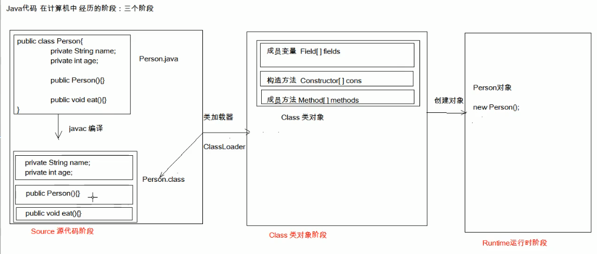

<!-- TOC -->

- [1. 反射：框架设计的灵魂](#1-反射框架设计的灵魂)
    - [1.1. 概述](#11-概述)
    - [1.2. Class对象功能](#12-class对象功能)
    - [1.3. 反射案例](#13-反射案例)
- [2. 注解基础](#2-注解基础)
    - [注解概念](#注解概念)
        - [2.1.2. java内置注解](#212-java内置注解)
    - [自定义注解](#自定义注解)

<!-- /TOC -->

# 1. 反射：框架设计的灵魂
## 1.1. 概述

* **框架：半成品软件**，可以在框架的基础上进行软件开发，简化编码；
* **反射：** 将类的各个组成部分封装为其他**对象**，这就是反射。
    * 好处：
        1. 可以在程序的运行过程中，操作这些对象
        2. 可以解耦，提高程序的可扩展性
* **获取Class对象的方式**
    1. Class.forName("全类名")：将字节码文件加载进内存，返回Class对象
        * 多用于配置文件，将类名定义在配置文件中，读取文件，加载类
    2. 类名.class：通过类名的属性`.class`获取;
        * 多用于参数的传递
    3. 对象.getClass：getClass()方法在Object类中定义。
        * 多用于对象的获取字节码的方式。
    * **结论：**  
    同一个字节码文件（.class）在一次程序运行过程中，只会被加载一次，不论通过哪种方式获取的Class对象都是同一个。


## 1.2. Class对象功能  

1. 获取成员变量  
    1. Field[] getFields():获取所有public修饰的成员变量；
    2. Field getField(String name): 获取指定名称的public修饰的成员变量  
    3. Field[] getDeclaredField():获取所有成员变量，不考虑修饰符
    4. Field getDeclaredField(String name)


2. 获取构造方法们
	* Constructor<?>[] getConstructors()  
	* Constructor<T> getConstructor(类<?>... parameterTypes)  

	* Constructor<T> getDeclaredConstructor(类<?>... parameterTypes)  
	* Constructor<?>[] getDeclaredConstructors()  
3. 获取成员方法们：
	* Method[] getMethods()  
	* Method getMethod(String name, 类<?>... parameterTypes)  

	* Method[] getDeclaredMethods()  
	* Method getDeclaredMethod(String name, 类<?>... parameterTypes)  

4. 获取全类名	
	* String getName()

5. 详细
	* Field：成员变量
		* 操作：
			1. 设置值
				* void set(Object obj, Object value)  
			2. 获取值
				* get(Object obj) 

			3. 忽略访问权限修饰符的安全检查
				* setAccessible(true):暴力反射


	* Constructor:构造方法
		* 创建对象：
			* T newInstance(Object... initargs)  

			* 如果使用空参数构造方法创建对象，操作可以简化：Class对象的newInstance方法


	* Method：方法对象
		* 执行方法：
			* Object invoke(Object obj, Object... args)  

		* 获取方法名称：
			* String getName:获取方法名
## 1.3. 反射案例
* 需求：写一个"框架"，不能改变该类的任何代码的前提下，可以帮我们创建任意类的对象，并且执行其中任意方法
* 实现：
    1. 配置文件
    2. 反射
* 步骤：
    1. 将需要创建的对象的全类名和需要执行的方法定义在配置文件中
    2. 在程序中加载读取配置文件
    3. 使用反射技术来加载类文件进内存
    4. 创建对象
    5. 执行方法 `invoke()`
* 实施  
1.  在根目录下[src/]创建配置文件`pro.properties`
    ```java
    className=cn.itcast.domain.Person
    methodName=eat
    className2=cn.itcast.domain.Student
    ```
2. 反射调用
```java
package cn.itcast.reflect;

import java.io.InputStream;
import java.lang.reflect.Method;
import java.util.Properties;

/**
 * 框架类
 */
public class ReflectTest {
    public static void main(String[] args) throws Exception {
        //可以创建任意类的对象，可以执行任意方法
        //前提：不能改变该类的任何代码。可以创建任意类的对象，可以执行任意方法
        // Person p = new Person();
        //p.eat();
        //Student stu = new Student();
        //stu.sleep();*/
        //1.加载配置文件
        //1.1创建Properties对象
        Properties pro = new Properties();
        //1.2加载配置文件，转换为一个集合
        //1.2.1获取class目录下的配置文件
        ClassLoader classLoader = ReflectTest.class.getClassLoader();
        InputStream is = classLoader.getResourceAsStream("cn/itcast/pro.properties");//配置文件在根目录下，把src设置为根目录
        pro.load(is);
        //2.获取配置文件中定义的数据
        String className = pro.getProperty("className");
        String methodName = pro.getProperty("methodName");
        //3.加载该类进内存
        Class cls = Class.forName(className);
        //4.创建对象
        Object obj = cls.newInstance();
        //5.获取方法对象
        Method method = cls.getMethod(methodName);
        //6.执行方法
        method.invoke(obj);
    }
}

```


<div align="center"><a></a></div>


# 2. 注解基础

## 注解概念
Annotation是从jdk5.0开始引入的新技术。  
**注解的本质其实就是接口**
* **注解的作用：**  
&emsp;&emsp;-- 不是程序本身，可以对程序做出解释。  
&emsp;&emsp;-- 可以被其他程序（比如：编译器）读取。（注解信息处理流程，是注解和注释的重大区别）  
* **Annotation的格式：**  
&emsp;&emsp;**"@注解名"**  
@SuppressWarnings(value="unlocked")
* **Annotation在哪使用：**   
&emsp;&emsp;-- 可以附加在package，class，method，field等上面，相当于给它们添加额外的辅助信息，可通过**反射机制**编程实现对这些元数据的访问。
### 2.1.2. java内置注解
* **@Override**  
&emsp;&emsp;- 定义在java.lang.Override中，适用于修饰方法，重写。
* **Deprecated**  
&emsp;&emsp;- 定义在java.lang.Deprecated中，可修饰方法，属性，类，表示不鼓励使用的元素（即将取消的元素）  
也可以自定义@Deprecated方法
* **SuppressWarnings**  
&emsp;&emsp;- 定义在java.lang.SuppressWarnings中，用来抑制编译时的警告信息。  
&emsp;&emsp;-- 对警告信息的忽略。
```java
@SuppressWarnings("all") //压制警告
public class AnnoDemo2 {
    @Override
    public String toString(){
     return super.toString();
    }

    @Deprecated
    public void show1(){
        //有缺陷
    }

    @SuppressWarnings("all")
    public void show2(){
        //替代show1方法
    }

    public void demo(){
        show1();
    }
}
```
**备注：什么是元数据**  
元数据是指用来**描述数据的数据**，更通俗一点，就是**描述代码间关系**，或者**代码与其他资源（例如数据库表）之间内在联系的数据**。

## 自定义注解
* JDK自带注解
* 常见第三方注解：  
Spring: @Autowired @Service @Resipository  
Mybatis: @InsertProvider @UpdateProvider @Options

* 自定义注解  
下面自定义个注解
```java
public @interface MyAnnotation {
    // 定义公共的final静态属性
    int age = 25;
    // 定义公共的抽象方法
    String name();
}
```

既然元数据是指用来描述数据的数据，那么**元注解就是注解的注解**（在注解中再添加一层注解）  
JAVA元注解有四种：
@Retention @Target @Document @Inherited；


```java
@Target(ElementType.METHOD)
@Retention(RetentionPolicy.SOURCE)
public @interface Override {
}
```