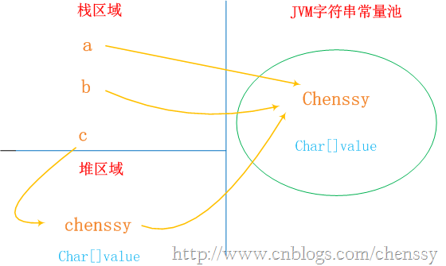
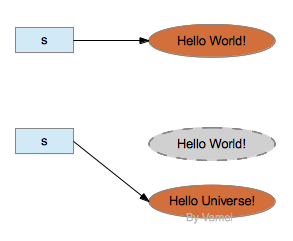

<!-- TOC -->

- [1. String类](#1-string类)
    - [1.1. 源码解析](#11-源码解析)
- [2. 字符串常量池](#2-字符串常量池)
    - [2.1. 案例分析](#21-案例分析)
- [3. 总结](#3-总结)
    - [3.1. String类初始化后是不可变的(immutable)](#31-string类初始化后是不可变的immutable)
    - [3.2. 引用变量与对象](#32-引用变量与对象)
    - [3.3. 创建字符串的方式](#33-创建字符串的方式)
    - [3.4. 使用String不一定创建对象](#34-使用string不一定创建对象)
    - [3.5. 使用new String，一定创建对象](#35-使用new-string一定创建对象)
    - [3.6. 关于equals和==](#36-关于equals和)
    - [3.7. String相关的+：](#37-string相关的)
    - [3.8. String、StringBuffer、StringBuilder的区别](#38-stringstringbufferstringbuilder的区别)
    - [3.9. 关于String str = new String("abc")创建了多少个对象？](#39-关于string-str--new-stringabc创建了多少个对象)
    - [3.10. 字符串池的优缺点：](#310-字符串池的优缺点)

<!-- /TOC -->

# 1. String类
## 1.1. 源码解析
想要了解一个类，最好的办法就是看这个类的实现源代码，来看一下String类的源码：

<details>
<summary>String类的源码 </summary>

```java
public final class String
    implements java.io.Serializable, Comparable<String>, CharSequence
{
    /** The value is used for character storage. */
    private final char value[];

    /** The offset is the first index of the storage that is used. */
    private final int offset;

    /** The count is the number of characters in the String. */
    private final int count;

    /** Cache the hash code for the string */
    private int hash; // Default to 0

    /** use serialVersionUID from JDK 1.0.2 for interoperability */
    private static final long serialVersionUID = -6849794470754667710L;

    ........
}
```
</details>

从上面可以看出几点：

1）String类是`final类`，也即意味着`String类不能被继承`，并且它的`成员方法都默认为final方法`。**在Java中，被final修饰的类是不允许被继承的，并且该类中的成员方法都默认为final方法**。

2）上面列举出了String类中所有的成员属性，从上面可以看出**String类其实是通过char数组来保存字符串的**。

下面再继续看String类的一些方法实现：
<details>
<summary>String类的一些方法实现</summary>

```java
public String substring(int beginIndex, int endIndex) {
    if (beginIndex < 0) {
        throw new StringIndexOutOfBoundsException(beginIndex);
    }
    if (endIndex > count) {
        throw new StringIndexOutOfBoundsException(endIndex);
    }
    if (beginIndex > endIndex) {
        throw new StringIndexOutOfBoundsException(endIndex - beginIndex);
    }
    return ((beginIndex == 0) && (endIndex == count)) ? this :
        new String(offset + beginIndex, endIndex - beginIndex, value);
}

public String concat(String str) {
    int otherLen = str.length();
    if (otherLen == 0) {
        return this;
    }
    char buf[] = new char[count + otherLen];
    getChars(0, count, buf, 0);
    str.getChars(0, otherLen, buf, count);
    return new String(0, count + otherLen, buf);
}

public String replace(char oldChar, char newChar) {
    if (oldChar != newChar) {
        int len = count;
        int i = -1;
        char[] val = value; /* avoid getfield opcode */
        int off = offset;   /* avoid getfield opcode */

        while (++i < len) {
        if (val[off + i] == oldChar) {
            break;
        }
        }
        if (i < len) {
        char buf[] = new char[len];
        for (int j = 0 ; j < i ; j++) {
            buf[j] = val[off+j];
        }
        while (i < len) {
            char c = val[off + i];
            buf[i] = (c == oldChar) ? newChar : c;
            i++;
        }
        return new String(0, len, buf);
        }
    }
    return this;
}
```
</details>

从上面的三个方法可以看出，无论是sub操作、concat还是replace操作都不是在原有的字符串上进行的，而是重新生成了一个新的字符串对象。也就是说进行这些操作后，最原始的字符串并没有被改变。

在这里要永远记住一点：**“String对象一旦被创建就是固定不变的了，对String对象的任何改变都不影响到原对象，相关的任何change操作都会生成新的对象”**。

# 2. 字符串常量池
我们知道字符串的分配和其他对象分配一样，是需要消耗高昂的时间和空间的，而且字符串我们使用的非常多。JVM为了提高性能和减少内存的开销，在实例化字符串的时候进行了一些优化：`使用字符串常量池`。**每当我们创建字符串常量时，JVM会首先检查字符串常量池，如果该字符串已经存在常量池中，那么就直接返回常量池中的实例引用。如果字符串不存在常量池中，就会实例化该字符串并且将其放到常量池中**。**由于String字符串的不可变性我们可以十分肯定`常量池中一定不存在两个相同的字符串（这点对理解上面至关重要）`**。

Java中的常量池，实际上分为两种形态：`静态常量池和运行时常量池`。
* 静态常量池  
所谓**静态常量池，即*.class文件中的常量池**，class文件中的常量池不仅仅包含字符串(数字)字面量，还包含类、方法的信息，占用class文件绝大部分空间。
* 运行时常量池  
而运行时常量池，则是jvm虚拟机在完成类装载操作后，将class文件中的常量池载入到内存中，并保存在方法区中，我们常说的常量池，就是`指方法区中的运行时常量池`。

来看下面的程序：
```java
String a = "chenssy";
String b = "chenssy";
```
a、b和字面上的chenssy都是指向JVM字符串常量池中的"chenssy"对象，他们`指向同一个对象`。
```java
String c = new String("chenssy");
```
new关键字一定会产生一个对象chenssy（注意这个chenssy和上面的chenssy不同），同时这个对象是存储在堆中。所以上面应该产生了两个对象：保存在栈中的c和保存堆中chenssy。但是在Java中根本就不存在两个完全一模一样的字符串对象。故堆中的chenssy应该是引用字符串常量池中chenssy。所以c、chenssy、池chenssy的关系应该是：c--->chenssy--->池chenssy。整个关系如下：

<div align="center"><a></a></div>

通过上面的图我们可以非常清晰的认识他们之间的关系。所以我们修改内存中的值，他变化的是所有。

总结：虽然a、b、c、chenssy是不同的对象，但是从String的内部结构我们是可以理解上面的。String c = new String("chenssy");虽然c的内容是创建在堆中，但是他的内部value还是指向JVM常量池的chenssy的value，它构造chenssy时所用的参数依然是chenssy字符串常量。

## 2.1. 案例分析
例子1：  
```java
/**
 * 采用字面值的方式赋值
 */
public void test1(){
    String str1="aaa";
    String str2="aaa";
    System.out.println("===========test1============");
    System.out.println(str1==str2);//true 可以看出str1跟str2是指向同一个对象 
}
```
执行上述代码，结果为：`true`。
分析：当执行String str1="aaa"时，JVM首先会去字符串池中查找是否存在"aaa"这个对象，如果不存在，则在字符串池中创建"aaa"这个对象，然后将池中"aaa"这个对象的引用地址返回给字符串常量str1，这样str1会指向池中"aaa"这个字符串对象；如果存在，则不创建任何对象，直接将池中"aaa"这个对象的地址返回，赋给字符串常量。当创建字符串对象str2时，字符串池中已经存在"aaa"这个对象，直接把对象"aaa"的引用地址返回给str2，这样str2指向了池中"aaa"这个对象，也就是说`str1和str2指向了同一个对象`，因此语句System.out.println(str1 == str2)输出：true。

例子2：
```java
/**
     * 采用new关键字新建一个字符串对象
     */
    @Test
    public void test2(){
        String str3=new String("aaa");
        String str4=new String("aaa");
        System.out.println("===========test2============");
        System.out.println(str3==str4);//false 可以看出用new的方式是生成不同的对象
    }
```
 执行上述代码，结果为：false。

分析： 采用new关键字新建一个字符串对象时，JVM首先在字符串池中查找有没有"aaa"这个字符串对象，如果有，则不在池中再去创建"aaa"这个对象了，直接在堆中创建一个"aaa"字符串对象，然后将堆中的这个"aaa"对象的地址返回赋给引用str3，这样，str3就指向了堆中创建的这个"aaa"字符串对象；如果没有，则首先在字符串池中创建一个"aaa"字符串对象，然后再在堆中创建一个"aaa"字符串对象，然后将堆中这个"aaa"字符串对象的地址返回赋给str3引用，这样，str3指向了堆中创建的这个"aaa"字符串对象。当执行String str4=new String("aaa")时， 因为`采用new关键字创建对象时，每次new出来的都是一个新的对象`，也即是说引用str3和str4指向的是两个不同的对象，因此语句System.out.println(str3 == str4)输出：false。

例子3：
```java
/**
 * 编译期确定
 */
public void test3(){
    String s0="helloworld";
    String s1="helloworld";
    String s2="hello"+"world";
    System.out.println("===========test3============");
    System.out.println(s0==s1); //true 可以看出s0跟s1是指向同一个对象 
    System.out.println(s0==s2); //true 可以看出s0跟s2是指向同一个对象 
}
```
执行上述代码，结果为：`true、true`。

分析：因为例子中的s0和s1中的"helloworld”都是字符串常量，它们在编译期就被确定了，所以s0==s1为true；而"hello”和"world”也都是字符串常量，`当一个字符串由多个字符串常量连接而成时，它自己肯定也是字符串常量`，所以s2也同样在编译期就被解析为一个字符串常量，所以s2也是常量池中"helloworld”的一个引用。所以我们得出s0==s1==s2。

例子4：
```java
/**
     * 编译期无法确定
     */
    @Test
    public void test4(){
        String s0="helloworld";
        String s1=new String("helloworld");//创建了一个新的对象，不能在编译期就确定
        String s2="hello" + new String("world");
        System.out.println("===========test4============");
        System.out.println( s0==s1 ); //false
        System.out.println( s0==s2 ); //false
        System.out.println( s1==s2 ); //false
    }
```
执行上述代码，结果为：`false、false、false`。

分析：用new String() 创建的字符串不是常量，不能在编译期就确定，所以new String() 创建的字符串不放入常量池中，它们有自己的地址空间。

s0还是常量池中"helloworld”的引用，s1因为无法在编译期确定，所以是运行时创建的新对象"helloworld”的引用，s2因为有后半部分new String(”world”)所以也无法在编译期确定，所以也是一个新创建对象"helloworld”的引用。

例子5：
```java
/**
     * 继续-编译期无法确定
     */
    @Test
    public void test5(){
        String str1="abc";
        String str2="def";
        String str3=str1+str2;
        System.out.println("===========test5============");
        System.out.println(str3=="abcdef"); //false
    }
```
执行上述代码，结果为：`false`。

分析：因为`str3指向堆中的"abcdef"对象，而"abcdef"是字符串池中的对象`，所以结果为false。`JVM对String str="abc"对象放在常量池中是在编译时做的，而String str3=str1+str2是在运行时刻才能知道的`。new对象也是在运行时才做的。而这段代码总共创建了5个对象，字符串池中两个、堆中三个。+运算符会在堆中建立来两个String对象，这两个对象的值分别是"abc"和"def"，也就是说从字符串池中复制这两个值，然后在堆中创建两个对象，然后再建立对象str3,然后将"abcdef"的堆地址赋给str3。  
步骤：   
1)栈中开辟一块中间存放引用str1，str1指向池中String常量"abc"。   
2)栈中开辟一块中间存放引用str2，str2指向池中String常量"def"。   
3)栈中开辟一块中间存放引用str3。  
4)str1 + str2通过StringBuilder的最后一步toString()方法还原一个新的String对象"abcdef"，因此堆中开辟一块空间存放此对象。  
5)引用str3指向堆中(str1 + str2)所还原的新String对象。   
6)str3指向的对象在堆中，而常量"abcdef"在池中，输出为false。  

例子6：
```java
/**
     * 编译期优化
     */
    @Test
    public void test6(){
        String s0 = "a1";
        String s1 = "a" + 1;
        System.out.println("===========test6============");
        System.out.println((s0 == s1)); //result = true
        String s2 = "atrue";
        String s3= "a" + "true";
        System.out.println((s2 == s3)); //result = true
        String s4 = "a3.4";
        String s5 = "a" + 3.4;
        System.out.println((s4 == s5)); //result = true
    }
```
执行上述代码，结果为：true、true、true。

分析：`在程序编译期，JVM就将常量字符串的"+"连接优化为连接后的值`，拿"a" + 1来说，经编译器优化后在class中就已经是a1。在编译期其字符串常量的值就确定下来，故上面程序最终的结果都为true。

例子7：
```java
/**
     * 编译期无法确定
     */
    @Test
    public void test7(){
        String s0 = "ab";
        String s1 = "b";
        String s2 = "a" + s1;
        System.out.println("===========test7============");
        System.out.println((s0 == s2)); //result = false
    }
```
执行上述代码，结果为：false。

分析：`JVM对于字符串引用，由于在字符串的"+"连接中，有字符串引用存在，而引用的值在程序编译期是无法确定的，即"a" + s1无法被编译器优化，只有在程序运行期来动态分配并将连接后的新地址赋给s2`。所以上面程序的结果也就为false。

例子8：
```java
/**
     * 比较字符串常量的“+”和字符串引用的“+”的区别
     */
    @Test
    public void test8(){
        String test="javalanguagespecification";
        String str="java";
        String str1="language";
        String str2="specification";
        System.out.println("===========test8============");
        System.out.println(test == "java" + "language" + "specification");
        System.out.println(test == str + str1 + str2);
    }
```
执行上述代码，结果为：`true、false`。

分析：为什么出现上面的结果呢？这是因为，字符串字面量拼接操作是在Java编译器编译期间就执行了，也就是说编译器编译时，直接把"java"、"language"和"specification"这三个字面量进行"+"操作得到一个"javalanguagespecification" 常量，并且直接将这个常量放入字符串池中，这样做实际上是一种优化，将3个字面量合成一个，避免了创建多余的字符串对象。而字符串引用的"+"运算是在Java运行期间执行的，即str + str2 + str3在程序执行期间才会进行计算，它会在堆内存中重新创建一个拼接后的字符串对象。总结来说就是：`字面量"+"拼接是在编译期间进行的，拼接后的字符串存放在字符串池中；而字符串引用的"+"拼接运算实在运行时进行的，新创建的字符串存放在堆中。`

`对于直接相加字符串，效率很高，因为在编译器便确定了它的值，也就是说形如"I"+"love"+"java"; 的字符串相加，在编译期间便被优化成了"Ilovejava"。对于间接相加（即包含字符串引用），形如s1+s2+s3; 效率要比直接相加低，因为在编译器不会对引用变量进行优化。`

例子9：
```java
/**
     * 编译期确定
     */
    @Test
    public void test9(){
        String s0 = "ab";
        final String s1 = "b";
        String s2 = "a" + s1;
        System.out.println("===========test9============");
        System.out.println((s0 == s2)); //result = true
    }
```
执行上述代码，结果为：`true`。

分析：和例子7中唯一不同的是s1字符串加了final修饰，`对于final修饰的变量，它在编译时被解析为常量值的一个本地拷贝存储到自己的常量池中或嵌入到它的字节码流中`。所以此时的"a" + s1和"a" + "b"效果是一样的。故上面程序的结果为true。  
另外：去掉final和不去掉final的效果是不一样的。

例子10：
```java
@Test
    public void test10(){
        String s0 = "ab";
        final String s1 = getS1();
        String s2 = "a" + s1;
        System.out.println("===========test10============");
        System.out.println((s0 == s2)); //result = false

    }

    private static String getS1() {
        return "b";
    }
```
执行上述代码，结果为：false。

分析：这里面虽然将s1用final修饰了，但是由于其赋值是通过方法调用返回的，那么它的`值只能在运行期间确定`，因此s0和s2指向的不是同一个对象，故上面程序的结果为false。

# 3. 总结
## 3.1. String类初始化后是不可变的(immutable)
String使用private final char value[]来实现字符串的存储，也就是说String对象创建之后，就不能再修改此对象中存储的字符串内容，就是因为如此，才说String类型是不可变的(immutable)。程序员不能对已有的不可变对象进行修改。我们自己也可以创建不可变对象，只要在接口中不提供修改数据的方法就可以。
然而，String类对象确实有编辑字符串的功能，比如replace()。这些编辑功能是通过创建一个新的对象来实现的，而不是对原有对象进行修改。比如:
```java
s = s.replace("World", "Universe");
```
上面对s.replace()的调用将创建一个新的字符串"Hello Universe!"，并返回该对象的引用。通过赋值，`引用s将指向该新的字符串`。`如果没有其他引用指向原有字符串"Hello World!"，原字符串对象将被垃圾回收`。

<div align="center"><a></a></div>

## 3.2. 引用变量与对象

A aa;
这个语句声明一个类A的引用变量aa[我们常常称之为`句柄`]，而对象一般通过new创建。所以`aa仅仅是一个引用变量，它不是对象`。

## 3.3. 创建字符串的方式

创建字符串的方式归纳起来有两类：

（1）使用""引号创建字符串;
（2）使用new关键字创建字符串。

结合上面例子，总结如下:

（1）`单独使用""引号创建的字符串都是常量,编译期就已经确定存储到String Pool中`；
（2）`使用new String("")创建的对象会存储到heap中,是运行期新创建的`；
new创建字符串时首先查看池中是否有相同值的字符串，如果有，则拷贝一份到堆中，然后返回堆中的地址；如果池中没有，则在堆中创建一份，然后返回堆中的地址（注意，此时不需要从堆中复制到池中，否则，将使得堆中的字符串永远是池中的子集，导致浪费池的空间）！
（3）使用只包含常量的字符串连接符如"aa" + "aa"创建的也是常量,编译期就能确定,已经确定存储到String Pool中；
（4）使用包含变量的字符串连接符如"aa" + s1创建的对象是运行期才创建的,存储在heap中；

## 3.4. 使用String不一定创建对象
在执行到双引号包含字符串的语句时，如String a = "123"，JVM会先到常量池里查找，如果有的话返回常量池里的这个实例的引用，否则的话创建一个新实例并置入常量池里。所以，当我们在使用诸如String str = "abc"；的格式定义对象时，总是想当然地认为，创建了String类的对象str。`担心陷阱！对象可能并没有被创建！而可能只是指向一个先前已经创建的对象。只有通过new()方法才能保证每次都创建一个新的对象。`

## 3.5. 使用new String，一定创建对象
在执行String a = new String("123")的时候，首先走常量池的路线取到一个实例的引用，然后在堆上创建一个新的String实例，然后把实例引用赋值给a：

## 3.6. 关于equals和==

（1）**对于==，如果作用于基本数据类型的变量（byte,short,char,int,long,float,double,boolean ），则直接比较其存储的"值"是否相等；如果作用于引用类型的变量（String），则比较的是所指向的对象的地址（即是否指向同一个对象）**。

（2）·equals方法是基类Object中的方法·，因此对于所有的继承于Object的类都会有该方法。在Object类中，`equals方法是用来比较两个对象的引用是否相等，即是否指向同一个对象`。

（3）对于equals方法，注意：`equals方法不能作用于基本数据类型的变量`。如果没有对equals方法进行重写，则比较的是引用类型的变量所指向的对象的地址；`而String类对equals方法进行了重写，用来**比较指向的字符串对象所存储的字符串是否相等**`。其他的一些类诸如Double，Date，Integer等，都对equals方法进行了重写用来比较指向的对象所存储的内容是否相等。

```java
 /**
     * 关于equals和==
     */
    @Test
    public void test12(){
        String s1="hello";
        String s2="hello";
        String s3=new String("hello");
        System.out.println("===========test12============");
        System.out.println( s1 == s2); //true,表示s1和s2指向同一对象，它们都指向常量池中的"hello"对象
        //flase,表示s1和s3的地址不同，即它们分别指向的是不同的对象,s1指向常量池中的地址，s3指向堆中的地址
        System.out.println( s1 == s3);
        System.out.println( s1.equals(s3)); //true,表示s1和s3所指向对象的内容相同
    }
```

## 3.7. String相关的+：
显然，通过字节码我们可以得出如下几点结论：  
(1).String中使用 + 字符串连接符进行字符串连接时，连接操作最开始时如果都是字符串常量，编译后将尽可能多的直接将字符串常量连接起来，形成新的字符串常量参与后续连接（通过反编译工具jd-gui也可以方便的直接看出）；

(2).接下来的字符串连接是从左向右依次进行，`对于不同的字符串，首先以最左边的字符串为参数创建StringBuilder对象，然后依次对右边进行append操作，最后将StringBuilder对象通过toString()方法转换成String对象（注意：中间的多个字符串常量不会自动拼接）`。

也就是说String c = "xx" + "yy " + a + "zz" + "mm" + b; 实质上的实现过程是： `String c = new StringBuilder("xxyy ").append(a).append("zz").append("mm").append(b).toString();`

由此得出结论：**当使用+进行多个字符串连接时，实际上是产生了一个StringBuilder对象和一个String对象**。

## 3.8. String、StringBuffer、StringBuilder的区别

（1）可变与不可变：  
`String是不可变字符串对象，StringBuilder和StringBuffer是可变字符串对象（其内部的字符数组长度可变）`。

（2）是否多线程安全：  
String中的对象是不可变的，也就可以理解为常量，显然线程安全。StringBuffer 与 StringBuilder 中的方法和功能完全是等价的，只是StringBuffer 中的方法大都采用了`synchronized` 关键字进行修饰，因此是线程安全的，而 StringBuilder 没有这个修饰，可以被认为是非线程安全的。

（3）String、StringBuilder、StringBuffer三者的执行效率：  
`StringBuilder > StringBuffer > String` 当然这个是相对的，不一定在所有情况下都是这样。比如String str = "hello"+ "world"的效率就比 StringBuilder st  = new StringBuilder().append("hello").append("world")要高。因此，这三个类是各有利弊，应当根据不同的情况来进行选择使用：
当字符串相加操作或者改动较少的情况下，建议使用 String str="hello"这种形式；
当字符串相加操作较多的情况下，建议使用StringBuilder，如果采用了多线程，则使用StringBuffer。

## 3.9. 关于String str = new String("abc")创建了多少个对象？
该段代码执行过程和类的加载过程是有区别的。在类加载的过程中，确实在运行时常量池中创建了一个"abc"对象，而在代码执行过程中确实只创建了一个String对象。

## 3.10. 字符串池的优缺点：
**字符串池的优点就是避免了相同内容的字符串的创建，节省了内存，省去了创建相同字符串的时间，同时提升了性能；另一方面，字符串池的缺点就是`牺牲了JVM在常量池中遍历对象所需要的时间`，不过其时间成本相比而言比较低。**
