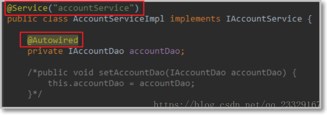
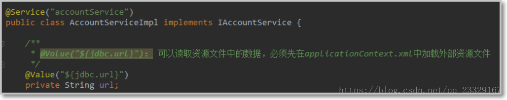
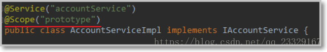
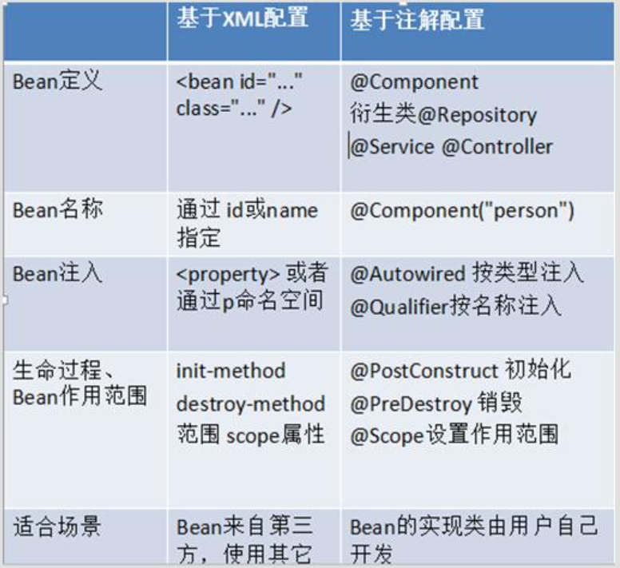

<!-- TOC -->

- [1. 纯注解的银行账户CRDU案例](#1-纯注解的银行账户crdu案例)
    - [1.1. 前言](#11-前言)
    - [1.2. 数据模型domain](#12-数据模型domain)
    - [1.3. 构建Dao层](#13-构建dao层)
    - [1.4. Service层](#14-service层)
    - [1.5. spring配置](#15-spring配置)
- [2. Spring注解解析](#2-spring注解解析)
    - [2.1. 使用注解装配bean](#21-使用注解装配bean)
        - [2.1.1. @Component](#211-component)
        - [2.1.2. @Controller @Service @Repository](#212-controller-service-repository)
    - [2.2. 用于注入数据的注解](#22-用于注入数据的注解)
        - [2.2.1. @Autowired](#221-autowired)
        - [2.2.2. @Qualifier](#222-qualifier)
        - [2.2.3. @Resource](#223-resource)
        - [2.2.4. @Value](#224-value)
    - [2.3. 用于改变作用范围的注解](#23-用于改变作用范围的注解)
        - [2.3.1. @Scope](#231-scope)
    - [2.4. 和生命周期相关的注解](#24-和生命周期相关的注解)
        - [2.4.1. @PostConstruct](#241-postconstruct)
        - [2.4.2. @PreDestroy](#242-predestroy)
    - [2.5. 配置类相关的注解](#25-配置类相关的注解)
        - [2.5.1. @Configuration](#251-configuration)
        - [2.5.2. @ComponentScan](#252-componentscan)
        - [2.5.3. @PropertySource](#253-propertysource)
        - [2.5.4. @Import](#254-import)
        - [2.5.5. @Bean](#255-bean)
        - [2.5.6. 通过注解获取容器](#256-通过注解获取容器)
    - [2.6. 关于 Spring 注解和 XML 的选择问题](#26-关于-spring-注解和-xml-的选择问题)
- [3. Spring整合Junit](#3-spring整合junit)
    - [3.1. 添加maven依赖](#31-添加maven依赖)
    - [3.2. 使用@RunWith 注解替换原有运行器](#32-使用runwith-注解替换原有运行器)
    - [3.3. 使用@ContextConfiguration 指定 spring 配置文件的位置](#33-使用contextconfiguration-指定-spring-配置文件的位置)
    - [3.4. 使用@Autowired 给测试类中的变量注入数据](#34-使用autowired-给测试类中的变量注入数据)
    - [3.5. 为什么不把测试类配到 xml 中](#35-为什么不把测试类配到-xml-中)

<!-- /TOC -->


# 1. 纯注解的银行账户CRDU案例

## 1.1. 前言
基于注解的IoC配置，与在xml中配置目的是一样的，都是降低代码之间的耦合度的，只是配置的形式不一样。

使用注解的步骤：  
    1、添加context的名称控件和约束；  
    2、开启注解扫描：由spring扫描指定的包及其子包下的所有类，如果类上使用了@Component注解，就将该类装配到容器中；  
    3、在类上使用@Component注解；
【备注】  
使用注解之前一定要先开启注解扫描。
```xml
<!-- 配置注解扫描的包：声明到指定的包下去进行扫描，如果发现类上有对应的注解，将其装配到容器中 -->
<context:component-scan base-package="com.demon"/>
```

## 1.2. 数据模型domain
```java
public class Account implements Serializable {
    private Integer id;
    private String name;
    private Float money;
    // getter setter toString
}
```
## 1.3. 构建Dao层

1. IAccountDao.java
```java
import java.util.List;
/**
 * 账户的持久层接口
 */
public interface IAccountDao {

    /** 查询所有 */
    List<Account> findAllAccount();

    /** 查询一个 */
    Account findAccountById(Integer accountId);

    /** 保存 */
    void saveAccount(Account account);

    /** 更新 */
    void updateAccount(Account account);

    /** 删除 */
    void deleteAccount(Integer acccountId);
}
```
2.
```java
**
 * 账户的持久层实现类
 */
@Repository("accountDao")
public class AccountDaoImpl implements IAccountDao {
    @Autowired
    private QueryRunner runner;

    @Override
    public List<Account> findAllAccount() {
        try{
            return runner.query("select * from account",new BeanListHandler<Account>(Account.class));
        }catch (Exception e) {
            throw new RuntimeException(e);
        }
    }

    @Override
    public Account findAccountById(Integer accountId) {
        try{
            return runner.query("select * from account where id = ? ",new BeanHandler<Account>(Account.class),accountId);
        }catch (Exception e) {
            throw new RuntimeException(e);
        }
    }

    @Override
    public void saveAccount(Account account) {
        try{
            runner.update("insert into account(name,money)values(?,?)",account.getName(),account.getMoney());
        }catch (Exception e) {
            throw new RuntimeException(e);
        }
    }

    @Override
    public void updateAccount(Account account) {
        try{
            runner.update("update account set name=?,money=? where id=?",account.getName(),account.getMoney(),account.getId());
        }catch (Exception e) {
            throw new RuntimeException(e);
        }
    }

    @Override
    public void deleteAccount(Integer accountId) {
        try{
            runner.update("delete from account where id=?",accountId);
        }catch (Exception e) {
            throw new RuntimeException(e);
        }
    }
}
```
## 1.4. Service层
1.IAccountService.java
```java
/**
 * 账户的业务层接口
 */
public interface IAccountService {

    /** 查询所有 */
    List<Account> findAllAccount();

    /** 查询一个 */
    Account findAccountById(Integer accountId);

    /** 保存 */
    void saveAccount(Account account);

    /** 更新 */
    void updateAccount(Account account);

    /** 删除 */
    void deleteAccount(Integer acccountId);
}
```

```java
/**
 * 账户的业务层实现类
 */
@Service("accountService")
public class AccountServiceImpl implements IAccountService {
    @Autowired
    private IAccountDao accountDao;

    @Override
    public List<Account> findAllAccount() {
        return accountDao.findAllAccount();
    }

    @Override
    public Account findAccountById(Integer accountId) {
        return accountDao.findAccountById(accountId);
    }

    @Override
    public void saveAccount(Account account) {
        accountDao.saveAccount(account);
    }

    @Override
    public void updateAccount(Account account) {
        accountDao.updateAccount(account);
    }

    @Override
    public void deleteAccount(Integer acccountId) {
        accountDao.deleteAccount(acccountId);
    }
}
```

## 1.5. spring配置
1.JdbcConfig
```java
/**
 * 和spring连接数据库相关的配置类
 */
public class JdbcConfig {

    @Value("${jdbc.driver}")
    private String driver;

    @Value("${jdbc.url}")
    private String url;

    @Value("${jdbc.username}")
    private String username;

    @Value("${jdbc.password}")
    private String password;

    /**
     * 用于创建一个QueryRunner对象
     * @param dataSource
     * @return
     */
    @Bean(name="runner")
    @Scope("prototype")
    public QueryRunner createQueryRunner(@Qualifier("ds2") DataSource dataSource){
        return new QueryRunner(dataSource);
    }

    /**
     * 创建数据源对象
     * @return
     */
    @Bean(name="ds2")
    public DataSource createDataSource(){
        try {
            ComboPooledDataSource ds = new ComboPooledDataSource();
            ds.setDriverClass(driver);
            ds.setJdbcUrl(url);
            ds.setUser(username);
            ds.setPassword(password);
            return ds;
        }catch (Exception e){
            throw new RuntimeException(e);
        }
    }

    @Bean(name="ds1")
    public DataSource createDataSource1(){
        try {
            ComboPooledDataSource ds = new ComboPooledDataSource();
            ds.setDriverClass(driver);
            ds.setJdbcUrl("jdbc:mysql://localhost:3306/work");
            ds.setUser(username);
            ds.setPassword(password);
            return ds;
        }catch (Exception e){
            throw new RuntimeException(e);
        }
    }
}
```
2.SpringConfiguration.java

```java
/**
 * 该类是一个配置类，它的作用和bean.xml是一样的
 * spring中的新注解
 * Configuration
 *     作用：指定当前类是一个配置类
 *     细节：当配置类作为AnnotationConfigApplicationContext对象创建的参数时，该注解可以不写。
 * ComponentScan
 *      作用：用于通过注解指定spring在创建容器时要扫描的包
 *      属性：
 *          value：它和basePackages的作用是一样的，都是用于指定创建容器时要扫描的包。
 *                 我们使用此注解就等同于在xml中配置了:
 *                      <context:component-scan base-package="com.itheima"></context:component-scan>
 *  Bean
 *      作用：用于把当前方法的返回值作为bean对象存入spring的ioc容器中
 *      属性:
 *          name:用于指定bean的id。当不写时，默认值是当前方法的名称
 *      细节：
 *          当我们使用注解配置方法时，如果方法有参数，spring框架会去容器中查找有没有可用的bean对象。
 *          查找的方式和Autowired注解的作用是一样的
 *  Import
 *      作用：用于导入其他的配置类
 *      属性：
 *          value：用于指定其他配置类的字节码。
 *                  当我们使用Import的注解之后，有Import注解的类就父配置类，而导入的都是子配置类
 *  PropertySource
 *      作用：用于指定properties文件的位置
 *      属性：
 *          value：指定文件的名称和路径。
 *                  关键字：classpath，表示类路径下
 */
//@Configuration
@ComponentScan("account_annoioc_withoutxml")
@Import(JdbcConfig.class)
@PropertySource("classpath:jdbcConfig.properties")
public class SpringConfiguration {
}
```
【备注】
如果不采用bean配置文件，ContextConfiguration应该配置类  
如果采用bean配置文件，ContextConfiguration应该配置bean.xml所在的位置
@ContextConfiguration(locations = "classpath:bean.xml")  
@ContextConfiguration(classes = SpringConfiguration.class)

3.配置文件
jdbcConfig.properties
```properties
jdbc.driver=com.mysql.jdbc.Driver
jdbc.url=jdbc:mysql://localhost:3306/work
jdbc.username=root
jdbc.password=123456
```
放在resource/文件夹下

# 2. Spring注解解析

## 2.1. 使用注解装配bean
相当于： <bean id="" class="">

```java
/**
 * @Component注解：相当于配置了<bean>标签
 * value = "util":相当于配置了bean标签的id属性，单独配置value时，可以省略value属性名称。
 */
@Component(value="util")
public class Util { 
}

```
### 2.1.1. @Component
* 作用：
    * 把资源让 spring 来管理。相当于在 xml 中配置一个 bean。
* 属性：  
    * value：指定 bean 的 id。如果不指定 value 属性，默认 bean 的 id 是当前类的类名。首字母小写。
<div align="center"><a></a></div>


### 2.1.2. @Controller @Service @Repository

他们三个注解都是针对一个的衍生注解，他们的作用及属性都是一模一样的。    
他们只不过是提供了更加明确的语义化。  
* @Controller： 一般用于表现层的注解。
* @Service： 一般用于业务层的注解。
* @Repository： 一般用于持久层的注解。
【细节】如果注解中有且只有一个属性要赋值时，且名称是 value， value 在赋值是可以不写。

## 2.2. 用于注入数据的注解
相当于：
```xml
    <property name="" ref="">
    <property name="" value="">
```

### 2.2.1. @Autowired
作用：  
自动按照类型注入。当使用注解注入属性时， set 方法可以省略。**它只能注入其他 bean 类型**。当有多个类型匹配时，使用要注入的对象变量名称作为 bean 的 id，在 spring 容器查找，找到了也可以注入成功。找不到就报错。
### 2.2.2. @Qualifier
* 作用：  
在自动按照类型注入的基础之上，再按照 Bean 的 id 注入。它在给字段注入时不能独立使用，必须和@Autowire 一起使用；但是给方法参数注入时，可以独立使用。

* 属性：  
value：指定 bean 的 id。

### 2.2.3. @Resource
* 作用：  
直接按照 Bean 的 id 注入。它也只能注入其他 bean 类型。
* 属性：
name：指定 bean 的 id。

### 2.2.4. @Value
* 作用：
注入基本数据类型和 String 类型数据的.
* 属性：
value：用于指定值.

<div align="center"><a></a></div>
接下来：

## 2.3. 用于改变作用范围的注解
相当于：
```xml
 <bean id="" class="" scope="">
```


### 2.3.1. @Scope
 
**@Scope**
* 作用：  
指定 bean 的作用范围。
* 属性：  
value：指定范围的值。
取值  ： `singleton prototype request session globalsession`
<div align="center"><a></a></div>
  

## 2.4. 和生命周期相关的注解
相当于： 
```xml
<bean id="" class="" init-method="" destroy-method="" />
```

### 2.4.1. @PostConstruct
作用：
用于指定初始化方法。

### 2.4.2. @PreDestroy
作用：
用于指定销毁方法

## 2.5. 配置类相关的注解
### 2.5.1. @Configuration
* 作用：   
用于指定当前类是一个spring配置类，当创建容器时会从该类上加载注解。获取容器时需要使用AnnotationApplicationContext(有@Configuration注解的类.class)。
```java
/**
 * spring的配置类，相当于applicationContext.xml文件
 * @author Demon
 * @date 2018/9/20 18:06
 */
@Configuration
public class SpringConfiguration {
}
```

### 2.5.2. @ComponentScan
作用： 用于指定spring在初始化容器时要扫描的包。作用和在spring的xml配置文件中的：
```xml
<context:component-scan base-package="com.demon"/>
```

属性：Value（单独使用可省略）：用于指定要扫描的包。和标签中的basePackages属性作用一样。
```java

/**
 * spring的配置类，相当于bean.xml文件
 * @author Demon
 * @date 2018/9/20 18:06
 */
@Configuration
@ComponentScan({"com.demon"})
public class SpringConfiguration {
 
}
```

### 2.5.3. @PropertySource
作用： 用于加载.properties文件中的配置。例如我们配置数据源时，可以把连接数据库的信息写到properties配置文件中，就可以使用此注解指定properties配置文件的位置。 

属性： value[]：用于指定properties文件位置。如果是在类路径下，需要写上classpath:
```java
@PropertySource(value = {"classpath:jdbc.properties"})
public class JdbcConfig {
    @Value(value = "${jdbc.driverClass}")
    private String driverClassName;
    @Value(value = "${jdbc.url}")
    private String url;
    @Value(value = "${jdbc.username}")
    private String username;
    @Value(value = "${jdbc.password}")
    private String password;
 
    @Bean(name = {"jdbcTemplate"})
    public JdbcTemplate createJdbcTemplate(@Qualifier(value = "dataSource") DataSource dataSource) {
        return new JdbcTemplate(dataSource);
    }
 
    @Bean(name = {"dataSource"})
    public DataSource createDataSource() {
        DruidDataSource dataSource = new DruidDataSource();
        dataSource.setDriverClassName(driverClassName);
        dataSource.setUrl(url);
        dataSource.setUsername(username);
        dataSource.setPassword(password);
        return dataSource;
    }
}
```

### 2.5.4. @Import  
* 作用： 
用于导入其他配置类，在引入其他配置类时，其他类上可以不用再写@Configuration注解。当然，写上也没问题。   
* 属性： value[]：用于指定其他配置类的字节码。
```java
@Configuration
@ComponentScan(value = {"com.demon"})
@Import(value = JdbcConfig.class)
public class SpringConfiguration {
}
```

### 2.5.5. @Bean
作用： 该注解只能写在方法上，将方法的返回值作为一个bean,并且放入spring容器。 

属性： name：给当前@Bean注解方法创建的对象指定一个名称(即bean的id）。
```java
@Bean(name = {"jdbcTemplate"})
public JdbcTemplate createJdbcTemplate(@Qualifier(value = "dataSource") DataSource dataSource) {
    return new JdbcTemplate(dataSource);
}
 
@Bean(name = {"dataSource"})
public DataSource createDataSource() {
    DruidDataSource dataSource = new DruidDataSource();
    dataSource.setDriverClassName(driverClassName);
    dataSource.setUrl(url);
    dataSource.setUsername(username);
    dataSource.setPassword(password);
    return dataSource;
}
```

### 2.5.6. 通过注解获取容器
```java
ApplicationContext ac = new AnnotationConfigApplicationContext(SpringConfiguration.class);
```


## 2.6. 关于 Spring 注解和 XML 的选择问题
* 注解的优势：  
配置简单，维护方便（我们找到类，就相当于找到了对应的配置）。  
* XML 的优势：
修改时，不用改源码。不涉及重新编译和部署。  
* Spring 管理 Bean 方式的比较：
<div align="center"><a></a></div>

# 3. Spring整合Junit
Spring junit的实现步骤如下
## 3.1. 添加maven依赖
使用spring的test模块的时候需要在pom.xml文件中引入
```xml
<dependency>
    <groupId>org.springframework</groupId>
    <artifactId>spring-test</artifactId>
    <version>5.0.6.RELEASE</version>
</dependency>
```
## 3.2. 使用@RunWith 注解替换原有运行器
```java
/**
* 测试类
*/
@RunWith(SpringJUnit4ClassRunner.class)
public class AccountServiceTest {
}
```

## 3.3. 使用@ContextConfiguration 指定 spring 配置文件的位置
```java
@RunWith(SpringJUnit4ClassRunner.class)
@ContextConfiguration(locations= {"classpath:bean.xml"})
public class AccountServiceTest {
}
```
【备注】
@ContextConfiguration 注解：
* locations 属性： 用于指定配置文件的位置。如果是类路径下，需要用 classpath:表明。
* classes 属性： 用于指定注解的类。当不使用 xml 配置时，需要用此属性指定注解类的位置。
## 3.4. 使用@Autowired 给测试类中的变量注入数据
```java
@RunWith(SpringJUnit4ClassRunner.class)
@ContextConfiguration(locations= {"classpath:bean.xml"})
public class AccountServiceTest {
@Autowired
private IAccountService as ;
}
```

## 3.5. 为什么不把测试类配到 xml 中
第一：当我们在 xml 中配置了一个 bean， spring 加载配置文件创建容器时，就会创建对象。  
第二：测试类只是我们在测试功能时使用，而在项目中它并不参与程序逻辑，也不会解决需求上的问题，所以创建完了，并没有使用。那么存在容器中就会造成资源的浪费.


