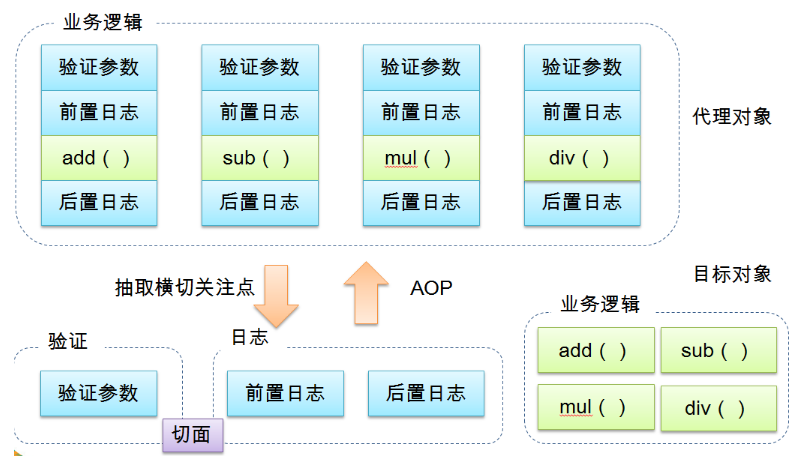
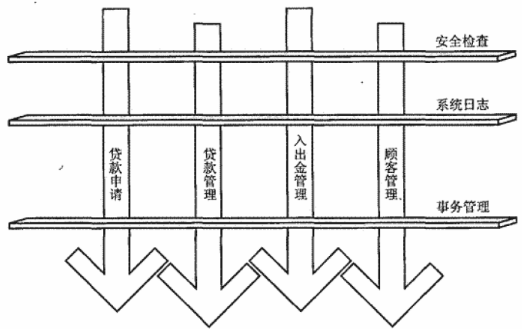

静态代理、JDK与CGLIB动态代理、AOP+IoC

<!-- TOC -->

- [1. 前言](#1-前言)
- [2. 为什么需要代理模式](#2-为什么需要代理模式)
- [静态代理](#静态代理)
- [动态代理，使用JDK内置的Proxy实现](#动态代理使用jdk内置的proxy实现)

<!-- /TOC -->

# 1. 前言
AOP（Aspect Oriented Programming）意为：**面向切面编程**，通过预编译方式和运行期动态代理实现程序功能的统一维护的一种技术。AOP是OOP的延续，是软件开发中的一个热点，也是Spring框架中的一个重要内容，是函数式编程的一种衍生范型。**利用AOP可以对业务逻辑的各个部分进行隔离，从而使得业务逻辑各部分之间的耦合度降低，提高程序的可重用性，同时提高了开发的效率**。

* **应用场景**
<div align="center"><a></a></div>
<div align="center"><a></a></div>

<details>
<summary>代码</summary>

```java
System.out.println("Hello World");
```
</details>

# 2. 为什么需要代理模式
假设需实现一个计算的类Math、完成加、减、乘、除功能，如下所示：
<details>
<summary>Math.java</summary>

```java
public class Math {
    //加
    public int add(int n1,int n2){
        int result=n1+n2;
        System.out.println(n1+"+"+n2+"="+result);
        return result;
    }
    
    
    //减
    public int sub(int n1,int n2){
        int result=n1-n2;
        System.out.println(n1+"-"+n2+"="+result);
        return result;
    }
    
    //乘
    public int mut(int n1,int n2){
        int result=n1*n2;
        System.out.println(n1+"X"+n2+"="+result);
        return result;
    }
    
    //除
    public int div(int n1,int n2){
        int result=n1/n2;
        System.out.println(n1+"/"+n2+"="+result);
        return result;
    }
}
```
</details>
现在需求发生了变化，要求项目中所有的类在执行方法时输出执行耗时。最直接的办法是修改源代码，如下所示：
<details>
<summary>代码</summary>

```java
package com.zhangguo.Spring041.aop01;

import java.util.Random;

public class Math {
    //加
    public int add(int n1,int n2){
        //开始时间
        long start=System.currentTimeMillis();
        lazy();
        int result=n1+n2;
        System.out.println(n1+"+"+n2+"="+result);
        Long span= System.currentTimeMillis()-start;
        System.out.println("共用时："+span);
        return result;
    }
    
    //减
    public int sub(int n1,int n2){
        //开始时间
        long start=System.currentTimeMillis();
        lazy();
        int result=n1-n2;
        System.out.println(n1+"-"+n2+"="+result);
        Long span= System.currentTimeMillis()-start;
        System.out.println("共用时："+span);
        return result;
    }
    
    //乘
    public int mut(int n1,int n2){
        //开始时间
        long start=System.currentTimeMillis();
        lazy();
        int result=n1*n2;
        System.out.println(n1+"X"+n2+"="+result);
        Long span= System.currentTimeMillis()-start;
        System.out.println("共用时："+span);
        return result;
    }
    
    //除
    public int div(int n1,int n2){
        //开始时间
        long start=System.currentTimeMillis();
        lazy();
        int result=n1/n2;
        System.out.println(n1+"/"+n2+"="+result);
        Long span= System.currentTimeMillis()-start;
        System.out.println("共用时："+span);
        return result;
    }
    
    //模拟延时
    public void lazy()
    {
        try {
            int n=(int)new Random().nextInt(500);
            Thread.sleep(n);
        } catch (InterruptedException e) {
            e.printStackTrace();
        }
    }
}
```
</details>

缺点：  
1、工作量特别大，如果项目中有多个类，多个方法，则要修改多次。  
2、违背了设计原则：**开闭原则（OCP），对扩展开放，对修改关闭**，而为了增加功能把每个方法都修改了，也不便于维护。  
3、违背了设计原则：**单一职责（SRP）**，每个方法除了要完成自己本身的功能，还要计算耗时、延时；每一个方法引起它变化的原因就有多种。  
4、违背了设计原则：依赖倒转（DIP），抽象不应该依赖细节，两者都应该依赖抽象。而在Test类中，Test与Math都是细节。  
使用静态代理可以解决部分问题。

# 静态代理
1.定义抽象主题接口。
<details>
  <summary>IMath .java</summary>
  
  ```java
  /**
 * @author xiaolong_wu
 * @date 2019年09月25日
 * @function 接口，抽象主题
 **/
public interface IMath {
    // 加
    int add(int n1,int n2);

    //减
    int sub(int n1,int n2);

    // 乘
    int mut(int n1,int n2);

    //除
    int div(int n1,int n2);
}
  ```
</details>

2、主题类，算术类，实现抽象接口。  
<details>
  <summary>Math.java</summary>
  
  ```java
  /**
 * @author xiaolong_wu
 * @date 2019年09月25日
 * @function 被代理的目标对象 -- 真实主题
 **/
public class Math implements IMath{
    private static final Logger logger = LoggerFactory.getLogger(Math.class);

    @Override
    public int add(int n1, int n2) {
        int result = n1 + n2;
        logger.info(n1+"+"+n2+"="+result);
        return result;
    }

    @Override
    public int sub(int n1, int n2) {
        int result=n1-n2;
        logger.info(n1+"-"+n2+"="+result);
        return result;
    }

    @Override
    public int mut(int n1, int n2) {
        int result=n1*n2;
        logger.info(n1+"X"+n2+"="+result);
        return result;
    }

    @Override
    public int div(int n1, int n2) {
        int result=n1/n2;
        logger.info(n1+"/"+n2+"="+result);
        return result;
    }
}
  
  ```
</details>
3、代理类
<details>
  <summary>MathProxy.java</summary>
  
  ```java
  package com.proxystart.mathoperation;

import org.slf4j.Logger;
import org.slf4j.LoggerFactory;

import java.util.Random;

/**
 * @author xiaolong_wu
 * @date 2019年09月25日
 * @function 静态代理类
 **/
public class MathProxy implements IMath {
    final static Logger logger = LoggerFactory.getLogger(MathProxy.class);

    IMath math = new Math();

    // 加
    @Override
    public int add(int n1, int n2) {
        //开始时间
        long start = System.currentTimeMillis();
        lazy();
        int result = math.add(n1, n2);
        Long span = System.currentTimeMillis()-start;
        System.out.println("共用时："+span);
        return result;
    }

    @Override
    public int sub(int n1, int n2) {
        //开始时间
        long start = System.currentTimeMillis();
        lazy();
        int result = math.sub(n1, n2);
        Long span = System.currentTimeMillis() - start;
        System.out.println("共用时：" + span);
        return result;
    }

    @Override
    public int mut(int n1, int n2) {
        //开始时间
        long start = System.currentTimeMillis();
        lazy();
        int result = math.mut(n1, n2);
        Long span = System.currentTimeMillis() - start;
        System.out.println("共用时：" + span);
        return result;
    }

    @Override
    public int div(int n1, int n2) {
        //开始时间
        long start=System.currentTimeMillis();
        lazy();
        int result=math.div(n1, n2);
        Long span= System.currentTimeMillis()-start;
        System.out.println("共用时："+span);
        return result;
    }

    //模拟延时
    public void lazy()
    {
        try {
            int n = new Random().nextInt(500);
            Thread.sleep(n);
        } catch (InterruptedException e) {
            e.printStackTrace();
        }
    }
}

  
  ```
</details>

4.测试类
<details>
  <summary>.java</summary>
  
  ```java
  /**
 * @author xiaolong_wu
 * @date 2019年09月25日
 * @function 静态代理测试类
 **/
public class TestMathProxy {

    IMath math = new MathProxy();
    int n1 = 100;
    int n2 = 5;

    @Test
    public void testAdd(){
        Assert.assertEquals(math.add(n1,n2),105);
    }

    @Test
    public void testSub(){
        math.sub(n1,n2);
        math.sub(n1, n2);
        math.mut(n1, n2);
        math.div(n1, n2);
        Assert.assertEquals(math.sub(n1,n2),95);
    }
}
  
  ```
</details>
5、小结

通过静态代理，是否完全解决了上述的4个问题：

已解决：

5.1、解决了“开闭原则（OCP）”的问题，因为并没有修改Math类，而扩展出了MathProxy类。  
5.2、解决了“依赖倒转（DIP）”的问题，通过引入接口。  
5.3、解决了“单一职责（SRP）”的问题，Math类不再需要去计算耗时与延时操作，但从某些方面讲MathProxy还是存在该问题。  

未解决：
5.4、如果项目中有多个类，则需要编写多个代理类，工作量大，不好修改，不好维护，不能应对变化。

如果要解决上面的问题，可以使用动态代理。

# 动态代理，使用JDK内置的Proxy实现
只需要一个代理类，而不是针对每个类编写代理类。

在上一个示例中修改代理类MathProxy如下：

