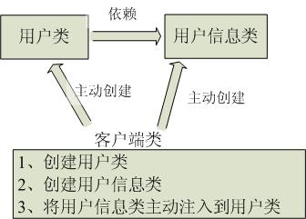
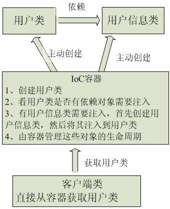

# Spring进阶：谈谈对Spring IOC的理解 
## IoC是什么
Ioc—Inversion of Control，即**控制反转**，不是什么技术，而是一种设计思想。在Java开发中，Ioc意味着**将你设计好的对象交给容器控制，而不是传统的在你的对象内部直接控制**。

* 谁控制谁，控制什么  
    传统Java SE程序设计，我们直接在对象内部通过**new进行创建对象**，是程序主动去创建依赖对象；而IoC是有专门一个容器来创建这些对象，即**由Ioc容器来控制对象的创建**；  
    **谁控制谁？当然是IoC 容器控制了对象；控制什么？那就是主要控制了外部资源获取（不只是对象包括比如文件等）**。
* 为何是反转，哪些方面反转了  
有反转就有正转，传统应用程序是由我们自己在对象中主动控制去直接获取依赖对象，也就是正转；而**反转则是由容器来帮忙创建及注入依赖对象**；为何是反转？因为**由容器帮我们查找及注入依赖对象，对象只是被动的接受依赖对象**，所以是反转；哪些方面反转了？**依赖对象的获取**被反转了。

* 传统程序设计

* 有IoC/DI容器后程序设计

IoC很好的体现了面向对象设计法则之一—— **好莱坞法则：“别找我们，我们找你”**；即由IoC容器帮对象找相应的依赖对象并注入，而不是由对象主动去找。

## IoC和DI
DI— **Dependency Injection**，即"依赖注入"：**组件之间依赖关系由容器在运行期决定**，形象的说，即**由容器动态的将某个依赖关系注入到组件之中**。依赖注入的目的并非为软件系统带来更多功能，而是**为了提升组件重用的频率**，并为系统搭建一个灵活、可扩展的平台。通过依赖注入机制，我们只需要通过简单的配置，而无需任何代码就可指定目标需要的资源，完成自身的业务逻辑，而不需要关心具体的资源来自何处，由谁实现。

* 谁依赖于谁：  
当然是应用程序依赖于IoC容器；

* 为什么需要依赖  
应用程序需要IoC容器来提供对象需要的外部资源；

* 谁注入谁
IoC容器注入应用程序某个对象(应用程序依赖的对象)；

* 注入了什么：
就是注入某个对象所需要的外部资源（包括对象、资源、常量数据）

IoC和DI由什么关系呢？其实它们是同一个概念的不同角度描述，由于控制反转概念比较含糊（可能只是理解为容器控制对象这一个层面，很难让人想到谁来维护对象关系），所以2004年大师级人物Martin Fowler又给出了一个新的名字：“依赖注入”，相对IoC 而言，“依赖注入”明确描述了“被注入对象依赖IoC容器配置依赖对象”

[参考资料](https://www.cnblogs.com/xiaoxi/p/5930736.html)

