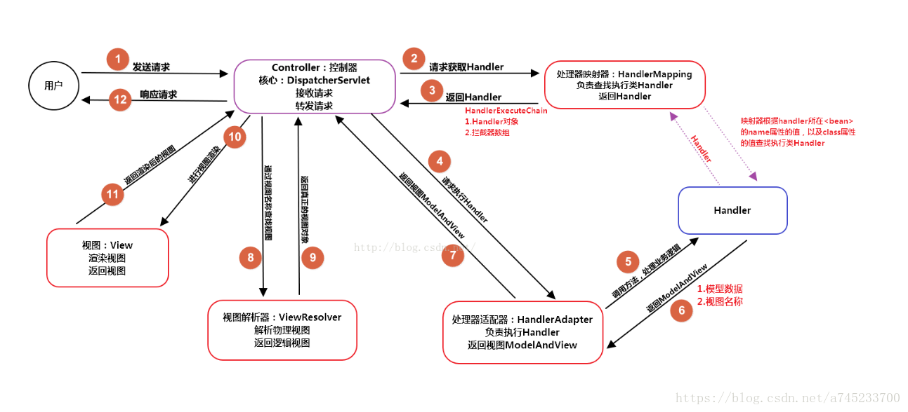
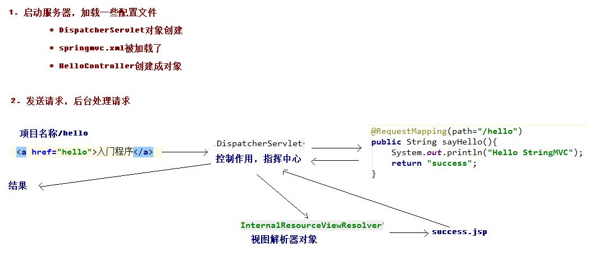

# 1. Spring原理
参考文档：  
https://blog.csdn.net/a745233700/article/details/80963758
<!-- TOC -->

- [1. Spring原理](#1-spring原理)
    - [1.1. 什么是SpringMVC?](#11-什么是springmvc)
    - [1.2. Spring MVC原理](#12-spring-mvc原理)
    - [1.3. SpringMVC的优点：](#13-springmvc的优点)
    - [1.4. Spring MVC的主要组件？](#14-spring-mvc的主要组件)
- [springMVC HelloWorld](#springmvc-helloworld)
    - [流程总结](#流程总结)
    - [RequestMapping注解](#requestmapping注解)
        - [作用](#作用)
        - [属性](#属性)
    - [请求参数绑定](#请求参数绑定)
        - [请求绑定参数入门](#请求绑定参数入门)
        - [请求参数绑定实体](#请求参数绑定实体)

<!-- /TOC -->
## 1.1. 什么是SpringMVC?
&emsp;&emsp;Spring MVC是一个基于Java的实现了MVC设计模式的**请求驱动**类型的轻量级Web框架，通过把Model，View，Controller分离，将web层进行职责解耦，把复杂的web应用分成逻辑清晰的几部分，简化开发，减少出错，方便组内开发人员之间的配合。

&emsp;&emsp;SpringMVC框架是以请求为驱动，围绕Servlet设计，将请求发给控制器，然后通过模型对象，分派器来展示请求结果视图。其中核心类是DispatcherServlet，它是一个Servlet，顶层是实现的Servlet接口。

总结：  
（1）请求驱动类型的轻量级web框架；  
（2）Model，View，Controller分离，讲web层进行职责解耦，逻辑清晰；  
（3）springMVC就是spring的一个子模块；  
（4）

**分析：**  
M-Model 模型（完成业务逻辑：有javaBean构成，service+dao+entity）  
V-View 视图（做界面的展示  jsp，html……）  
C-Controller 控制器（接收请求—>调用模型—>根据结果派发页面）  

## 1.2. Spring MVC原理

<div align="center"><a></a></div>

**step1:**   
（1）用户发送请求至前端控制器DispatcherServlet；  
（2） DispatcherServlet收到请求后，调用HandlerMapping（处理器映射器），请求获取Handler；  
（3）HandlerMapping根据请求url找到具体的Handler，生成Handler对象及Handler拦截器(如果有则生成)，一并返回给DispatcherServlet；  
（4）DispatcherServlet 调用 HandlerAdapter(处理器适配器),请求执行Handler；  
（5）HandlerAdapter 经过适配调用Handler,处理业务逻辑；  
**step2:**  
（6）Handler执行完成返回视图ModelAndView；  
（7）HandlerAdapter将Handler执行结果ModelAndView返回给DispatcherServlet；  
（8）DispatcherServlet将ModelAndView传给ViewResolver视图解析器进行解析；  
（9）ViewResolver解析后返回具体View；  
（10）DispatcherServlet对View进行渲染视图（即将模型数据填充至视图中）  
（11）DispatcherServlet响应用户。  

## 1.3. SpringMVC的优点：
（1）可以支持各种视图技术,而不仅仅局限于JSP；  
（2）与Spring框架集成（如IoC容器、AOP等，实际上是Spring的一个子模块）；  
（3）清晰的角色分配：前端控制器(dispatcherServlet) , 请求到处理器映射（handlerMapping), 处理器适配器（HandlerAdapter), 视图解析器（ViewResolver）。  
（4） 支持各种请求资源的映射策略。
## 1.4. Spring MVC的主要组件？

（1）前端控制器 DispatcherServlet（不需要程序员开发）  
作用：接收请求、响应结果，相当于转发器，有了DispatcherServlet 就减少了其它组件之间的耦合度。  
（2）处理器映射器HandlerMapping（不需要程序员开发）  
作用：根据请求的URL来查找Handler  
（3）处理器适配器HandlerAdapter  
注意：在编写Handler的时候要按照HandlerAdapter要求的规则去编写，这样适配器HandlerAdapter才可以正确的去执行Handler。  
（4）处理器Handler（需要程序员开发）  
（5）视图解析器 ViewResolver（不需要程序员开发）  
作用：进行视图的解析，根据视图逻辑名解析成真正的视图（view）  

（6）视图View（需要程序员开发jsp）

View是一个接口， 它的实现类支持不同的视图类型（jsp，freemarker，pdf等等）

# springMVC HelloWorld 
## 流程总结
<div align="center"><a></a></div>

## RequestMapping注解
### 作用
1. RequestMapping注解的作用是**建立请求URL和处理方法(Handler类中)之间的对应关系**  
2. RequestMapping注解可以作用在方法和类上   
    * 作用在类上：第一级的访问目录  
    * 作用在方法上：第二级的访问目录
```java
//HelloController.java
@Controller
@RequestMapping(path="/user")
public class HelloController {
    @RequestMapping(path="testRequestMapping")
    public String testRequestMapping(){
        System.out.println("测试RequestMapping注解....");
        return "success";
    }
}

//index.jsp
<a href="user/testRequestMapping">RequestMapping</a>  //目录的对应

```


### 属性
* path属性和value属性功能相同；默认是value，如果不写属性名称默认即**value**;  
* method:用于指定请求方式：GET;POST...  
* params:用于指定限制请求参数的条件。
```java
@RequestMapping(path="testRequestMapping",params={"username=hehe"})

<a href="user/testRequestMapping?username=hehe>RequestMapping</a>  //目录的对应
//
```
## 请求参数绑定
### 请求绑定参数入门
1.格式：username=haha&password=123  
2. SpringMVC的参数绑定过程是**把表单提交的请求参数，作为控制器中方法的参数进行绑定的。**  
&emsp;&emsp;表单指jsp文件，这里指param.jsp；

**注意事项：**
param.jsp的路径要和index.jsp路径相同
```java
//ParamController.java
/**
 * 请求参数绑定入门
 */
@Controller
@RequestMapping(path="/param")
public class ParamController {

    @RequestMapping(path="/testParam")
    public String testParam(String username,String password){
        System.out.println("执行了！");
        System.out.println("用户名："+ username + "密码：" + password);
        return "success";
    }
}

//param.jsp
<a href="param/testParam?username=hadoop&password=hadoop">请求参数绑定</a>

//index.jsp
<a href="param/testParam?username=hadoop&password=hadoop">请求参数绑定</a>

```

### 请求参数绑定实体


