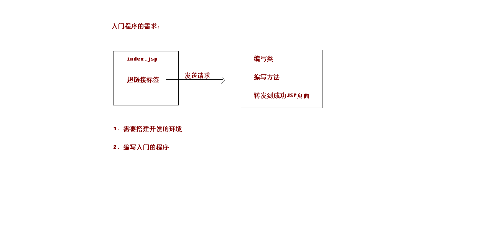
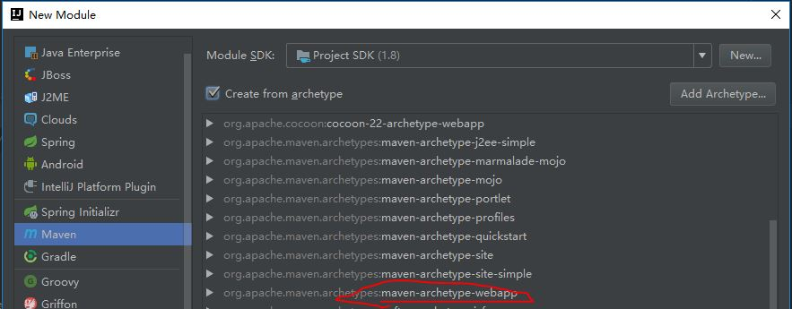
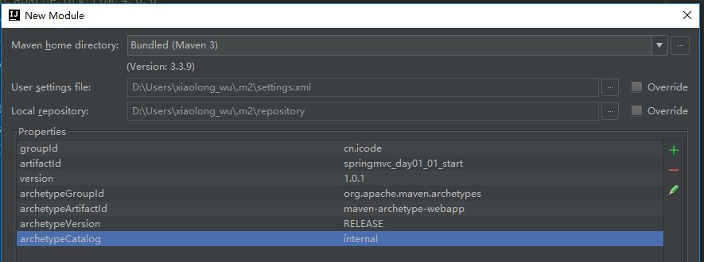
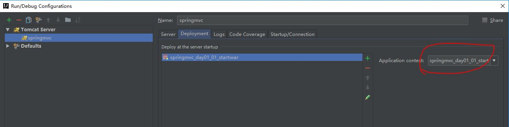
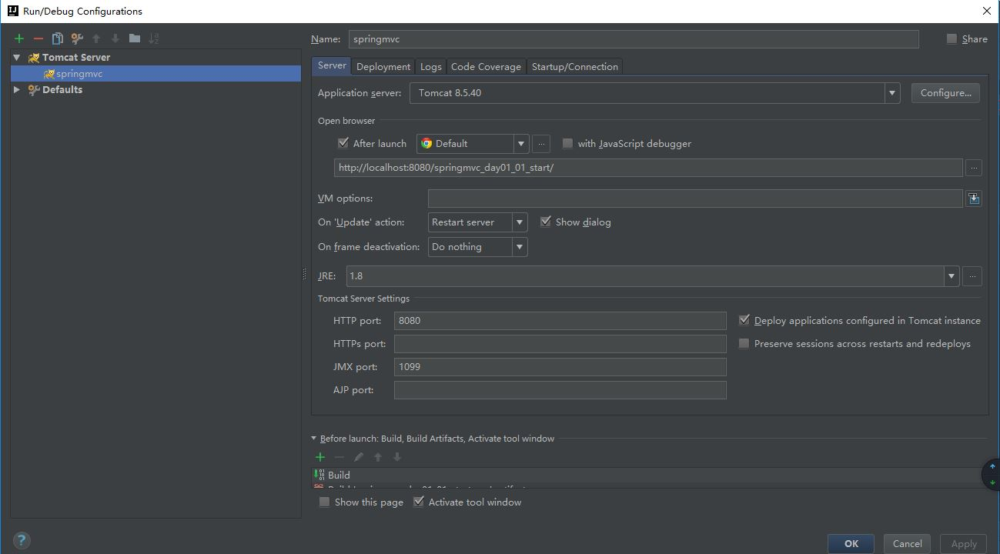
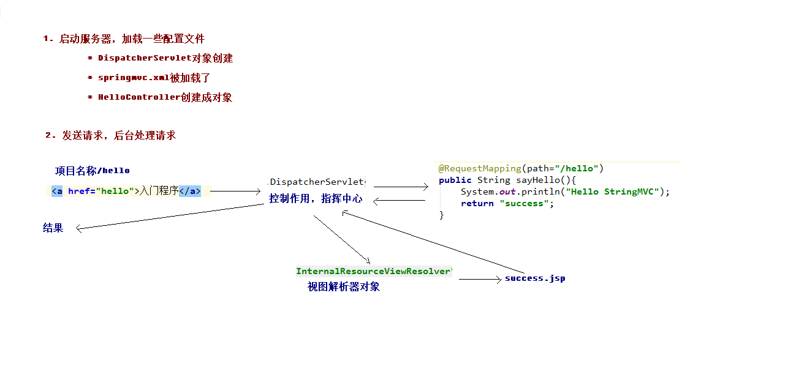
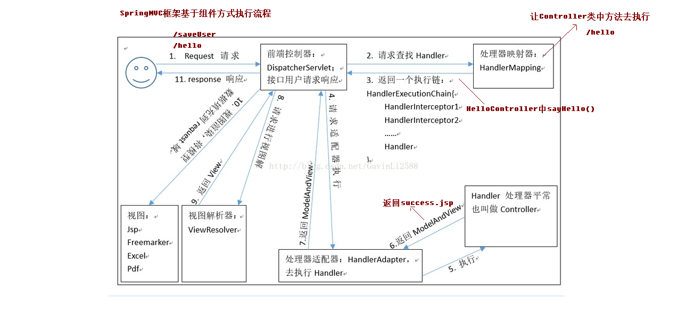

<!-- TOC -->

- [1. SpringMVC入门案例](#1-springmvc入门案例)
    - [1.1. SpringMVC入门案例需求介绍](#11-springmvc入门案例需求介绍)
    - [1.2. 搭建开发环境](#12-搭建开发环境)
    - [1.3. 入门总结](#13-入门总结)
    - [1.4. 组件介绍](#14-组件介绍)
    - [1.5. RequestMapping的作用](#15-requestmapping的作用)

<!-- /TOC -->
# 1. SpringMVC入门案例
## 1.1. SpringMVC入门案例需求介绍
* 需求介绍
<div align="center"><a></a></div>


## 1.2. 搭建开发环境  
* 创建工程springmvc
* 创建module springmvc_day01_01_start --> 
<div align="center"><a></a></div> 

* 解决maven项目创建过慢的问题（需要下载一些jar包）
<div align="center"><a></a></div> 

* 补充目录  
在src下面创建java和resources文件夹，并设置java为source root；resources为resources root
* 引入依赖  
```xml
<dependency>
    <groupId>org.springframework</groupId>
    <artifactId>spring-context</artifactId>
    <version>${spring.version}</version>
</dependency>
<dependency>
    <groupId>org.springframework</groupId>
    <artifactId>spring-web</artifactId>
    <version>${spring.version}</version>
</dependency>
<dependency>
    <groupId>org.springframework</groupId>
    <artifactId>spring-webmvc</artifactId>
    <version>${spring.version}</version>
</dependency>
<dependency>
    <groupId>javax.servlet</groupId>
    <artifactId>servlet-api</artifactId>
    <version>2.5</version>
    <scope>provided</scope>
</dependency>
<dependency>
    <groupId>javax.servlet.jsp</groupId>
    <artifactId>jsp-api</artifactId>
    <version>2.0</version>
    <scope>provided</scope>
</dependency>
```
* 配置前端控制器
在springmvc_day01_01_start\src\main\webapp 目录下的web.xml文件加入内容：
```xml
<web-app>
    <display-name>Archetype Created Web Application</display-name>
    <!-- SpringMVC的核心控制器 -->
    <servlet>
        <servlet-name>dispatcherServlet</servlet-name>
        <servlet-class>org.springframework.web.servlet.DispatcherServlet</servlet-class>
        <!-- 配置Servlet的初始化参数，读取springmvc的配置文件，创建spring容器 -->
        <init-param>
            <param-name>contextConfigLocation</param-name>
            <param-value>classpath:springmvc.xml</param-value>
        </init-param>
        <!-- 配置servlet启动时加载对象 -->
        <load-on-startup>1</load-on-startup>
    </servlet>
    <servlet-mapping>
        <servlet-name>dispatcherServlet</servlet-name>
        <url-pattern>/</url-pattern>
    </servlet-mapping>
</web-app>
```
同时，需要在resource目录下创建springmvc.xml配置文件
* 配置服务器
    * run -- edit configuration
  <div align="center"><a></a></div>   
  <div align="center"><a></a></div> 

 ## 入门程序编写
 1.index文件内容信息不完整，删除后用IDEA重新创建
 ```jsp
<%@ page contentType="text/html;charset=UTF-8" language="java" %>
<html>
<head>
    <title>Title</title>
</head>
<body>
    <h3>入门程序</h3>
    <a href="hello">入门程序</a>
</body>
</html>
 ``` 
 2.创建Controller类
 ```java
package cn.itcast.controller;

import org.springframework.stereotype.Controller;
import org.springframework.web.bind.annotation.RequestMapping;

/**
 * function:控制器类
 * Producered by xiaolong_wu on 2019/7/28
 **/
@Controller
public class HelloController {

    @RequestMapping(path="/hello")
    public String sayHello(){
        System.out.println("Hello StringMVC");
        return "success";
    }
}
 ```
3.配置springmvc.xml
* 用于创建对象【注解扫描】
```xml
<!-- 配置spring创建容器时要扫描的包 -->
<context:component-scan base-package="com.itheima"></context:component-scan>
```
* 用于创建视图解析器对象
```xml
<!-- 配置视图解析器 -->
<bean id="viewResolver"
class="org.springframework.web.servlet.view.InternalResourceViewResolver">
<property name="prefix" value="/WEB-INF/pages/"></property>
<property name="suffix" value=".jsp"></property>
</bean>
```
* 配置spring开启注解mvc的支持
```xml
<!-- 配置spring开启注解mvc的支持-->
<mvc:annotation-driven/>
</beans>
```
## 1.3. 入门总结
  <div align="center"><a></a></div> 

## 1.4. 组件介绍
 <div align="center"><a></a></div> 

## 1.5. RequestMapping的作用
1. RequestMapping注解的作用是建立请求URL和处理方法之间的对应关系
2. RequestMapping注解可以作用在方法和类上
	1.作用在类上：第一级的访问目录
	2.作用在方法上：第二级的访问目录
	3.细节：路径可以不编写 / 表示应用的根目录开始
	4.细节：${ pageContext.request.contextPath }也可以省略不写，但是路径上不能写 /
3. RequestMapping的属性
	1.path 指定请求路径的url
	2.value value属性和path属性是一样的
	3.mthod 指定该方法的请求方式
	4.params 指定限制请求参数的条件
	5.headers 发送的请求中必须包含的请求头

* 配置Controller
```java
package cn.itcast.controller;

import org.springframework.stereotype.Controller;
import org.springframework.web.bind.annotation.RequestMapping;
/**
 * function:控制器类
 * Producered by xiaolong_wu on 2019/7/28
 **/
@Controller
@RequestMapping(path = "/user")
public class HelloController {
    @RequestMapping(path="/hello")
    public String sayHello(){
        System.out.println("Hello StringMVC!");
        return "success";
    }
    @RequestMapping(path="/testResuestMapping")
    public String testResuestMapping(){
        System.out.println("测试ResuestMapping注解！");
        return "success";
    }
}
```
2.修改index.jsp
```jsp
<a href="user/testResuestMapping">ResuestMapping注解！</a>
```
3.重启服务器


