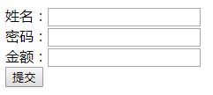

# 请求参数绑定
## 请求参数绑定入门
1.创建param.jsp
```jsp
<%@ page contentType="text/html;charset=UTF-8" language="java" %>
<html>
<head>
    <title>Title</title>
</head>
<body>
<!-- 请求参数绑定 -->
<a href="param/testParam">请求参数绑定！</a>
</body>
</html>
```
2.创建ParamController类
```java
package cn.itcast.controller;

import org.springframework.stereotype.Controller;
import org.springframework.web.bind.annotation.RequestMapping;

/**
 * function: 请求参数绑定
 * Producered by xiaolong_wu on 2019/7/28
 **/
@Controller
@RequestMapping("/param")
public class ParanController {

    @RequestMapping("/testParam")
    public String testParam(String username,String password){
        System.out.println("执行了！...");
        System.out.println("用户名：" + username);
        System.out.println("密码：" + password);
        return "success";
    }
}
```
【备注】
在超链接文件中，用相对路径，
```jsp
<a href="param/testParam?username=hehe&password=123">请求参数绑定！</a>
<%--而不是--%>
<a href="/param/testParam?username=hehe&password=123">请求参数绑定！</a>
```

3.浏览器输入： http://localhost:8088/springmvc_day01_01_start/param.jsp

4.输出结果：  
```
执行了！...
用户名：hehe
密码：123
```

## 请求参数绑定实体
请求的参数比较多，则采用javabean的形式
1.创建Account实体
```java
package cn.itcast.domain;

import java.io.Serializable;
/**
 * function:
 * Producered by xiaolong_wu on 2019/7/28
 **/
public class Account implements Serializable {
    private String username;
    private String password;
    private Double money;

    public String getUsername() {
        return username;
    }
    public void setUsername(String username) {
        this.username = username;
    }
    public String getPassword() {
        return password;
    }
    public void setPassword(String password) {
        this.password = password;
    }
    public Double getMoney() {
        return money;
    }
    public void setMoney(Double money) {
        this.money = money;
    }
    @Override
    public String toString() {
        return "Account{" +
                "username='" + username + '\'' +
                ", password='" + password + '\'' +
                ", money=" + money +
                '}';
    }
}
```
2.创建Controller类
```java
package cn.itcast.controller;
import cn.itcast.domain.Account;
import org.springframework.stereotype.Controller;
import org.springframework.web.bind.annotation.RequestMapping;
/**
 * function: 请求参数绑定
 * Producered by xiaolong_wu on 2019/7/28
 **/
@Controller
@RequestMapping("/param")
public class ParanController {
    @RequestMapping("/saveAccount")
    public String saveAccount(Account account){
        System.out.println("测试参数绑定！！...");
        System.out.println(account);
        return "success";
    }
}
```
3.配置param.jsp
```jsp
<html>
<head>
    <title>Title</title>
</head>
<body>
<!-- 请求参数绑定 -->
<%--<a href="param/testParam?username=hehe&password=123">请求参数绑定！</a>--%>
    <form action="param/saveAccount" method="post">
        姓名：<input type="text" name="username" /><br/>
        密码：<input type="text" name="password" /><br/>
        金额：<input type="text" name="money" /><br/>
        <input type="submit" value="提交" />
    </form>
</body>
</html>
```

4.重启服务器，跳转到指定页面
http://localhost:8088/springmvc_day01_01_start/param.jsp
<div align="center"><a></a></div> 

4.解决中文乱码问题
在web.xml文件中做如下配置
```xml
<!-- 配置过滤器，解决中文乱码的问题 -->
    <filter>
        <filter-name>characterEncodingFilter</filter-name>
        <filter-class>org.springframework.web.filter.CharacterEncodingFilter</filter-class>
        <!-- 指定字符集 -->
        <init-param>
            <param-name>encoding</param-name>
            <param-value>UTF-8</param-value>
        </init-param>
    </filter>
    <filter-mapping>
        <filter-name>characterEncodingFilter</filter-name>
        <url-pattern>/*</url-pattern>
    </filter-mapping>
```


