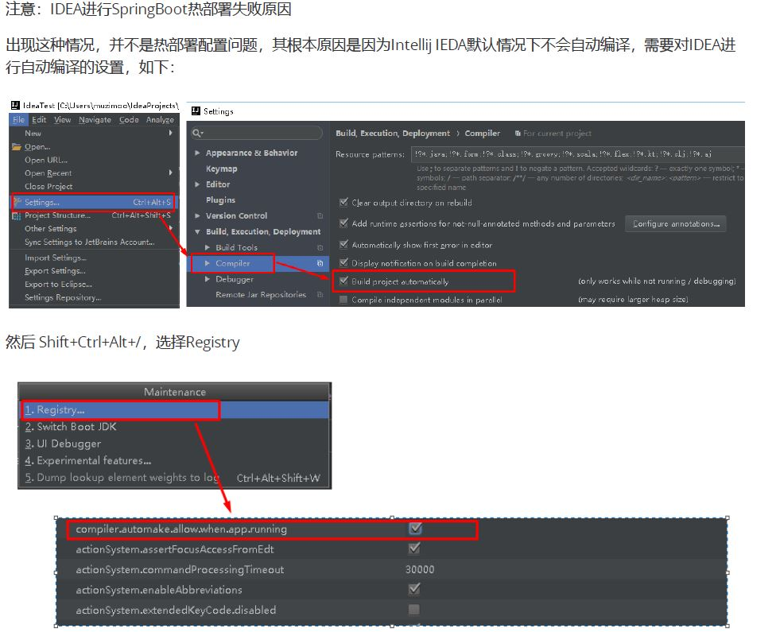

本文目录
<!-- TOC -->

- [1. SpringBoot简介](#1-springboot简介)
    - [1.1. 原有Spring优缺点分析](#11-原有spring优缺点分析)
        - [1.1.1. Spring的优点分析](#111-spring的优点分析)
        - [1.1.2. Spring缺点分析](#112-spring缺点分析)
    - [1.2. SpringBoot概述](#12-springboot概述)
        - [1.2.1. SpringBoot解决上述Spring的缺点](#121-springboot解决上述spring的缺点)
        - [1.2.2. SpringBoot的特点](#122-springboot的特点)
        - [1.2.3. SpringBoot的核心功能](#123-springboot的核心功能)
- [2. SpringBoot Quick Start](#2-springboot-quick-start)
    - [2.1. springboot依赖](#21-springboot依赖)
    - [2.2. 编写SpringBoot引导类](#22-编写springboot引导类)
    - [2.3. 编写Controller](#23-编写controller)
    - [2.4. 测试](#24-测试)
- [3. Springboot整合JUnit](#3-springboot整合junit)
    - [3.1. Springboot集成JUnit](#31-springboot集成junit)
        - [3.1.1. 添加依赖](#311-添加依赖)
        - [3.1.2. 编写QuickStartController测试类](#312-编写quickstartcontroller测试类)
- [4. 快速入门解析](#4-快速入门解析)
    - [4.1. 注解解析](#41-注解解析)
    - [4.2. SpringBoot工程热部署](#42-springboot工程热部署)
    - [4.3. 起步依赖分析](#43-起步依赖分析)
        - [4.3.1. 分析spring-boot-starter-parent](#431-分析spring-boot-starter-parent)
        - [4.3.2. 分析spring-boot-starter-web](#432-分析spring-boot-starter-web)
    - [主程序类，主入口类](#主程序类主入口类)
    - [4.4. SpringBoot配置文件](#44-springboot配置文件)
- [5. 【写在后面】](#5-写在后面)
    - [博客源代码](#博客源代码)
        - [[项目代码](https://github.com/eastlong/icode/tree/master/springboot/bootstart)](#项目代码httpsgithubcomeastlongicodetreemasterspringbootbootstart)
    - [关注更多](#关注更多)
        - [5.1. [1.我的博客](https://me.csdn.net/gunhunti4524)](#51-1我的博客httpsmecsdnnetgunhunti4524)
        - [5.2. [2.我的Github](https://github.com/eastlong/)](#52-2我的githubhttpsgithubcomeastlong)
        - [5.3. 我的微信公众号：](#53-我的微信公众号)

<!-- /TOC -->
# 1. SpringBoot简介
## 1.1. 原有Spring优缺点分析  
### 1.1.1. Spring的优点分析  
Spring是Java企业版（Java Enterprise Edition，JEE，也称J2EE）的轻量级代替品。无需开发重量级的Enterprise
JavaBean（EJB），Spring为企业级Java开发提供了一种相对简单的方法，通过依赖注入和面向切面编程，用简单
的Java对象（Plain Old Java Object，POJO）实现了EJB的功能。

### 1.1.2. Spring缺点分析
1. 重配置  
&emsp;&emsp;一开始，Spring用XML配置，而且是很多XML配置。Spring 2.5引入了基于注解的组件扫描，这消除了大量针对应用程序自身组件的显式XML配置。Spring 3.0引入了基于Java的配置，这是一种类型安全的可重构配置方式，可以代替XML。
2. 依赖管理耗时耗力  
&emsp;&emsp;在环境搭建时，需要分析要导入哪些库的坐标，而且还需要
分析导入与之有依赖关系的其他库的坐标，一旦选错了依赖的版本，随之而来的不兼容问题就会严重阻碍项目的开发进度。
## 1.2. SpringBoot概述
### 1.2.1. SpringBoot解决上述Spring的缺点
&emsp;&emsp;SpringBoot对上述Spring的缺点进行的改善和优化，基于约定优于配置的思想，可以让开发人员不必在配置与逻辑业务之间进行思维的切换，全身心的投入到逻辑业务的代码编写中，从而大大提高了开发的效率，一定程度上缩短了项目周期。
### 1.2.2. SpringBoot的特点
1. 为基于Spring的开发提供更快的入门体验  
2. 开箱即用，没有代码生成，也无需XML配置。同时也可以修改默认值来满足特定的需求。  
3. 提供了一些大型项目中常见的非功能性特性，如嵌入式服务器、安全、指标，健康检测、外部配置等
4. **SpringBoot不是对Spring功能上的增强，而是提供了一种快速使用Spring的方式。**
### 1.2.3. SpringBoot的核心功能
* 起步依赖  
&emsp;&emsp;起步依赖本质上是一个Maven项目对象模型（Project Object Model，POM），定义了对其他库的传递依赖，这些东西加在一起即支持某项功能。  
&emsp;&emsp;简单的说，**起步依赖**就是将具备某种功能的坐标打包到一起，并提供一些默认的功能。
* 自动配置  
&emsp;&emsp;SpringBoot的自动配置是一个运行时（更准确地说，是应用程序启动时）的过程，考虑了众多因素，才决定Spring配置应该用哪个，不该用哪个。该过程是Spring自动完成的。

# 2. SpringBoot Quick Start
## 2.1. springboot依赖
* SpringBoot要求，项目要继承SpringBoot的起步依赖spring-boot-starter-parent
```xml
<parent>
    <groupId>org.springframework.boot</groupId>
    <artifactId>spring-boot-starter-parent</artifactId>
    <version>2.0.1.RELEASE</version>
</parent>
```
* SpringBoot要集成SpringMVC进行Controller的开发，所以项目要导入web的启动依赖
```xml
<dependencies>
    <dependency>
        <groupId>org.springframework.boot</groupId>
        <artifactId>spring-boot-starter-web</artifactId>
    </dependency>
</dependencies>
```

## 2.2. 编写SpringBoot引导类
* 要通过SpringBoot提供的引导类起步SpringBoot才可以进行访问
```java
package com.itheima;
import org.springframework.boot.SpringApplication;
import org.springframework.boot.autoconfigure.SpringBootApplication;

@SpringBootApplication
public class MySpringBootApplication {
    public static void main(String[] args) {
        SpringApplication.run(MySpringBootApplication.class);
    }
}
```
## 2.3. 编写Controller
在引导类MySpringBootApplication同级包或者子级包中创建QuickStartController
```java
package com.itheima.controller;
import org.springframework.stereotype.Controller;
import org.springframework.web.bind.annotation.RequestMapping;
import org.springframework.web.bind.annotation.ResponseBody;

@Controller
public class QuickStartController {
    @RequestMapping("/quick")
    @ResponseBody
    public String quick(){
        return "SpringBoot访问成功";
    }
}
```
## 2.4. 测试
执行SpringBoot起步类的主方法。
查看日志，发现：
```
Tomcat started on port(s): 8080 (http) with context path '
```
访问url:  
http://localhost:8080/quick

# 3. Springboot整合JUnit
对于开发人员来说，写JUnit是必备的技能之一。在企业真实开发环境中，往往会有UT检测，就是对单元测试类的指标检测。伴随着项目的开发，单元测试类的开发也必不可少。
## 3.1. Springboot集成JUnit
### 3.1.1. 添加依赖
```xml
<!--测试的起步依赖-->
<dependency>
    <groupId>org.springframework.boot</groupId>
    <artifactId>spring-boot-starter-test</artifactId>
    <scope>test</scope>
</dependency>
```
### 3.1.2. 编写QuickStartController测试类
```java
@RunWith(SpringRunner.class)
@SpringBootTest(classes = MyApplication.class)
public class QuickStartControllerTest {
    @Autowired
    private QuickStartController controller;

    @Test
    public void testQuick(){
        System.out.println("test result:" + controller.quick());
    }
}
```

【备注】  
* SpringRunner继承自SpringJUnit4ClassRunner，使用哪一个Spring提供的测试引擎都可以。  
@SpringBootTest的属性指定的是引导类的字节码对象。


# 4. 快速入门解析
## 4.1. 注解解析
* @SpringBootApplication：标注SpringBoot的启动类，该注解具备多种功能（后面详细剖析）
* SpringApplication.run(MySpringBootApplication.class) 代表运行SpringBoot的启动类，参数为SpringBoot启动类的字节码对象。

## 4.2. SpringBoot工程热部署
我们在开发中反复修改类、页面等资源，每次修改后都是需要重新启动才生效，这样每次启动都很麻烦，浪费了大量的时间，我们可以在修改代码后不重启就能生效，在 pom.xml 中添加如下配置就可以实现这样的功能，我们称之为`热部署`。
1.添加依赖
```xml
<!--热部署配置-->
<dependency>
    <groupId>org.springframework.boot</groupId>
    <artifactId>spring-boot-devtools</artifactId>
</dependency>
```
2.IDEA配置
<div align="center"><a></a></div>

## 4.3. 起步依赖分析

### 4.3.1. 分析spring-boot-starter-parent
* 我们的SpringBoot工程继承spring-boot-starter-parent后已经具备版本锁定等配置了。所以起步依赖的作用就是进行``依赖的传递``。  
* spring-boot-starter-parent父项目是spring‐boot‐dependencies，他来真正管理SpringBoot应用里面所有依赖(版本)；  
**以后我们导入依赖默认是不需要写版本；（没有在dependencies里面管理的依赖自然需要声明版本号）**
```xml
<parent>
    <groupId>org.springframework.boot</groupId>
    <artifactId>spring-boot-starter-parent</artifactId>
    <version>2.0.1.RELEASE</version>
</parent>

<parent>
<groupId>org.springframework.boot</groupId>
<artifactId>spring‐boot‐dependencies</artifactId>
<version>2.0.1.RELEASE</version>
<relativePath>../../spring‐boot‐dependencies</relativePath>
</parent>
```
### 4.3.2. 分析spring-boot-starter-web
* 启动器  
spring-boot-starter-web就是将web开发要使用的spring-web、spring-webmvc等坐标进行了“打包”，这样我们的工程只要引入spring-boot-starter-web起步依赖的坐标就可以进行web开发了，同样体现了**依赖传递**的作用。

## 主程序类，主入口类
```java
@SpringBootApplication
public class MySpringBootApplication {
    public static void main(String[] args) {
        SpringApplication.run(MySpringBootApplication.class);
    }
}
```
@SpringBootApplication:标注一个主程序类，说明这是一个Spring Boot应用。


## 4.4. SpringBoot配置文件
SpringBoot是基于约定的，所以很多配置都有默认值，但如果想使用自己的配置替换默认配置的话，就可以使用application.properties或者application.yml（application.yaml）进行配置。

SpringBoot默认会从Resources目录下加载application.properties或application.yml（application.yaml）文件其中，application.properties文件是键值对类型的文件，之前一直在使用，所以此处不在对properties文件的格式进行阐述。除了properties文件外，SpringBoot还可以使用yml文件进行配置。


# 5. 【写在后面】  
## 博客源代码
### [项目代码](https://github.com/eastlong/icode/tree/master/springboot/bootstart)

## 关注更多
### 5.1. [1.我的博客](https://me.csdn.net/gunhunti4524)
### 5.2. [2.我的Github](https://github.com/eastlong/)   
### 5.3. 我的微信公众号：
**Healthy Learner**
<div align="center"><a></a></div>

