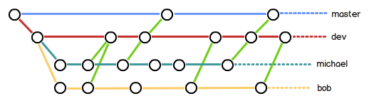

<!-- TOC -->

- [1. 分支管理](#1-分支管理)
    - [1.1. 创建分支](#11-创建分支)
        - [1.1.1. 创建分支](#111-创建分支)
        - [1.1.2. 合并](#112-合并)
    - [1.2. 解决冲突](#12-解决冲突)
    - [1.3. 分支管理策略](#13-分支管理策略)
        - [1.3.1. 分支策略](#131-分支策略)
    - [1.4. Bug分支](#14-bug分支)
    - [Feature分支](#feature分支)

<!-- /TOC -->
**参考文档：**  
[廖雪峰Git教程](https://www.liaoxuefeng.com/wiki/896043488029600)
# 1. 分支管理
## 1.1. 创建分支
### 1.1.1. 创建分支
git init初始化后，默认创建了一个主分支master；
创建分支  
```shell
# -b是参数，b即build
git checkout -b dev
Switched to a new branch 'dev'

## 上面的代码相当于
$ git branch dev
$ git checkout dev
Switched to branch 'dev'

## 查看当前分支；git branch命令会列出所有分支，当前分支前面会标一个*号
$ git branch
* dev
  master
```
在readme.txt文件中添加一行：
```shell
Creating a new branch is quick
```
提交到git
```shell
$ git add readme.txt 
$ git commit -m "branch test"
```

### 1.1.2. 合并

首先要切换回master分支
```shell
$ git checkout master

## 合并分支
$ git merge dev

## 删除分支；d即delete
$ git branch -d dev

## 查看分支
$ git branch
* master

```

## 1.2. 解决冲突
step1：新建分支feature1
```shell
$ git checkout -b feature1
Switched to a new branch 'feature1'
```
修改readme.txt最后一行，改为：
```shell
Creating a new branch is quick AND simple.
```
step2：在feature1分支上提交：
```shell
$ git add readme.txt

$ git commit -m "AND simple"
```
step3：切换到```master```分支
```shell
$ git checkout master
Switched to branch 'master'

```
在master分支上把readme.txt文件的最后一行改为：
```shell
Creating a new branch is quick & simple.
```
step4：在master分支上提交：
```
$ git add readme.txt 
$ git commit -m "& simple"
[master 5dc6824] & simple
 1 file changed, 1 insertion(+), 1 deletion(-)
```

**现在，master分支和feature1分支各自都分别有新的提交**
这种情况下，Git无法执行“快速合并”，只能试图把各自的修改合并起来，但这种合并就可能会有冲突

```shell
$ git merge feature1
Auto-merging readme.txt
CONFLICT (content): Merge conflict in readme.txt
Automatic merge failed; fix conflicts and then commit the result.

$ cat readme.txt
```
<div align="center"><a></a></div>  

**解决方法：**   
有顺序依次提交，确保没有问题，然后提交并合并！

## 1.3. 分支管理策略
通常，合并分支时，如果可能，Git会用```Fast forward```模式，但这种模式下，删除分支后，会丢掉分支信息。  
如果要强制禁用``Fast forward``模式，Git就会在merge时生成一个新的commit，这样，从分支历史上就可以看出分支信息。
```
  不用--no-ff，实际上只是将master的指针update成dev分支而已，用的还是dev的commit ID，而使用之后，则是重新commit了一哈，有了新的commit ID
```

step1：创建新的分支，并修改readme.txt
```shell
$ git checkout -b dev
Switched to a new branch 'dev'

$ git add readme.txt 
$ git commit -m "add merge"
```
step2：切换回master分支
```shell
$ git checkout master
Switched to branch 'master'

$ git merge --no-ff -m "merge with no-ff" dev

## 查看历史log
$ git log --graph --pretty=oneline --abbrev-commit
```

### 1.3.1. 分支策略
(2) master分支应该是非常稳定的，也就是**仅用来发布新版本**；

(2) 干活都在dev分支上，也就是说，dev分支是不稳定的，到某个时候，比如1.0版本发布时，再**把dev分支合并到master上**，在master分支发布1.0版本；  
(3) 每个人都在dev分支上干活，每个人都有自己的分支，往dev分支上合并就可以了。

<div align="center"><a></a></div> 


## 1.4. Bug分支
遇到Bug时，创建新的临时分支修复bug，修复后合并分支，然后将临时分支删除。    
* 场景：  
&emsp;&emsp;当你接到一个修复代号101的bug任务时，需要创建一个分支issue-101修复它，但是正在dev上进行的工作进行到一半没有提交。  
&emsp;&emsp;Git还提供了一个**stash**功能，可以把当前工作现场“储藏”起来，等以后恢复现场后继续工作

```
$ git status
On branch dev
```
stash功能：
```shell
$ git stash

$ git checkout master

$ git checkout -b issue-101
Switched to a new branch 'issue-101'
## 现在修复bug，需要把“Git is free software ...”改为“Git is a free software ...”，然后提交：
$ git add readme.txt 
$ git commit -m "fix bug 101"

$ git checkout master

# 合并
$ git merge --no-ff -m "merged bug fix 101" issue-101

# 切换回原来的dev分支
$ git checkout dev
$ git status

# 查看stash  list
$ git stash list
```
* 恢复stash  
一是用```git stash apply```恢复，但是恢复后，stash内容并不删除，你需要用```git stash drop```来删除；  
另一种方式是用```git stash pop```，恢复的同时把stash内容也删了：  
```shell
$ git stash pop
```

**小结:**  
修复bug时，我们会通过创建新的bug分支进行修复，然后合并，最后删除；  
当手头工作没有完成时，先把工作现场git stash一下，然后去修复bug，修复后，再git stash pop，回到工作现场。

## Feature分支
