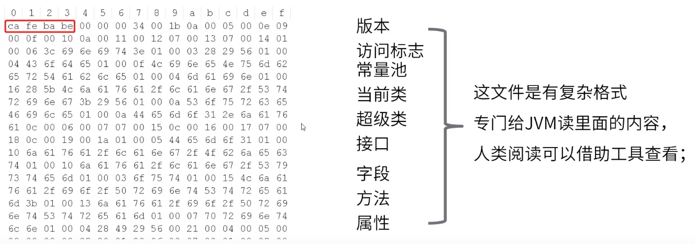
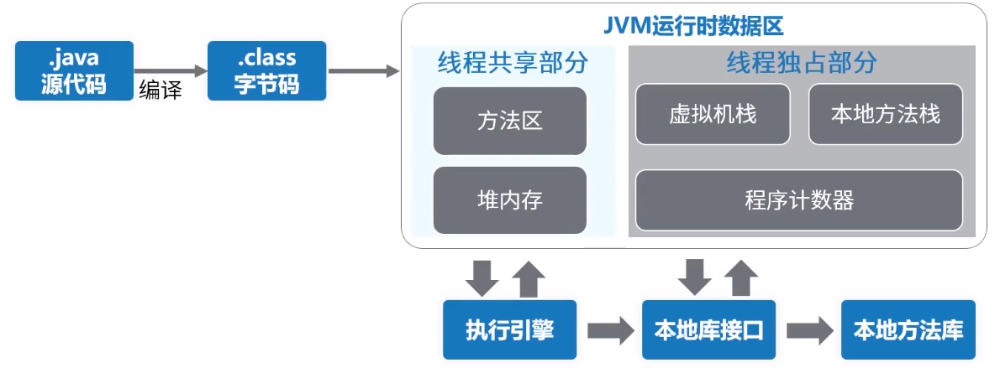

高性能编程(一)：JAVA程序运行原理分析
<!-- TOC -->

- [1. JAVA程序运行原理分析](#1-java程序运行原理分析)
    - [1.1. class文件内容](#11-class文件内容)
    - [1.2. JVM运行时数据区](#12-jvm运行时数据区)

<!-- /TOC -->
# 1. JAVA程序运行原理分析

## 1.1. class文件内容
class文件包含java程序执行的字节码，

## 1.2. JVM运行时数据区

* 线程独占：每个线程都有它独立的空间，随线程的生命周期创建和销毁
* 线程共享：所有线程都能访问这块内存数据，随虚拟机或GC创建和销毁

继续补充

