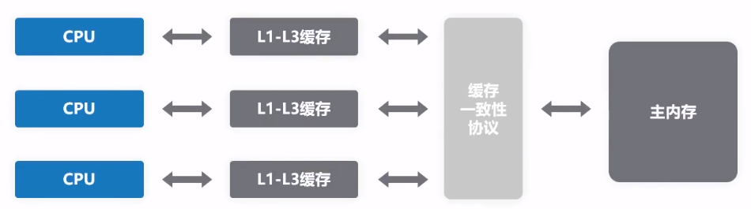
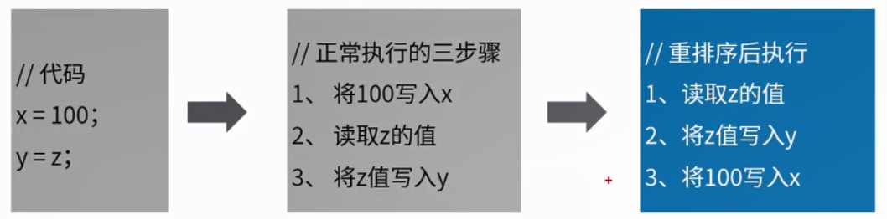

高性能编程(三)：CPU性能优化手段
<!-- TOC -->

- [1. CPU性能优化手段](#1-cpu性能优化手段)
    - [1.1. CPU性能优化手段-缓存](#11-cpu性能优化手段-缓存)
        - [1.1.1. 多级缓存](#111-多级缓存)
        - [1.1.2. 缓存同步协议](#112-缓存同步协议)
    - [1.2. CPU性能优化手段 - 运行时指令重排](#12-cpu性能优化手段---运行时指令重排)
    - [1.3. 存在两个问题](#13-存在两个问题)
    - [1.4. 解决方案 - 内存屏障](#14-解决方案---内存屏障)

<!-- /TOC -->
# 1. CPU性能优化手段

## 1.1. CPU性能优化手段-缓存
为提高程序运行的性能，现代CPU在很多方面对程序进行了优化。
例如：CPU高速缓存。尽可能地避免处理器访问主内存的时间开销，处理器大多会利用缓存（cache）以提高性能。

### 1.1.1. 多级缓存
* **L1 Cache**(一级缓存)是CPU第一层高速缓存，分为数据缓存和指令缓存。一般服务器CPU的L1缓存的容量通常在32-4096KB
* **L2 Cache** 由于一级缓存容量的限制，为再次提高CPU的运算速度，在CPU外部防止一高速存储器，即二级缓存
* **L3 Cache** 现在都是内置的，L3缓存可以进一步降低内存延迟，同时提升大数据计算时处理器的性能。**一般多核共享一个L3缓存**

CPU读取数据是：**先从L1找，再从L2找，再从L3找，然后是内存，最后是外存储器（硬盘）。**

### 1.1.2. 缓存同步协议
多CPU读取同样的数据进行缓存，进行不同的运算，最终写入主内存以哪个CPU为为准？

**缓存同步协议- MESI协议**，利用四个标志位  
多处理器时，单个CPU对缓存中的数据进行了改动，需要通知给其他CPU。也就是说，CPU除了要控制自己的读写操作，还要监听其他CPU发出的通知，从而保证最终一致。

## 1.2. CPU性能优化手段 - 运行时指令重排

1. 指令重排的场景：  
当CPU**写缓存**时发现缓存区块正被其他CPU占用，为提高CPU的处理兴能，可能**将后面的读缓存命令优先执行**。

2. 并非随便重排，需**遵守as-if-serial语义**  
不管怎么重排序（编译器和处理器为了提高并行度），（**单线程**）执行的结果不能被改变。编译器，runtime和处理器都必须遵循as-if-serial语义。意味着：**编译器和处理器不会对存在数据依赖关系的操作做重排序**。

## 1.3. 存在两个问题
1. CPU高速缓存下存在一个问题
缓存中的数据与主内存的数据并不是同步的，各CPU（或CPU核心）间缓存的数据也不是实时同步的。**在同一时间点，各CPU所看到同一内存地址的数据的值可能不一致。**

2. CPU执行指令重排序优化存在一个问题：
虽然遵守遵守as-if-serial语义，单仅仅是在`单CPU`自己执行的情况下能保证结果正确，**多核多线程中，指令逻辑无法分辨因果关联，可能出现乱序执行，导致运行结果出错。**

## 1.4. 解决方案 - 内存屏障
处理器提供了两个**内存屏障指令（Memory Barrier）**用于解决上述两个问题：

**写内存屏障（Store Memory Barrier）**  
在指令后插入`Store Barrier`,能让写入缓存中的最新数据更新写入主内存，让其他线程可见。  
【总结】**强制将缓存中最新数据写入主内存，CPU就不会因为性能考虑而去做指令重排序**

**读内存屏障（Load Memory Barrier）**  
在指令执行前插入`Load Barrier`,可以让高速缓存中的数据失效，强制重新从主内存加载数据。
【总结】**强制 读取主内存数据，让CPU缓存与主内存保持一致，避免了缓存导致的一致性问题**

本章节内容为后续章节**JVM线程安全问题做铺垫**