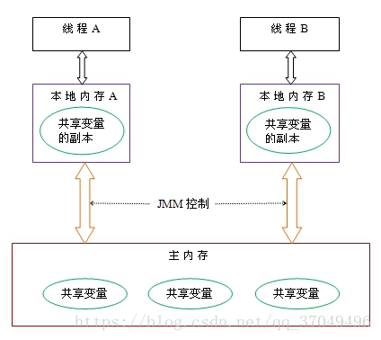
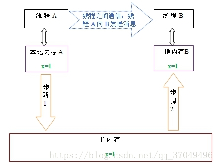
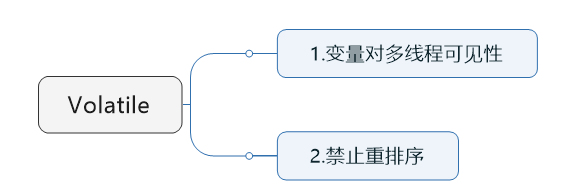

<!-- TOC -->

- [1. 并发编程中的内存模型](#1-并发编程中的内存模型)
    - [1.1. 并发编程中的三个概念](#11-并发编程中的三个概念)
        - [1.1.1. 原子性](#111-原子性)
        - [1.1.2. 可见性](#112-可见性)
        - [1.1.3. 有序性](#113-有序性)
    - [1.2. Java内存模型](#12-java内存模型)
        - [1.2.1. 内存模型的案例分析](#121-内存模型的案例分析)
        - [1.2.2. 总结](#122-总结)
- [2. volatile关键字详解](#2-volatile关键字详解)
    - [2.1. volatile关键字的两层语义](#21-volatile关键字的两层语义)
        - [2.1.1. 案例分析](#211-案例分析)
    - [2.2. volatile保证原子性吗？](#22-volatile保证原子性吗)
        - [2.2.1. 案例分析](#221-案例分析)
        - [2.2.2. 优化方案](#222-优化方案)
    - [2.3. volatile能保证有序性吗？](#23-volatile能保证有序性吗)
        - [2.3.1. 案例分析](#231-案例分析)
    - [2.4. volatile的原理和实现机制](#24-volatile的原理和实现机制)
- [3. 使用volatile关键字的场景](#3-使用volatile关键字的场景)
    - [3.1. 状态标记量](#31-状态标记量)
    - [3.2. double check](#32-double-check)
- [4. 参考资料](#4-参考资料)

<!-- /TOC -->

由于volatile关键字是与Java的内存模型有关的，因此在讲述volatile关键之前，我们先来了解一下与内存模型相关的概念和知识，然后分析了volatile关键字的实现原理，最后给出了几个使用volatile关键字的场景。
# 1. 并发编程中的内存模型
## 1.1. 并发编程中的三个概念
如果要了解Java内存模型，就得对多线程的三大特性有初步的了解。
### 1.1.1. 原子性
原子性：即一个操作或者多个操作 要么全部执行并且执行的过程不会被任何因素打断，要么就都不执行。

### 1.1.2. 可见性
可见性是指当多个线程访问同一个变量时，一个线程修改了这个变量的值，其他线程能够立即看得到修改的值。（**一个线程修改的状态对另一个线程是可见的**）
举个例子：
```java
//线程1执行的代码
int i = 0;
i = 10;
 
//线程2执行的代码
j = i;
```
　　假若执行线程1的是CPU1，执行线程2的是CPU2。由上面的分析可知，当线程1执行 i =10这句时，会先把i的初始值加载到CPU1的高速缓存中，然后赋值为10，那么在CPU1的高速缓存当中i的值变为10了，却没有立即写入到主存当中。  
　　此时线程2执行 j = i，它会先去主存读取i的值并加载到CPU2的缓存当中，注意此时内存当中i的值还是0，那么就会使得j的值为0，而不是10.  
　　这就是可见性问题，线程1对变量i修改了之后，线程2没有立即看到线程1修改的值。  

### 1.1.3. 有序性
　　即程序执行的顺序按照代码的先后顺序执行。  
　　举个简单的例子，看下面这段代码：
```java
int i = 0;              
boolean flag = false;
i = 1;                //语句1  
flag = true;  
```   
　　上面代码定义了一个int型变量，定义了一个boolean类型变量，然后分别对两个变量进行赋值操作。从代码顺序上看，语句1是在语句2前面的，那么JVM在真正执行这段代码的时候会保证语句1一定会在语句2前面执行吗？不一定，为什么呢？这里可能会发生**指令重排序（Instruction Reorder）**。  
　　下面解释一下什么是指令重排序，一般来说，**处理器为了提高程序运行效率，可能会对输入代码进行优化，它不保证程序中各个语句的执行先后顺序同代码中的顺序一致，但是它会保证程序最终执行结果和代码顺序执行的结果是一致的。**  
　　比如上面的代码中，语句1和语句2谁先执行对最终的程序结果并没有影响，那么就有可能在执行过程中，语句2先执行而语句1后执行。  
　　但是要注意，**虽然处理器会对指令进行重排序，但是它会保证程序最终结果会和代码顺序执行结果相同**，那么它靠什么保证的呢？再看下面一个例子：
```java
int a = 10;    //语句1
int r = 2;    //语句2
a = a + 3;    //语句3
r = a*a;     //语句4
```
这段代码有4个语句，那么可能的一个执行顺序是： 
<div align="center"></div>
那么可不可能是这个执行顺序呢： 语句2 --> 语句1--> 语句4--> 语句3

　　不可能，因为处理器在进行重排序时是会考虑指令之间的数据依赖性，如果一个指令Instruction 2必须用到Instruction 1的结果，那么处理器会保证Instruction 1会在Instruction 2之前执行。

　　虽然重排序不会影响单个线程内程序执行的结果，但是多线程呢？下面看一个例子：
```java
//线程1:
context = loadContext();   //语句1
inited = true;             //语句2
 
//线程2:
while(!inited ){
  sleep()
}
doSomethingwithconfig(context);
```

上面代码中，由于语句1和语句2没有数据依赖性，因此可能会被重排序。假如发生了重排序，在线程1执行过程中先执行语句2，而此是线程2会以为初始化工作已经完成，那么就会跳出while循环，去执行doSomethingwithconfig(context)方法，而此时context并没有被初始化，就会导致程序出错。  

从上面可以看出，**指令重排序不会影响单个线程的执行，但是会影响到线程并发执行的正确性。**

　　也就是说，**要想并发程序正确地执行，必须要保证原子性、可见性以及有序性。只要有一个没有被保证，就有可能会导致程序运行不正确。**

## 1.2. Java内存模型
下面我们来看一下Java内存模型，研究一下Java内存模型为我们提供了哪些保证以及在java中提供了哪些方法和机制来让我们在进行多线程编程时能够保证程序执行的正确性。

在Java虚拟机规范中试图定义一种**Java内存模型（Java Memory Model，JMM）**来**屏蔽各个硬件平台和操作系统的内存访问差异，以实现让Java程序在各种平台下都能达到一致的内存访问效果**。那么Java内存模型规定了哪些东西呢，它定义了**程序中变量的访问规则**，往大一点说是**定义了程序执行的次序**。注意，**为了获得较好的执行性能，Java内存模型并没有限制执行引擎使用处理器的寄存器或者高速缓存来提升指令执行速度，也没有限制编译器对指令进行重排序**。也就是说，在**java内存模型中，也会存在缓存一致性问题和指令重排序的问题。**

**Java内存模型规定所有的变量都是存在主存当中（类似于前面说的物理内存），每个线程都有自己的工作内存（类似于前面的高速缓存）。线程对变量的所有操作都必须在工作内存中进行，而不能直接对主存进行操作。并且每个线程不能访问其他线程的工作内存。**

### 1.2.1. 内存模型的案例分析
举个简单的例子：在java中，执行下面这个语句：
```java
i  = 10;
```
执行线程必须先在自己的工作线程中对变量i所在的缓存行进行赋值操作，然后再写入主存当中。而不是直接将数值10写入主存当中。
<div align="center"></div>

Java内存模型又叫**共享内存模型**，**JMM决定一个线程对共享变量的写入时,能对另一个线程可见**。从抽象的角度来看，JMM定义了线程和主内存之间的抽象关系：线程之间的共享变量存储在主内存（main memory）中，每个线程都有一个私有的本地内存（local memory），本地内存中存储了该线程以读/写共享变量的副本。本地内存是JMM的一个抽象概念，并不真实存在。它涵盖了缓存，写缓冲区，寄存器以及其他的硬件和编译器优化。

<div align="center"></div>

线程A与线程B之间如要通信的话，必须要经历下面2个步骤：
1. 首先，线程A把本地内存A中更新过的共享变量刷新到主内存中去。
2. 然后，线程B到主内存中去读取线程A之前已更新过的共享变量。

从整体来看，这两个步骤实质上是**线程A在向线程B发送消息，而且这个通信过程必须要经过主内存。**

### 1.2.2. 总结
什么是Java内存模型：**java内存模型简称jmm，定义了一个线程对另一个线程可见。共享变量存放在主内存中，每个线程都有自己的本地内存，当多个线程同时访问一个数据的时候，可能本地内存没有及时刷新到主内存，所以就会发生线程安全问题。**

【注意】：Java内存模型和Java内存结构不是一个概念，切记切记

# 2. volatile关键字详解
在前面讲述了很多东西，其实都是为讲述volatile关键字作铺垫，那么接下来我们就进入主题。
## 2.1. volatile关键字的两层语义
一旦一个共享变量（类的成员变量、类的静态成员变量）被volatile修饰之后，那么就具备了两层语义：  

　　1）**保证了不同线程对这个变量进行操作时的可见性，即一个线程修改了某个变量的值，这新值对其他线程来说是立即可见的。**  
　　2）**禁止进行指令重排序。**
<div align="center"></div>

### 2.1.1. 案例分析
```java
//线程1
boolean stop = false;
while(!stop){
    doSomething();
}
 
//线程2
stop = true;
```
这段代码是很典型的一段代码，很多人在中断线程时可能都会采用这种标记办法。但是事实上，这段代码会完全运行正确么？

在前面已经解释过，每个线程在运行过程中都有自己的工作内存，那么线程1在运行的时候，会将stop变量的值拷贝一份放在自己的工作内存当中。那么当线程2更改了stop变量的值之后，但是还没来得及写入主存当中，线程2转去做其他事情了，那么线程1由于不知道线程2对stop变量的更改，因此还会一直循环下去。

但是用volatile修饰之后就变得不一样了：

* 第一：使用volatile关键字会强制将修改的值立即写入主存；

* 第二：使用volatile关键字的话，当线程2进行修改时，会导致线程1的工作内存中缓存变量stop的缓存行无效（反映到硬件层的话，就是CPU的L1或者L2缓存中对应的缓存行无效）；

* 第三：由于线程1的工作内存中缓存变量stop的缓存行无效，所以线程1再次读取变量stop的值时**会去主存读取**。

## 2.2. volatile保证原子性吗？
### 2.2.1. 案例分析
```java
public class Test {
    public volatile int inc = 0;
     
    public void increase() {
        inc++;
    }
     
    public static void main(String[] args) {
        final Test test = new Test();
        for(int i=0;i<10;i++){
            new Thread(){
                public void run() {
                    for(int j=0;j<1000;j++)
                        test.increase();
                };
            }.start();
        }
         
        while(Thread.activeCount()>1)  //保证前面的线程都执行完
            Thread.yield();
        System.out.println(test.inc);
    }
}
```
【结果】？10000？？  
由于volatile保证了可见性，那么在每个线程中对inc自增完之后，在其他线程中都能看到修改后的值啊，所以有10个线程分别进行了1000次操作，那么最终inc的值应该是1000*10=10000。  

【NO!!】
这里面就有一个误区了，volatile关键字能保证可见性没有错，但是上面的程序错在没能保证原子性。**可见性只能保证每次读取的是最新的值，但是volatile没办法保证对*变量的操作的原子性*。**

**自增操作是不具备原子性的**，它包括**读取变量的原始值、进行加1操作、写入工作内存**。那么就是说自增操作的三个子操作可能会分割开执行，就有可能导致下面这种情况出现：  
假如某个时刻变量inc的值为10，

　　线程1对变量进行自增操作，线程1先读取了变量inc的原始值，然后线程1被阻塞了；

　　然后线程2对变量进行自增操作，线程2也去读取变量inc的原始值，由于线程1只是对变量inc进行读取操作，而没有对变量进行修改操作，所以不会导致线程2的工作内存中缓存变量inc的缓存行无效，所以线程2会直接去主存读取inc的值，发现inc的值时10，然后进行加1操作，并把11写入工作内存，最后写入主存。

　　然后线程1接着进行加1操作，由于已经读取了inc的值，注意此时在线程1的工作内存中inc的值仍然为10，所以线程1对inc进行加1操作后inc的值为11，然后将11写入工作内存，最后写入主存。

　　那么两个线程分别进行了一次自增操作后，inc只增加了1。

根源就在这里，**自增操作不是原子性操作，而且volatile也无法保证对变量的任何操作都是原子性的。**

### 2.2.2. 优化方案
【方案一：synchronized】
```java
public class Test {
    public  int inc = 0;
    
    public synchronized void increase() {
        inc++;
    }
    
    public static void main(String[] args) {
        final Test test = new Test();
        for(int i=0;i<10;i++){
            new Thread(){
                public void run() {
                    for(int j=0;j<1000;j++)
                        test.increase();
                };
            }.start();
        }
        
        while(Thread.activeCount()>1)  //保证前面的线程都执行完
            Thread.yield();
        System.out.println(test.inc);
    }
}
```

【方案二：采用Lock】
```java
public class Test {
    public  int inc = 0;
    Lock lock = new ReentrantLock();
    
    public  void increase() {
        lock.lock();
        try {
            inc++;
        } finally{
            lock.unlock();
        }
    }
    
    public static void main(String[] args) {
        final Test test = new Test();
        for(int i=0;i<10;i++){
            new Thread(){
                public void run() {
                    for(int j=0;j<1000;j++)
                        test.increase();
                };
            }.start();
        }
        
        while(Thread.activeCount()>1)  //保证前面的线程都执行完
            Thread.yield();
        System.out.println(test.inc);
    }
}
```
【方案三：采用AtomicInteger】
```java
public class Test {
    public  AtomicInteger inc = new AtomicInteger();
     
    public  void increase() {
        inc.getAndIncrement();
    }
    
    public static void main(String[] args) {
        final Test test = new Test();
        for(int i=0;i<10;i++){
            new Thread(){
                public void run() {
                    for(int j=0;j<1000;j++)
                        test.increase();
                };
            }.start();
        }
        
        while(Thread.activeCount()>1)  //保证前面的线程都执行完
            Thread.yield();
        System.out.println(test.inc);
    }
}
```

在java 1.5的java.util.concurrent.atomic包下提供了一些**原子操作类**，即对基本数据类型的 自增（加1操作），自减（减1操作）、以及加法操作（加一个数），减法操作（减一个数）进行了封装，保证这些操作是原子性操作。atomic是利用CAS来实现原子性操作的（Compare And Swap），CAS实际上是利用处理器提供的CMPXCHG指令实现的，而处理器执行CMPXCHG指令是一个原子性操作。

## 2.3. volatile能保证有序性吗？
### 2.3.1. 案例分析
```java
x = 2;        //语句1
y = 0;        //语句2
volatile flag = true;  //语句3
x = 4;         //语句4
y = -1;       //语句5
```

由于flag变量为volatile变量，那么在进行指令重排序的过程的时候，不会将语句3放到语句1、语句2前面，也不会讲语句3放到语句4、语句5后面。但是要注意语句1和语句2的顺序、语句4和语句5的顺序是不作任何保证的。

　　并且volatile关键字能保证，执行到语句3时，语句1和语句2必定是执行完毕了的，且语句1和语句2的执行结果对语句3、语句4、语句5是可见的。

前面的例子改进：
```java
//线程1:
context = loadContext();   //语句1
volatile inited = true;             //语句2
 
//线程2:
while(!inited ){
  sleep()
}
doSomethingwithconfig(context);
```
当执行到语句2时，必定能保证context已经初始化完毕。

## 2.4. volatile的原理和实现机制
前面讲述了源于volatile关键字的一些使用，下面我们来探讨一下volatile到底如何保证可见性和禁止指令重排序的。  
　　下面这段话摘自《深入理解Java虚拟机》：  
　　“观察加入volatile关键字和没有加入volatile关键字时所生成的汇编代码发现，**加入volatile关键字时，会多出一个lock前缀指令**”  
　　lock前缀指令实际上相当于一个内存屏障（也成内存栅栏），内存屏障会提供3个功能：

　　1）它确保指令重排序时不会把其后面的指令排到内存屏障之前的位置，也不会把前面的指令排到内存屏障的后面；即在执行到内存屏障这句指令时，**在它前面的操作已经全部完成**；

　　2）它会**强制将对缓存的修改操作立即写入主存**；

　　3）如果是写操作，它会导致**其他CPU中对应的缓存行无效**（只能操作主存）。

# 3. 使用volatile关键字的场景
synchronized关键字是防止多个线程同时执行一段代码，那么就会很影响程序执行效率，**而volatile关键字在某些情况下性能要优于synchronized，但是要注意volatile关键字是无法替代synchronized关键字的，因为volatile关键字无法保证操作的原子性。**

**需要保证操作是原子性操作，才能保证使用volatile关键字的程序在并发时能够正确执行。**

## 3.1. 状态标记量
```java
volatile boolean flag = false;
 
while(!flag){
    doSomething();
}
 
public void setFlag() {
    flag = true;
}
```

## 3.2. double check
```java
class Singleton{
    private volatile static Singleton instance = null;
     
    private Singleton() {
         
    }
     
    public static Singleton getInstance() {
        if(instance==null) {
            synchronized (Singleton.class) {
                if(instance==null)
                    instance = new Singleton();
            }
        }
        return instance;
    }
}

```
至于为何需要这么写请参考：  
　　《Java 中的双重检查（Double-Check）》http://blog.csdn.net/dl88250/article/details/5439024和http://www.iteye.com/topic/652440


# 4. 参考资料
[Java并发编程：volatile关键字解析](https://www.cnblogs.com/dolphin0520/p/3920373.html)  
[Java多线程之Java内存模型](https://www.cnblogs.com/losemyfuture/p/9375336.html)

