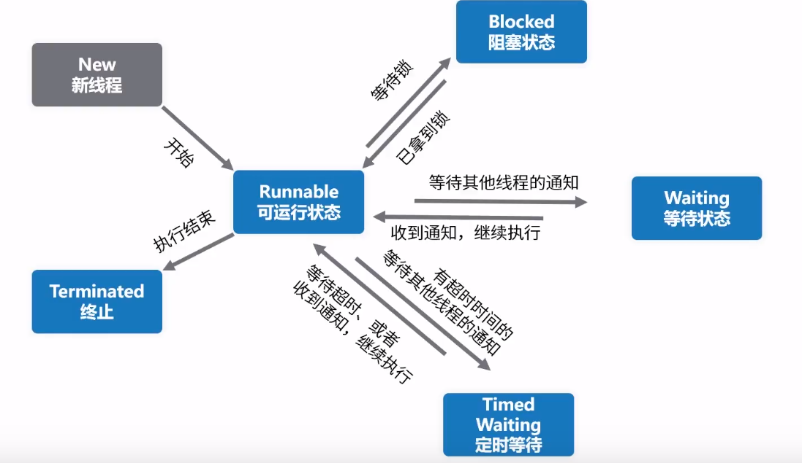

# 2. 线程状态
## 2.1. 线程的6种状态
6个状态定义：java.lang.Thread.State
1. New :尚未启动的线程状态
2. Runnable：可运行的线程状态，等待CPU调度
3. Blocked：**线程阻塞**等待监视器锁定的线程状态
    * 处于synchronized同步代码块或方法中被阻塞
4. Waitting：等待线程的状态。下列不带超时的方式：
    Object.wait、Thread.join、LockSupport.park
5. Timed Waitting：具有指定等待时间的等待线程的线程状态，下列带超时的方式：
Thread.sleep;Object.wait;Thread.join...
6. Terminated: 终止线程的线程状态。线程正常执行完毕或者出现异常。

<div align="center"></div>

## 2.2. 案例分析
1. 源代码
```java
package com.betop.base.highperformance.thread;

/**
 * @Author: eastlong
 * @Date 2020/2/7
 * @function: 多线程运行状态切换示例
 **/
public class ThreadState {
    public static Thread thread1;
    public static ThreadState obj;

    public static void main(String[] args) throws Exception {
        // 第一种状态切换 - 新建 -> 运行 -> 终止
        System.out.println("#######第一种状态切换  - 新建 -> 运行 -> 终止################################");
        Thread thread1 = new Thread(new Runnable() {
            @Override
            public void run() {
                System.out.println("thread1当前状态：" + Thread.currentThread().getState().toString());
                System.out.println("thread1 执行了");
            }
        });
        System.out.println("没调用start方法，thread1当前状态：" + thread1.getState().toString());
        thread1.start();
        Thread.sleep(2000L); // 等待thread1执行结束，再看状态
        System.out.println("等待两秒，再看thread1当前状态：" + thread1.getState().toString());
        // thread1.start(); TODO 注意，线程终止之后，再进行调用，会抛出IllegalThreadStateException异常

        System.out.println();
        System.out.println("############第二种：新建 -> 运行 -> 等待 -> 运行 -> 终止(sleep方式)###########################");
        Thread thread2 = new Thread(new Runnable() {
            @Override
            public void run() {
                try {// 将线程2移动到等待状态，1500后自动唤醒
                    Thread.sleep(1500);
                } catch (InterruptedException e) {
                    e.printStackTrace();
                }
                System.out.println("thread2当前状态：" + Thread.currentThread().getState().toString());
                System.out.println("thread2 执行了");
            }
        });
        System.out.println("没调用start方法，thread2当前状态：" + thread2.getState().toString());
        thread2.start();
        System.out.println("调用start方法，thread2当前状态：" + thread2.getState().toString());
        Thread.sleep(200L); // 等待200毫秒，再看状态
        System.out.println("等待200毫秒，再看thread2当前状态：" + thread2.getState().toString());
        Thread.sleep(3000L); // 再等待3秒，让thread2执行完毕，再看状态
        System.out.println("等待3秒，再看thread2当前状态：" + thread2.getState().toString());

        System.out.println();
        System.out.println("############第三种：新建 -> 运行 -> 阻塞 -> 运行 -> 终止###########################");
        Thread thread3 = new Thread(new Runnable() {
            @Override
            public void run() {
                synchronized (ThreadState.class) {
                    System.out.println("thread3当前状态：" + Thread.currentThread().getState().toString());
                    System.out.println("thread3 执行了");
                }
            }
        });
        synchronized (ThreadState.class) {
            System.out.println("没调用start方法，thread3当前状态：" + thread3.getState().toString());
            thread3.start();
            System.out.println("调用start方法，thread3当前状态：" + thread3.getState().toString());
            Thread.sleep(200L); // 等待200毫秒，再看状态
            System.out.println("等待200毫秒，再看thread3当前状态：" + thread3.getState().toString());
        }
        Thread.sleep(3000L); // 再等待3秒，让thread3执行完毕，再看状态
        System.out.println("等待3秒，让thread3抢到锁，再看thread3当前状态：" + thread2.getState().toString());

    }
}
```

2. 程序运行结果
```
#######第一种状态切换  - 新建 -> 运行 -> 终止################################
没调用start方法，thread1当前状态：NEW
thread1当前状态：RUNNABLE
thread1 执行了
等待两秒，再看thread1当前状态：TERMINATED

############第二种：新建 -> 运行 -> 等待 -> 运行 -> 终止(sleep方式)###########################
没调用start方法，thread2当前状态：NEW
调用start方法，thread2当前状态：RUNNABLE
等待200毫秒，再看thread2当前状态：TIMED_WAITING
thread2当前状态：RUNNABLE
thread2 执行了
等待3秒，再看thread2当前状态：TERMINATED

############第三种：新建 -> 运行 -> 阻塞 -> 运行 -> 终止###########################
没调用start方法，thread3当前状态：NEW
调用start方法，thread3当前状态：RUNNABLE
等待200毫秒，再看thread3当前状态：BLOCKED
thread3当前状态：RUNNABLE
thread3 执行了
等待3秒，让thread3抢到锁，再看thread3当前状态：TERMINATED
```

# 3. 线程的终止
## 3.1. 不正确的终止方式 - stop
* stop：终止线程，并且清楚监视器的信息，但是可能导致线程安全问题，JDK不建议使用；
* Destory：JDK未提供实现方法

## 3.2. 正确的线程终止方法 - interrupt
```java
thread.interrupt();
```
在Thread.java类里提供了两种方法判断线程是否为停止的。

`this.interrupted()`:测试当前线程是否已经中断（静态方法）。如果连续调用该方法，则第二次调用将返回false。在api文档中说明interrupted()方法具有清除状态的功能。执行后具有将状态标识清除为false的功能。

`this.isInterrupted()`:测试线程是否已经中断，但是不能清除状态标识。

```java
public class MyThread4 extends Thread {
    @Override
    public void run() {
        super.run();
        for (int i = 0; i < 50000; i++) {
            if (this.isInterrupted()) {
                System.out.println( "线程已经结束，我要退出" );
                break;
            }
            System.out.println( "i=" + (i + 1) );
        }
        System.out.println( "我是for下面的语句，我被执行说明线程没有真正结束" );
    }
}

public static void main(String[] args) {
        try {
            MyThread4 myThread4 = new MyThread4();
            myThread4.start();
            Thread.sleep( 20);
            myThread4.interrupt();
        } catch (InterruptedException e) {
            System.out.println( "main catch" );
            e.printStackTrace();
        }
}
```

## 3.3. 正确的线程终止--标志位
代码逻辑中增加一个判断用来控制线程执行的终止
```java
/** 通过状态位来判断 */
public class Demo4 extends Thread {
  public volatile static boolean flag = true;

  public static void main(String[] args) throws InterruptedException {
    new Thread(() -> {
      try {
        while (flag) { // 判断是否运行
          System.out.println("运行中");
          Thread.sleep(1000L);
        }
      } catch (InterruptedException e) {
        e.printStackTrace();
      }
    }).start();
    // 3秒之后，将状态标志改为False，代表不继续运行
    Thread.sleep(3000L);
    flag = false;
    System.out.println("程序运行结束");
  }
}
```

<!-- TOC -->

- [2. 线程状态](#2-线程状态)
    - [2.1. 线程的6种状态](#21-线程的6种状态)
    - [2.2. 案例分析](#22-案例分析)
- [3. 线程的终止](#3-线程的终止)
    - [3.1. 不正确的终止方式 - stop](#31-不正确的终止方式---stop)
    - [3.2. 正确的线程终止方法 - interrupt](#32-正确的线程终止方法---interrupt)
    - [3.3. 正确的线程终止--标志位](#33-正确的线程终止--标志位)
- [1. java线程的创建](#1-java线程的创建)
    - [1.1. 继承Thread类创建线程类](#11-继承thread类创建线程类)
    - [1.2. 实现Runnable接口](#12-实现runnable接口)
    - [1.3. 总结](#13-总结)
        - [1.3.1. 共同点](#131-共同点)
        - [1.3.2. 区别](#132-区别)
    - [1.4. 实现callable接口](#14-实现callable接口)

<!-- /TOC -->
# 1. java线程的创建
## 1.1. 继承Thread类创建线程类

&emsp;&emsp;Java使用`Thread类`代表线程，`所有的线程对象都必须是Thread类或其子类的实例`。每个线程的作用是完成一定的任务，实际上就是执行一段程序流即一段顺序执行的代码。Java使用线程执行体来代表这段程序流。
Thread类的声明如下：
```java
public class Thread implements Runnable {}
```
可以看到，**Thread本身就实现了Runnable接口**。

Java中通过继承Thread类来创建并启动多线程的步骤如下：
01. 定义Thread类的子类，并重写该类的run()方法，该run()方法的方法体就代表了线程需要完成的任务，因此把run()方法称为线程执行体。

02. 创建Thread子类的实例，即创建了线程对象。

03. 调用线程对象的start()方法来启动该线程。
示例：
<details>
<summary>MyThread.java </summary>

```java

package com.base.threadstart;

public class MyThread extends Thread{
    private int ticket = 5;
   @Override
    public void run(){
        for(int i=0;i<20;i++){
            if(this.ticket >0){
                System.out.println(this.getName()+" 卖票：ticket"+this.ticket--);
            }
        }
    }
    public static void main(String[] args) {
        // 启动3个线程t1,t2,t3；每个线程各卖5张票！
        MyThread t1=new MyThread();
        MyThread t2=new MyThread();
        MyThread t3=new MyThread();
        t1.start();
        t2.start();
        t3.start();
    }
}
```
</details>
【运行结果】
<details>
<summary>MyThread.java </summary>

```
Thread-0 卖票：ticket5
Thread-1 卖票：ticket5
Thread-0 卖票：ticket4
Thread-2 卖票：ticket5
Thread-0 卖票：ticket3
Thread-1 卖票：ticket4
Thread-0 卖票：ticket2
Thread-2 卖票：ticket4
Thread-0 卖票：ticket1
Thread-1 卖票：ticket3
Thread-2 卖票：ticket3
Thread-1 卖票：ticket2
Thread-2 卖票：ticket2
Thread-1 卖票：ticket1
Thread-2 卖票：ticket1
```
</details>
结果说明：
1. MyThread继承于Thread，它是自定义个线程。每个MyThread都会卖出10张票。  
2. 主线程main创建并启动3个MyThread子线程。每个子线程都各自卖出了10张票。

## 1.2. 实现Runnable接口
Runnable 是一个接口，该接口中只包含了一个run()方法。它的定义如下：
```java
public interface Runnable {
    public abstract void run();
}
```
实现类：

<details>
<summary>实现Runnable接口 </summary>

```java
package com.base.threadstart;

public class MyThread2 implements Runnable {
    private int ticket = 10;

    @Override
    public void run(){
        for(int i=0;i<20;i++){
            if(this.ticket >0){
                System.out.println(Thread.currentThread()+" 卖票：ticket"+this.ticket--);
            }
        }
    }

    public static void main(String[] args) {
        MyThread2 mt=new MyThread2();

        // 启动3个线程t1,t2,t3(它们共用一个Runnable对象)，这3个线程一共卖10张票！
        Thread t1=new Thread(mt);
        Thread t2=new Thread(mt);
        Thread t3=new Thread(mt);
        t1.start();
        t2.start();
        t3.start();
    }
}
```
</details>
【运行结果】

```java
Thread-0 卖票：ticket10
Thread-0 卖票：ticket8
Thread-0 卖票：ticket7
Thread-1 卖票：ticket9
Thread-2 卖票：ticket5
Thread-0 卖票：ticket6
Thread-1 卖票：ticket4
Thread-2 卖票：ticket3
Thread-1 卖票：ticket1
Thread-0 卖票：ticket2w
```

主线程main创建并启动3个子线程，而且这3个子线程都是基于“mt这个Runnable对象”而创建的。运行结果是这3个子线程一共卖出了5张票。这说明它们是**共享了MyThread接口**的。

## 1.3. 总结
### 1.3.1. 共同点
都是“多线程的实现方式”。
### 1.3.2. 区别
两种方式的区别
1. Thread 是类，而Runnable是接口；Thread本身是实现了Runnable接口的类。我们知道**一个类只能有一个父类，但是却能实现多个接口**，因此Runnable具有更好的扩展性。
2. Runnable还可以用于“资源的共享”。即，多个线程都是基于某一个Runnable对象建立的，它们会共享Runnable对象上的资源。

* 通常，建议通过“Runnable”实现多线程！

## 1.4. 实现callable接口
特点：重写call方法,可提供返回值  
（依赖于线程池使用）


