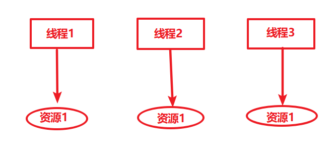

<!-- TOC -->

- [1. 问题引出](#1-问题引出)
    - [1.1. 优惠券案例分析](#11-优惠券案例分析)
    - [1.2. 积分增加的测试](#12-积分增加的测试)
    - [1.3. 使用 ThreadLocal 保存对象的局部变量](#13-使用-threadlocal-保存对象的局部变量)
        - [1.3.1. ThreadLocal初始化对象](#131-threadlocal初始化对象)
        - [1.3.2. 测试](#132-测试)
- [2. ThreadLocal详解](#2-threadlocal详解)
    - [2.1. ThreadLocal简介](#21-threadlocal简介)
    - [2.2. ThreadLocal简单使用](#22-threadlocal简单使用)
    - [2.3. ThreadLocal的实现原理](#23-threadlocal的实现原理)
    - [2.4. ThreadLocal 与 Thread 同步机制的比较](#24-threadlocal-与-thread-同步机制的比较)
- [3. ThreadLocal具体源码实现](#3-threadlocal具体源码实现)
    - [3.1. set源码](#31-set源码)
    - [3.2. get()源码](#32-get源码)
    - [3.3. remove方法的实现](#33-remove方法的实现)
        - [3.3.1. threadLocals](#331-threadlocals)
    - [3.4. 参考资料](#34-参考资料)

<!-- /TOC -->
ThreadLocal是用来做什么的呢？
# 1. 问题引出
某公司对每个客户分发了优惠券，基数为1000积分（每个客户账户有1000积分）。现在与客户A、客户B、客户C，因下了订单，都获得了200个积分。
## 1.1. 优惠券案例分析
```java
package com.betop.base.threadlearn.threadlocal;

/**
 * @Author: eastlong
 * @Date 2019/11/23
 * @function: 优惠券
 **/
public class Coupon {
    private int score = 1000;

    public void addScore(int score){
        String threadName = Thread.currentThread().getName();
        System.out.println(threadName + "--当前账户积分为：" + this.score);
        this.score += score;
        System.out.println(threadName + "--获得" + score + " 后账户积分为：" + this.score);
        try {
            Thread.sleep(1000);
        } catch (InterruptedException e) {
            System.out.println(e);
        }
    }
}
```

## 1.2. 积分增加的测试
这里我们使用JUnit进行单元测试。在真实的公司企业java开发中，对每个项目的单元测试要求很高，单元测试指标（比例）未通过的代码会阻止发布。  
1. JUnit的maven依赖
```xml
<dependency>
    <groupId>junit</groupId>
    <artifactId>junit</artifactId>
    <version>4.12</version>
</dependency>
```
2. Coupon单元测试类
```java
package com.betop.base.threadlearn.threadlocal;

import org.junit.Test;

import static org.junit.Assert.*;

public class CouponTest {

    @Test
    public void testAddScore() throws Exception {
        Coupon coupon = new Coupon();
        Thread aThread = new Thread(() -> coupon.addScore(200),"客户A");
        Thread bThread = new Thread(() -> coupon.addScore(200),"客户B");
        Thread cThread = new Thread(() -> coupon.addScore(200),"客户C");
        aThread.start();
        bThread.start();
        cThread.start();
    }
}
```

3. 运行结果
```
客户A--当前账户积分为：1000
客户B--当前账户积分为：1000
客户C--当前账户积分为：1000
客户C--获得200 后账户积分为：1600
客户B--获得200 后账户积分为：1400
客户A--获得200 后账户积分为：1200
```
【分析】  
&emsp;&emsp;实际上我们是要求A、B、C每个客户的账户都增加200积分，而并非一个账户累计增加200积分。  
&emsp;&emsp;客户A的账户增加200积分，客户B、客户C的账户却额外多了200、和400积分。这是非常不合理的。

&emsp;&emsp;这是因为多个线程共享了同一个实例对象的局部变量所致。
ThreadLocal可以解决这个问题。
## 1.3. 使用 ThreadLocal 保存对象的局部变量
### 1.3.1. ThreadLocal初始化对象
```java
package com.betop.base.threadlearn.threadlocal;

import java.util.function.Supplier;

/**
 * @Author: eastlong
 * @Date 2019/11/23
 * @function: 引入ThreadLocal解决优惠券问题
 **/
public class CouponThreadLocal {
    // 初始化账户余额为 1000
    ThreadLocal<Integer> account = ThreadLocal.withInitial(new Supplier<Integer>() {
        @Override
        public Integer get() {
            return 1000;
        }
    });

    public void addScore(int score) {
        String threadName = Thread.currentThread().getName();
        System.out.println(threadName + "--当前账户积分为：" + account.get());
        account.set(account.get() + score);
        System.out.println(threadName + "--增加 " + score + " 后账户积分为：" + account.get());
        try {
            Thread.sleep(1000);
        } catch (InterruptedException e) {
            System.out.println(e);
        }
    }
}
```
### 1.3.2. 测试
```java
package com.betop.base.threadlearn.threadlocal;

import org.junit.Test;

public class CouponThreadLocalTest {
    @Test
    public void testAddScore() throws Exception {
        CouponThreadLocal coupon = new CouponThreadLocal();
        Thread aThread = new Thread(() -> coupon.addScore(200),"客户A");
        Thread bThread = new Thread(() -> coupon.addScore(200),"客户B");
        Thread cThread = new Thread(() -> coupon.addScore(200),"客户C");
        aThread.start();
        bThread.start();
        cThread.start();
    }

}
```

【运行结果】
```
客户A--当前账户积分为：1000
客户C--当前账户积分为：1000
客户B--当前账户积分为：1000
客户C--增加 200 后账户积分为：1200
客户A--增加 200 后账户积分为：1200
客户B--增加 200 后账户积分为：1200
```

可以看到，我们要的效果达到了。各线程间同时操作自己的变量，相互间没有影响。

# 2. ThreadLocal详解
## 2.1. ThreadLocal简介
&emsp;&emsp;多线程访问同一个共享变量的时候容易出现并发问题，特别是多个线程对一个变量进行写入的时候，为了保证线程安全，一般使用者在访问共享变量的时候需要进行额外的同步措施才能保证线程安全性。ThreadLocal是除了加锁这种同步方式之外的一种保证一种规避多线程访问出现线程不安全的方法，当我们在创建一个变量后，如果每个线程对其进行访问的时候访问的都是线程自己的变量这样就不会存在线程不安全问题。

&emsp;&emsp;ThreadLocal是**JDK包提供的**，它提供**线程本地变量**，如果创建一个ThreadLocal变量，那么访问这个变量的每个线程都会有这个变量的一个副本，在实际多线程操作的时候，操作的是自己本地内存中的变量（副本），从而规避了线程安全问题，如下图所示：
<div align="center"></div>

【总结】  
&emsp;&emsp;**ThreadLocal 不是一个线程，而是一个线程的本地化对象。当某个变量在使用 ThreadLocal 进行维护时，ThreadLocal 为使用该变量的每个线程分配了一个独立的变量副本，每个线程可以自行操作自己对应的变量副本，而不会影响其他线程的变量副本。**

## 2.2. ThreadLocal简单使用
下面的例子中，开启两个线程，在每个线程内部设置了本地变量的值，然后调用print方法打印当前本地变量的值。如果在打印之后调用本地变量的remove方法会删除本地内存中的变量，代码如下所示：
```java
package com.betop.base.threadlearn.threadlocal;

/**
 * @Author: eastlong
 * @Date 2019/11/23
 * @function: ThreadLocalDemo
 **/
public class ThreadLocalDemo {
    static ThreadLocal<String> localVar = new ThreadLocal<>();

    static void printVar(String str) {
        //打印当前线程中本地内存中本地变量的值
        System.out.println(str + " :" + localVar.get());
        //清除本地内存中的本地变量
        localVar.remove();
    }

    public static void main(String[] args) {
        Thread t1 = new Thread(new Runnable() {
            @Override
            public void run() {
                // 设置线程1中本地变量的值
                localVar.set("localVar1");
                printVar("thread1");
                System.out.println("after remove : " + localVar.get());
            }
        });

        Thread t2 = new Thread(new Runnable() {
            @Override
            public void run() {
                localVar.set("localVar1");
                printVar("thread2");
                System.out.println("after remove : " + localVar.get());
            }
        });

        t1.start();
        t2.start();
    }
}
```
【运行结果】
```
thread1 :localVar1
thread2 :localVar1
after remove : null
after remove : null
```
## 2.3. ThreadLocal的实现原理
<div align="center"></div>

&emsp;&emsp;上面是ThreadLocal的类图结构，从图中可知：**Thread类中有两个变量threadLocals和inheritableThreadLocals，二者都是ThreadLocal内部类ThreadLocalMap类型的变量**，我们通过查看内部内ThreadLocalMap可以发现实际上它类似于一个HashMap.  
&emsp;&emsp;在默认情况下，每个线程中的这两个变量都为null，只有当线程第一次调用ThreadLocal的set或者get方法的时候才会创建他们（后面我们会查看这两个方法的源码）。**每个线程的本地变量不是存放在ThreadLocal实例中，而是放在调用线程的ThreadLocals变量里面**。也就是说，ThreadLocal类型的本地变量是存放在具体的线程空间上，其本身相当于一个装载本地变量的工具壳，通过set方法将value添加到调用线程的threadLocals中，当调用线程调用get方法时候能够从它的threadLocals中取出变量。如果调用线程一直不终止，那么这个本地变量将会一直存放在他的threadLocals中，所以不使用本地变量的时候需要调用remove方法将threadLocals中删除不用的本地变量.  

## 2.4. ThreadLocal 与 Thread 同步机制的比较
* Thread同步机制  
&emsp;&emsp;**Thread同步机制采用了以时间换空间方式，通过对象锁保证在同一个时间，对于同一个实例对象，只有一个线程访问**。

* ThreadLocal  
&emsp;&emsp;**ThreadLocal采用以空间换时间方式，为每一个线程都提供一份变量，各线程间同时访问互不影响**。

# 3. ThreadLocal具体源码实现
&emsp;&emsp;下面我们通过查看ThreadLocal的set、get以及remove方法来查看ThreadLocal具体实怎样工作的.
## 3.1. set源码
```java
public void set(T value) {
    //(1)获取当前线程（调用者线程）
    Thread t = Thread.currentThread();
    //(2)以当前线程作为key值，去查找对应的线程变量，找到对应的map
    ThreadLocalMap map = getMap(t);
    //(3)如果map不为null，就直接添加本地变量，key为当前线程，值为添加的本地变量值
    if (map != null)
        map.set(this, value);
    //(4)如果map为null，说明首次添加，需要首先创建出对应的map
    else
        createMap(t, value);
}
```
在上面的代码中，(2)处调用getMap方法获得当前线程对应的threadLocals(参照上面的图示和文字说明)，该方法代码如下：
```java
ThreadLocalMap getMap(Thread t) {
    return t.threadLocals; //获取线程自己的变量threadLocals，并绑定到当前调用线程的成员变量threadLocals上
}
```
如果调用getMap方法返回值不为null，就直接将value值设置到threadLocals中（key为当前线程引用，值为本地变量）；如果getMap方法返回null说明是第一次调用set方法（前面说到过，threadLocals默认值为null，只有调用set方法的时候才会创建map），这个时候就需要调用createMap方法创建threadLocals，该方法如下所示:
```java
void createMap(Thread t, T firstValue) {
    t.threadLocals = new ThreadLocalMap(this, firstValue);
}
```
**createMap方法不仅创建了threadLocals，同时也将要添加的本地变量值添加到了threadLocals中。**

## 3.2. get()源码
在get方法的实现中，首先获取当前调用者线程，如果当前线程的threadLocals不为null，就直接返回当前线程绑定的本地变量值，否则执行setInitialValue方法初始化threadLocals变量。在setInitialValue方法中，类似于set方法的实现，都是判断当前线程的threadLocals变量是否为null，是则添加本地变量（这个时候由于是初始化，所以添加的值为null），否则创建threadLocals变量，同样添加的值为null。
```java
public T get() {
    //(1)获取当前线程
    Thread t = Thread.currentThread();
    //(2)获取当前线程的threadLocals变量
    ThreadLocalMap map = getMap(t);
    //(3)如果threadLocals变量不为null，就可以在map中查找到本地变量的值
    if (map != null) {
        ThreadLocalMap.Entry e = map.getEntry(this);
        if (e != null) {
            @SuppressWarnings("unchecked")
            T result = (T)e.value;
            return result;
        }
    }
    //(4)执行到此处，threadLocals为null，调用该更改初始化当前线程的threadLocals变量
    return setInitialValue();
}

private T setInitialValue() {
    //protected T initialValue() {return null;}
    T value = initialValue();
    //获取当前线程
    Thread t = Thread.currentThread();
    //以当前线程作为key值，去查找对应的线程变量，找到对应的map
    ThreadLocalMap map = getMap(t);
    //如果map不为null，就直接添加本地变量，key为当前线程，值为添加的本地变量值
    if (map != null)
        map.set(this, value);
    //如果map为null，说明首次添加，需要首先创建出对应的map
    else
        createMap(t, value);
    return value;
}
```

## 3.3. remove方法的实现
remove()方法判断该当前线程对应的threadLocals变量是否为null，不为null就直接删除当前线程中指定的threadLocals变量
```java
public void remove() {
    //获取当前线程绑定的threadLocals
     ThreadLocalMap m = getMap(Thread.currentThread());
     //如果map不为null，就移除当前线程中指定ThreadLocal实例的本地变量
     if (m != null)
         m.remove(this);
 }
```

### 3.3.1. threadLocals
<div align="center"></div>

如图所示：每个线程内部有一个名为**threadLocals**的成员变量，该变量的类型为ThreadLocal.ThreadLocalMap类型（类似于一个HashMap），其中的key为当前定义的ThreadLocal变量的this引用，value为我们使用set方法设置的值。**每个线程的本地变量存放在自己的本地内存变量threadLocals中**，如果当前线程一直不消亡，那么这些本地变量就会一直存在（所以可能会导致内存溢出），因此使用完毕需要将其remove掉。


## 3.4. 参考资料
[ThreadLocal 解决多线程变量共享问题](https://segmentfault.com/a/1190000009236777)  
[Java中的ThreadLocal详解](https://www.cnblogs.com/fsmly/p/11020641.html)

