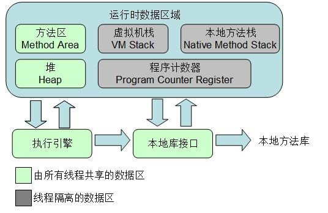
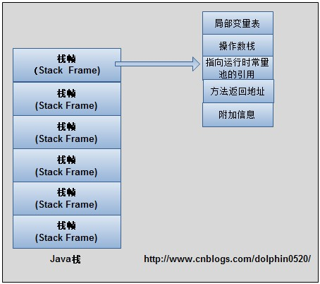

高性能编程(六)：线程可见性基础-JVM内存区域划分
<!-- TOC -->

- [1. 运行时内存区域](#1-运行时内存区域)
    - [1.1. 线程独有的内存区域](#11-线程独有的内存区域)
        - [1.1.1. 程序计数器 Program Counter Register](#111-程序计数器-program-counter-register)
        - [1.1.2. 补充：native method](#112-补充native-method)
        - [1.1.3. 虚拟机栈 jVM Stack](#113-虚拟机栈-jvm-stack)
        - [1.1.4. 本地方法栈 - Native Method Stack](#114-本地方法栈---native-method-stack)
    - [1.2. 线程间共享的内存区域](#12-线程间共享的内存区域)
        - [1.2.1. 堆 - HEAP](#121-堆---heap)
        - [1.2.2. 方法区 - Method Area](#122-方法区---method-area)
        - [1.2.3. 运行时常量池 - Runtime constant pool](#123-运行时常量池---runtime-constant-pool)
    - [1.3. 直接内存](#13-直接内存)
- [2. 对象的创建](#2-对象的创建)
- [3. 对象的访问定位](#3-对象的访问定位)

<!-- /TOC -->
说到**Java内存区域**，可能很多人第一反应是**堆栈**。首先堆栈不是一个概念，而是两个概念，堆和栈是两块不同的内存区域，简单理解的话，**堆是用来存放对象而栈是用来执行程序的。**其次，堆内存和栈内存的这种划分方式比较粗糙，这种划分方式只能说明大多数程序员最关注的、与对象内存分配关系最密切的内存区域是这两块，Java内存区域的划分实际上远比这复杂。对于Java程序员来说，在虚拟机自动内存管理机制的帮助下，不再需要为每一个new操作去配对delete/free代码，不容易出现内存泄露和内存溢出问题。但是，也正是因为Java把内存控制权交给了虚拟机，一旦出现内存泄露和内存溢出的问题，就难以排查，因此一个好的Java程序员应该去了解虚拟机的内存区域以及会引起内存泄露和内存溢出的场景。

# 1. 运行时内存区域
Java虚拟机（JVM）内部定义了程序在运行时需要使用到的内存区域。

<div align="center"></div>

## 1.1. 线程独有的内存区域
### 1.1.1. 程序计数器 Program Counter Register
这块内存区域很小，它是**当前线程所执行的字节码的行号指示器**，字节码解释器通过改变这个计数器的值来选取下一条需要执行的字节码指令。

**在JVM规范中规定，如果线程执行的是非native方法，则程序计数器中保存的是当前需要执行的指令的地址；如果线程执行的是native方法，则程序计数器中的值是undefined。**  
?? 什么是native方法

### 1.1.2. 补充：native method
凡是带有native关键字，说明java的作用范围达不到，只能回去调用底层其他语言（如：C语言）的库。
调用本地方法本地接口，`JNI(java native interface)`.
java在内存区域专门开辟了一块标记区域，`Native Method Stack`，登记Native方法在执行的时候，通过`JNI`加载本地方法库中的方法。
```java
public class NativeDemo {
    public static void main(String[] args) {
        new Thread(() -> {} ,"my Thread").start();
    }

    private native void start0();
}
```

**由于程序计数器中存储的数据所占空间的大小不会随程序的执行而发生改变，因此，对于程序计数器是不会发生内存溢出现象(OutOfMemory)的。**

【总结】
- 当前线程所执行的字节码的行号指示器;
- 当前线程私有;
- 不会出现OutOfMemoryError情况。

### 1.1.3. 虚拟机栈 jVM Stack
Java栈也称作虚拟机栈（Java Vitual Machine Stack），也就是我们常常所说的栈。事实上，**Java栈是Java方法执行的内存模型。**  
　　Java栈中存放的是一个个的栈帧，每个栈帧对应一个被调用的方法，在栈帧中包括：**局部变量表(Local Variables)、操作数栈(Operand Stack)、指向当前方法所属的类的运行时常量池（运行时常量池的概念在方法区部分会谈到）的引用(Reference to runtime constant pool)、方法返回地址(Return Address)和一些额外的附加信息。** 当线程执行一个方法时，就会随之创建一个对应的栈帧，并将建立的栈帧压栈。当方法执行完毕之后，便会将栈帧出栈。因此可知，线程当前执行的方法所对应的栈帧必定位于Java栈的顶部。  
　　讲到这里，大家就应该会明白为什么在使用递归方法的时候容易导致栈内存溢出的现象了以及为什么栈区的空间不用程序员去管理了（当然在Java中，程序员基本不用关系到内存分配和释放的事情，因为Java有自己的垃圾回收机制），这部分空间的分配和释放都是由系统自动实施的。对于所有的程序设计语言来说，栈这部分空间对程序员来说是不透明的。下图表示了一个Java栈的模型：    
<div align="center"></div>
  
- 局部变量表，是用来存储方法中的局部变量（包括在方法中声明的非静态变量以及函数形参）。**对于基本数据类型的变量，则直接存储它的值，对于引用类型的变量，则存的是指向对象的引用。**局部变量表的大小在编译器就可以确定其大小了，因此在程序执行期间局部变量表的大小是不会改变的。
- 操作数栈，想必学过数据结构中的栈的朋友想必对表达式求值问题不会陌生，**栈最典型的一个应用就是用来对表达式求值**。想想一个线程执行方法的过程中，实际上就是不断执行语句的过程，而归根到底就是进行计算的过程。因此可以这么说，**程序中的所有计算过程都是在借助于操作数栈来完成的。**
- 指向运行时常量池的引用，因为在方法执行的过程中有可能需要用到类中的常量，所以必须要有一个引用指向运行时常量。
- 方法返回地址，当一个方法执行完毕之后，要返回之前调用它的地方，因此在栈帧中必须保存一个方法返回地址。

&emsp;&emsp;由于每个线程正在执行的方法可能不同，因此每个线程都会有一个自己的Java栈，互不干扰。

&emsp;&emsp;**生命周期和线程相同**。每个方法执行的同时都会创建一个`栈帧`，用于存储局部变量表、操作数栈、指向运行时常量池的引用、方法返回地址等信息，每一个方法从调用直至执行完毕的过程，就对应着一个栈帧在虚拟机中入栈到出栈的过程。栈的大小和具体JVM的实现有关，通常在256K~756K之间。

【总结】
- **线程私有，生命周期与线程相同**;
- **java方法执行的内存模型，每个方法执行的同时都会创建一个栈帧，存储局部变量表(基本类型、对象引用)、操作数栈、指向运行时常量池的引用、方法返回地址等信息**;
- **StackOverflowError异常：当线程请求的栈深度大于虚拟机所允许的深度**;
- **OutOfMemoryError异常：如果栈的扩展时无法申请到足够的内存**。

### 1.1.4. 本地方法栈 - Native Method Stack
本地方法栈与Java栈的作用和原理非常相似。区别只不过是**Java栈是为执行Java方法服务的，而本地方法栈则是为执行本地方法（Native Method）服务的**。在JVM规范中，并没有对本地方发展的具体实现方法以及数据结构作强制规定，虚拟机可以自由实现它。在HotSopt虚拟机中直接就把本地方法栈和Java栈合二为一。

## 1.2. 线程间共享的内存区域
### 1.2.1. 堆 - HEAP
大多数应用，**堆都是Java虚拟机所管理的内存中最大的一块**，它在虚拟机启动时创建，**此内存唯一的目的就是存放对象实例**。由于现在垃圾收集器采用的基本都是**分代收集算法**，所以堆还可以细分为**新生代和老年代**，再细致一点还有Eden区、From Survivior区、To Survivor区。

【总结】
- 可以通过-Xmx和-Xms控制堆的大小;
- OutOfMemoryError异常：当在堆中没有内存完成实例分配，且堆也无法再扩展时。

### 1.2.2. 方法区 - Method Area
这块区域用于存储虚拟机加载的类信息、常量、静态变量、即时编译器编译后的代码等数据。

【总结】
- **线程间共享**;
- **用于存储已被虚拟机加载的类信息、常量、静态变量、即时编译器编译后的代码等数据**;
- **OutOfMemoryError异常：当方法区无法满足内存的分配需求时**。

### 1.2.3. 运行时常量池 - Runtime constant pool
上面的图中没有画出来，因为它**是方法区的一部分**。Class文件中除了有类的版本信息、字段、方法、接口等描述信息外，还有一项信息就是常量池，**用于存放编译期间生成的各种字面量和符号引用，这部分内容将在类加载后进入方法区的运行时常量池中，另外翻译出来的直接引用也会存储在这个区域中**。这个区域另外一个特点就是**动态性**，Java并不要求常量就一定要在编译期间才能产生，运行期间也可以在这个区域放入新的内容，String.intern()方法就是这个特性的应用。

【总结】
- 方法区的一部分;
- 用于存放编译期生成的各种字面量与符号引用;
- OutOfMemoryError异常：当常量池无法再申请到内存时。

## 1.3. 直接内存
**直接内存并不是虚拟机运行时数据区的一部分，也不是Java虚拟机规范中定义的内存区域**。但是这部分内存也被频繁地使用，而且也可能导致内存溢出问题。**JDK1.4中新增加了NIO，引入了一种基于通道与缓冲区的I/O方式，NIO可以使用Native函数库直接分配堆外内存，然后通过一个存储在Java堆中的DirectByteBuffer对象作为这块内存的引用进行操作。**这样能在一些场景中显著提高性能，因为避免了在Java堆和Native堆中来回复制数据。显然，本机直接内存的分配不会受到Java堆大小的限制，但是，既然是内存，肯定还是会受到本机总内存（包括RAM、SWAP区）大小以及处理器寻址空间的限制。

【总结】
- NIO可以使用Native函数库直接分配堆外内存，堆中的DirectByteBuffer对象作为这块内存的引用进行操作;
- 大小不受Java堆大小的限制，受本机(服务器)内存限制;
- OutOfMemoryError异常：系统内存不足时。

# 2. 对象的创建
Java是一门面向对象的语言，Java程序运行过程中无时无刻都有对象被创建出来。在语言层面上，创建对象（克隆、反序列化）就是一个new关键字而已，但是虚拟机层面上却不是如此。看一下在虚拟机层面上创建对象的步骤：

1. 虚拟机遇到一条new指令，首先去检查这个指令的参数能否在常量池中定位到一个类的符号引用，并且检查这个符号引用代表的类是否已经被加载、解析和初始化。如果没有，那么必须先执行类的初始化过程。

2. 类加载检查通过后，虚拟机为新生对象分配内存。对象所需内存大小在类加载完成后便可以完全确定，为对象分配空间无非就是从Java堆中划分出一块确定大小的内存而已。这个地方会有两个问题：  
    1. 如果内存是规整的，那么虚拟机将采用的是指针碰撞法来为对象分配内存。意思是所有用过的内存在一边，空闲的内存在另外一边，中间放着一个指针作为分界点的指示器，分配内存就仅仅是把指针向空闲那边挪动一段与对象大小相等的距离罢了。如果垃圾收集器选择的是Serial、ParNew这种基于压缩算法的，虚拟机采用这种分配方式。

    2. 如果内存不是规整的，已使用的内存和未使用的内存相互交错，那么虚拟机将采用的是空闲列表法来为对象分配内存。意思是虚拟机维护了一个列表，记录上哪些内存块是可用的，在分配的时候从列表中找到一块足够大的空间划分给对象实例，并更新列表上的内容。如果垃圾收集器选择的是CMS这种基于标记-清除算法的，虚拟机采用这种分配方式。

    另外一个问题及时保证new对象时候的线程安全性。因为可能出现虚拟机正在给对象A分配内存，指针还没有来得及修改，对象B又同时使用了原来的指针来分配内存的情况。虚拟机采用了CAS配上失败重试的方式保证更新更新操作的原子性和TLAB两种方式来解决这个问题。

3. 内存分配结束，虚拟机将分配到的内存空间都初始化为零值（不包括对象头）。这一步保证了对象的实例字段在Java代码中可以不用赋初始值就可以直接使用，程序能访问到这些字段的数据类型所对应的零值。

4. 对对象进行必要的设置，例如这个对象是哪个类的实例、如何才能找到类的元数据信息、对象的哈希码、对象的GC分代年龄等信息，这些信息存放在对象的对象头中。

5. 执行<init>方法，把对象按照程序员的意愿进行初始化，这样一个真正可用的对象才算完全产生出来。

# 3. 对象的访问定位
建立对象是为了使用对象，Java程序需要通过栈上的reference（引用）数据来操作堆上的具体对象。比如我们写了一句:
```java
Object obj = new Object()
```
而new Object()之后其实有两部分内容，一部分是类数据（比如代表类的Class对象）、一部分是实例数据。

由于reference在Java虚拟机规范中只是一个指向对象new Object()的引用obj，并没有规定obj应该通过何种方式去定位、访问堆中对象的具体位置，所以对象访问方式也是取决于虚拟机而定的。主流方式有两种：

1、句柄访问。java堆中将会划分出一块内存来作为句柄池，reference中存储的就是对象的句柄地址，而句柄中包含了对象实例数据与类型数据各自的具体地址信息。

2、指针访问。java堆对象的布局中必须考虑如何放置访问类型数据的相关信息，reference中存储的就是对象地址。

HotSpot虚拟机采用的是后者，不过前者的对象访问方式也是十分常见的。


