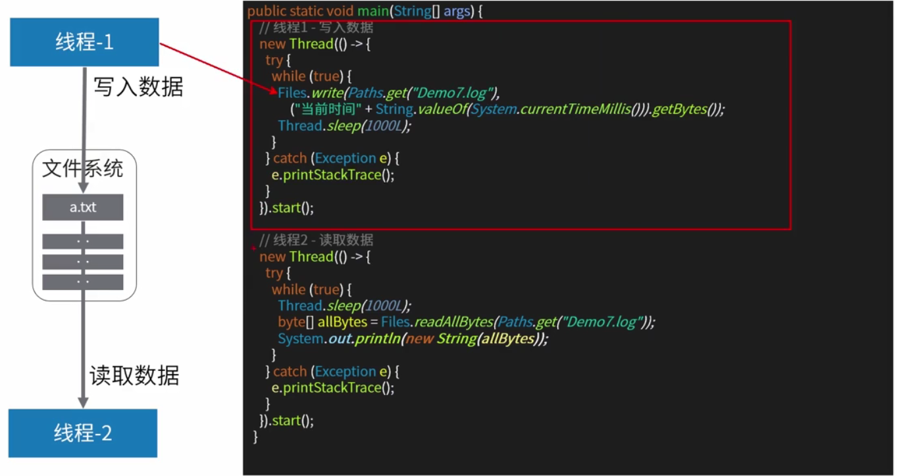
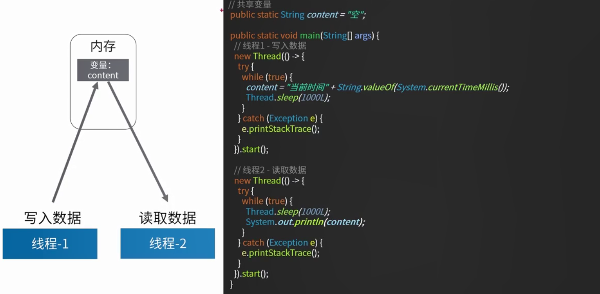
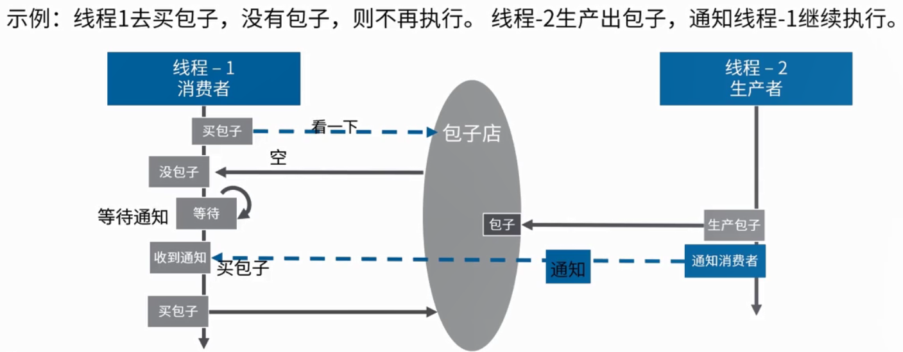
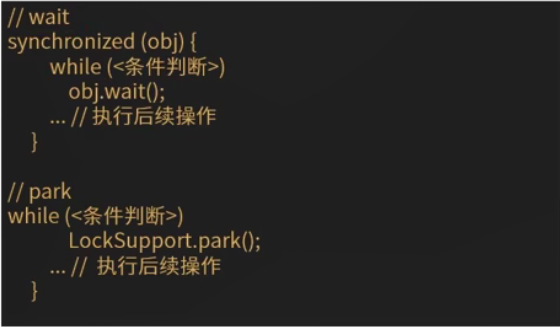

高性能编程(四)：线程通信
<!-- TOC -->

- [1. 线程通信](#1-线程通信)
- [2. 线程协作](#2-线程协作)
    - [2.1. wait/notify机制](#21-waitnotify机制)
        - [2.1.1. 正常的wait/notify例子](#211-正常的waitnotify例子)
        - [2.1.2. 使用说明](#212-使用说明)
        - [2.1.3. 程序永久等待的wait/notify](#213-程序永久等待的waitnotify)
    - [2.2. park/unpark机制](#22-parkunpark机制)
        - [2.2.1. 正常的park/unpark](#221-正常的parkunpark)
        - [2.2.2. 使用说明](#222-使用说明)
        - [2.2.3. 死锁的park/unpark */](#223-死锁的parkunpark-)
    - [2.3. 伪唤醒](#23-伪唤醒)
    - [线程封闭](#线程封闭)

<!-- /TOC -->
# 1. 线程通信
要想实现多个线程之间的协同，如：线程执行先后顺序、获取某个线程执行 的结果，等。  
涉及线程之间的相互通信，分为下面四类：
* 文件共享
* 网络共享
* 共享变量
* Jdk 提供的线程协调API
    * wait/notify
    * park/unpark

1. 文件共享
<div align="center"></div>

2. 变量共享
<div align="center"></div>

# 2. 线程协作
线程协作典型产景：生产者 - 消费者模型。（线程阻塞，线程唤醒）
<div align="center"></div>

## 2.1. wait/notify机制
`wait/notify`方法只能由同一对象锁的持有者线程调用，也就是写在代码块里面，否则会抛出`IllegalMontiorStateException`异常。

* wait方法导致当前线程等待，加入该对象的等待集合中，并且释放当前持有的对象锁。

* notify/notifyAll方法唤醒一个或者所有正在等待一个对象锁的线程。

* 【注意】虽然`wait()`**自动解锁**，但是**对顺序有要求**，如果在`notify()`被调用之后，才开始`wait()`方法的调用，线程会永远处于waiting状态

### 2.1.1. 正常的wait/notify例子
```java
 /** 正常的wait/notify */
    public void waitNotifyTest() throws Exception {
        // 启动线程
        new Thread(() -> {
            if (baozidian == null) { // 如果没包子，则进入等待
                synchronized (this) {
                    try {
                        System.out.println("1、进入等待");
                        this.wait();
                    } catch (InterruptedException e) {
                        e.printStackTrace();
                    }
                }
            }
            System.out.println("2、买到包子，回家");
        }).start();
        // 3秒之后，生产一个包子
        Thread.sleep(3000L);
        baozidian = new Object();
        synchronized (this) {
            this.notifyAll();
            System.out.println("3、通知消费者");
        }
    }
```
【程序运行结果】
```
1、进入等待
3、通知消费者
2、买到包子，回家
```

### 2.1.2. 使用说明
**wait/notify要求再同步关键字里面使用，免去了死锁的困扰，但是一定要先调用wait，再调用notify，否则永久等待了**

### 2.1.3. 程序永久等待的wait/notify 
```java
/** 会导致程序永久等待的wait/notify */
    public void waitNotifyDeadLockTest() throws Exception {
        // 启动线程
        new Thread(() -> {
            if (baozidian == null) { // 如果没包子，则进入等待
                try {
                    Thread.sleep(5000L);
                } catch (InterruptedException e1) {
                    e1.printStackTrace();
                }
                synchronized (this) {
                    try {
                        System.out.println("1、进入等待");
                        this.wait();
                    } catch (InterruptedException e) {
                        e.printStackTrace();
                    }
                }
            }
            System.out.println("2、买到包子，回家");
        }).start();
        // 3秒之后，生产一个包子
        Thread.sleep(3000L);
        baozidian = new Object();
        synchronized (this) {
            this.notifyAll();
            System.out.println("3、通知消费者");
        }
    }
```

【程序运行结果】
```
3、通知消费者
1、进入等待
...... 一直等待 ......
```

【程序说明】  
在调用wait()方法前线程先休眠5s，但是线程休眠3秒后，已经开始执行`this.notifyAll()`，因此notify()方法先执行，顺序不对。程序会一直进入等待状态.。

## 2.2. park/unpark机制
* 线程调用park则等待许可，调用unpark则为指定的线程提供许可（permit） 

* 不要求park和unpark方法的调用顺序。

* 多次调用unpark，再调用park，线程会直接执行，但不会叠加。

### 2.2.1. 正常的park/unpark
```java
/** 正常的park/unpark */
    public void parkUnparkTest() throws Exception {
        // 启动线程
        Thread consumerThread = new Thread(() -> {
            if (baozidian == null) { // 如果没包子，则进入等待
                System.out.println("1、进入等待");
                LockSupport.park();
            }
            System.out.println("2、买到包子，回家");
        });
        consumerThread.start();
        // 3秒之后，生产一个包子
        Thread.sleep(3000L);
        baozidian = new Object();
        LockSupport.unpark(consumerThread);// 为consumerThread线程提供许可
        System.out.println("3、通知消费者");
    }
```

【程序结果】
```
1、进入等待
3、通知消费者
2、买到包子，回家
```

### 2.2.2. 使用说明
`park/unpark`没有顺序要求，但是park并不会释放锁，所有再同步代码中使用要注意。

### 2.2.3. 死锁的park/unpark */
```java
/** 死锁的park/unpark */
    public void parkUnparkDeadLockTest() throws Exception {
        // 启动线程
        Thread consumerThread = new Thread(() -> {
            if (baozidian == null) { // 如果没包子，则进入等待
                System.out.println("1、进入等待");
                // 当前线程拿到锁，然后挂起
                synchronized (this) {
                    LockSupport.park();
                }
            }
            System.out.println("2、买到包子，回家");
        });
        consumerThread.start();
        // 3秒之后，生产一个包子
        Thread.sleep(3000L);
        baozidian = new Object();
        // 争取到锁以后，再恢复consumerThread
        synchronized (this) {
            LockSupport.unpark(consumerThread);
        }
        System.out.println("3、通知消费者");
    }
```

【程序结果】
```java
1、进入等待
...... 一直等待 ......
```
【程序说明】
```java
// 当前线程拿到锁，然后挂起
synchronized (this) {
    LockSupport.park();
}
```
该代码块执行后，由于`park()`方法不会自动释放锁，因此这把锁一直被占用，进入死锁状态，其他线程无法拿到这把锁。


## 2.3. 伪唤醒
【！警告】之前代码中用if语句来做判断是否进入等待状态，是错误的！
**官方建议应该在循环条件中检查等待条件**，原因是**处于等待状态的线程可能会收到错误警报和伪唤醒，如果不在循环条件中唤醒等待，程序可能在没有满足条件的情况下退出！**(循环条件退出后会继续判断)

伪唤醒是指线程并非因为`wait()/notify()、park()/unpark()`等api调用而唤醒，**是更底层原因导致的**。

<div align="center"></div>

* 所以在`wait/notify`代码中应该做如下修改：
把`if()`判断修改为`while()`判断
```java
/** 正常的wait/notify */
    public void waitNotifyTest() throws Exception {
        // 启动线程
        new Thread(() -> {
            // 如果没包子，则进入等待
            synchronized (this) {
                while (baozidian == null) {
                    try {
                        System.out.println("1、进入等待");
                        this.wait();
                    } catch (InterruptedException e) {
                        e.printStackTrace();
                    }
                }

            }
            System.out.println("2、买到包子，回家");
        }).start();
        // 3秒之后，生产一个包子
        Thread.sleep(3000L);
        baozidian = new Object();
        synchronized (this) {
            this.notifyAll();
            System.out.println("3、通知消费者");
        }
    }
```

# 线程封闭
多线程访问共享可变数据时，涉及到线程间的数据同步的问题。并不是所有的时候，都用到共享数据，所以线程封闭的概念就被提出来了。

数据都被封闭在各自的线程中，就不需要同步，这种通过将数据封闭在线程中而避免使用同步的技术，称之为**线程封闭**。

线程封闭具体的体现有：
* ThreadLocal
* 局部变量

## ThreadLocal
ThreadLocal是java里一中特殊的变量。

它是一个**线程级别的变量**，定义好一个ThreadLocal变量后，每个线程都有一个ThreadLocal副本,每个线程都有自己独立的一个变量，竞争条件被彻底消除了，**在并发模式下绝对安全的变量**。

### 用法
ThreadLocal<T> var = new ThreadLocal<T>()  
会自动在每一个线程上创建一个T的副本，副本之间彼此独立，互不影响。  
可以用ThreadLocal存储一些参数，以便在线程中多个方法中使用。

### 案例分析
```java
/** 线程封闭示例 */
public class Demo7 {
    /** threadLocal变量，每个线程都有一个副本，互不干扰 */
    public static ThreadLocal<String> value = new ThreadLocal<>();

    /**
     * threadlocal测试
     *
     * @throws Exception
     */
    public void threadLocalTest() throws Exception {

        // threadlocal线程封闭示例
        value.set("这是主线程设置的123"); // 主线程设置值
        String v = value.get();
        System.out.println("线程1执行之前，主线程取到的值：" + v);

        new Thread(new Runnable() {
            @Override
            public void run() {
                String v = value.get();
                System.out.println("线程1取到的值：" + v);
                // 设置 threadLocal
                value.set("这是线程1设置的456");

                v = value.get();
                System.out.println("重新设置之后，线程1取到的值：" + v);
                System.out.println("线程1执行结束");
            }
        }).start();

        Thread.sleep(5000L); // 等待所有线程执行结束

        v = value.get();
        System.out.println("线程1执行之后，主线程取到的值：" + v);

    }

    public static void main(String[] args) throws Exception {
        new Demo7().threadLocalTest();
    }
}
```

【程序执行结果】
```
线程1执行之前，主线程取到的值：这是主线程设置的123
线程1取到的值：null
重新设置之后，线程1取到的值：这是线程1设置的456
线程1执行结束
线程1执行之后，主线程取到的值：这是主线程设置的123
```

## 栈封闭
**局部变量**的固有属性之一就是**封闭在线程中**。
它们**位于执行线程的栈中**，其他线程无法访问这个栈。